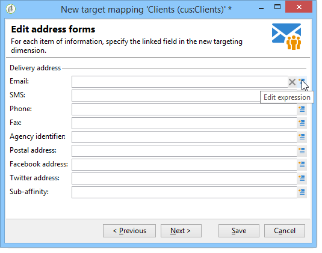
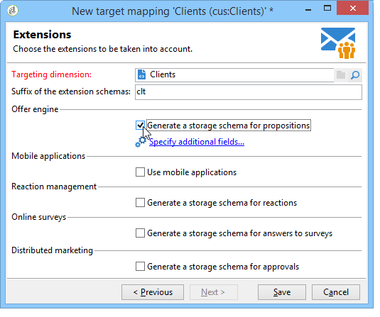

# 외부 데이터 매핑 정의 {#defining-data-mapping}

Adobe Campaign을 사용하면 외부 테이블의 데이터에 대한 매핑을 정의할 수 있습니다.

이렇게 하려면 외부 테이블의 스키마가 만들어지면 이 테이블의 데이터를 게재 대상으로 사용할 새 게재 매핑을 만들어야 합니다.

그렇게 하려면 다음 단계를 적용합니다.

1. 새 게재 매핑을 만들고 타겟팅 차원(예: 방금 만든 스키마)을 선택합니다.

   

1. 게재 정보가 저장되는 필드(성, 이름, 이메일, 주소 등)를 나타냅니다.

   

1. 확장 스키마의 접미사를 포함하여 정보 저장 영역에 대한 매개 변수를 지정하여 쉽게 식별할 수 있도록 합니다.

   

   제외를 저장할지 여부를 선택할 수 있습니다(**excludelog**), 메시지(**broadlog**) 또는 를 사용하여 메시지를 타깃팅할 수 있습니다.

   이 게재 매핑에 대한 추적을 관리할지 여부도 선택할 수 있습니다(**trackinglog**).

1. 그런 다음 고려할 확장을 선택합니다. 확장 유형은 플랫폼의 매개 변수 및 옵션(라이선스 계약 보기)에 따라 다릅니다.

   

   다음을 클릭합니다. **[!UICONTROL Save]** 게재 매핑 생성을 시작하는 단추: 연결된 모든 테이블은 선택한 매개 변수를 기반으로 자동으로 생성됩니다.
