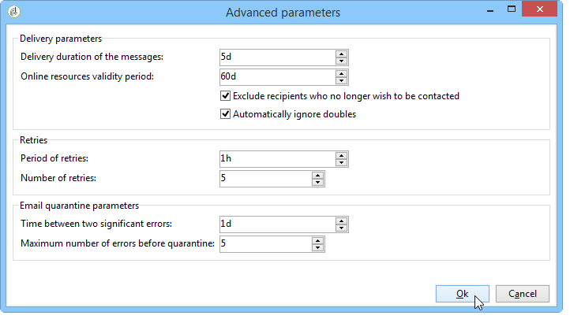

# 인스턴스 배포{#deploying-an-instance}

>[!NOTE]
>
>서버측 구성은 Adobe에서 호스팅하는 배포에 대해 Adobe에 의해서만 수행될 수 있습니다. 다양한 배포에 대한 자세한 내용은 [호스팅 모델](../../installation/using/hosting-models.md) 섹션 또는 종료 [이 페이지](../../installation/using/capability-matrix.md).

## 배포 마법사 {#deployment-wizard}

Adobe Campaign은 Adobe Campaign 클라이언트 콘솔에서 사용할 수 있는 그래픽 도우미를 제공하여 연결할 인스턴스의 매개 변수를 정의합니다.

배포 마법사를 시작하려면 다음을 선택합니다. **도구 > 고급 > 배포 마법사**.


구성 단계는 다음과 같습니다.

1. [일반 매개 변수](#general-parameters)
1. [전자 메일 채널 매개 변수](#email-channel-parameters)
1. [반송된 이메일 관리](#managing-bounced-emails)
1. [추적 구성](#tracking-configuration)
1. [모바일 채널 매개 변수](#mobile-channel-parameters)
1. [지역 설정](#regional-settings)
1. [인터넷에서 액세스](#access-from-the-internet)
1. [공개 리소스 관리](#managing-public-resources)
1. [데이터 제거](#purging-data)

## 일반 매개 변수 {#general-parameters}

배포 마법사의 첫 번째 단계에서는 인스턴스에 대한 일반 정보를 입력할 수 있습니다.


### 일반 정보 {#general-information}

창의 아래 섹션에서 활성화할 옵션을 선택할 수 있습니다.

* **[!UICONTROL Customer identifier used in billing]** : 인스턴스 이름과 버전 번호가 될 수 있습니다.
* **[!UICONTROL Common name of the customer]** : 회사 이름이 포함된 문자열을 입력합니다. 이 정보는 구독 취소 링크에 사용할 수 있습니다.
* **[!UICONTROL Namespace]** : 짧은 식별자를 소문자로 입력합니다. 목표는 업그레이드가 발생할 경우 특정 구성과 공장 구성을 구별하는 것입니다. 기본 네임스페이스는 입니다. **cus** - 고객용

### 기술 옵션 {#technical-options}

창의 아래 섹션에서 활성화할 옵션을 선택할 수 있습니다.

다음 옵션을 사용할 수 있습니다.

* **[!UICONTROL Email channel]** : 이메일 게재를 활성화합니다. 을(를) 참조하십시오 [이메일 채널 매개 변수](#email-channel-parameters).
* **[!UICONTROL Tracking]** : 대상 모집단(열기 및 클릭) 추적을 활성화합니다. 을(를) 참조하십시오 [추적 구성](#tracking-configuration).
* **[!UICONTROL Managing bounced emails]** : 수신 이메일을 선택하는 데 사용되는 POP 계정을 정의합니다. 을(를) 참조하십시오 [반송된 이메일 관리](#managing-bounced-emails).
* **[!UICONTROL LDAP integration]** : LDAP 디렉터리를 통해 사용자 인증을 구성합니다. 을(를) 참조하십시오 [LDAP를 통해 연결](../../installation/using/connecting-through-ldap.md).

## 전자 메일 채널 매개 변수 {#email-channel-parameters}

다음 단계에서는 메시지 헤더에 표시할 정보를 정의할 수 있습니다.

이러한 매개 변수는 각 게재(사용자에게 필요한 권한이 있는 경우)에 대해 개별적으로 게재 템플릿에서 오버로드될 수 있습니다.

### 게재된 이메일에 대한 매개 변수 {#parameters-for-delivered-emails}


다음 매개 변수를 지정합니다.

* **[!UICONTROL Sender name]** : 발신자명을 입력합니다.
* **[!UICONTROL Sender address]** : 발신자의 이메일 주소를 입력합니다. Adobe Campaign에서 이메일을 보낼 때 **보낸 사람 주소** 사서함이 모니터링되지 않으며 마케팅 사용자가 이 사서함에 액세스할 수 없습니다. Adobe Campaign은 또한 이 사서함에서 받은 전자 메일을 자동 회신 또는 자동 전달하는 기능을 제공하지 않습니다. 게재 가능성 모범 사례에 대해 자세히 알아보기 [이 설명서에서](https://experienceleague.adobe.com/docs/deliverability-learn/deliverability-best-practice-guide/additional-resources/campaign/ac-starting-new-platform.html){_blank}.

* **[!UICONTROL Reply address text]** : 수신자가 다음을 클릭할 때 사용되는 이름 입력 **[!UICONTROL Reply]** 단추를 클릭합니다.
* **[!UICONTROL Reply address]** : 수신자가 다음을 클릭할 때 사용할 이메일 주소를 입력합니다. **[!UICONTROL Reply]** 이메일 클라이언트 소프트웨어의 버튼입니다. 의 목적 **회신 주소** 필드는 수신자가 다음 주소가 아닌 다른 주소로 회신하도록 할 때입니다. **보낸 사람 주소**.  이 주소는 올바른 이메일 주소여야 하며, 모니터링되는 사서함에 연결되어 있고 고객이 호스팅해야 합니다.  예를 들어 이메일을 읽고 응답하는 지원 사서함일 수 있습니다. customer-care@customer.com

* **[!UICONTROL Error address]** : 오류가 발생한 메시지의 이메일 주소를 입력합니다. 존재하지 않는 대상 주소로 인해 Adobe Campaign 서버가 받은 이메일을 포함하여 바운스 메일을 처리하는 데 사용되는 기술 주소입니다. 이 주소는 올바른 이메일 주소여야 하며, 모니터링되는 사서함에 연결되어 있고 고객이 호스팅해야 합니다. 바운스 사서함일 수 있습니다(예: errors@customer.com).


이외에도 다음을 지정할 수 있습니다. **마스크** 보낸 사람 주소 및 오류 주소에 대해 승인되었습니다. 필요에 따라 이러한 마스크는 쉼표를 사용하여 분리할 수 있다. 이 구성은 선택 사항입니다. 필드를 입력하면 Adobe Campaign은 게재 시(분석 시, 주소에 변수가 포함되지 않은 경우) 주소가 유효한지 확인합니다. 이 운영 모드에서는 게재 문제를 트리거할 수 있는 주소가 사용되지 않습니다. 게재 서버에서 게재 주소를 구성해야 합니다.

>[!NOTE]
>
>* 이러한 설정은 Campaign 플랫폼 옵션에 저장됩니다. [자세히 알아보기](../../installation/using/configuring-campaign-options.md)
> 
>* 다중 브랜딩 구성의 경우 오류 주소를 조정하고 이메일 라우팅 외부 계정에서 이 구성을 재정의할 수 있습니다. [자세히 알아보기](../../installation/using/external-accounts.md#email-routing-external-account)
>


### 주소에 승인된 문자 {#characters-authorized-in-addresses}

<!--This window enables you to define, for all email campaigns, the delivery and address-quality management options.-->

Adobe Campaign 데이터베이스에서 모든 이메일 주소는 다음과 같이 만들어야 합니다. `x@y.z`. 다음 **x**, **y** 및 **z** 문자는 비워 둘 수 없으며 권한이 없는 문자를 포함해서는 안 됩니다.

여기에서 데이터베이스의 이메일 필드에 승인된 문자(&#39;데이터 정책&#39;)를 정의할 수 있습니다. 목록에 포함되지 않은 문자는 사용할 수 없으므로 인터페이스를 통해, 웹 양식을 통해, 데이터를 가져올 때 데이터베이스에 정보를 입력할 수 없습니다.

두 가지 목록을 사용할 수 있습니다. **유럽어만** 또는 **미국만**. 필요한 경우 다른 문자를 추가할 수 있습니다.

### 게재 매개 변수 {#delivery-parameters}

다음 **고급 매개 변수...** 링크를 사용하면 게재 옵션, 다시 시도 및 격리에 연결된 매개 변수에 액세스할 수 있습니다.



이 창에서는 모든 이메일 캠페인에 대해 게재 및 주소 품질 관리 옵션을 정의할 수 있습니다.

다음 옵션을 사용할 수 있습니다.

* **[!UICONTROL Delivery duration of messages]** : 이 시간이 지나면 게재가 중지됩니다(기본적으로 5일).
* **[!UICONTROL Online resources validity duration]** : 미러 페이지를 생성하기 위해 수신자 프로필의 정보가 유지되는 시간입니다.
* **[!UICONTROL Exclude recipients who no longer wish to be contacted]** 차단 목록 : 이 옵션을 선택하면 이 수신자에게 연락되지 않습니다.
* **[!UICONTROL Automatically ignore doubles]** : 이 옵션을 선택하면 중복 주소에 대한 게재가 수행되지 않습니다.

>[!NOTE]
>
>호스팅 또는 하이브리드 설치의 경우 를 로 업그레이드한 경우 [향상된 MTA](../../delivery/using/sending-with-enhanced-mta.md), **[!UICONTROL Delivery duration of the messages]** 로 설정된 경우에만 사용됩니다. **3.5일 이하**. 3.5일 이상의 값을 정의하면 고려되지 않습니다.

### 매개 변수 다시 시도 {#retry-parameters}

복구에 대한 정보는 **복구 기간** 및 **복구 수** 필드: 수신자에 연결할 수 없는 경우(예: 받은 편지함이 가득 찬 경우) 기본적으로 프로그램은 각 시도 간에 1시간 간격으로 5번 연락합니다(최대 배달 시간 동안). 이러한 값은 필요에 따라 변경할 수 있습니다.

>[!NOTE]
>
>호스팅 또는 하이브리드 설치의 경우 를 로 업그레이드한 경우 [향상된 MTA](../../delivery/using/sending-with-enhanced-mta.md), 캠페인 재시도 매개 변수는 더 이상 사용되지 않습니다. 소프트 바운스 재시도 및 재시도 간 시간은 메시지 이메일 도메인에서 돌아오는 바운스 응답의 유형 및 심각도에 따라 고급 MTA에 의해 결정됩니다.

### 격리 매개 변수 {#quarantine-parameters}

격리에 대한 구성 옵션은 다음과 같습니다.

* **[!UICONTROL Duration between two significant errors]** : 실패 시 애플리케이션이 오류 카운터를 증가시키기 전에 기다리는 시간을 정의하려면 값(&quot;1d&quot;(기본값: 1일)을 입력합니다.
* **[!UICONTROL Maximum number of errors before quarantine]** : 이 값에 도달하면 전자 메일 주소가 격리됩니다(기본적으로 &quot;5&quot;: 주소가 여섯 번째 오류에서 격리됨). 즉, 연락처는 후속 게재에서 자동으로 제외됩니다.

## 반송된 이메일 관리 {#managing-bounced-emails}

바운스 메일은 게재 오류를 검증하는 데 매우 중요합니다. 이러한 오류는 규칙이 원인을 파악하면 NP@I에서 분류됩니다.

이 단계는 **이메일 채널** 및 **바운스 메일** 배포 마법사의 첫 번째 단계에서 관리 옵션을 선택합니다. 을(를) 참조하십시오 [일반 매개 변수](#general-parameters).

이 단계에서는 바운스 메일 관리에 대한 설정을 정의할 수 있습니다.


### 수신 메일 검색에 사용되는 POP 계정 {#pop-account-used-to-retrieve-incoming-mails}

수신 전자 메일을 검색하기 위한 계정에 연결할 매개 변수를 나타냅니다.

* **[!UICONTROL Label]** : 아래에 주어진 모든 매개 변수를 포함하는 이름,
* **[!UICONTROL Server]** : 반송 메일(수신 메일)을 검색하는 데 사용되는 서버,
* **[!UICONTROL Security]** : 필요한 경우 다음을 선택합니다 **[!UICONTROL SSL]** 드롭다운 목록에서
* **[!UICONTROL Port]** : 서버 포트(일반적으로 110),
* **[!UICONTROL Account]** : 바운스 메일에 사용된 계정 이름,
* **[!UICONTROL Password]** : 계정과 연결된 암호.

POP 설정을 지정하고 나면 **테스트** 정확한지 확인하기 위해.

### 처리되지 않은 바운스 메일 {#unprocessed-bounce-mails}

바운스는 Adobe Campaign에 의해 자동으로 처리되며, **관리 > Campaign Management > 비게재 항목 관리 > 게재 로그 자격 요건** 노드. 자세한 내용은 다음을 참조하십시오. [바운스 메일 관리](../../delivery/using/understanding-delivery-failures.md#bounce-mail-management).

처리되지 않은 바운스는 Adobe Campaign 인터페이스에 표시되지 않습니다. 다음 필드를 사용하여 서드파티 사서함으로 전송되지 않으면 자동으로 삭제됩니다.

* **[!UICONTROL Forwarding address]** : 이 필드를 입력하여 Adobe Campaign 플랫폼에서 수집된 모든 오류 메시지(처리됨 또는 처리되지 않음 )를 타사 주소로 전송합니다.
* **[!UICONTROL Address for errors]** : inMail 프로세스에서 자격을 갖추지 못한 오류 메시지만 타사 주소로 전송하려면 이 필드를 입력합니다.
* **[!UICONTROL SMTP server]** : 처리되지 않은 바운스 이메일을 전송하는 데 사용되는 서버입니다.

>[!IMPORTANT]
>
>처리되지 않은 바운스 이메일을 전달하려면 Adobe에서는 **[!UICONTROL Address for errors]** 필드. 그러나 메일 서버에 부하가 걸릴 수 있으므로 사용되는 주소를 정기적으로 확인해야 합니다. 자세한 내용은 계정 담당자에게 문의하십시오.

## 추적 구성 {#tracking-configuration}

다음 단계에서는 인스턴스에 대한 추적을 구성할 수 있습니다. 인스턴스를 선언하고 추적 서버에 등록해야 합니다.

이 단계는 **이메일 채널** 및 **추적** 배포 마법사의 첫 페이지에서 옵션이 선택됩니다. 을(를) 참조하십시오 [일반 매개 변수](#general-parameters).

웹 추적(추적 모드, 태그 만들기 및 삽입...)에 대한 자세한 내용은 다음을 참조하십시오. [이 문서](../../configuration/using/about-web-tracking.md).

### 운영 원칙 {#operating-principle}

인스턴스에서 추적을 활성화하면 전송 중에 게재의 URL이 변경되어 추적이 활성화됩니다.

* 배포 마법사의 이 페이지에 입력된 외부 URL(보안 여부에 상관없이)에 대한 정보는 새 URL을 작성하는 데 사용됩니다. 이 정보뿐만 아니라 수정된 링크에는 게재 식별자, 수신자 및 URL이 포함됩니다.

  Adobe Campaign은 추적 서버에서 추적 정보를 수집하여 수신자 프로필 및 게재에 연결된 데이터를 보강합니다( **[!UICONTROL Tracking]** 탭).

  내부 URL에 대한 정보는 Adobe Campaign 애플리케이션 서버에서 추적 서버에 접속하는 데만 사용됩니다.

  자세한 내용은 다음을 참조하십시오. [추적 서버](#tracking-server).

* URL이 구성되면 추적을 활성화해야 합니다. 이렇게 하려면 인스턴스가 추적 서버에 등록되어야 합니다.

  자세한 내용은 다음을 참조하십시오. [추적 저장 중](#saving-tracking).

### 추적 서버 {#tracking-server}


이 인스턴스에서 추적의 효율성을 보장하려면 다음 정보가 표시되어야 합니다.
<!--With Mid-sourcing architecture, you can externalize tracking management. To do this:-->

* **[!UICONTROL External URL]** 및/또는 **[!UICONTROL Secure external URL]** : 전송할 이메일에 사용할 리디렉션 URL을 입력합니다.
* **[!UICONTROL Internal URL(s)]** : Adobe Campaign 서버에서만 로그를 수집하고 URL을 업로드하기 위해 추적 서버에 접속하는 데 사용하는 URL. 인스턴스와 연결할 필요는 없습니다.

  URL을 지정하지 않으면 기본적으로 추적 URL이 사용됩니다.

중간 소싱 아키텍처를 사용하여 추적 관리를 외부화할 수 있습니다. 방법은 다음과 같습니다.

1. 옵션 선택 **[!UICONTROL Externalize tracking management]** : 중간 소싱 서버를 추적 서버로 사용할 수 있습니다.
1. 채우기 **[!UICONTROL External account]** 및 **[!UICONTROL Instance name]** 중간 소싱 서버에 연결할 수 있는 필드입니다.

   자세한 내용은 다음을 참조하십시오. [중간 소싱 서버](../../installation/using/mid-sourcing-server.md).

1. 다음을 클릭합니다. **[!UICONTROL Enable the tracking instance]** 서버 연결을 승인하는 단추입니다.

   

### 추적 저장 중 {#saving-tracking}

URL이 채워지면 추적 서버를 등록해야 합니다.

링크 클릭 **추적 서버에 등록** 그런 다음 사용 가능한 옵션 중 하나를 선택합니다.


추적을 구현하는 아키텍처에는 세 가지 유형이 있습니다.

1. **기존 인스턴스의 추적에 대한 지원 추가**

   이 선택은 인스턴스가 다른 요구 사항(MTA 서버 등)을 위해 이미 생성된 경우에 적용됩니다. 추적 서버로 사용할 서버입니다.

   

   다음에 대한 암호 입력 **내부** 추적 인스턴스를 구성하기 위한 리디렉션 서버의 계정입니다.

   >[!NOTE]
   >
   >여러 추적 서버를 사용하는 경우 모두 동일한 이름과 암호를 사용해야 합니다.

   인스턴스 이름과 암호를 지정합니다.

1. **추적 전용 새 인스턴스 만들기**

   이 옵션은 추적 인스턴스가 추적을 위해 예약되어 있고 다른 애플리케이션 모듈이 없는 경우에 유용합니다.

   

   다음에 대한 암호 입력 **내부** 추적 인스턴스를 구성하기 위한 리디렉션 서버의 계정입니다.

   >[!NOTE]
   >
   >여러 추적 서버가 구성된 경우 모두 동일한 암호를 사용해야 합니다.

   인스턴스 이름, 암호 및 다음과 같은 연결된 DNS 마스크를 지정합니다. **[!UICONTROL Campaign*]**.

1. **이미 사전 구성된 추적 인스턴스의 유효성 검사**

   이 옵션은 의 암호가 없을 때 사용됩니다. **내부** account; 이 경우 추적 계정은 추적 서버에서 사전 구성되어 있습니다. 추적 인스턴스의 유효성을 검사하려면 리디렉션 서버의 추적 계정 암호를 입력하십시오.

   

   유효성을 검사할 인스턴스의 이름을 지정합니다.

클릭 **승인** 를 클릭하여 추적 서버로 기록 프로세스를 시작합니다.

이전 창으로 돌아가면 추적 서버 수준에서 등록을 확인하는 메시지가 표시됩니다.


URL 검색에 연결된 매개 변수 **은(는) 수정할 수 없습니다.** 표준 설치의 경우. 기타 모든 매개 변수는 Adobe에 문의하십시오.

## 모바일 채널 매개 변수 {#mobile-channel-parameters}

다음 단계에서는 모바일 게재(SMS 및 WAP 푸시)에 대한 기본 설정을 정의할 수 있습니다.

>[!NOTE]
>
>모바일 채널은 선택 사항입니다. 이 단계는 구매한 경우에만 표시됩니다. 사용권 계약을 확인하십시오.


### SMS 게재용 기본 계정 {#default-account-for-sms-delivery}

다음 정보를 입력합니다.

* **[!UICONTROL Label]** : 이 SMS/Wap 푸시 계정의 이름을 입력합니다. 예를 들어 라우터의 이름을 사용할 수 있습니다.
* 의 경우 **[!UICONTROL Server]**, **[!UICONTROL Port]**, **[!UICONTROL Account]**, **[!UICONTROL Password]**, **[!UICONTROL Connector]**, **[!UICONTROL Send Endpoint]**, **[!UICONTROL Reception Endpoint]**, **[!UICONTROL Notification Endpoint]** 필드: 필요한 설정에 대해서는 서비스 공급자에게 문의하십시오.

### 보낸 SMS 매개변수 {#parameters-of-sms-sent}

다음에서 **우선 순위** 드롭다운 목록: &quot;보통&quot;, &quot;높음&quot; 또는 &quot;긴급&quot;을 선택하여 전송할 메시지에 적용합니다.

### 고급 매개 변수 {#advanced-parameters}

다음 **고급 매개 변수...** 링크를 통해 다시 시도 및 격리 옵션에 액세스할 수 있습니다.


재시도에 대한 정보는 **재시도 기간** 및 **재시도 수** 필드: 모바일에 연결할 수 없는 경우 기본적으로 프로그램은 최소 15분 간격으로 5번 다시 시도합니다(최대 배달 기간 동안). 이러한 값은 사용자의 요구 사항에 맞게 조정할 수 있습니다.

격리에 대한 구성 옵션은 다음과 같습니다.

* **[!UICONTROL Time between two significant errors]** : 기본값(기본값: &quot;1d&quot;: 일)을 입력하여 실패에 대해 오류 카운터를 증가시키기 전에 응용 프로그램이 대기하는 시간을 정의합니다.
* **[!UICONTROL Maximum number of errors before quarantine]** : 이 값에 도달하면 모바일 번호가 격리됩니다(기본적으로 &quot;5&quot;: 여섯 번째 오류 시 번호가 격리됨). 즉, 연락처는 향후 게재에서 자동으로 제외됩니다.

## 지역 설정 {#regional-settings}

이 단계에서는 데이터 정책 환경 설정을 포함할 수 있습니다.


* **[!UICONTROL Consider all phone numbers as international ones]** : 이 옵션을 선택하면 국제 형식이 전화 번호에 적용됩니다(국가 접두사는 형식을 적용하기 전에 자릿수를 확인하지 않으므로 필수). 이 옵션을 선택하지 않은 경우 국제전화 번호 앞에 &quot;+&quot; 또는 &quot;00&quot;을 붙여야 합니다.
* **[!UICONTROL Store all phone numbers using the international format]** : 이 옵션은 다음과 같은 문제에만 해당됩니다 **국내** 가져오거나 편집한 전화번호. 국내 형식(예: 425 555 0150)을 사용할지 또는 국제 형식(예: +1 425 555 0150)을 사용할지 여부를 정의합니다.

## 인터넷에서 액세스 {#access-from-the-internet}

>[!IMPORTANT]
>
>개인정보 보호를 위해 모든 외부 리소스에 HTTPS를 사용하는 것이 좋습니다.

이 단계에서는 인터넷에 노출된 Adobe Campaign 페이지에 대한 액세스 URL을 정의할 수 있습니다.

웹 양식에 연결된 게시 옵션도 여기에 표시해야 합니다.


### 웹에 노출된 서버 {#servers-exposed-on-the-web}

이 페이지에서는 서버 URL을 채워 다음과 같은 작업을 수행할 수 있습니다.

1. 구독/구독 취소 양식, 엑스트라넷 등 인터넷에 노출된 애플리케이션 서버에 액세스합니다.
1. 양식, 인트라넷, 확인 페이지와 같이 웹에 노출되지 않은 리소스에 대한 응용 프로그램 서버에 액세스합니다.
1. 게재의 미러 페이지에 액세스합니다.

   미러 페이지는 이메일의 내용을 표시하는 동적 페이지입니다. 수신자에게 전송된 메시지에 삽입된 링크를 통해 액세스되며 개인화된 요소를 포함할 수 있습니다. 미러 페이지를 사용하면 수신자가 게재 형식(텍스트 또는 HTML)에 관계없이 이메일 소프트웨어 대신 인터넷 브라우저에서 메시지를 읽을 수 있습니다. 그러나 필요한 HTML 콘텐츠가 정의된 경우, 미러 페이지는 지정된 게재에 대해서만 생성됩니다.

Adobe Campaign을 사용하면 이러한 세 가지 URL을 구별하여 여러 플랫폼에 로드를 분산할 수 있습니다.


>[!NOTE]
>
>* 이러한 설정은 Campaign 플랫폼 옵션에 저장됩니다. [자세히 알아보기](../../installation/using/configuring-campaign-options.md)
>* 다중 브랜딩 구성의 경우 미러 페이지 URL을 조정하고 이메일 라우팅 외부 계정에서 이 구성을 재정의할 수 있습니다. [자세히 알아보기](../../installation/using/configuring-campaign-options.md)


## 공개 리소스 관리 {#managing-public-resources}

>[!IMPORTANT]
>
>개인정보 보호를 위해 모든 외부 리소스에 HTTPS를 사용하는 것이 좋습니다.

외부에서 보려면 캠페인에 연결된 이메일 및 공개 리소스에 사용된 이미지가 외부에서 액세스할 수 있는 서버에 표시되어야 합니다. 그런 다음 외부 수신자 또는 운영자가 사용할 수 있습니다.


이 단계의 경우 다음을 입력해야 합니다.

1. 새 공개 리소스 URL. 자세한 내용은 [공개 리소스 URL](#public-resources-url) 섹션.
1. 게재 시 이미지 감지 모드. 자세한 내용은 [게재 이미지 감지](#delivery-image-detection) 섹션.
1. 게시 옵션. 자세한 내용은 [게시 모드](#publication-modes) 섹션.

공용 리소스는 **관리 > 리소스 > 온라인 > 공개 리소스** Adobe Campaign 트리의 노드입니다. 이러한 파일은 라이브러리에서 수집되며 이메일에 포함될 수 있지만, 캠페인이나 작업 및 컨텐츠 관리에도 사용할 수 있습니다.


### 공개 리소스 URL {#public-resources-url}

첫 번째 필드를 사용하면 업로드한 후 리소스에 사용되는 URL의 시작을 지정할 수 있습니다. 업로드되면 이 새 URL을 통해 리소스에 액세스할 수 있습니다.

게재에서 공개 리소스 라이브러리에 저장된 이미지나 서버에 저장된 다른 로컬 이미지 또는 이미지를 사용할 수 있습니다.

* 이메일 이미지의 경우 **https://** server **/res/img** URL.

  이 값은 각 게재에 대해 재정의할 수 있습니다.

* 공개 리소스의 경우 URL **https://** server **/res/**&#x200B;인스턴스&#x200B;****위치&#x200B;**인스턴스**는 추적 인스턴스의 이름입니다.

### 게재 이미지 감지 {#delivery-image-detection}

게재에서 공개 리소스 라이브러리에 저장된 이미지나 서버에 저장된 다른 로컬 이미지 또는 이미지를 사용할 수 있습니다.

필드 **URL 마스크** 이미지를 자동으로 업로드할 때 건너뛸 URL 마스크 목록을 지정할 수 있습니다. 예를 들어 외부에서 액세스할 수 있는 사이트(특히 인터넷 사이트)에 저장된 이미지를 사용하는 경우 이 필드에 사이트 URL을 입력할 수 있습니다.


각 URL 마스크를 구분하기 위해 쉼표를 사용하여 여러 URL 마스크를 지정할 수 있습니다.

* 이메일에서 이미지 사용 및 관리에 대한 자세한 내용은 을 참조하십시오. [이 섹션](../../delivery/using/defining-the-email-content.md#adding-images).
* 게재 마법사에서 이러한 URL에서 호출된 이미지의 상태는 &quot;무시됨&quot;입니다.

### 게시 모드 {#publication-modes}

마법사의 아래 섹션에서는 공개 리소스 및 이미지의 게시 옵션을 선택할 수 있습니다.

다음 게시 모드를 사용할 수 있습니다.

* 추적 서버

  리소스는 다른 추적 서버에 자동으로 복사됩니다. 단계에서 구성됩니다. [추적 구성](#tracking-configuration).

* 기타 Adobe Campaign 서버

  리소스를 복사할 다른 Adobe Campaign 서버를 하나 더 사용할 수 있습니다.

  서버측에서 전용 Adobe Campaign 서버를 사용하려면 다음 명령을 사용하여 새 인스턴스를 만들어야 합니다.

  ```
  nlserver config -addtrackinginstance:<trackingA>/<trackingA*>
  ```

  그런 다음 암호를 입력합니다.

  전용 서버의 매개변수는 **[!UICONTROL Media URL(s)]**, **[!UICONTROL Password]** 및 **[!UICONTROL Instance name]** 필드.

  

* 수동 게시 스크립트(공개 리소스만 해당)

  

  스크립트를 사용하여 이미지를 게시할 수 있습니다.

   * 이 스크립트를 만들어야 합니다. 스크립트의 내용은 구성에 따라 다릅니다.
   * 다음 명령을 사용하여 스크립트가 호출됩니다.

     ```
     [INSTALL]/copyToFrontal.vbs "$(XTK_INSTALL_DIR)\var\<instance>\upload\" "img1,img2,img3"
     ```

     위치 `[INSTALL]` 는 Adobe Campaign 설치 폴더의 액세스 경로입니다.

   * Unix에서 스크립트가 실행 가능한지 확인합니다.

이미지의 경우 를 통해 지정된 &quot;images&quot; 폴더에서 복사해야 합니다. **NmsDelivery_ImageSubDirectory** 하나 이상의 전면 서버에 대한 옵션입니다. 이러한 서버는 새 구성된 URL을 통해 액세스할 수 있도록 이미지를 저장합니다.

수동 게시 스크립트 없이 Adobe Campaign 서버에 게시하는 경우 기본적으로 게재 이미지가 `$(XTK_INSTALL_DIR)/var/res/img/ directory`. 해당 URL은 다음과 같습니다. **`https://server/res/img`**.

`XTK_INSTALL_DIR)/var/res/$(INSTANCE_NAME)`. 해당 URL은 다음과 같습니다. **`https://server/res/instance`** 여기서 instance는 추적 인스턴스의 이름입니다.

>[!NOTE]
>
>공용 리소스 저장소 디렉터리를 변경할 수 있습니다. 자세한 내용은 다음을 참조하십시오. [공개 리소스 관리](#managing-public-resources).

### 공용 리소스 동기화 {#synchronizing-public-resources}

이 기능을 사용하면 다음 작업을 수행할 수 있습니다. **공개 리소스 동기화** 여러 예비 서버에서.

공개 리소스가 추적 서버에 없거나 리소스가 404 오류를 반환하는 경우 추적 서버는 예비 서버 중 하나에서 리소스 검색을 시도합니다.

예비 서버 선언 및 구성은 마케팅 서버의 **serverConf.xml** 파일. 에서 사용할 수 있는 모든 매개 변수 **serverConf.xml** 다음에 나열됨 [섹션](../../installation/using/the-server-configuration-file.md).

**선언**

```
<redirection>
<spareServer enabledIf="" id="" url=""/>
</redirection>
```

**구성**

동기화해야 하는 각 공용 리소스에 대해 상태 속성을 `<url>` 의 요소 `<relay>` 부분:

상태 속성은 다음 세 값 중 하나일 수 있습니다.

* spare: 공개 리소스가 동기화됨

* 보통: 기존 동작(동기화 없음)

* 블랙리스트: 44 오류를 반환하는 경우 URL이 차단 목록에 추가됩니다. 차단 목록에 있는 URL의 기간(초)은 **timeout** 기본값이 60초인 속성.

동기화의 기본 구성은 다음과 같습니다.

```
(extracted from the serverConf.xml file)

<redirection P3PCompactPolicy="CAO DSP COR CURa DEVa TAIa OUR BUS IND UNI COM NAV"
databaseId="" defLogCount="30" expirationURL="" maxJobsInCache="100"
startRedirection="true" startRedirectionInModule="true" trackWebVisitors="false" trackingPassword="">
<spareServer enabledIf="" id="1" url=""/>
</redirection>

....


<relay debugRelay="false" forbiddenCharsInAuthority="?#.@/:" forbiddenCharsInPath="?#/"
           modDir="index.html" startRelay="false" startRelayInModule="true" timeout="60">
   <url IPMask="" deny="" hostMask="" relayHost="true" relayPath="true" status="normal" targetUrl="https://localhost:8080" timeout="" urlPath="/view/*"/>
      <url IPMask="" deny="" hostMask="" relayHost="true" relayPath="true" status="blacklist" targetUrl="https://localhost:8080" timeout="" urlPath="*.jsp"/>
      <url IPMask="" deny="" hostMask="" relayHost="true" relayPath="true" status="blacklist" targetUrl="https://localhost:8080" timeout="" urlPath="*.jssp"/>
      <url IPMask="" deny="" hostMask="" relayHost="true" relayPath="true" status="blacklist" targetUrl="https://localhost:8080" timeout="" urlPath="/webApp/*"/>
      <url IPMask="" deny="" hostMask="" relayHost="true" relayPath="true" status="blacklist" targetUrl="https://localhost:8080" timeout="" urlPath="/report/*"/>
      <url IPMask="" deny="" hostMask="" relayHost="true" relayPath="true" status="blacklist" targetUrl="https://localhost:8080" timeout="" urlPath="/jssp/*"/>
      <url IPMask="" deny="" hostMask="" relayHost="true" relayPath="true" status="normal" targetUrl="https://localhost:8080" timeout="" urlPath="/strings/*"/>
      <url IPMask="" deny="" hostMask="" relayHost="true" relayPath="true" status="normal" targetUrl="https://localhost:8080" timeout="" urlPath="/interaction/*"/>
      <url IPMask="" deny="" hostMask="" relayHost="true" relayPath="true" status="normal" targetUrl="https://localhost:8080" timeout="" urlPath="/barcode/*"/>

      <url IPMask="" deny="" hostMask="" relayHost="false" relayPath="false" status="spare" targetUrl="" timeout="" urlPath="/favicon.*"/>
      <url IPMask="" deny="" hostMask="" relayHost="false" relayPath="false" status="spare" targetUrl="" timeout="" urlPath="/*.html"/>
      <url IPMask="" deny="" hostMask="" relayHost="false" relayPath="false" status="spare" targetUrl="" timeout="" urlPath="/*.png"/>
      <url IPMask="" deny="" hostMask="" relayHost="false" relayPath="false" status="spare" targetUrl="" timeout="" urlPath="/*.jpg"/>

 </relay>
```

## 데이터 제거 {#purging-data}

배포 마법사의 마지막 단계에서는 사용되지 않는 데이터의 자동 제거를 구성할 수 있습니다. 값은 일 단위로 표시됩니다.


데이터는 데이터베이스 정리 워크플로우를 통해 자동으로 삭제됩니다. 이 워크플로우를 구성 및 운영하는 방법과 삭제된 항목에 대한 자세한 내용은 다음을 참조하십시오. [문서](../../production/using/database-cleanup-workflow.md).
