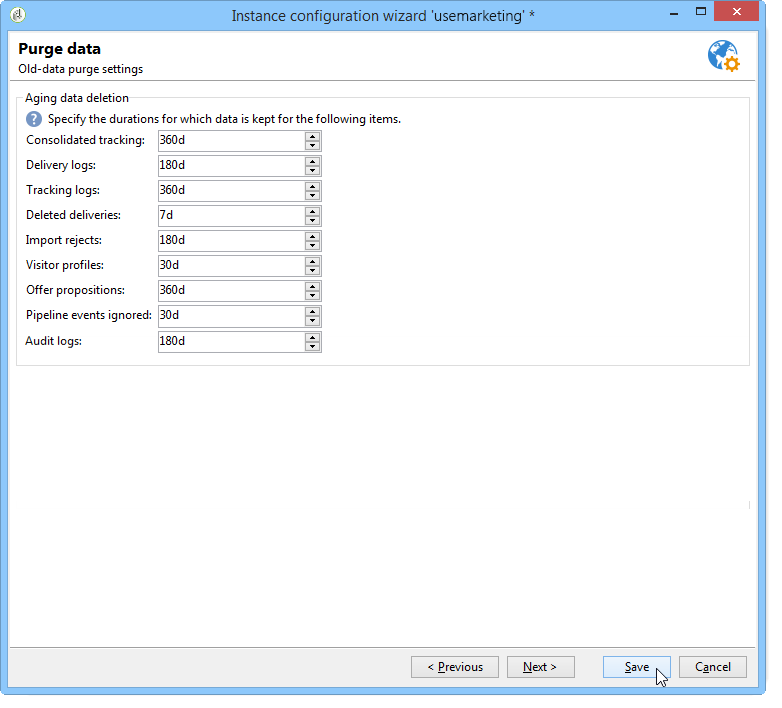

# 인스턴스 배포{#deploying-an-instance}

>[!NOTE]
>
>서버측 구성은 Adobe가 호스팅하는 배포에 대해서만 수행할 수 있습니다. 다른 배포에 대한 자세한 내용은 호스팅 모델 [섹션](../../installation/using/hosting-models.md) 또는 [이 문서를](https://helpx.adobe.com/campaign/kb/acc-on-prem-vs-hosted.html)참조하십시오.

## 배포 마법사 {#deployment-wizard}

Adobe Campaign 클라이언트 콘솔에서 사용할 그래픽 마법사를 사용하여 연결할 인스턴스의 매개 변수를 정의할 수 있습니다.

배포 마법사를 시작하려면 도구 > 고급 **> 배포 마법사를**&#x200B;선택합니다.


구성 단계는 다음과 같습니다.

1. [일반 매개 변수](#general-parameters)
1. [이메일 채널 매개 변수](#email-channel-parameters)
1. [바운스된 이메일 관리](#managing-bounced-emails)
1. [구성 추적](#tracking-configuration)
1. [모바일 채널 매개 변수](#mobile-channel-parameters)
1. [지역 설정](#regional-settings)
1. [인터넷에서 액세스](#access-from-the-internet)
1. [공공 자원 관리](#managing-public-resources)
1. [데이터 제거](#purging-data)

## 일반 매개 변수 {#general-parameters}

배포 마법사의 첫 번째 단계에서는 인스턴스에 대한 일반 정보를 입력할 수 있습니다.


### 일반 정보 {#general-information}

창의 하단 섹션에서 활성화할 옵션을 선택할 수 있습니다.

* **[!UICONTROL Customer identifier used in billing]** :인스턴스 이름과 버전 번호가 될 수 있습니다.
* **[!UICONTROL Common name of the customer]** :회사 이름으로 문자열을 입력합니다. 이 정보는 구독 취소 링크에서 사용할 수 있습니다.
* **[!UICONTROL Namespace]** :짧은 식별자를 소문자로 입력합니다. 목표는 업그레이드 시 특정 구성과 출하 시 구성을 구별하는 것입니다. 기본 네임스페이스는 **고객을 위한** 것입니다.

### 기술 옵션 {#technical-options}

창의 하단 섹션에서 활성화할 옵션을 선택할 수 있습니다.

다음 옵션을 사용할 수 있습니다.

* **[!UICONTROL Email channel]** :을 클릭하여 이메일 배달을 활성화합니다. 이메일 [채널 매개 변수를](#email-channel-parameters)참조하십시오.
* **[!UICONTROL Tracking]** :대상 모집단(열기 및 클릭)을 추적하려면 추적 [구성을](#tracking-configuration)참조하십시오.
* **[!UICONTROL Managing bounced emails]** :받는 전자 메일을 선택하는 데 사용되는 POP 계정을 정의하려면 바운스된 [이메일 관리를 참조하십시오](#managing-bounced-emails).
* **[!UICONTROL LDAP integration]** :LDAP 디렉토리를 통해 사용자 인증을 구성하려면 LDAP를 [통해 연결을 참조하십시오](../../installation/using/connecting-through-ldap.md).

## 이메일 채널 매개 변수 {#email-channel-parameters}

다음 단계에서는 메시지 헤더에 표시할 정보를 정의할 수 있습니다.

이러한 매개 변수는 배달 템플릿에서 오버로드될 수 있으며 각 전달에 대해 개별적으로 오버로드될 수 있습니다(사용자에게 필요한 권한이 있는 경우).

### 배달된 이메일의 매개 변수 {#parameters-for-delivered-emails}


다음 매개 변수를 지정합니다.

* **[!UICONTROL Sender name]** :보낸 사람의 이름,
* **[!UICONTROL Sender address]** :보낸 사람의 주소,
* **[!UICONTROL Reply address text]** :수신자가 이메일 클라이언트 소프트웨어의 **[!UICONTROL Reply]** 버튼을 클릭할 때 사용되는 사용자 정의 가능한 이름
* **[!UICONTROL Reply address]** :받는 사람이 이메일 클라이언트 소프트웨어에서 **[!UICONTROL Reply]** 단추를 클릭할 때 사용할 이메일 주소입니다.
* **[!UICONTROL Error address]** :오류가 있는 메시지의 이메일 주소입니다. 이 주소는 존재하지 않는 대상 주소로 인해 Adobe Campaign 서버에서 받은 이메일을 포함하여 바운스 메일을 처리하는 데 사용되는 기술 주소입니다.

이 외에도 보낸 사람 주소와 오류 주소에 대해 인증된 **마스크를** 지정할 수 있습니다. 필요한 경우 이러한 마스크는 쉼표로 구분할 수 있습니다. 이 구성은 선택 사항입니다. 필드를 입력하면 Adobe Campaign은 배달 시(분석 중에 주소에 변수가 없는 경우) 주소가 유효한지 확인합니다. 이 운영 모드에서는 배달 문제를 유발할 수 있는 주소가 사용되지 않습니다. 배달 서버에 배달 주소를 구성해야 합니다.

### 주소에 인증된 문자 {#characters-authorized-in-addresses}

<!--This window enables you to define, for all email campaigns, the delivery and address-quality management options.-->

Adobe Campaign 데이터베이스에서 모든 이메일 주소를 다음과 같이 만들어야 합니다. `x@y.z`Adobe x **,** y **및** z **** 문자는 비워 둘 수 없으며 인증되지 않은 문자를 포함할 수 없습니다.

데이터베이스의 이메일 필드에 인증된 문자(&#39;데이터 정책&#39;)를 여기에서 정의할 수 있습니다. 목록에 포함되지 않은 문자는 사용이 금지되므로 인터페이스, 웹 양식 및 데이터 가져오기를 통해 데이터베이스에 정보를 입력할 때 거부됩니다.

다음 두 가지 목록을 사용할 수 있습니다.유럽 **전용** 또는 **미국만**&#x200B;해당합니다. 필요한 경우 다른 문자를 추가할 수 있습니다.

### 전달 매개 변수 {#delivery-parameters}

**고급**&#x200B;매개 변수...링크를 사용하면 배달 옵션, 다시 시도 및 격리에 연결된 매개 변수에 액세스할 수 있습니다.


이 창에서 모든 이메일 캠페인에 대해 배달 및 주소 품질 관리 옵션을 정의할 수 있습니다.

다음 옵션을 사용할 수 있습니다.

* **[!UICONTROL Delivery duration of messages]** :이 시간 이후에는 배달이 중지됩니다(기본적으로 5일).
* **[!UICONTROL Online resources validity duration]** :미러 페이지를 생성하기 위해 수신자 프로필의 정보를 보관하는 시간,
* **[!UICONTROL Exclude recipients who no longer wish to be contacted]** :이 옵션을 선택하면 블랙리스트에 추가된 받는 사람에게 연결되지 않습니다.
* **[!UICONTROL Automatically ignore doubles]** :이 옵션을 선택하면 주소가 중복되도록 배달되지 않습니다.

### 다시 시도 매개 변수 {#retry-parameters}

복구에 대한 정보는 복구 **기간** 및 복구 **수** 필드에 제공됩니다.수신자의 받은 편지함이 가득 찬 경우, 기본적으로 프로그램은 최대 배달 시간 동안 각 시도 사이의 1시간 간격으로 수신자에게 5번 연락합니다. 이러한 값은 필요에 맞게 변경할 수 있습니다.

### 격리 매개 변수 {#quarantine-parameters}

격리를 위한 구성 옵션은 다음과 같습니다.

* **[!UICONTROL Duration between two significant errors]** :기본적으로 값(&quot;1d&quot;)을 입력합니다.1일)을 사용하여 실패 시 응용 프로그램이 오류 카운터를 증가시키기 전에 기다리는 시간을 정의합니다.
* **[!UICONTROL Maximum number of errors before quarantine]** :이 값에 도달하면 이메일 주소가 격리됩니다(기본적으로 &quot;5&quot;).6번째 오류 시 주소가 격리됩니다.) 즉, 연락처는 후속 배달에서 자동으로 제외됩니다.

## 바운스된 이메일 관리 {#managing-bounced-emails}

바운스 메일은 배달 오류를 확인하는 데 매우 중요합니다. 규칙이 원인을 결정하면 이러한 오류는 NP@I폴더에 분류됩니다.

이 단계는 배포 마법사의 첫 번째 단계에서 **이메일 채널** 및 **바운스 메일** 관리 옵션을 선택한 경우에만 사용할 수 있습니다. 일반 매개 [변수를](#general-parameters)참조하십시오.

이 단계에서는 바운스 메일 관리에 대한 설정을 정의할 수 있습니다.


### 받는 메일을 검색하는 데 사용되는 POP 계정 {#pop-account-used-to-retrieve-incoming-mails}

들어오는 이메일을 검색할 계정에 연결할 매개 변수를 지정합니다.

* **[!UICONTROL Label]** :아래에 제공된 모든 매개 변수를 포함하는 이름,
* **[!UICONTROL Server]** :바운스 메일(받는 메일)을 검색하는 데 사용되는 서버,
* **[!UICONTROL Security]** :필요한 경우 드롭다운 **[!UICONTROL SSL]** 목록에서
* **[!UICONTROL Port]** :서버 포트(일반적으로 110),
* **[!UICONTROL Account]** :바운스 메일에 사용되는 계정 이름,
* **[!UICONTROL Password]** :계정과 연결된 암호입니다.

POP 설정이 지정되면 [테스트] **를** 클릭하여 설정이 올바른지 확인합니다.

### 처리되지 않은 바운스 메일 {#unprocessed-bounce-mails}

바운스는 관리 > 캠페인 관리 > 비산출물 관리 > 배달 **로그 적격** 노드에 나열된 규칙을 적용하여 Adobe Campaign에서 자동으로 처리됩니다. 자세한 내용은 바운스 [메일 관리를](../../delivery/using/understanding-delivery-failures.md#bounce-mail-management)참조하십시오.

처리되지 않은 바운스는 Adobe Campaign 인터페이스에 표시되지 않습니다. 다음 필드를 사용하여 타사 사서함으로 전송되지 않으면 자동으로 삭제됩니다.

* **[!UICONTROL Forwarding address]** :Adobe Campaign 플랫폼에서 수집한 모든 오류 메시지(처리되거나 처리되지 않음)를 타사 주소로 전송하려면 이 필드를 채웁니다.
* **[!UICONTROL Address for errors]** :InMail 프로세스를 사용할 수 없었던 오류 메시지만 타사 주소로 전송하려면 이 필드를 채웁니다.
* **[!UICONTROL SMTP server]** :처리되지 않은 바운스 이메일을 보내는 데 사용되는 서버입니다.

>[!CAUTION]
>
>처리되지 않은 바운스 이메일을 전달하려면 **[!UICONTROL Address for errors]** 필드만 입력할 것을 권장합니다. 그러나 메일 서버에 많은 부하를 줄 수 있으므로 사용되는 주소가 정기적으로 확인되었는지 확인하십시오. 자세한 내용은 계정 관리자에게 문의하십시오.

## 구성 추적 {#tracking-configuration}

다음 단계에서는 인스턴스에 대한 추적을 구성할 수 있습니다. 인스턴스를 선언하고 추적 서버에 등록해야 합니다.

이 단계는 배포 마법사의 첫 번째 페이지에서 **이메일 채널** 및 **추적** 옵션을 선택한 경우에만 제공됩니다. 일반 매개 [변수를](#general-parameters)참조하십시오.

웹 추적(추적 모드, 태그 만들기 및 삽입..)에 대한 자세한 내용은 [이 문서를](../../configuration/using/about-web-tracking.md)참조하십시오.

### 운영 원칙 {#operating-principle}

인스턴스에서 추적을 활성화하면 추적을 활성화하도록 전송 중에 게재 URL이 변경됩니다.

* 배포 마법사의 이 페이지에 입력한 외부 URL(보안 여부)에 대한 정보는 새 URL을 작성하는 데 사용됩니다. 이 정보뿐만 아니라 수정된 링크에도 다음이 포함되어 있습니다.배달의 식별자, 받는 사람 및 URL입니다.

   추적 정보는 추적 서버의 Adobe Campaign에서 수신자 프로필 및 게재에 연결된 데이터( **[!UICONTROL Tracking]** 탭)를 강화하도록 수집합니다.

   내부 URL에 대한 정보는 추적 서버에 연결하기 위해 Adobe Campaign 응용 프로그램 서버에서만 사용됩니다.

   자세한 내용은 추적 서버를 [참조하십시오](#tracking-server).

* URL이 구성되면 추적을 활성화해야 합니다. 이렇게 하려면 인스턴스가 추적 서버에 등록되어 있어야 합니다.

   자세한 내용은 추적 [저장을 참조하십시오](#saving-tracking).

### 추적 서버 {#tracking-server}


이 인스턴스에 대한 추적 효율성을 보장하려면 다음 정보가 표시되어야 합니다.
<!--With Mid-sourcing architecture, you can externalize tracking management. To do this:-->

* **[!UICONTROL External URL]** 및/또는 **[!UICONTROL Secure external URL]** :보낼 이메일에 사용할 리디렉션 URL을 입력합니다.
* **[!UICONTROL Internal URL(s)]** :Adobe Campaign 서버가 추적 서버에 연결하여 로그를 수집하고 URL을 업로드하기 위해 사용하는 URL입니다. 인스턴스와 연결할 필요는 없습니다.

   URL을 지정하지 않으면 기본적으로 추적 URL이 사용됩니다.

중간 소싱 아키텍처를 사용하여 추적 관리를 외부화할 수 있습니다. 이렇게 하려면:

1. 다음 옵션을 **[!UICONTROL Externalize tracking management]** 선택합니다.이렇게 하면 중간 소싱 서버를 추적 서버로 사용할 수 있습니다.
1. 중간 소싱 서버에 연결할 수 있도록 **[!UICONTROL External account]** 및 **[!UICONTROL Instance name]** 필드를 채웁니다.

   자세한 내용은 Mid-sourcing [서버를](../../installation/using/mid-sourcing-server.md)참조하십시오.

1. 서버에 대한 연결을 승인하려면 **[!UICONTROL Enable the tracking instance]** 단추를 클릭합니다.

   

### 추적 저장 {#saving-tracking}

URL이 채워지면 추적 서버를 등록해야 합니다.

추적 **서버에서 링크 등록을** 클릭한 다음 사용 가능한 옵션 중 하나를 선택합니다.


추적을 구현하기 위한 다음과 같은 세 가지 유형의 아키텍처가 있습니다.

1. **기존 인스턴스에서 추적 지원 추가**

   이 선택 사항은 인스턴스가 이미 다른 요구 사항(MTA 서버 등)을 위해 생성된 경우 적용됩니다. 추적 서버로 사용될 서버.

   

   추적 인스턴스를 구성하려면 리디렉션 서버의 **내부** 계정에 대한 암호를 입력합니다.

   >[!NOTE]
   >
   >여러 추적 서버를 사용하는 경우 모두 동일한 이름과 암호를 사용해야 합니다.

   인스턴스의 이름과 암호를 지정합니다.

1. **추적을 위한 새 인스턴스 만들기**

   이 옵션은 추적 인스턴스가 추적을 위해 예약되어 있고 다른 애플리케이션 모듈이 없는 경우에 유용합니다.

   

   추적 인스턴스를 구성하려면 리디렉션 서버의 **내부** 계정에 대한 암호를 입력합니다.

   >[!NOTE]
   >
   >여러 추적 서버가 구성된 경우 모두 동일한 암호를 사용해야 합니다.

   인스턴스의 이름, 암호 및 관련 DNS 마스크(예: **[!UICONTROL Campaign*]**)를 지정합니다.

1. **이미 사전 구성된 추적 인스턴스 유효성 확인**

   이 옵션은 **내부** 계정에 대한 암호가 없는 경우에 사용됩니다.이 경우 추적 계정은 추적 서버에서 사용자를 위해 미리 구성되어 있습니다. 추적 인스턴스의 유효성을 확인할 리디렉션 서버의 추적 계정 암호를 입력합니다.

   

   검증할 인스턴스의 이름을 지정합니다.

승인을 **클릭하여** 추적 서버로 레코딩 프로세스를 시작합니다.

이전 창으로 돌아가면 추적 서버 수준에서 등록을 확인하는 메시지가 표시됩니다.


URL 검색에 연결된 매개 변수는 표준 설치를 위해 수정해서는 **안** 됩니다. 기타 모든 매개 변수는 Adobe에 문의하십시오.

## 모바일 채널 매개 변수 {#mobile-channel-parameters}

다음 단계에서는 모바일(SMS 및 WAP 푸시)로 배달할 기본 설정을 정의할 수 있습니다.

>[!NOTE]
>
>모바일 채널은 선택 사항입니다.이 단계는 구매한 경우에만 나타납니다. 사용권 계약을 확인하십시오.


### SMS 전달의 기본 계정 {#default-account-for-sms-delivery}

다음 정보를 입력합니다.

* **[!UICONTROL Label]** :이 SMS/Wap 푸시 계정의 이름을 입력하십시오. 예를 들어 라우터의 이름을 사용할 수 있습니다.
* 이 경우, **[!UICONTROL Server]****[!UICONTROL Port]**, **[!UICONTROL Account]**&#x200B;이, **[!UICONTROL Password]**, **[!UICONTROL Connector]**&#x200B;이, **[!UICONTROL Send Endpoint]**&#x200B;에 대해, **[!UICONTROL Reception Endpoint]**&#x200B;이, **[!UICONTROL Notification Endpoint]** 필드의 경우,필요한 설정은 서비스 공급업체에 문의하십시오.

### 전송된 SMS의 매개 변수 {#parameters-of-sms-sent}

우선 **순위** 드롭다운 목록에서 다음을 수행합니다.&quot;일반&quot;, &quot;높음&quot; 또는 &quot;긴급&quot;을 선택하여 보낼 메시지에 적용합니다.

### 고급 매개 변수 {#advanced-parameters}

**고급**&#x200B;매개 변수...링크를 사용하면 재시도 및 격리 옵션에 액세스할 수 있습니다.


재시도 **기간 및 재시도** 횟수 **필드에서 재시도** 정보를 사용할 수 있습니다.모바일에 연결할 수 없는 경우 기본적으로 프로그램은 최소 15분 간격으로(최대 배달 기간 동안) 5회 다시 시도합니다. 이러한 값은 필요에 맞게 조정할 수 있습니다.

격리를 위한 구성 옵션은 다음과 같습니다.

* **[!UICONTROL Time between two significant errors]** :기본값 입력(기본값: &quot;1d&quot;):일)을 클릭하여 실패 시 오류 카운터를 증가시키기 전에 응용 프로그램이 대기하는 시간을 정의합니다.
* **[!UICONTROL Maximum number of errors before quarantine]** :이 값에 도달하면 모바일 번호가 격리됩니다(기본적으로 &quot;5&quot;:6번째 오류 발생 시 번호가 격리됩니다.) 즉, 연락처는 자동으로 이후 배달에서 제외됩니다.

## 지역 설정 {#regional-settings}

이 단계에서는 데이터 정책 환경 설정을 포함할 수 있습니다.


* **[!UICONTROL Consider all phone numbers as international ones]** :이 옵션을 선택하면 응용 프로그램에서 국제 형식을 전화 번호에 적용합니다. 이때 국가 접두사는 서식을 적용하기 전에 숫자 수를 확인하지 않으므로 필수로 지정됩니다. 이 옵션을 선택하지 않으면 국제 전화 번호 앞에 &quot;+&quot; 또는 &quot;00&quot;을 붙여야 합니다.
* **[!UICONTROL Store all phone numbers using the international format]** :이 옵션은 가져오거나 편집한 **국내** 전화 번호에만 적용됩니다. 국내 형식(예: 425 555 0150)을 사용할지 국제 형식(예:+1 425 555 0150)

## 인터넷에서 액세스 {#access-from-the-internet}

>[!CAUTION]
>
>개인 정보상의 이유로 모든 외부 리소스에 대해 HTTPS를 사용하는 것이 좋습니다.

이 단계에서는 인터넷에 노출된 Adobe Campaign 페이지에 대한 액세스 URL을 정의할 수 있습니다.

웹 양식에 연결된 발행물 옵션을 여기에 표시해야 합니다.


### 웹에 노출된 서버 {#servers-exposed-on-the-web}

이 페이지에서는 다음 작업을 수행할 서버 URL을 채울 수 있습니다.

1. 인터넷에 노출된 응용 프로그램 서버에 액세스:구독/구독 취소 양식, 엑스트라넷 등
1. 웹에 노출되지 않은 리소스에 대해 응용 프로그램 서버에 액세스합니다.양식, 인트라넷, 확인 페이지
1. 게재의 미러 페이지에 액세스합니다.

   미러 페이지는 이메일의 컨텐츠를 표시하는 동적 페이지입니다. 수신자에게 보낸 메시지에 삽입된 링크를 통해 액세스할 수 있으며 개인화된 요소를 포함할 수 있습니다. 미러 페이지에서는 수신자에게 전달 형식(텍스트 또는 HTML)에 상관없이 이메일 소프트웨어 대신 인터넷 브라우저에서 메시지를 읽을 수 있는 가능성이 있습니다. 그러나 필요한 HTML 컨텐츠가 정의된 경우 지정된 게재에 대해서만 미러 페이지가 생성됩니다.

Adobe Campaign을 사용하면 이러한 3개의 URL을 차별화하여 로드를 여러 플랫폼에 분산시킬 수 있습니다.

## 공공 자원 관리 {#managing-public-resources}

>[!CAUTION]
>
>개인 정보상의 이유로 모든 외부 리소스에 대해 HTTPS를 사용하는 것이 좋습니다.

외부에서 확인하려면 캠페인에 연결된 이메일 및 공개 리소스에 사용된 이미지가 외부에서 액세스 가능한 서버에 있어야 합니다. 그런 다음 외부 받는 사람 또는 연산자가 사용할 수 있습니다.


이 단계에서 다음을 입력해야 합니다.

1. 새 공개 리소스 URL입니다. 자세한 내용은 공개 리소스 [URL 섹션을 참조하십시오](#public-resources-url) .
1. 전달의 이미지 감지 모드. 자세한 내용은 배달 [이미지 감지](#delivery-image-detection) 섹션을 참조하십시오.
1. 게시 옵션. 자세한 내용은 게시 모드 [섹션을](#publication-modes) 참조하십시오.

공개 리소스는 Adobe Campaign 트리의 **[관리] > [리소스] > [온라인] > [공용 리소스** ] 노드를 통해 액세스할 수 있습니다. 라이브러리는 라이브러리에서 수집되며 이메일에도 포함될 수 있지만 캠페인 또는 작업이나 컨텐츠 관리에도 사용할 수 있습니다.


### 공개 리소스 URL {#public-resources-url}

첫 번째 필드를 사용하면 업로드한 리소스에 대해 사용된 URL의 시작을 지정할 수 있습니다. 업로드되면 리소스는 이 새 URL을 통해 액세스할 수 있습니다.

전달에서는 공용 리소스 라이브러리에 저장된 이미지나 서버에 저장된 다른 로컬 이미지나 이미지를 사용할 수 있습니다.

* 전자 메일 이미지의 경우 https:// ****&#x200B;서버&#x200B;**/res/img** URL을 참조하십시오.

   이 값은 각 전달에 대해 재정의할 수 있습니다.

* 공용 리소스의 경우 URL **https://**&#x200B;서버&#x200B;**/******res/**instance**(인스턴스)가 추적 인스턴스의 이름입니다.

### 배달 이미지 감지 {#delivery-image-detection}

전달에서는 공용 리소스 라이브러리에 저장된 이미지나 서버에 저장된 다른 로컬 이미지나 이미지를 사용할 수 있습니다.

필드 **URL 마스크를** 사용하면 이미지를 자동으로 업로드할 때 건너뛸 URL 마스크 목록을 지정할 수 있습니다. 예를 들어 외부에서 액세스할 수 있는 사이트, 특히 인터넷 사이트에서 저장된 이미지를 사용하는 경우 이 필드에 사이트 URL을 입력할 수 있습니다.


여러 URL 마스크를 지정할 수 있습니다.

* 이메일에서 이미지 사용 및 관리에 대한 자세한 내용은 [이 섹션을](../../delivery/using/defining-the-email-content.md#adding-images)참조하십시오.
* 배달 마법사에서 이러한 URL에서 호출된 이미지는 &quot;무시됨&quot; 상태를 갖습니다.

### 게시 모드 {#publication-modes}

마법사의 하단 섹션에서는 공개 리소스 및 이미지의 게시 옵션을 선택할 수 있습니다. 이러한 옵션은 웹 양식 및 설문 조사에도 사용할 수 있습니다.

다음 게시 모드를 사용할 수 있습니다.

* 추적 서버

   리소스는 다른 추적 서버에 자동으로 복사됩니다. 이러한 구성 요소는 추적 단계에서 [구성됩니다](#tracking-configuration).

* 기타 Adobe Campaign 서버

   리소스를 복사할 다른 Adobe Campaign 서버를 하나 더 사용할 수 있습니다.

   서버측에서 전용 Adobe Campaign 서버를 사용하려면 다음 명령을 사용하여 새 인스턴스를 만들어야 합니다.

   ```
   nlserver config -addtrackinginstance:<trackingA>/<trackingA*>
   ```

   암호를 입력합니다.

   전용 서버의 매개 변수는 **[!UICONTROL Media URL(s)]**&#x200B;및 **[!UICONTROL Password]****[!UICONTROL Instance name]** 필드에 제공됩니다.

   

* 수동 게시 스크립트(공용 리소스에만 해당)

   

   스크립트를 사용하여 이미지를 게시할 수 있습니다.

   * 다음 스크립트를 만들어야 합니다.컨텐츠는 구성에 따라 다릅니다.
   * 스크립트는 다음 명령으로 호출됩니다.

      ```
      [INSTALL]/copyToFrontal.vbs "$(XTK_INSTALL_DIR)\var\<instance>\upload\" "img1,img2,img3"
      ```

      여기서 `[INSTALL]` 는 Adobe Campaign 설치 폴더의 액세스 경로입니다.

   * Unix에서는 스크립트가 실행 가능한지 확인합니다.

이미지의 경우 NmsDelivery_ImageSubDirectory 옵션을 통해 지정된 &quot; **images&quot; 폴더에서 하나** 이상의 중앙 서버로 복사해야 합니다. 이러한 서버는 이미지를 저장하여 새로 구성된 URL을 통해 액세스할 수 있도록 합니다.

수동 게시 스크립트 없이 Adobe Campaign 서버에 게시하면 기본적으로 게재 이미지가 에 저장됩니다 `$(XTK_INSTALL_DIR)/var/res/img/ directory`. 해당 URL은 다음과 같습니다. **`https://server/res/img`** Adobe

`XTK_INSTALL_DIR)/var/res/$(INSTANCE_NAME)`. 해당 URL은 다음과 같습니다.여기서 **`https://server/res/instance`** instance 는 추적 인스턴스의 이름입니다.

>[!NOTE]
>
>공용 리소스 저장소 디렉터리를 변경할 수 있습니다. 자세한 내용은 공개 [리소스](#managing-public-resources)관리를 참조하십시오.

### 공용 리소스 동기화 {#synchronizing-public-resources}

이 기능을 사용하면 여러 예비 서버에서 공용 리소스를 **동기화할** 수 있습니다.

추적 서버에 공용 리소스가 없거나 리소스가 404 오류를 반환하는 경우 추적 서버는 예비 서버 중 하나에서 리소스를 찾으려고 시도합니다.

스페어 서버 선언 및 구성은 마케팅 서버의 serverConf. **xml** 파일에서 수행해야 합니다. serverConf.xml에서 사용할 수 있는 **모든 매개 변수가** 이 [섹션에](../../installation/using/the-server-configuration-file.md)나열됩니다.

**선언**

```
<redirection>
<spareServer enabledIf="" id="" url=""/>
</redirection>
```

**구성**

동기화해야 하는 각 공용 리소스의 경우, `<url>` `<relay>` 부품의 요소에 상태 속성을 추가해야 합니다.

status 속성은 다음 세 가지 값 중 하나일 수 있습니다.

* 스페어:공용 리소스가 동기화되었습니다.

* normal:기존 동작(동기화 없음)

* 블랙:404 오류가 반환되면 URL이 차단됩니다. 블랙리스트의 지속 시간(초)은 기본값이 60인 **timeout** 속성으로 정의됩니다.

즉시 사용 가능한 동기화 구성은 다음과 같습니다.

```
(extracted from the serverConf.xml file)

<redirection P3PCompactPolicy="CAO DSP COR CURa DEVa TAIa OUR BUS IND UNI COM NAV"
databaseId="" defLogCount="30" expirationURL="" maxJobsInCache="100"
startRedirection="true" startRedirectionInModule="true" trackWebVisitors="false" trackingPassword="">
<spareServer enabledIf="" id="1" url=""/>
</redirection>

....


<relay debugRelay="false" forbiddenCharsInAuthority="?#.@/:" forbiddenCharsInPath="?#/"
           modDir="index.html" startRelay="false" startRelayInModule="true" timeout="60">
   <url IPMask="" deny="" hostMask="" relayHost="true" relayPath="true" status="normal" targetUrl="https://localhost:8080" timeout="" urlPath="/view/*"/>
      <url IPMask="" deny="" hostMask="" relayHost="true" relayPath="true" status="blacklist" targetUrl="https://localhost:8080" timeout="" urlPath="*.jsp"/>
      <url IPMask="" deny="" hostMask="" relayHost="true" relayPath="true" status="blacklist" targetUrl="https://localhost:8080" timeout="" urlPath="*.jssp"/>
      <url IPMask="" deny="" hostMask="" relayHost="true" relayPath="true" status="blacklist" targetUrl="https://localhost:8080" timeout="" urlPath="/webApp/*"/>
      <url IPMask="" deny="" hostMask="" relayHost="true" relayPath="true" status="blacklist" targetUrl="https://localhost:8080" timeout="" urlPath="/report/*"/>
      <url IPMask="" deny="" hostMask="" relayHost="true" relayPath="true" status="blacklist" targetUrl="https://localhost:8080" timeout="" urlPath="/jssp/*"/>
      <url IPMask="" deny="" hostMask="" relayHost="true" relayPath="true" status="normal" targetUrl="https://localhost:8080" timeout="" urlPath="/strings/*"/>
      <url IPMask="" deny="" hostMask="" relayHost="true" relayPath="true" status="normal" targetUrl="https://localhost:8080" timeout="" urlPath="/interaction/*"/>
      <url IPMask="" deny="" hostMask="" relayHost="true" relayPath="true" status="normal" targetUrl="https://localhost:8080" timeout="" urlPath="/barcode/*"/>

      <url IPMask="" deny="" hostMask="" relayHost="false" relayPath="false" status="spare" targetUrl="" timeout="" urlPath="/favicon.*"/>
      <url IPMask="" deny="" hostMask="" relayHost="false" relayPath="false" status="spare" targetUrl="" timeout="" urlPath="/*.html"/>
      <url IPMask="" deny="" hostMask="" relayHost="false" relayPath="false" status="spare" targetUrl="" timeout="" urlPath="/*.png"/>
      <url IPMask="" deny="" hostMask="" relayHost="false" relayPath="false" status="spare" targetUrl="" timeout="" urlPath="/*.jpg"/>

 </relay>
```

## 데이터 제거 {#purging-data}

배포 마법사의 마지막 단계에서는 오래된 데이터의 자동 제거를 구성할 수 있습니다. 값은 일 단위로 표현됩니다.



데이터는 데이터베이스 정리 워크플로우를 통해 자동으로 삭제됩니다. 이 워크플로우를 구성 및 운영하는 방법과 삭제된 항목에 대한 자세한 내용은 이 [문서를](../../production/using/database-cleanup-workflow.md)참조하십시오.
