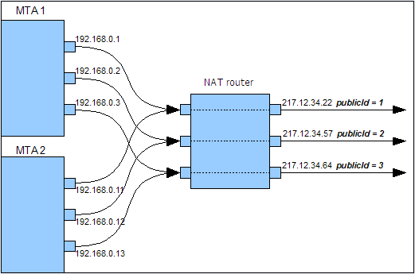

# 기술 이메일 구성{#email-deliverability}


## 개요 {#overview}

다음 섹션에서는 이메일을 배달할 때 Adobe Campaign 인스턴스의 출력을 제어하는 데 필요한 구성에 대한 개요를 제공합니다.

>[!NOTE]
>
>일부 구성은 Adobe이 서버 및 인스턴스 구성 파일에 액세스하는 등 Adobe이 호스팅하는 배포에 대해서만 수행할 수 있습니다. 다양한 배포에 대한 자세한 내용은 [호스팅 모델](../../installation/using/hosting-models.md) 또는 [이 페이지](../../installation/using/capability-matrix.md).

Adobe Campaign을 통한 게재 기능과 관련된 개념과 모범 사례에 대한 자세한 내용은 이 항목을 참조하십시오 [섹션](../../delivery/using/about-deliverability.md).

Adobe 플랫폼이 전자 메일을 효율적으로 보내고 받는 것과 관련된 모든 기술 권장 사항을 포함하여 게재 능력에 대한 자세한 내용은 [Adobe 게재 가능성 모범 사례 안내서](https://experienceleague.adobe.com/docs/deliverability-learn/deliverability-best-practice-guide/introduction.html?lang=ko).

## 운영 원칙 {#operating-principle}

도메인에 따라 전송되는 이메일 수를 제한하는 하나 이상의 Adobe Campaign 인스턴스의 출력을 제어할 수 있습니다. 예를 들어 출력을 시간 당 20,000으로 제한할 수 있습니다 **yahoo.com** 주소 를 구성하는 동안 다른 모든 도메인에 대해 시간당 100,000개의 메시지를 구성합니다.

게재 서버에서 사용하는 각 IP 주소에 대해 메시지 출력을 제어해야 합니다(**mta**). 몇 개 **mta** 여러 시스템에 대해 분류되고 다양한 Adobe Campaign 인스턴스에 속하는 는 전자 메일 게재를 위해 동일한 IP 주소를 공유할 수 있습니다. 이러한 IP 주소의 사용을 조정하기 위해 프로세스를 설정해야 합니다.

이것이 바로 **stat** 의 기능은 다음과 같습니다. 이 서비스는 IP 주소 집합에 대해 메일 서버로 전송할 모든 연결 요청과 메시지를 전달합니다. 통계 서버는 게재를 추적하고 설정된 할당량에 따라 전송을 활성화하거나 비활성화할 수 있습니다.


* 통계 서버(**stat**)가 Adobe Campaign 베이스에 연결되어 구성을 로드합니다.
* 게재 서버(**mta**) UDP를 사용하여 자체 인스턴스에 항상 속하지 않는 통계 서버에 연결합니다.

### 게재 서버 {#delivery-servers}

다음 **mta** 모듈은 메시지를 **mtachild** 하위 모듈입니다. 각 **mtachild** 통계 서버에서 인증을 요청하고 보내기 전에 메시지를 준비합니다.

단계는 다음과 같습니다.

1. 다음 **mta** 적합한 메시지를 선택하고 사용 가능한 메시지를 지정합니다. **mtachild**.
1. 다음 **mtachild** 메시지(콘텐츠, 개인화 요소, 첨부 파일, 이미지 등)를 작성하는 데 필요한 모든 정보를 로드합니다. 메시지를 **이메일 트래픽 표시기**.
1. 전자 메일 트래픽이 통계 서버의 인증을 받는 즉시(**smtp stat**)이면 메시지가 수신자에게 전송됩니다.


### 이메일 서버 통계 및 제한 사항 {#email-server-statistics-and-limitations}

통계 서버는 메시지를 수신하는 각 이메일 서버에 대해 다음 통계를 유지합니다.

* 연 시점 연결 수,
* 지난 시간에 전송된 메시지 수,
* 성공/거부된 연결 비율,
* 연결할 수 없는 서버에 대한 연결 비율입니다.

동시에 모듈은 특정 이메일 서버에 대한 제한 사항 목록을 로드합니다.

* 최대 동시 연결 수,
* 시간당 최대 메시지 수,
* 연결당 최대 메시지 수입니다.

### IP 주소 관리 {#managing-ip-addresses}

통계 서버는 동일한 공용 IP 주소를 사용하여 여러 인스턴스 또는 여러 컴퓨터를 결합할 수 있습니다. 따라서 특정 인스턴스에는 연결되지 않지만 도메인별 제한 사항을 복구하려면 인스턴스에 문의해야 합니다.

게재 통계는 각 대상 MX 및 각 소스 IP에 대해 유지됩니다. 예를 들어 타깃팅된 도메인에 5개의 MX가 있고 플랫폼이 3개의 서로 다른 IP 주소를 사용할 수 있는 경우 서버는 이 도메인에 대해 최대 15개의 지표 시리즈를 관리할 수 있습니다.

소스 IP 주소는 공용 IP 주소(원격 이메일 서버에서 보는 주소)와 일치합니다. 이 IP 주소는 **mta** NAT 라우터가 제공된 경우 통계 서버에서 공용 IP(**publicId**). 로컬 주소와 이 식별자 간의 연결은 **serverConf.xml** 구성 파일. 에서 사용할 수 있는 모든 매개 변수 **serverConf.xml** 여기에 나열되어 있습니다. [섹션](../../installation/using/the-server-configuration-file.md).

## 게재 출력 제어 {#delivery-output-controlling}

전자 메일 서버에 메시지를 전달하려면 **이메일 트래픽 표시기** 구성 요소는 통계 서버에서 연결을 요청합니다. 요청이 수락되면 연결이 열립니다.

모듈을 통해 메시지를 보내기 전에 서버에서 &#39;토큰&#39;을 요청합니다. 일반적으로 서버에 대한 쿼리 수를 줄이는 10개 이상의 토큰 집합입니다.

서버는 연결 및 게재와 관련된 모든 통계를 저장합니다. 재부팅할 경우 정보가 일시적으로 손실됩니다. 각 클라이언트는 전송 통계의 로컬 복사본을 보관하고 정기적으로(2분마다) 서버로 반환합니다. 그런 다음 서버가 데이터를 다시 집계할 수 있습니다.

다음 섹션에서는 **이메일 트래픽 표시기** 구성 요소.

### 메시지 전달 {#message-delivery}

메시지가 전송되면 3가지 가능한 결과가 있습니다.

1. **성공**: 메시지를 보냈습니다. 메시지가 업데이트됩니다.
1. **메시지 실패**: 선택한 수신자에 대한 메시지가 연결된 서버에서 거부되었습니다. 이 결과는 반환 코드 550~599와 일치하지만, 예외를 정의할 수 있습니다.
1. **세션 실패** (5.11 상향): if **mta** 이 메시지에 대한 답변을 받으면 메시지가 중단됩니다(참조: [메시지 포기](#message-abandonment)). 다른 경로를 사용할 수 없는 경우 메시지가 다른 경로로 전송되거나 보류 중으로 설정됩니다(참조: [메시지 보류 중](#message-pending)).

   >[!NOTE]
   >
   >A **경로** 는 Adobe Campaign 간의 연결입니다 **mta** 타겟과 **mta**. Adobe Campaign **mta** 여러 시작 IP 및 여러 타겟 도메인 IP 중에서 선택할 수 있습니다.

### 메시지 포기 {#message-abandonment}

중단된 메시지는 **mta** 및 는 더 이상 **mtachild**.

다음 **mta** 이 메시지의 절차(복구, 중단, 격리 등)를 결정합니다. 응답 코드 및 규칙에 따라 다릅니다.

### 메시지 보류 중 {#message-pending}

메시지가 활성 대기열에 도착하고 사용 가능한 경로가 없을 때 메시지가 추가됩니다.

일반적으로 경로는 연결 오류 후 일정 시간 동안 변수를 사용할 수 없는 것으로 표시됩니다. 가용성의 기간은 오류 빈도와 나이에 따라 다릅니다.

## 통계 서버 구성 {#statistics-server-configuration}

통계 서버는 여러 인스턴스에서 사용할 수 있습니다. 사용할 인스턴스와 독립적으로 구성해야 합니다.

먼저 구성을 호스트할 Adobe Campaign 데이터베이스를 정의합니다.

### 구성 시작 {#start-configuration}

기본적으로 **stat** 모듈은 각 인스턴스에 대해 시작됩니다. 인스턴스가 동일한 컴퓨터에서 풀링되거나 인스턴스가 동일한 IP 주소를 공유하는 경우 단일 통계 서버가 사용됩니다. 다른 사람들은 비활성화되어야 합니다.

### 서버 포트의 정의 {#definition-of-the-server-port}

기본적으로 통계 서버는 포트 7777에서 수신 대기합니다. 이 포트는 **serverConf.xml** 파일. 에서 사용할 수 있는 모든 매개 변수 **serverConf.xml** 여기에 나열되어 있습니다. [섹션](../../installation/using/the-server-configuration-file.md).

```
<stat port="1234"/>
```

## MX 구성 {#mx-configuration}

>[!IMPORTANT]
>
>호스팅 또는 하이브리드 설치의 경우 로 업그레이드한 경우 [향상된 MTA](../../delivery/using/sending-with-enhanced-mta.md), **[!UICONTROL MX management]** 게재 처리량 규칙은 더 이상 사용되지 않습니다. Enhanced MTA는 자체 MX 규칙을 사용하여 사용자의 과거 전자 메일 신뢰도를 기반으로, 전자 메일을 전송하는 도메인에서 오는 실시간 피드백에 따라 도메인별로 처리량을 사용자 정의할 수 있습니다.

### MX 규칙 {#about-mx-rules}

>[!NOTE]
>
>이 섹션 및 아래 섹션은 기존 Campaign MTA를 사용하는 온-프레미스 설치 및 호스팅/하이브리드 설치에만 적용됩니다.

MX 규칙(Mail eXchanger)은 전송 서버와 수신 서버 간의 통신을 관리하는 규칙입니다.

이러한 규칙은 클라이언트 인스턴스를 정기적으로 공급하기 위해 매일 아침 6AM(서버 시간)에 자동으로 다시 로드됩니다.

자재 용량 및 내부 정책에 따라, ISP는 미리 정의된 연결 및 메시지를 시간당 허용합니다. 이러한 변수는 IP 및 전송 도메인의 평판에 따라 ISP 시스템에서 자동으로 수정할 수 있습니다. 게재 기능 플랫폼을 통해 Adobe Campaign은 ISP에 의해 150개 이상의 특정 규칙을 관리하며, 다른 도메인용된 규칙도 관리합니다.

최대 연결 수는 MTA에서 사용하는 공개 IP 주소 수에만 의존하지 않습니다.

예를 들어 MX 규칙에서 5개의 연결을 허용했으며 2개의 공용 IP를 구성한 경우 이 도메인에 대해 동시에 10개 이상의 연결을 열 수 없다고 생각할 수 있습니다. 이는 사실이 아닙니다. 실제로 최대 연결 수는 Adobe의 MTA 공용 IP 및 클라이언트 MTA의 공개 IP 중 하나의 조합인 경로 및 경로를 나타냅니다.

아래 예에서는 사용자에게 두 개의 공개 IP 주소가 구성되고 도메인은 yahoo.com입니다.

```
user:~ user$ host -t mx yahoo.com
                yahoo.com mail is handled by 1 mta5.am0.yahoodns.net.
                yahoo.com mail is handled by 1 mta6.am0.yahoodns.net.
                yahoo.com mail is handled by 1 mta7.am0.yahoodns.net.
```

yahoo.com에 대한 MX 레코드는 yahoo.com에 3개의 메일 교환기가 있다고 우리에게 말합니다. 피어 메일 교환기를 연결하려면 MTA가 DNS의 IP 주소를 요청합니다.

```
user:~ user$ host -t a mta5.am0.yahoodns.net
                mta5.am0.yahoodns.net has address 98.136.216.26
                mta5.am0.yahoodns.net has address 98.136.217.202
                mta5.am0.yahoodns.net has address 98.138.112.38
                mta5.am0.yahoodns.net has address 66.196.118.37
                mta5.am0.yahoodns.net has address 63.250.192.46
                mta5.am0.yahoodns.net has address 66.196.118.240
                mta5.am0.yahoodns.net has address 98.136.217.203
                mta5.am0.yahoodns.net has address 98.138.112.35
```

이 레코드의 경우 사용자는 8개의 피어 IP 주소에 연결할 수 있습니다. 사용자에게 2개의 공개 IP 주소가 있으므로 8 * 2 = 16개의 조합을 제공하여 yahoo.com 메일 서버에 연결합니다. 이러한 각 조합을 경로라고 합니다.

두 번째 MX 레코드가 다음과 같이 나타납니다.

```
user:~ user$ host -t a mta6.am0.yahoodns.net
                mta6.am0.yahoodns.net has address 98.138.112.38
                mta6.am0.yahoodns.net has address 98.136.216.26
                mta6.am0.yahoodns.net has address 63.250.192.46
                mta6.am0.yahoodns.net has address 66.196.118.35
                mta6.am0.yahoodns.net has address 98.136.217.203
                mta6.am0.yahoodns.net has address 98.138.112.32
                mta6.am0.yahoodns.net has address 98.138.112.37
                mta6.am0.yahoodns.net has address 66.196.118.33
```

이 8개의 IP 주소 중 4개는 mta5(98.136.216.26, 98.138.112.38, 63.250.192.46 및 98.136.217.203)에 이미 사용되고 있습니다. 이 레코드를 사용하면 사용자가 4개의 새 IP 주소를 사용할 수 있습니다. 세 번째 MX 레코드도 동일하게 수행됩니다.

총 16개의 원격 IP 주소가 있습니다. 2개의 로컬 공용 IP와 결합하여 yahoo.com 메일 서버에 연결할 수 있는 32개의 경로가 있습니다.

>[!NOTE]
>
>2개의 MX 레코드가 동일한 IP 주소를 참조하는 경우 이 IP 주소는 2가 아니라 하나의 경로로 계산됩니다.

다음은 MX 규칙 사용의 몇 가지 예입니다.


아래 예에서는 특정 도메인에 대해 시간당 10,000개의 메시지 제한이 있지만 MTA 처리량 용량은 이 제한보다 높습니다.

이 경우 트래픽은 매시간 12분 5초로 나누어지고 실제 제한은 기간당 833개의 메시지입니다.

이러한 메시지는 가능한 한 빨리 전달됩니다.


### MX 관리 구성 {#configuring-mx-management}

MX에 대해 준수해야 하는 규칙은 **[!UICONTROL MX management]** 문서 **[!UICONTROL Administration > Campaign Management > Non deliverables Management > Mail rule sets]** 노드 아래에 있어야 합니다.

만약 **[!UICONTROL MX management]** 문서가 노드에 없으므로 수동으로 만들 수 있습니다. 방법은 다음과 같습니다.

1. 새 메일 규칙 세트를 만듭니다.
1. 을(를) 선택합니다 **[!UICONTROL MX management]** 모드.

   

1. Enter 키 **defaultMXRules** 에서 **[!UICONTROL Internal name]** 필드.

변경 사항을 고려하려면 통계 서버를 다시 시작해야 합니다.

통계 서버를 다시 시작하지 않고 구성을 다시 로드하려면 서버를 호스트하는 시스템에서 다음 명령을 사용합니다. `nlserver stat -reload`

>[!NOTE]
>
>이 명령줄에서 **nlserver 다시 시작**. 다시 시작하기 전에 수집된 통계가 손실되지 않도록 하고 MX 규칙에 정의된 할당량에 따라 사용할 수 있는 최고점을 방지합니다.

### MX 규칙 구성 {#configuring-mx-rules}

다음 **[!UICONTROL MX management]** 문서는 MX 규칙에 연결된 모든 도메인을 나열합니다.

이러한 규칙은 순서대로 적용됩니다. MX 마스크가 타깃팅된 MX와 호환되는 첫 번째 규칙이 적용됩니다.

각 규칙에 사용할 수 있는 매개 변수는 다음과 같습니다.

* **[!UICONTROL MX mask]**: 규칙이 적용되는 도메인. 각 규칙은 MX의 주소 마스크를 정의합니다. 따라서 이 마스크와 이름이 일치하는 모든 MX를 사용할 수 있습니다. 마스크에는 &quot;*&quot;와 &quot;?&quot;가 포함될 수 있습니다. 일반 문자

   예를 들어 다음 주소가 있습니다.

   * a.mx.yahoo.com
   * b.mx.yahoo.com
   * c.mx.yahoo.com

   는 다음 마스크와 호환됩니다.

   * *.yahoo.com
   * ?.mx.yahoo.com

   예를 들어 이메일 주소 foobar@gmail.com의 경우 도메인은 gmail.com이고 MX 레코드는 다음과 같습니다.

   ```
   gmail.com mail exchanger = 20 alt2.gmail-smtp-in.l.google.com.
   gmail.com mail exchanger = 10 alt1.gmail-smtp-in.l.google.com.
   gmail.com mail exchanger = 40 alt4.gmail-smtp-in.l.google.com.
   gmail.com mail exchanger = 5  gmail-smtp-in.l.google.com.
   gmail.com mail exchanger = 30 alt3.gmail-smtp-in.l.google.com.
   ```

   이 경우 MX 규칙 `*.google.com` 이 사용됩니다. 보시다시피 MX 규칙 마스크가 메일의 도메인과 꼭 일치하지 않습니다. gmail.com 전자 메일 주소에 적용되는 MX 규칙은 마스크가 있는 규칙입니다 `*.google.com`.

* **[!UICONTROL Range of identifiers]**: 이 옵션을 사용하면 규칙이 적용되는 식별자(publicID) 범위를 지정할 수 있습니다. 다음을 지정할 수 있습니다.

   * 숫자: 규칙은 이 publicId에만 적용됩니다.
   * 숫자 범위(**number1-number2**): 이 두 숫자 사이의 모든 publicIds에 규칙이 적용됩니다.

   >[!NOTE]
   >
   >필드가 비어 있으면 규칙이 모든 식별자에 적용됩니다.

   공개 ID는 하나 또는 여러 MTA에서 사용하는 공개 IP의 내부 식별자입니다. 이러한 ID는 의 MTA 서버에서 정의됩니다 **config-instance.xml** 파일.

   

* **[!UICONTROL Shared]**: 이 MX 규칙의 속성 범위를 정의합니다. 이 필드를 선택하면 모든 매개 변수가 인스턴스에서 사용할 수 있는 모든 IP에서 공유됩니다. 선택하지 않으면 각 IP에 대해 MX 규칙이 정의됩니다. 최대 메시지 수에 사용 가능한 IP 수를 곱합니다.
* **[!UICONTROL Maximum number of connections]**: 보낸 사람의 도메인에 대한 동시 연결 최대 수입니다.
* **[!UICONTROL Maximum number of messages]**: 연결 시 전송할 수 있는 최대 메시지 수입니다. 메시지가 이 수를 초과하면 연결이 닫히고 새 메시지가 열립니다.
* **[!UICONTROL Messages per hour]**: 보낸 사람의 도메인으로 1시간 내에 보낼 수 있는 최대 메시지 수입니다.
* **[!UICONTROL Connection time out]**: 도메인에 연결하는 시간 임계값입니다.

   >[!NOTE]
   >
   >Windows에서 **timeout** 이 임계값 전에 Windows 버전에 따라 달라집니다.

* **[!UICONTROL Timeout Data]**: 메시지 콘텐츠를 보낸 후 최대 대기 시간(SMTP 프로토콜의 데이터 섹션)
* **[!UICONTROL Timeout]**: SMTP 서버와의 다른 교환을 위한 최대 대기 시간입니다.
* **[!UICONTROL TLS]**: 이메일 전송을 암호화할 수 있는 TLS 프로토콜을 선택적으로 활성화할 수 있습니다. 각 MX 마스크에 대해 다음 옵션을 사용할 수 있습니다.

   * **[!UICONTROL Default configuration]**: 적용되는 serverConf.xml 구성 파일에 지정된 일반 구성입니다.

      >[!IMPORTANT]
      >
      >기본 구성은 수정하지 않는 것이 좋습니다.

   * **[!UICONTROL Disabled]** : 메시지는 암호화 없이 체계적으로 전송됩니다.
   * **[!UICONTROL Opportunistic]** : 수신 서버(SMTP)가 TLS 프로토콜을 생성할 수 있는 경우 메시지 배달이 암호화됩니다.

구성 예:


>[!NOTE]
>
>Adobe Campaign에서 MX 서버 사용에 대한 자세한 내용은 [이 섹션](../../installation/using/using-mx-servers.md).

### 이메일 형식 관리 {#managing-email-formats}

전송된 메시지의 형식을 정의하여 표시되는 컨텐츠가 각 수신자 주소의 도메인에 따라 자동으로 조정되도록 할 수 있습니다.

이렇게 하려면 로 이동합니다. **[!UICONTROL Management of email formats]** 문서, **[!UICONTROL Administration]** > **[!UICONTROL Campaign management]** > **[!UICONTROL Non deliverables management]** > **[!UICONTROL Mail rule sets]**.

이 문서에는 Adobe Campaign에서 관리하는 일본어 형식에 해당하는 사전 정의된 모든 도메인 목록이 포함되어 있습니다. 자세한 내용은 [이 문서](../../delivery/using/defining-the-email-content.md#sending-emails-on-japanese-mobiles).


다음 **MIME 구조** (다목적 인터넷 메일 확장) 매개 변수를 사용하면 다른 메일 클라이언트로 보낼 메시지 구조를 정의할 수 있습니다. 다음 세 가지 옵션을 사용할 수 있습니다.

* **다중 부분**: 메시지는 텍스트 또는 HTML 형식으로 전송됩니다. HTML 형식이 허용되지 않는 경우에도 메시지는 텍스트 형식으로 표시될 수 있습니다.

   기본적으로 다중 부분 구조는 다음과 같습니다 **다중 부분/대체**&#x200B;그러나 자동으로 **다중 부분/관련** 메시지에 이미지가 추가되는 경우입니다. 특정 공급자는 **다중 부분/관련** 기본적으로 형식은 **[!UICONTROL Force multipart/related]** 옵션이 첨부된 이미지가 없는 경우에도 이 형식을 적용합니다.

* **HTML**: HTML 전용 메시지가 전송됩니다. HTML 형식이 허용되지 않으면 메시지가 표시되지 않습니다.
* **텍스트**: 텍스트 전용 형식의 메시지가 전송됩니다. 텍스트 형식 메시지의 장점은 크기가 매우 작다는 것입니다.

만약 **[!UICONTROL Image inclusion]** 옵션이 활성화되어 있으면 전자 메일 본문에 직접 표시됩니다. 그러면 이미지가 업로드되고 URL 링크가 해당 컨텐츠로 바뀝니다.

이 옵션은 특히 일본 시장에서 **데코 메일**, **전자 메일 삭제** 또는 **장식 메일**. 자세한 내용은 [이 문서](../../delivery/using/defining-the-email-content.md#sending-emails-on-japanese-mobiles).

>[!IMPORTANT]
>
>이메일에 이미지를 삽입하면 크기가 상당히 증가합니다.

## 게재 서버 구성 {#delivery-server-configuration}

### 클럭 동기화 {#clock-synchronization}

Adobe Campaign 플랫폼(데이터베이스 포함)을 구성하는 모든 서버의 클럭은 동기화되어야 하며 시스템은 동일한 시간대에 설정되어야 합니다.

### 통계 서버의 좌표 {#coordinates-of-the-statistics-server}

통계 서버의 주소는 **mta**.

다음 **statServerAddress** 속성 **mta** 구성의 요소를 사용하여 사용할 포트의 주소와 번호를 지정할 수 있습니다.

```
<mta statServerAddress="emailStatServer:7777">
   [...]
 </mta>
```

같은 컴퓨터에서 통계 서버를 사용하려면 적어도 이 컴퓨터에 있는 컴퓨터 이름을 입력해야 합니다 **localhost** 값:

```
 <mta statServerAddress="localhost">
```

>[!IMPORTANT]
>
>이 필드를 채우지 않으면 **mta** 이 시작되지 않습니다.

### 사용할 IP 주소 목록 {#list-of-ip-addresses-to-use}

트래픽 관리에 대한 구성은 **mta/child/smtp** 구성 파일의 요소입니다.

각 **IPAffness** 요소를 사용하려면 컴퓨터에 사용할 수 있는 IP 주소를 선언해야 합니다.

예제:

```
<IPAffinity localDomain="<domain>" name="default">
  <IP address="192.168.0.11" publicId="1" weight="5"/>
  <IP address="192.168.0.12" heloHost="revdns1.campaign.com" publicId="2" weight="5"/>
  <IP address="192.168.0.13" publicId="3" weight="1"/>
</IPAffinity>
```

매개 변수는 다음과 같습니다.

* **주소**: 사용할 MTA 호스트 시스템의 IP 주소입니다.
* **heloHost**: 이 식별자는 SMTP 서버에서 볼 IP 주소를 나타냅니다.

* **publicId**: 이 정보는 여러 Adobe Campaign에서 IP 주소를 공유할 때 유용합니다 **mtas** NAT 라우터 뒤에 있습니다. 통계 서버는 이 식별자를 사용하여 이 시작점과 대상 서버 사이의 연결 및 전송 통계를 기억합니다.
* **가중치**: 주소의 상대 사용 빈도를 정의할 수 있습니다. 기본적으로 모든 주소의 가중치는 1입니다.

>[!NOTE]
>
>serverConf.xml 파일에서 하나의 IP가 고유한 식별자(public_id)가 있는 단일 helohost에 해당하는지 확인해야 합니다. 여러 helohosts에 매핑할 수 없으므로 게재 조절 문제가 발생할 수 있습니다.

앞의 예에서 일반적인 조건에서 주소는 다음과 같이 배포됩니다.

    * &quot;1&quot;: 5 / (5+5+1) = 45%
    * &quot;2&quot;: 5 / (5+5+1) = 45%
    * &quot;3&quot;: 1 / (5+5+1) = 10%

예를 들어, 지정된 MX에 첫 번째 주소를 사용할 수 없으면 다음과 같이 메시지가 전송됩니다.

    * &quot;2&quot;: 5 / (5+1) = 83%
    * &quot;3&quot;: 1 / (5+1) = 17%

* **includeDomains**: 특정 도메인에 속하는 이메일에 대해 이 IP 주소를 예약할 수 있습니다. 하나 이상의 와일드카드(&#39;*&#39;)를 포함할 수 있는 마스크 목록입니다. 특성을 지정하지 않으면 모든 도메인이 이 IP 주소를 사용할 수 있습니다.

   예: **includeDomains=&quot;wanadoo.com,orange.com,yahoo.*&quot;**

* **excludeDomains**: 은 이 IP 주소의 도메인 목록을 제외합니다. 이 필터는 **includeDomains** 필터.

   

## 이메일 전송 최적화 {#email-sending-optimization}

Adobe Campaign의 내부 아키텍처 **mta** 은 이메일 게재 최적화를 위한 구성에 영향을 줍니다. 다음은 게재 개선에 대한 몇 가지 팁입니다.

### maxWaitingMessages 매개 변수 조정 {#adjust-the-maxwaitingmessages-parameter}

다음 **maxWaitingMessages** 매개 변수는 **mtachild**. 메시지를 보내거나 포기한 경우에만 이 목록에서 삭제됩니다.

이 매개 변수는 메시지를 도메인으로 정렬하지 않는 경우 매우 중요하며 특히 중요합니다.

한 번 **maxWorkingSetMb** (256) 임계값에 도달하면 게재 서버가 메시지 전송을 중지합니다. 성능이 크게 저하될 때까지 **mtachild** 다시 시작합니다. 이 문제를 회피하려면 **maxWorkingSetMb** 매개 변수 또는 **maxWaitingMessages** 매개 변수.

다음 **maxWorkingSetMb** 매개 변수는 최대 메시지 수에 평균 메시지 크기를 곱하고 결과에 2.5를 곱하여 경험적으로 계산됩니다. 예를 들어, 메시지의 평균 크기가 50kB이고 **maxWaitingMessages** 매개 변수는 1,000이며, 사용된 메모리는 평균 125MB입니다.

### 일치 개수 조정 {#adjust-the-number-of-mtachild}

하위 수는 시스템의 프로세서 수를 초과할 수 없습니다(약). 1000개 세션). 8을 넘지 않는 것이 좋습니다 **mtachild**. 그런 다음 메시지 수를 늘릴 수 있습니다 **하위** (**maxMsgPerChild**)을 클릭하여 충분한 수명을 제공합니다.
