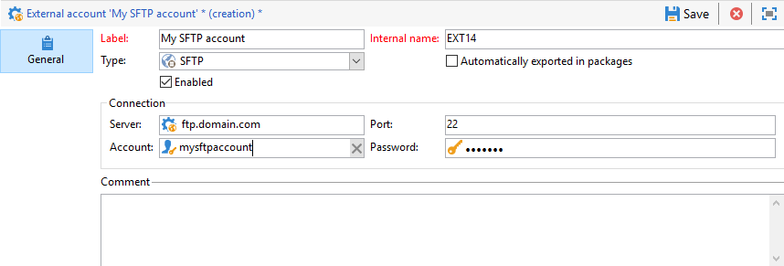

# 외부 계정{#external-accounts}


Adobe Campaign에는 미리 정의된 외부 계정 집합이 포함되어 있습니다. 외부 시스템과의 연결을 설정하기 위해 새 외부 계정을 만들 수 있습니다.

외부 계정은 기술 워크플로우 또는 캠페인 워크플로우와 같은 기술 프로세스에서 사용됩니다. 예를 들어 워크플로우에서 파일 전송을 설정하거나 다른 애플리케이션(Adobe Target, Experience Manager 등)과의 데이터 교환을 설정할 때 외부 계정을 선택해야 합니다.

## 외부 계정 만들기 {#creating-an-external-account}

새 외부 계정을 만들려면 아래 단계를 수행하십시오. 자세한 설정은 외부 계정 유형에 따라 다릅니다.

1. 출처: Campaign **[!UICONTROL Explorer]**, 선택 **[!UICONTROL Administration]** &#39;>&#39; **[!UICONTROL Platform]** &#39;>&#39; **[!UICONTROL External accounts]**.

   

1. **[!UICONTROL New]** 버튼을 클릭합니다.

   

1. 입력 **[!UICONTROL Label]** 및 **[!UICONTROL Internal Name]**.
1. 외부 계정 선택 **[!UICONTROL Type]** 어떤 것을 만들고 싶은지 지정합니다.
1. 선택한 외부 계정 유형에 따라 자격 증명을 지정하여 계정에 대한 액세스를 구성합니다.

   필요한 정보는 일반적으로 연결 중인 서버 공급자가 제공합니다.

1. 다음 확인: **[!UICONTROL Enabled]** 연결을 활성화하는 옵션입니다.
1. **[!UICONTROL Save]**&#x200B;를 클릭합니다.

외부 계정이 만들어지고 외부 계정 목록에 추가됩니다.

## 캠페인별 외부 계정

### 바운스 메일 {#bounce-mails-external-account}

다음 **바운스 메일** 외부 계정은 이메일 서비스에 연결하는 데 사용할 외부 POP3 계정을 지정합니다. 이 외부 계정에 대한 자세한 정보는 다음을 참조하십시오. [페이지](../../workflow/using/inbound-emails.md).

POP3 액세스용으로 구성된 모든 서버는 반송 메일을 수신하는 데 사용할 수 있습니다.


을(를) 구성하려면 다음을 수행하십시오. **[!UICONTROL Bounce mails (defaultPopAccount)]** 외부 계정:

* **[!UICONTROL Server]**

  POP3 서버의 URL.

* **[!UICONTROL Port]**

  POP3 연결 포트 번호. 기본 포트는 110입니다.

* **[!UICONTROL Account]**

  사용자 이름.

* **[!UICONTROL Password]**

  사용자 계정 암호.

* **[!UICONTROL Encryption]**

  다음 사이에 선택한 암호화 유형: **[!UICONTROL By default]**, **[!UICONTROL POP3 + STARTTLS]**, **[!UICONTROL POP3]** 또는 **[!UICONTROL POP3S]**.

* **[!UICONTROL Function]**

  인바운드 이메일 또는 SOAP 라우터

>[!IMPORTANT]
>
>Microsoft OAuth 2.0을 사용하여 POP3 외부 계정을 구성하기 전에 먼저 Azure 포털에 애플리케이션을 등록해야 합니다. 자세한 정보는 이 [페이지](https://docs.microsoft.com/en-us/azure/active-directory/develop/quickstart-register-app)를 참조하십시오.

다음을 사용하여 POP3 외부 구성 **Microsoft OAuth 2.0**&#x200B;을(를) 선택합니다. **[!UICONTROL Microsoft OAuth 2.0]** 옵션을 선택하고 다음 필드를 채웁니다.

* **[!UICONTROL Azure tenant]**

  Azure ID(또는 디렉터리(테넌트) ID)는 **기본 사항** azure 포털에서 애플리케이션 개요 드롭다운

* **[!UICONTROL Azure Client ID]**

  클라이언트 ID(또는 애플리케이션(클라이언트) ID)는 **기본 사항** azure 포털에서 애플리케이션 개요 드롭다운

* **[!UICONTROL Azure Client secret]**

  클라이언트 암호 ID는 **클라이언트 암호** 의 열 **인증서 및 암호** Azure 포털에 있는 애플리케이션의 메뉴.

* **[!UICONTROL Azure Redirect URL]**

  리디렉션 URL은 **인증** Azure 포털에 있는 애플리케이션의 메뉴. 다음 구문으로 끝나야 합니다 `nl/jsp/oauth.jsp`, 예: `https://redirect.adobe.net/nl/jsp/oauth.jsp`.

다른 자격 증명을 입력한 후 **[!UICONTROL Setup the connection]** 외부 계정 구성을 완료합니다.

### 라우팅{#routing-external-account}

다음 **[!UICONTROL Routing]** 외부 계정을 사용하면 설치된 패키지에 따라 Adobe Campaign에서 사용할 수 있는 각 채널을 구성할 수 있습니다.


다음 채널을 구성할 수 있습니다.

* [이메일](#email-routing-external-account)
* [모바일(SMS)](../../delivery/using/sms-set-up.md#creating-an-smpp-external-account)
* [휴대폰](../../delivery/using/steps-about-delivery-creation-steps.md#other-channels)
* [DM](../../delivery/using/about-direct-mail-channel.md)
* [에이전시](../../delivery/using/steps-about-delivery-creation-steps.md#other-channels)
* [X(이전 명칭: Twitter)](../../social/using/about-social-marketing.md)
* [iOS 채널](../../delivery/using/configuring-the-mobile-application.md)
* [Android 채널](../../delivery/using/configuring-the-mobile-application-android.md)

### 이메일 라우팅 {#email-routing-external-account}

이메일 라우팅 외부 계정은 기본적으로 제공되며 구성에 맞게 조정됩니다.

온-프레미스/하이브리드 고객은 아래 설명된 대로 새 라우팅 외부 계정을 만들거나 매개 변수를 업데이트할 수 있습니다. 이 구성은 전문가 사용자에게 예약되어 있으며 전달성에 영향을 줄 수 있습니다. 질문이 있는 경우 Adobe 고객 지원 센터 또는 Adobe 담당자에게 문의하십시오.

* 다음을 사용할 수 있습니다. **중간 소싱**, **외부** 라우팅 또는 **일괄** 게재 라우팅 유형.

* 대상 **일괄** 및 **중간 소싱** 게재 모드에서 브랜딩 매개 변수를 **브랜딩** 탭. 이러한 매개 변수는 [기본 매개 변수](../../installation/using/deploying-an-instance.md#email-channel-parameters) 대상 **미러 페이지 URL** 및 **오류 주소** 특정 브랜드 설정을 사용하는 경우입니다.

  

* 중간 소싱 외부 계정을 구성하려면 다음을 참조하십시오. [이 섹션](mid-sourcing-server.md)

### 실행 인스턴스  {#execution-instance-external-account}

분류 아키텍처가 있는 경우 제어 인스턴스에 연결된 실행 인스턴스를 지정하고 연결해야 합니다. 트랜잭션 메시지 템플릿이 실행 인스턴스에 배포됩니다.


* **[!UICONTROL URL]**

  실행 인스턴스가 설치된 서버의 URL.

* **[!UICONTROL Account]**

  계정 이름입니다. 연산자 폴더에 정의된 메시지 센터 에이전트와 일치해야 합니다.

* **[!UICONTROL Password]**

  연산자 폴더에 정의된 계정의 암호입니다.

이 구성에 대한 자세한 내용은 다음을 참조하십시오. [페이지](../../message-center/using/configuring-instances.md#control-instance).

## 외부 시스템 외부 계정에 액세스

### FTP {#ftp-external-account}

FTP 외부 계정을 사용하여 Adobe Campaign 외부의 서버에 대한 액세스를 구성하고 테스트할 수 있습니다. 파일 전송에 사용되는 FTP 서버 898과 같은 외부 시스템과의 연결을 설정하기 위해 자체 외부 계정을 만들 수 있습니다. 자세한 정보는 이 [페이지](../../workflow/using/file-transfer.md)를 참조하십시오.

이렇게 하려면 이 외부 계정에서 FTP 서버 연결을 설정하는 데 사용되는 주소와 자격 증명을 지정합니다


* **[!UICONTROL Server]**

  FTP 서버 이름입니다.

* **[!UICONTROL Port]**

  FTP 연결 포트 번호입니다. 기본 포트는 21입니다.

* **[!UICONTROL Account]**

  사용자 이름.

* **[!UICONTROL Password]**

  사용자 계정 암호.

* **[!UICONTROL Encryption]**

  다음 사이에 선택한 암호화 유형: **[!UICONTROL None]** 또는 **[!UICONTROL SSL]**.

이러한 자격 증명을 찾을 위치를 알려면 다음을 참조하십시오. [페이지](https://help.dreamhost.com/hc/en-us/articles/115000675027-FTP-overview-and-credentials).

### SFTP {#sftp-external-account}

SFTP 외부 계정을 사용하여 Adobe Campaign 외부의 서버에 대한 액세스를 구성하고 테스트할 수 있습니다. 파일 전송에 사용되는 SFTP와 같은 외부 시스템과의 연결을 설정하려면 고유한 외부 계정을 만들 수 있습니다. 자세한 정보는 이 [페이지](../../workflow/using/file-transfer.md)를 참조하십시오.



* **[!UICONTROL Server]**

  SFTP 서버의 URL입니다.

* **[!UICONTROL Port]**

  FTP 연결 포트 번호입니다. 기본 포트는 22입니다.

* **[!UICONTROL Account]**

  SFTP 서버에 연결하는 데 사용되는 계정 이름입니다.

* **[!UICONTROL Password]**

  SFTP 서버에 연결하는 데 사용되는 암호입니다.

Windows에서 SSH 키를 추가하려면:

1. 만들기 **홈** 값이 설치 디렉터리로 설정된 환경 변수입니다.

2. 에 개인 키 추가 `/$HOME/.ssh/id_rsa` 폴더를 삭제합니다.

3. Adobe Campaign 서비스를 다시 시작합니다.

### 외부 데이터베이스(FDA) {#external-database-external-account}

사용 **외부 데이터베이스** 외부 데이터베이스에 연결하려면 외부 계정을 입력하십시오. 에서 FDA(Federated Data Access) 옵션에 대해 자세히 알아봅니다. [이 섹션](../../installation/using/about-fda.md).

Campaign과 호환되는 외부 데이터베이스는 [호환성 매트릭스](../../rn/using/compatibility-matrix.md)


외부 계정 구성 설정은 데이터베이스 엔진에 따라 다릅니다. 다음 섹션에서 자세히 알아보세요.

* 액세스 권한 구성 [Vertica analytics](../../installation/using/configure-fda-vertica.md)
* 액세스 권한 구성 [Snowflake](../../installation/using/configure-fda-snowflake.md)
* 액세스 권한 구성 [Google Bigquery](../../installation/using/configure-fda-google-big-query.md)
* 액세스 권한 구성 [Azure synapse](../../installation/using/configure-fda-synapse.md)
* 액세스 권한 구성 [Hadoop](../../installation/using/configure-fda-hadoop.md)
* 액세스 권한 구성 [Oracle](../../installation/using/configure-fda-oracle.md)
* 액세스 권한 구성 [Netezza](../../installation/using/configure-fda-netezza.md)
* 액세스 권한 구성 [SAP HANA](../../installation/using/configure-fda-sap-hana.md)
* 액세스 권한 구성 [Snowflake](../../installation/using/configure-fda-snowflake.md)
* 액세스 권한 구성 [Sybase IQ](../../installation/using/configure-fda-sybase.md)
* 액세스 권한 구성 [Teradata](../../installation/using/configure-fda-teradata.md)


## Adobe 솔루션 통합 외부 계정

### Adobe Experience Cloud {#adobe-experience-cloud-external-account}

Adobe ID을 사용하여 Adobe Campaign 콘솔에 연결하려면 다음을 구성해야 합니다. **[!UICONTROL Adobe Experience Cloud (MAC)]** 외부 계정입니다.


* **[!UICONTROL IMS server]**

  IMS 서버의 URL. 스테이지 및 프로덕션 인스턴스가 동일한 IMS 프로덕션 끝점을 가리켜야 합니다.

* **[!UICONTROL IMS scope]**

  여기서 정의된 범위는 IMS에서 프로비저닝한 범위의 하위 집합이어야 합니다.

* **[!UICONTROL IMS client identifier]**

  IMS 클라이언트의 ID.

* **[!UICONTROL IMS client secret]**

  IMS 클라이언트 암호의 자격 증명입니다.

* **[!UICONTROL Callback server]**

  Adobe Campaign 인스턴스의 URL에 액세스합니다.

* **[!UICONTROL IMS organization ID]**

  조직의 ID. 조직 ID를 찾으려면 다음을 참조하십시오. [이 페이지](https://experienceleague.adobe.com/docs/core-services/interface/administration/organizations.html?lang=ko){_blank}.

* **[!UICONTROL Association mask]**

  Enterprise Dashboard의 구성 이름을 Adobe Campaign의 그룹과 동기화할 수 있는 구문

* **[!UICONTROL Server]**

  Adobe Experience Cloud 인스턴스의 URL.

* **[!UICONTROL Tenant]**

  Adobe Experience Cloud 테넌트의 이름입니다.

이 구성에 대한 자세한 내용은 [이 페이지](../../integrations/using/configuring-ims.md).

## 웹 분석 {#web-analytics-external-account}

다음 **[!UICONTROL Web Analytics]** 외부 계정을 사용하면 Adobe Analytics에서 Adobe Campaign으로 데이터를 세그먼트 형태로 전달할 수 있습니다. 반대로 Adobe Campaign에서 게재한 이메일 캠페인의 지표와 특성을 Adobe Analytics 커넥터로 보냅니다.


이 외부 계정의 경우 추적된 URL의 계산 수식을 보강하고 두 솔루션 간의 연결을 승인해야 합니다. 자세한 정보는 이 [페이지](../../platform/using/adobe-analytics-connector.md#external-account-classic)를 참조하십시오.

### Adobe Experience Manager {#adobe-experience-manager-external-account}

다음 **[!UICONTROL AEM (AEM instance)]** 외부 계정을 사용하면 이메일 게재 콘텐츠와 양식을 Adobe Experience Manager에서 직접 관리할 수 있습니다.


* **[!UICONTROL Server]**

  Adobe Experience Manager 서버의 URL.

* **[!UICONTROL Port]**

  Adobe Experience Manager 작성 인스턴스에 연결하는 데 사용되는 계정 이름입니다.

* **[!UICONTROL Password]**

  Adobe Experience Manager 작성 인스턴스에 연결하는 데 사용되는 암호입니다.

자세한 정보는 이 [섹션](../../integrations/using/about-adobe-experience-manager.md)을 참조하십시오.

## CRM 커넥터 외부 계정

### Microsoft Dynamics CRM {#microsoft-dynamics-crm-external-account}

>[!NOTE]
>
> **[!UICONTROL On-premise]** 및 **[!UICONTROL Office 365]** 이제 배포 유형이 더 이상 사용되지 않습니다. [자세히 알아보기](../../rn/using/deprecated-features.md)

다음 **[!UICONTROL Microsoft Dynamics CRM]** 외부 계정을 사용하면 Microsoft Dynamics 데이터를 Adobe Campaign으로 가져오고 내보낼 수 있습니다.

Campaign - Microsoft Dynamics CRM 커넥터에 대해 자세히 알아보기 [페이지](../../platform/using/crm-ms-dynamics.md).

포함 **[!UICONTROL Web API]** 배포 유형 및 **[!UICONTROL Password credentials]** 인증, 다음 세부 정보를 제공해야 합니다.


* **[!UICONTROL Account]**

  Microsoft CRM에 로그인하는 데 사용되는 계정.

* **[!UICONTROL Server]**

  Microsoft CRM 서버의 URL.

  Microsoft CRM을 찾으려면 **[!UICONTROL Server URL]**, Microsoft Dynamics CRM 계정에 액세스한 다음 **Dynamics 365** 앱을 선택합니다. 그러면 다음을 찾을 수 있습니다. **[!UICONTROL Server URL]** 브라우저의 주소 표시줄에 삽입할 수 있습니다(예: `https://myserver.crm.dynamics.com/`.

* **[!UICONTROL Client identifier]**

  의 Microsoft Azure 관리 포털에서 찾을 수 있는 클라이언트 ID **[!UICONTROL Update your code]** 범주, **[!UICONTROL Client ID]** 필드.

* **[!UICONTROL CRM version]**

  선택 **[!UICONTROL Dynamics CRM 365]** CRM 버전입니다.

포함 **[!UICONTROL Web API]** 배포 유형 및 **[!UICONTROL Certificate]** 인증, 다음 세부 정보를 제공해야 합니다.


* **[!UICONTROL Server]**

  Microsoft CRM 서버의 URL.

  Microsoft CRM을 찾으려면 **[!UICONTROL Server URL]**, Microsoft Dynamics CRM 계정에 액세스한 다음 **Dynamics 365** 앱을 선택합니다. 그러면 다음을 찾을 수 있습니다. **[!UICONTROL Server URL]** 브라우저의 주소 표시줄에 삽입할 수 있습니다(예: `https://myserver.crm.dynamics.com/`.

* **[!UICONTROL Private Key (Base64 encoded)]**

  개인 키는 Base64로 인코딩해야 합니다.

  이렇게 하려면 Base64 인코더의 도움을 사용하거나 명령줄을 사용합니다 `base64 -w0 private.key` Linux용

* **[!UICONTROL Custom Key identifier]**

* **[!UICONTROL Key ID]**

* **[!UICONTROL Client identifier]**

  의 Microsoft Azure 관리 포털에서 찾을 수 있는 클라이언트 ID **[!UICONTROL Update your code]** 범주, **[!UICONTROL Client ID]** 필드.

* **[!UICONTROL CRM version]**

  다음 기간 동안의 CRM 버전 **[!UICONTROL Dynamics CRM 2007]**, **[!UICONTROL Dynamics CRM 2015]** 또는 **[!UICONTROL Dynamics CRM 2016]**.

이 구성에 대한 자세한 내용은 다음을 참조하십시오. [페이지](../../platform/using/crm-connectors.md).

### Salesforce.com CRM  {#salesforce-crm-external-account}

다음 **[!UICONTROL Salesforce CRM]** 외부 계정을 사용하면 Salesforce 데이터를 Adobe Campaign으로 가져오고 내보낼 수 있습니다.


Adobe Campaign에서 작동하도록 Salesforce CRM 외부 계정을 구성하려면 다음 세부 정보를 제공해야 합니다.

* **[!UICONTROL Account]**

  Salesforce CRM에 로그인하는 데 사용되는 계정입니다.

* **[!UICONTROL Password]**

  Salesforce CRM 로그인에 사용되는 암호입니다.

* **[!UICONTROL Client identifier]**

  클라이언트 식별자를 찾을 수 있는 위치를 파악하려면 다음을 참조하십시오. [페이지](https://help.salesforce.com/articleView?id=000205876&amp;type=1).

* **[!UICONTROL Security token]**

  보안 토큰을 찾을 위치를 확인하려면 다음을 참조하십시오. [페이지](https://help.salesforce.com/articleView?id=000205876&amp;type=1).

* **[!UICONTROL API version]**

  API 버전을 선택합니다.

이 외부 계정의 경우 구성 마법사로 Salesforce CRM을 구성해야 합니다.

이 구성에 대한 자세한 내용은 다음을 참조하십시오. [페이지](../../platform/using/crm-connectors.md).

## 외부 계정 데이터 전송

### Amazon Simple Storage Service (S3) {#amazon-simple-storage-service--s3--external-account}

Amazon Simple Storage Service (S3) 커넥터를 사용하여 데이터를 Adobe Campaign으로 가져오거나 내보낼 수 있습니다. 워크플로우 활동에서 설정할 수 있습니다. 자세한 정보는 이 [페이지](../../workflow/using/file-transfer.md)를 참조하십시오.


이 새 외부 계정을 설정할 때 다음 세부 사항을 제공해야 합니다.

* **[!UICONTROL AWS S3 Account Server]**

  서버의 URL은 다음과 같이 채워야 합니다.

  ```
  <S3bucket name>.s3.amazonaws.com/<s3object path>
  ```

* **[!UICONTROL AWS access key ID]**

  AWS 액세스 키 ID를 찾을 수 있는 위치를 알려면 다음을 참조하십시오. [페이지](https://docs.aws.amazon.com/general/latest/gr/aws-sec-cred-types.html#access-keys-and-secret-access-keys) .

* **[!UICONTROL Secret access key to AWS]**

  AWS에 대한 비밀 액세스 키를 찾을 수 있는 위치를 파악하려면 다음을 참조하십시오. [페이지](https://aws.amazon.com/fr/blogs/security/wheres-my-secret-access-key/).

* **[!UICONTROL AWS Region]**

  AWS 지역에 대한 자세한 내용은 다음을 참조하십시오. [페이지](https://aws.amazon.com/about-aws/global-infrastructure/regions_az/).

* 다음 **[!UICONTROL Use server side encryption]** 확인란을 통해 파일을 S3 암호화 모드로 저장할 수 있습니다.

액세스 키 ID 및 비밀 액세스 키를 찾을 수 있는 위치에 대해 알아보려면 Amazon 웹 서비스 를 참조하십시오. [설명서](https://docs.aws.amazon.com/general/latest/gr/aws-sec-cred-types.html#access-keys-and-secret-access-keys).

### Azure Blob 스토리지 {#azure-blob-external-account}

다음 **Azure Blob 저장소** 외부 계정을 사용하여 Adobe Campaign으로 데이터를 가져오거나 내보낼 수 있습니다. **[!UICONTROL Transfer file]** 워크플로우 활동. 자세한 정보는 이 [섹션](../../workflow/using/file-transfer.md)을 참조하십시오.


을(를) 구성하려면 다음을 수행하십시오. **[!UICONTROL Azure external account]** Adobe Campaign을 사용하여 작업하려면 다음 세부 정보를 제공해야 합니다.

* **[!UICONTROL Server]**

  Azure Blob 스토리지 서버의 URL입니다.

* **[!UICONTROL Encryption]**

  다음 사이에 선택한 암호화 유형: **[!UICONTROL None]** 또는 **[!UICONTROL SSL]**.

* **[!UICONTROL Access key]**

  찾을 수 있는 위치 알기 **[!UICONTROL Access key]**, 다음을 참조하십시오. [페이지](https://docs.microsoft.com/en-us/azure/storage/common/storage-account-keys-manage?tabs=azure-portal).
