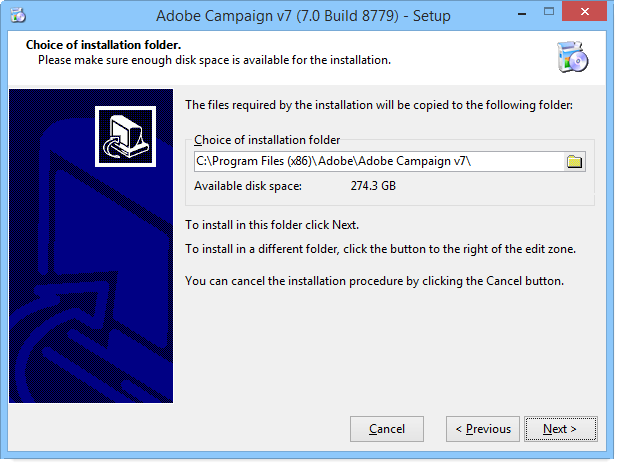
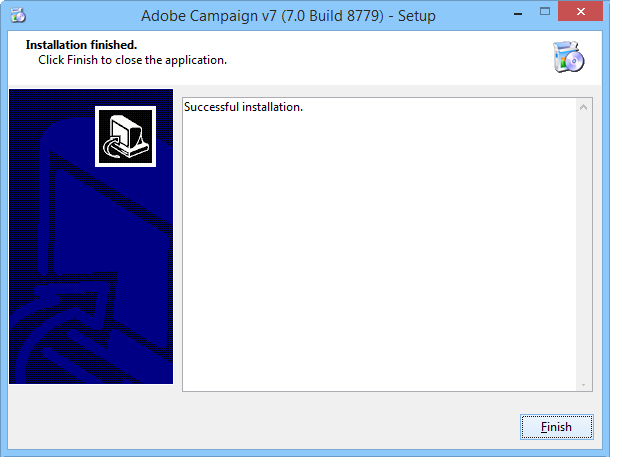

# 서버 설치{#installing-the-server}

## 설치 프로그램 실행 {#executing-the-installation-program}

Windows 32비트 플랫폼의 경우 Adobe Campaign 32비트를 설치합니다. Windows 64비트 플랫폼의 경우 Adobe Campaign 64비트를 설치합니다.

Adobe Campaign 서버의 설치 단계는 다음과 같습니다.

1. setup.exe 파일을 **실행합니다**.

   

1. 설치 유형을 선택합니다.

   

   다음과 같은 몇 가지 설치 유형을 사용할 수 있습니다.

   * **[!UICONTROL Installation of an application server]** :Adobe Campaign 애플리케이션 서버와 클라이언트 콘솔을 설치합니다.
   * **[!UICONTROL Minimal installation (Network)]** :네트워크에서 클라이언트 컴퓨터 설치. 필요한 경우 제한된 수의 DLL만 컴퓨터에 설치되고 다른 모든 구성 요소는 네트워크 드라이브에서 사용됩니다.
   * **[!UICONTROL Installation of a client]** :Adobe Campaign 클라이언트에 필요한 구성 요소 설치
   * **[!UICONTROL Custom installation]** :사용자가 설치할 요소를 선택합니다.
   응용 **프로그램 서버**&#x200B;설치를 선택하고 아래 표시된 다른 단계를 수행합니다.

   

1. 설치 디렉토리를 선택합니다.

   

1. 을 **[!UICONTROL Finish]** 클릭하여 설치를 시작합니다.

   

   진행률 표시줄에는 설치 거리가 표시됩니다.

   

   설치가 완료되면 다음과 같은 메시지가 표시됩니다.

   

   >[!NOTE]
   >
   >서버 설치가 완료되면 네트워크 문제가 발생하지 않도록 서버를 다시 부팅해야 합니다.

   설치가 완료되면 Adobe Campaign을 시작하여 구성 파일을 만듭니다. 서버의 [첫 번째 시작을 참조하십시오](#first-start-up-of-the-server).

## 요약 설치 테스트 {#summary-installation-testing}

다음 명령을 사용하여 초기 설치를 테스트할 수 있습니다.

```
nlserver pdump
```

Adobe Campaign이 시작되지 않으면 응답은 다음과 같습니다.

```
No task
```

## 서버의 첫 번째 시작 {#first-start-up-of-the-server}

설치 테스트가 완료되면 **[!UICONTROL Start > Programs > Adobe Campaign]** 메뉴를 통해 명령 프롬프트를 열고 다음 명령을 입력합니다.

```
nlserver web
```


설치 디렉토리의 파일은 Adobe Campaign 서버 모듈을 구성하는 데 사용됩니다.

다음 정보가 표시됩니다.

```
15:30:12 >   Application server for Adobe Campaign Classic (7.X YY.R build XXX@SHA1) of DD/MM/YYYY
15:30:12 >   Web server start (pid=664, tid=4188)...
15:30:12 >   Creation of server configuration file '[INSTALL]bin..confserverConf.xml' server via '[INSTALL]bin..conffraserverConf.xml.sample
15:30:12 >   Creation of server configuration file '[INSTALL]bin..confconfig-default.xml' server via '[INSTALL]bin..confmodelsconfig-default.xml
15:30:12 >   Server started
15:30:12 >   Stop requested (pid=664)
15:30:12 >   Web server stop (pid=664, tid=4188)...
```

프로세스를 **중지하려면 Ctrl+C** 키를 누른 다음 다음 명령을 입력합니다.

```
nlserver start web
```

다음 정보가 표시됩니다.

```
12:17:21 >   Application server for Adobe Campaign Classic (7.X YY.R build XXX@SHA1) of DD/MM/YYYY
12:17:21 >   Start of the 'web@default' ('nlserver web -tracefile:web@default -instance:default -detach -tomcat -autorepair') task in a new process 
12:17:21 >   Application server for Adobe Campaign Classic (7.X YY.R build XXX@SHA1) of DD/MM/YYYY
12:17:21 >   Web server start (pid=29188, tid=-1224824320)...
12:17:21 >   Generation of configuration changes '[INSTALL]bin..confserverConf.xml.diff' between '[INSTALL]bin..confserverConf.xml' and '[INSTALL]bin..conffraserverConf.xml.sample'
12:17:22 >   Tomcat started
12:17:22 >   Server started
```

중지하려면 다음을 입력합니다.

```
nlserver stop web
```

다음 정보가 표시됩니다.

```
12:18:31 >   Application server for Adobe Campaign Classic (7.X YY.R build XXX@SHA1) of DD/MM/YYYY
12:18:31 >   Stop requested for 'web@default' ('nlserver web -tracefile:web@default -instance:default -detach -tomcat -autorepair', pid=29188, tid=-1224824320)...
12:18:31 >   Stop requested (pid=29188)
12:18:31 >   Web server stopped (pid=29188, tid=-1224824320)...
```

## 내부 식별자의 암호 {#password-for-the-internal-identifier}

Adobe Campaign 서버는 모든 인스턴스에 대한 모든 권한이 있는 **internal** 이라는 기술 로그인을 정의합니다. 설치 후 로그인에 암호가 없습니다. 하나를 반드시 정의해야 합니다.

섹션 내부 [식별자를](../../installation/using/campaign-server-configuration.md#internal-identifier)참조하십시오.

## Adobe Campaign 서비스 시작 {#starting-adobe-campaign-services}

Adobe Campaign 서비스를 시작하려면 서비스 관리자를 사용하거나 명령줄에 다음을 입력합니다(적절한 권한 포함).

```
net start nlserver6
```

나중에 Adobe Campaign 프로세스를 중지해야 하는 경우 다음 명령을 사용합니다.

```
net stop nlserver6
```

## LibreOffice 설치 {#installing-libreoffice}

예를 들어 https://www.libreoffice.org/download/libreoffice-fresh/에서 LibreOffice를 [다운로드하고](https://www.libreoffice.org/download/libreoffice-fresh/) 일반 설치 단계를 따릅니다.

다음 환경 변수를 추가합니다.

```
OOO_BASIS_INSTALL_DIR="C:\Program Files (x86)\LibreOffice 5\"
```

