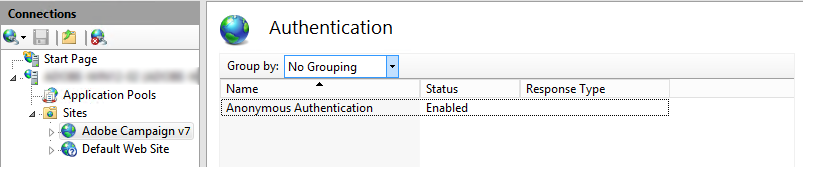

# Windows용 웹 서버에 통합{#integration-into-a-web-server-for-windows}

Adobe Campaign에는 HTTP(및 SOAP)를 통해 애플리케이션 서버의 시작 지점 역할을 하는 Apache Tomcat이 포함되어 있습니다.

이 통합된 Tomcat 서버를 사용하여 HTTP 요청을 제공할 수 있습니다.

이 경우:

* 기본 의견 수렴 포트는 8080입니다. 변경하려면 Tomcat 구성을 [참조하십시오](../../installation/using/configuring-campaign-server.md#configuring-tomcat).
* 그런 다음 클라이언트 콘솔은 https://: [8080 `<computer>`과 같은 URL을 사용하여 연결합니다](https://machine:8080).

그러나 보안 및 관리상의 이유로 Adobe Campaign을 실행 중인 컴퓨터가 인터넷에 노출되어 네트워크 외부의 콘솔에 대한 액세스를 열려는 경우 전용 웹 서버를 HTTP 트래픽의 기본 진입점으로 사용하는 것이 좋습니다.

웹 서버를 사용하면 HTTP 프로토콜을 통해 데이터 기밀성을 보장할 수 있습니다.

마찬가지로 웹 서버 확장 모듈로만 사용할 수 있는 추적 기능을 사용하려면 웹 서버를 사용해야 합니다.

>[!NOTE]
>
>추적 기능을 사용하지 않는 경우 Campaign으로 리디렉션을 사용하여 Apache 또는 IIS의 표준 설치를 수행할 수 있습니다. 추적 웹 서버 확장 모듈은 필요하지 않습니다.

## IIS 웹 서버 구성 {#configuring-the-iis-web-server}

IIS 웹 서버에 대한 구성 절차는 대부분 그래픽입니다. 이 작업에는 웹 사이트(이미 만들어짐 또는 보류 중인 작성)를 사용하여 Adobe Campaign 서버의 리소스에 액세스하는 작업이 포함됩니다.Java(.jsp) 파일, 스타일 시트(.css, .xsl), 이미지(.png), 리디렉션을 위한 ISAPI DLL

IIS 7의 다음 섹션 세부 구성 IIS8의 구성은 기본적으로 동일합니다.

웹 IIS 서버가 컴퓨터에 아직 설치되어 있지 않은 경우 **[!UICONTROL Add > Remove Programs > Enable or disable Windows functionalities]** 메뉴를 통해 설치할 수 있습니다.

IIS 7에서는 표준 서비스 외에도 ISAPI 확장 및 ISAPI 필터를 설치해야 합니다.


### 구성 단계 {#configuration-steps}

다음 구성 단계를 적용합니다.

1. 메뉴를 통해 IIS를 **[!UICONTROL Control panel > Administrative tools > Services]** 엽니다.
1. 네트워크의 매개 변수(TCP 연결 포트, DNS 호스트, IP 주소)에 따라 사이트(예: Adobe Campaign)를 만들고 구성합니다.

   

   최소한 사이트 이름과 가상 디렉토리의 액세스 경로를 지정해야 합니다. 웹 사이트 디렉토리에 액세스하는 경로는 사용되지 않으므로 다음 디렉토리를 사용할 수 있습니다.

   ```
   C:\inetpub\wwwroot
   ```

   

1. VBS **스크립트를** 사용하면 방금 만든 가상 디렉토리에서 Adobe Campaign 서버가 사용하는 리소스를 자동으로 구성할 수 있습니다. 시작하려면 폴더에 있는 **iis_neolane_setup.vbs** 파일을 두 번 클릭합니다. `[INSTALL]\tomcat-7\conf` 여기서 `[INSTALL]` 은 Adobe Campaign 설치 폴더에 액세스할 수 있는 경로입니다.

   

   >[!NOTE]
   >
   >Windows 서버 2008/IIS7 설치의 경우 VBS 스크립트를 실행하거나 관리자로 스크립트를 실행하려면 관리자로 로그인해야 합니다.

   웹 서버가 추적 리디렉션 서버로 사용되는 **[!UICONTROL OK]** 경우 을 클릭하고, 그렇지 않은 경우 을 클릭합니다 **[!UICONTROL Cancel]**.

   웹 서버에 여러 사이트가 이미 구성된 경우 중간 페이지가 표시되어 설치가 적용되는 웹 사이트를 지정합니다.사이트에 연결된 번호를 입력하고 을 클릭합니다 **[!UICONTROL OK]**.

   

   확인 메시지가 표시되어야 합니다.

   

1. 탭에서 웹 사이트가 Adobe Campaign 리소스로 올바르게 구성되었는지 **[!UICONTROL Content View]** 확인합니다.

   

   트리가 표시되지 않으면 IIS를 다시 시작합니다.

### 권한 관리 {#managing-rights}

다음으로 ISAPI DLL과 Adobe Campaign 설치 디렉토리의 리소스에 대한 보안 설정을 구성해야 합니다.

이렇게 하려면 다음 단계를 적용합니다.

1. 탭을 **[!UICONTROL Features View]** 선택하고 인증 **링크를 두 번 클릭합니다** .

   

1. 웹 **사이트의 디렉토리 보안** 탭에서 익명 액세스가 활성화되어 있는지 확인합니다. 필요한 경우 **[!UICONTROL Edit]** 링크를 클릭하여 설정을 변경합니다.

   

### 웹 서버 시작 및 구성 테스트 {#launching-the-web-server-and-testing-the-configuration}

이제 구성이 올바른지 테스트해야 합니다.

이렇게 하려면 다음 절차를 적용합니다.

1. iisreset **명령줄을 사용하여 IIS** 서버를 다시 시작합니다.
1. 다음 URL을 웹 브라우저에 삽입하여 추적 모듈을 테스트합니다.

   ```
   https://<computer>/r/test
   ```

   브라우저에 다음 응답이 표시되어야 합니다.

   ```
   <redir status='OK' date='YYYY/MM/DD HH:MM:SS' build='XXXX' host='myserver.mydomain.com' localHost='localhost'/>
   ```

리디렉션 모듈이 있는지 테스트하려면 다음 명령줄을 실행하십시오.

```
nlserver pdump
```

다음 정보를 반환해야 합니다.

```
12:00:33 >   Application server for Adobe Campaign Classic (7.X YY.R build XXX@SHA1) of DD/MM/YYYY
webmdl@default (1644) - 18.2 Mo
```

ISAPI DLL이 올바르게 로드되었는지 확인할 수도 있습니다.

이렇게 하려면 다음 단계를 적용합니다.

1. 아이콘을 클릭하여 Adobe Campaign 사이트에 대한 ISAPI 필터를 **[!UICONTROL Driver mapping]** 편집합니다.
1. ISAPI 필터의 컨텐츠를 확인합니다.

   

## 추가 구성 {#additional-configurations}

### 업로드 파일 크기 제한 변경 {#changing-the-upload-file-size-limit}

IIS 웹 서버를 구성할 때 서버에 업로드되는 세트 파일에 대해 약 28MB의 제한이 자동으로 적용됩니다.

특히 이 제한보다 큰 파일을 업로드하려는 경우 Adobe Campaign에 영향을 줄 수 있습니다.

예를 들어 워크플로우에서 데이터 **로드(파일)** 유형 활동을 사용하여 50MB 파일을 가져오는 경우 오류가 발생하여 워크플로우의 실행이 중지됩니다.

이 경우 이 제한을 늘려야 합니다.

1. 메뉴를 통해 IIS를 **[!UICONTROL Start > (Control panel) > Administration tools]** 엽니다.
1. 연결 **창에서** Adobe 설치에 대해 만든 사이트를 선택한 다음 기본 창에서 요청 **필터링을** 두 번 클릭합니다.
1. [ **작업** ] 창에서 **[기능 설정** 편집]을 선택하여 **[인증된 최대 내용 크기(** 바이트)] 필드에서 값을 편집할 수 있습니다.

   예를 들어, 50MB의 파일 업로드를 인증하려면 &quot;52428800&quot;바이트 이상의 값을 지정해야 합니다.

>[!NOTE]
>
>이 IIS 옵션에 대한 자세한 내용은 [공식 설명서의](https://www.iis.net/configreference/system.webserver/security/requestfiltering/requestlimits)&quot;방법&quot; 섹션을 참조하십시오.

### http 오류 메시지 표시 구성 {#configuring-http-error-message-display}

6.1 버전 IIS 서버를 사용하는 경우 메시지에 표시되는 원치 않는 HTML 코드로 인해 생성된 오류 메시지를 읽기 어려울 수 있습니다.

이 문제를 해결하고 오류를 올바로 표시하려면 다음 구성을 적용합니다.

1. 메뉴를 통해 IIS를 **[!UICONTROL Start > Control Panel > Administrative tools]** 엽니다.
1. 연결 **창에서** Adobe Campaign 설치에 대해 만든 사이트를 선택한 다음 주 **창에서 구성 편집기를** 두 번 클릭합니다.
1. 섹션 **드롭다운** 목록에서 **system.webServer** > **httpErrors를**&#x200B;선택합니다.
1. 기존 **응답** 라인에서 PassThrough 값을 **선택합니다** .


