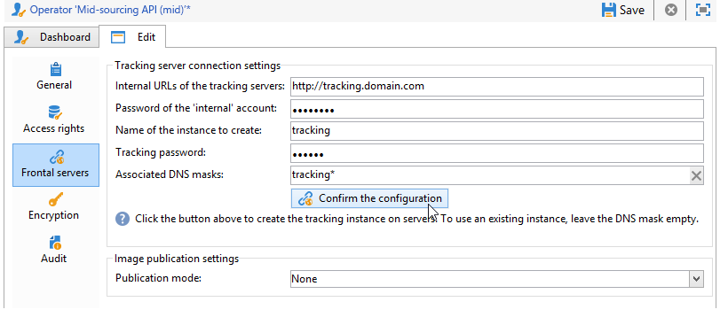

# 중간 소싱 서버{#mid-sourcing-server}


이 섹션에서는 중간 소싱 서버의 설치 및 구성과 서드파티가 메시지를 보낼 수 있는 인스턴스의 배포에 대해 자세히 설명합니다 **중간 소싱** 모드.

&quot;중간 소싱&quot; 아키텍처는에 나와 있습니다 [중간 소싱 배포](../../installation/using/mid-sourcing-deployment.md).

중간 소싱 서버를 설치하는 것은 일반적인 방법으로 서버를 설치하는 것과 동일한 프로세스를 따릅니다(표준 구성 참조). 게재를 실행하는 데 사용할 수 있는 자체 데이터베이스가 있는 독립 인스턴스입니다. 즉, 원격 인스턴스가 중간 소싱 모드에서 원격 인스턴스를 통해 게재를 실행할 수 있도록 추가 구성이 포함되어 있습니다.

>[!CAUTION]
>
>중간 소싱 서버가 설정되고 [워크플로우 동기화](../../workflow/using/about-technical-workflows.md) 를 처음 실행한 후에는 중간 소싱 외부 계정의 내부 이름을 업데이트하지 마십시오.

## 인스턴스 설치 및 구성 단계 {#steps-for-installing-and-configuring-an-instance}

### 인스턴스 설치 및 구성을 위한 사전 요구 사항 {#prerequisites-for-installing-and-configuring-an-instance}

* 애플리케이션 서버의 JDK.
* 응용 프로그램 서버의 데이터베이스 서버에 대한 액세스
* 중간 소싱 서버에 대한 HTTP(80) 또는 HTTPS(443) 포트를 열도록 구성된 방화벽.

다음 절차에서는 단일 중간 소싱 서버를 사용하는 구성에 대해 자세히 설명합니다. 여러 서버를 사용할 수도 있습니다. 마찬가지로 내부 구성에서 특정 메시지(예: 워크플로우 알림)를 보낼 수도 있습니다.

### 중간 소싱 배포를 위한 애플리케이션 서버 설치 및 구성 {#installing-and-configuring-the-application-server-for-mid-sourcing-deployment}

설치 절차는 독립 실행형 인스턴스의 설치 절차와 동일합니다. 을(를) 참조하십시오 [설치 및 구성(단일 시스템)](../../installation/using/standalone-deployment.md#installing-and-configuring--single-machine-).

단, 다음을 적용해야 합니다.

* 단계: **5**, 다음을 비활성화해야 합니다. **mta** (게재) 및 **inMail** (바운스 메일) 모듈입니다. 다음 **wfserver** (워크플로우) 그러나 모듈은 활성화 상태를 유지해야 합니다.

   ```
   <?xml version='1.0'?>
   <serverconf>  
     <shared>    
       <!-- add lang="eng" to dataStore to force English for the instance -->    
       <dataStore hosts="console.campaign.net*">      
         <mapping logical="*" physical="default"/>    
       </dataStore>  </shared>  
       <mta autoStart="false"/>  
       <wfserver autoStart="true"/>  
       <inMail autoStart="false"/>  
       <sms autoStart="false"/>  
       <listProtect autoStart="false"/>
   </serverconf>
   ```

   이 작업에 대한 자세한 정보는 [이 섹션](../../installation/using/configuring-campaign-server.md#enabling-processes)을 참조하십시오.

* 단계 **6**, **9** 및 **10** 필요 없습니다.
* 단계 중 **12** 및 **13**&#x200B;를 사용하려면 연결 URL에 8080 포트를 표시해야 합니다(콘솔이 웹 서버를 통하지 않고 Tomcat과 직접 통신하므로). URL은 `http://console.campaign.net:8080`. 단계 중 **13**&#x200B;를 선택하고 **[!UICONTROL Issue towards Mid-sourcing]** 설치할 패키지와 패키지를 제공합니다.

   

   >[!CAUTION]
   >
   >기술 게재의 기본 라우팅은 중간 소싱을 통한 이메일 라우팅으로 자동 대체됩니다.

### 중간 소싱 서버 설치 및 구성 {#installing-and-configuring-the-mid-sourcing-server}

클라이언트 콘솔에서 **중간 소싱을 사용한 이메일 라우팅** 중간 소싱 계정( **/Administration/External accounts/** 폴더가 있어야 합니다). 채우기 **서버 URL**, **account**, **암호** 및 **미러 페이지 URL** 중간 소싱 서버를 호스팅하는 서버 공급자가 제공하는 정보로 설정합니다. 연결을 테스트합니다.

>[!NOTE]
>
>다음 **mid-sourcingEmitter** 옵션은 두 개를 만듭니다. **중간 소싱** 워크플로. 기본적으로 1시간 20분마다 실행되며 중간 소싱 서버에서 게재 정보를 수집하는 프로세스입니다.

## 중간 소싱 서버 배포 {#deploying-a-mid-sourcing-server}

1. 응용 프로그램 서버 설치:

   >[!CAUTION]
   >
   >중간 소싱 서버를 설치하고 추가 Adobe Campaign 모듈을 설치하려면 Campaign 모듈이 아닌 게재 모듈을 사용하는 것이 좋습니다.

   표준 배포에 대해 와 동일한 절차를 따르고 **[!UICONTROL Mid-sourcing platform]** 옵션을 선택합니다.

   

1. 중간 소싱 모드에서 수신을 위한 구성

   제출 계정 암호 설정: **/중간 소싱/액세스 관리/운영자/** 폴더, **mid** 운영자는 중간 소싱 모드의 제출을 위해 원격 인스턴스에서 사용됩니다. 이 연산자에 대한 암호를 설정하고 이를 제출 인스턴스의 관리자에게 제공해야 합니다.

   다음 **중간 소싱 플랫폼** 옵션은 제출된 게재를 저장할 기본 폴더와 제출을 수행하는 기본 연산자를 만듭니다.

## 중간 소싱 서버 멀티플렉싱 {#multiplexing-the-mid-sourcing-server}

>[!CAUTION]
>
>멀티플렉싱은 온-프레미스 환경에서만 지원됩니다.

중간 소싱 인스턴스를 여러 제출 인스턴스에서 공유할 수 있습니다. 이러한 각 인스턴스는 중간 소싱 데이터베이스의 운영자와 연결되어야 합니다. 중간 소싱 서버에서 두 번째 계정을 생성하려면

1. 에서 폴더 만들기 **[!UICONTROL Mid-sourcing > Deliveries]** 기본 중간 소싱 계정과 연관될 노드(예: prod).
1. 에서 폴더 만들기 **[!UICONTROL Mid-sourcing > Deliveries]** 계정과 동일한 이름을 가진 노드(예: acceptance_test).

   

1. 위치 **[!UICONTROL Mid-sourcing > Access Management > Operators]**, 새 계정을 만듭니다.

   

1. 다음에서 **[!UICONTROL Access rights]** 탭, 이 연산자에 권한 부여 **중간 소싱 제출** 그룹입니다. 이 액세스 권한은 다음에서 사용할 수 있습니다. **[!UICONTROL Mid-sourcing > Access Management > Operator groups]**.

   

1. 다음 항목 선택 **[!UICONTROL Restrict to data in the sub-folders of]** 옵션을 선택하고 게재 폴더를 선택하여 이 연산자를 중간 소싱 게재 폴더로 제한합니다.

   

1. 다음 명령을 사용하여 웹 모듈을 다시 시작합니다. **nlserver 웹 다시 시작**.

serverConf.xml 파일에서 중간 소싱 서버 설정을 변경해야 합니다. 다음 줄을 기존 줄 아래의 &quot;IP 주소를 사용한 선호도 관리&quot; 섹션에 추가해야 합니다.

```
<IPAffinity IPMask="" localDomain="" name=""/>
```

&#39;@name&#39; 속성은 다음 규칙을 준수해야 합니다.

**&#39;marketing_account_operator_name&#39;.&#39;affinity_name&#39;.&#39;affinity_group&#39;**

&#39;marketing_account_operator_name&#39;은 중간 소싱 인스턴스에 선언된 중간 소싱 계정의 내부 이름과 관련이 있습니다.

&#39;affinity_name&#39;은 선호도에 지정된 임의의 이름과 관련이 있습니다. 이 이름은 고유해야 합니다. 승인된 문자는 다음과 같습니다 `[a-z]``[A-Z]``[0-9]`. 목표는 공용 IP 주소 그룹을 선언하는 것입니다.

&#39;affinity_group&#39;은 각 게재에 사용된 대상 매핑에 선언된 하위 친화성과 관련이 있습니다. &#39;.&#39;를 포함한 마지막 부분 하위 친화성이 없는 경우 이 무시됩니다. 승인된 문자는 다음과 같습니다 `[a-z]``[A-Z]``[0-9]`.

수정 사항을 고려하려면 서버를 중지했다가 다시 시작해야 합니다.

## 중간 소싱 서버에서 추적 구성 {#configuring-tracking-on-a-mid-sourcing-server}

**중간 소싱 서버 구성**

1. &#39;operators&#39;로 이동하여 연산자 선택 **[!UICONTROL mid]**.
1. 다음에서 **[!UICONTROL Frontal servers]** 탭에서 추적 서버 연결 매개 변수를 입력합니다.

   추적 인스턴스를 생성하려면 추적 서버의 URL, 추적 서버 내부 계정 암호 및 인스턴스 이름, 해당 암호 및 이와 연결된 DNS 마스크를 입력합니다.

   

1. 연결 매개 변수를 입력했으면 를 클릭합니다 **[!UICONTROL Confirm the configuration]**.
1. 필요한 경우 게재에 포함된 이미지를 저장할 위치를 지정합니다. 이렇게 하려면 드롭다운 목록에서 게시 모드 중 하나를 선택합니다.

   

   다음을 선택하면 **[!UICONTROL Tracking server(s)]** 옵션을 선택하면 이미지가 중간 소싱 서버에 복사됩니다.

**고객 플랫폼 구성**

1. 외부 중간 소싱 라우팅 계정으로 이동합니다.
1. 다음에서 **[!UICONTROL Mid-Sourcing]** 탭에서 중간 소싱 서버 연결 매개변수를 지정합니다.

   

1. 을 클릭하여 구성을 확인합니다. **[!UICONTROL Test the connection]**.
1. 중간 소싱 서버에서 참조된 추적 인스턴스를 선언합니다.

   링크 클릭 **[!UICONTROL Use this platform as a proxy to access the tracking servers]**,

   추적 인스턴스의 이름을 지정한 다음 추적 서버와의 연결을 확인합니다.

   

여러 중간 소싱 서버에서 메시지 게재를 관리하려면 옵션을 선택합니다 **[!UICONTROL Routing with alternating mid-sourcing accounts]** 다른 서버를 지정합니다.


