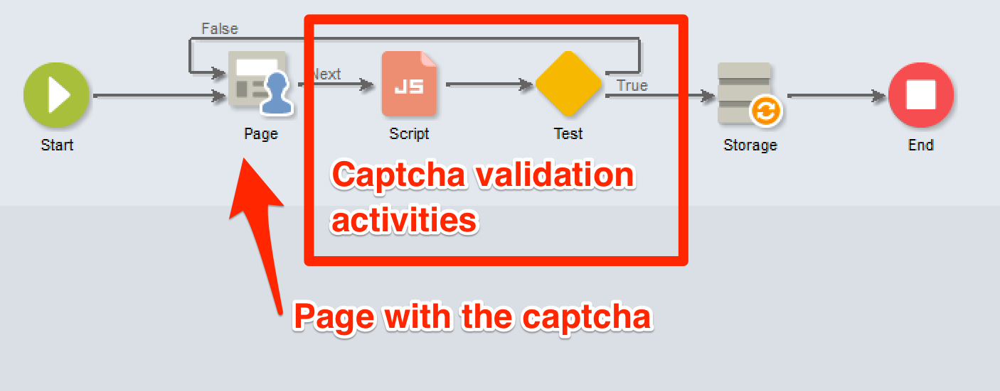

# 스크립팅 및 코딩 지침 {#scripting-coding-guidelines}


## 스크립팅

자세한 내용은 [Campaign JSAPI 설명서](https://docs.adobe.com/content/help/en/campaign-classic/technicalresources/api/index.html) 를 참조하십시오.

워크플로우, 웹 애플리케이션, jssp를 사용하여 스크립팅하는 경우 다음 우수 사례를 따르십시오.

* 가능한 한 SQL 문을 사용하지 않도록 하십시오.

* 필요한 경우 문자열 연결 대신 매개 변수가 있는(preparation statement) 함수를 사용합니다.

   잘못된 방법:

   ```
   sqlGetInt( "select iRecipientId from NmsRecipient where sEmail ='" + request.getParameter('email') +  "'  limit 1" )
   ```

   우수 사례:

   ```
   sqlGetInt( "select iRecipientId from NmsRecipient where sEmail = $(sz) limit 1", request.getParameter('email'));
   ```

   >[!IMPORTANT]
   >
   >sqlSelect는 이 기능을 지원하지 않으므로 DBEngine 클래스의 쿼리 함수를 사용해야 합니다.

   ```
   var cnx = application.getConnection()
   var stmt = cnx.query("SELECT sFirstName, sLastName FROM NmsRecipient where sEmail = $(sz)", request.getParameter('email'))
   for each(var row in stmt) logInfo(row[0] + " : " + row[1])
   cnx.dispose()
   ```

SQL 주입을 방지하려면 Adobe Campaign에서 사용할 허용 목록에 SQL 함수를 추가해야 합니다. 허용 목록에 추가되면 표현식 편집기에서 연산자가 표시됩니다. [이 페이지](../../configuration/using/adding-additional-sql-functions.md)를 참조하십시오.

>[!IMPORTANT]
>
>8140보다 오래된 빌드를 사용하는 경우 **XtkPassUnknownSQLFunctionsToRDBMS** 옵션이 &#39;1&#39;로 설정될 수 있습니다. 데이터베이스를 보호하려면 이 옵션을 삭제하거나 &#39;0&#39;으로 설정합니다.

사용자 입력을 사용하여 쿼리 또는 SQL 문에서 필터를 빌드하는 경우 항상 이스케이프 처리를 해야 합니다( [Campaign JSAPI 설명서](https://docs.adobe.com/content/help/en/campaign-classic/technicalresources/api/index.html) - 데이터 보호 참조: 이스케이프 처리). 이 기능은 다음과 같습니다.

* NL.XML.escape(data)
* NL.SQL.escape(data)
* NL.JS.escape(data)
* NL.XML.escapeAttribute(data)

## 새로운 데이터 모델 보안

### 폴더 기본

다음 페이지를 참조하십시오.

* [폴더 액세스 속성](../../platform/using/access-management.md)
* [연결된 폴더](../../configuration/using/configuration.md#linked-folder)

### 명명된 권한

폴더 기반 보안 모델 외에도 명명된 권한을 사용하여 운영자 작업을 제한할 수 있습니다.

* 일부 시스템 필터(sysFilter)를 추가하여 데이터를 읽거나 쓰지 못하도록 할 수 있습니다( [이 페이지](../../configuration/using/filtering-schemas.md) 참조).

   ```
   <sysFilter name="writeAccess">    
       <condition enabledIf="hasNamedRight('myNewRole')=false" expr="FALSE"/>  
   </sysFilter>
   ```

* 스키마에 정의된 일부 작업(SOAP 메서드)을 보호할 수도 있습니다. 해당 right를 값으로 사용하여 액세스 속성을 설정하십시오.

   ```
   <method name="grantVIPAccess" access="myNewRole">
       <parameters>
   ...
       </parameters>
   </method>
   ```

   자세한 정보는 이 [페이지](../../configuration/using/implementing-soap-methods.md)를 참조하십시오.

>[!IMPORTANT]
>
>navtree의 명령 노드에서 명명된 권한을 사용할 수 있습니다. 사용자 경험이 향상되지만 보호를 제공하지 않습니다(클라이언트 측만 사용하여 숨기거나 비활성화합니다). 액세스 속성을 사용해야 합니다.

### 오버플로 테이블

운영자 액세스 수준에 따라 기밀 데이터(스키마의 일부)를 보호해야 하는 경우 양식 정의(enabledIf/visibleIf 조건)에서 이를 숨기지 마십시오.

전체 엔티티는 화면에 의해 로드되며 열 정의에 표시할 수도 있습니다. 이렇게 하려면 오버플로 테이블을 만들어야 합니다. [이 페이지](../../configuration/using/examples-of-schemas-edition.md#overflow-table)를 참조하십시오.

## 웹 애플리케이션에서 캡션 추가

공개 랜딩 페이지/구독 페이지에 캡처를 추가하는 것이 좋습니다. 안타깝게도 DCE(디지털 콘텐츠 편집기) 페이지에 캡처를 추가하는 것은 쉽지 않습니다. v5 captcha 또는 Google reCAPTCHA를 추가하는 방법을 보여 줍니다.

DCE에서 캡처를 추가하는 일반적인 방법은 페이지 컨텐츠 내에 쉽게 포함할 개인화 블록을 만드는 것입니다. **Script** 활동과 **Test**&#x200B;를 추가해야 합니다.

### 개인화 블록

1. **[!UICONTROL Resources]** > **[!UICONTROL Campaign Management]** > **[!UICONTROL Personalization blocks]** 로 이동하여 새 인스턴스를 만듭니다.

1. **[!UICONTROL Web application]** 컨텐츠 유형을 사용하고 **[!UICONTROL Visible in the customization menus]** 을 선택합니다.

   자세한 정보는 [이 페이지](../../delivery/using/personalization-blocks.md)를 참조하십시오.

   다음은 **Campaign captcha**&#x200B;의 예입니다.

   ```javascript
   <%
   var captchaID = CaptchaIDGen();
   %>
   &width=200&height=50&minWordSize=8&maxWordSize=8"/>
   <input id="captchaValue" name="captchaValue" <%= String(ctx.vars.captchaValid) === "false" ? class="ui-state-error" : "" %>>
   <input type="hidden" name="captchaID" value="<%=captchaID%>"/>
   <%
   if( serverForm.isInputErroneous("captchaValue") ) {
   %>
   <script type="text/javascript"> 
   $("#captchaValue").addClass("ui-state-error")
   </script>
   <%
   }
   %>
   ```

   * 라인 1-6에서 필요한 입력을 모두 생성합니다.
   * 끝 행 7은 오류를 처리합니다.
   * 4행을 사용하면 captcha 회색 상자 크기(너비/높이)와 생성된 단어의 길이(minWordSize/maxWordSize)를 변경할 수 있습니다.
   * Google reCAPTCHA를 사용하기 전에 Google에 등록하고 새 reCAPTCHA 사이트를 만들어야 합니다.

      `<div class="g-recaptcha" data-sitekey="YOUR_SITE_KEY"></div>`
   유효성 검사 단추를 비활성화할 수 있지만 표준 단추/링크가 없으므로 HTML 자체에서 사용하는 것이 좋습니다. 방법을 알아보려면 [이 페이지](https://developers.google.com/recaptcha/)를 참조하십시오.

### 웹 애플리케이션 업데이트

1. 웹 응용 프로그램의 속성에 액세스하여 **captchaValid**&#x200B;라는 부울 변수를 추가합니다.

   

1. 마지막 페이지와 **[!UICONTROL Storage]** 활동 사이에 **[!UICONTROL Script]** 및 **[!UICONTROL Test]**&#x200B;를 추가합니다.

   분기 **[!UICONTROL True]**&#x200B;를 **[!UICONTROL Storage]**&#x200B;에 꽂고, 다른 하나는 captcha가 있는 페이지에 꽂습니다.

   

1. `"[vars/captchaValid]"`이 True인 분기 True의 조건을 편집합니다.

   

1. **[!UICONTROL Script]** 활동을 편집합니다. 콘텐츠는 선택한 Captcha 엔진에 따라 다릅니다.

1. 마지막으로 개인화된 블록을 페이지에 추가할 수 있습니다. [이 페이지](../../web/using/editing-content.md)를 참조하십시오.

   

   

>[!IMPORTANT]
>
>reCAPTCHA 통합의 경우 HTML에 클라이언트측 JavaScript를 추가해야 합니다( `<head>...</head>`).
>
>`<script src="https://www.google.com/recaptcha/api.js" async defer></script>`

### Campaign Captcha

```javascript
var captchaID = request.getParameter("captchaID");
var captchaValue = request.getParameter("captchaValue");
  
if( !CaptchaValidate(captchaID, captchaValue) ) {
  serverForm.logInputError("captchaValue",
                           "The characters you typed for the captcha must match the image ones.",
                           "captchaValue")
  ctx.vars.captchaValid = false
}
else
  ctx.vars.captchaValid = true
```

6행: 오류 메시지를 입력할 수 있습니다.

### Google recaptcha

[공식 설명서](https://developers.google.com/recaptcha/docs/verify)를 참조하십시오.

```javascript
ctx.vars.captchaValid = false
var gReCaptchaResponse = request.getParameter("g-recaptcha-response");
  
// Call reCaptcha API to validate it
var req = new HttpClientRequest("https://www.google.com/recaptcha/api/siteverify")
req.method = "POST"
req.header["Content-Type"] = "application/x-www-form-urlencoded"
req.body = "secret=YOUR_SECRET_HERE&response=" + encodeURIComponent(gReCaptchaResponse)
req.execute()
var response = req.response
if( response.code == 200 ) {
  captchaRes = JSON.parse(response.body.toString(response.codePage));
  ctx.vars.captchaValid = captchaRes.success
}
  
if( ctx.vars.captchaValid == false ) {
  serverForm.logInputError("reCaptcha",
                           "Please validate the captcha",
                           "reCaptcha")
  logInfo("reCaptcha not validated")
}
```

JSON.parse를 사용하려면 webApp에 &quot;shared/json2.js&quot;을 포함해야 합니다.


빌드 8797부터 확인 API URL을 사용하려면 urlPermission 노드에 를 추가하여 serverConf 파일의 허용 목록에 추가해야 합니다.

`<url dnsSuffix="www.google.com" urlRegEx="https://www.google.com/recaptcha/api/siteverify"/>`
