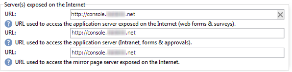

# 독립 실행형 배포{#standalone-deployment}

이 구성에는 동일한 컴퓨터에 있는 모든 구성 요소가 포함됩니다.

* 애플리케이션 프로세스(웹),
* 배달 프로세스(mta),
* 리디렉션 프로세스(추적),
* 워크플로우 프로세스 및 예약된 작업(wfserver),
* 바운스 메일 프로세스(inMail),
* 통계 프로세스(통계).

프로세스 간의 전체 통신은 다음 스키마에 따라 수행됩니다.


이러한 유형의 구성은 수신자가 100,000명 미만이고, 예를 들어, 다음 소프트웨어 레이어를 사용하여 관리할 때 실행할 수 있습니다.

* Linux,
* Apache,
* PostgreSQL,
* Qmail.

볼륨이 증가함에 따라 이 아키텍처의 변형으로 데이터베이스 서버를 다른 컴퓨터로 이동하여 성능을 향상시킵니다.

>[!NOTE]
>
>기존 데이터베이스 서버가 충분한 리소스를 갖고 있는 경우에도 사용할 수 있습니다.

## 기능 {#features}

### 장점 {#advantages}

* 완전한 독립 실행형 및 낮은 구성 비용(아래에 나열된 오픈 소스 소프트웨어를 사용하는 경우 청구 가능한 라이선스 필요 없음)
* 간편한 설치 및 네트워크 구성

### 단점 {#disadvantages}

* 사고 시 중요한 컴퓨터.
* 메시지를 브로드캐스트할 때 제한된 대역폭(Adobe 경험에서 시간당 약 수만 개의 메일)입니다.
* 방송 시 응용 프로그램의 잠재적 속도 저하
* 응용 프로그램 서버는 리디렉션 서버를 호스팅하기 때문에 DMZ에 있는 동안 외부에서 사용할 수 있어야 합니다.

## 설치 및 구성 단계 {#installation-and-configuration-steps}

### 사전 요구 사항 {#prerequisites}

* JDK,
* 웹 서버(IIS, Apache),
* 데이터베이스 서버에 대한 액세스,
* POP3,
* 두 개의 DNS 별칭 생성:

   * 공개 IP에서 컴퓨터를 추적하고 가리키기 위해 처음으로 대중에게 노출되었습니다.
   * 콘솔 액세스 및 동일한 컴퓨터를 가리키기 위해 내부 사용자에게 표시되는 두 번째 별칭입니다.

* STMP(25), DNS(53), HTTP(80), HTTPS(443), SQL(Oracle의 경우 1521, PostgreSQL의 경우 5432) 등을 열도록 구성된 방화벽 포트. 자세한 내용은 네트워크 구성을 [참조하십시오](../../installation/using/network-configuration.md).

다음 예에서 인스턴스의 매개 변수는 다음과 같습니다.

* 인스턴스의 이름: **데모**
* DNS 마스크: **console.campaign.net*** (클라이언트 콘솔 연결 및 보고서에만 해당)
* 데이터베이스: **캠페인:demo@dbsrv**

### 설치 및 구성(단일 시스템) {#installing-and-configuring--single-machine-}

다음 단계를 적용합니다.

1. Adobe Campaign 서버에 대한 설치 절차를 따르십시오.Linux **의** nlserver 패키지 또는 Windows의 **setup.exe** .

   자세한 내용은 Linux(Linux) [에서 Campaign](../../installation/using/prerequisites-of-campaign-installation-in-linux.md) 설치 사전 요구 사항 및 Windows(Windows)에서 [캠페인 설치 사전 요구](../../installation/using/prerequisites-of-campaign-installation-in-windows.md) 사항을참조하십시오.

1. Adobe Campaign 서버가 설치되면 nlserver web -tomcat 명령을 사용하여 응용 프로그램 서버(웹) **를** 시작하고(웹 모듈을 통해 포트 8080에서 독립 실행형 웹 서버 모드에서 Tomcat를 시작하고 Tomcat가 올바르게 시작하는지 확인:

   ```
   12:08:18 >   Application server for Adobe Campaign Classic (7.X YY.R build XXX@SHA1) of DD/MM/YYYY
   12:08:18 >   Starting Web server module (pid=28505, tid=-1225184768)...
   12:08:18 >   Tomcat started
   12:08:18 >   Server started
   ```

   >[!NOTE]
   >
   >웹 모듈을 처음 실행하면 설치 폴더 아래의 **conf** 디렉토리에 **config-default.xml** 및 **serverConf.xml** 파일이생성됩니다. serverConf.xml에서 사용할 수 있는 **모든 매개 변수가** 이 [섹션에](../../installation/using/the-server-configuration-file.md)나열됩니다.

   서버를 **중지하려면 Ctrl+C** 키를 누릅니다.

   자세한 내용은 다음 섹션을 참조하십시오.

   * Linux의 경우:서버의 [첫 번째](../../installation/using/installing-packages-with-linux.md#first-start-up-of-the-server)시작,
   * Windows의 경우:서버의 [첫 번째](../../installation/using/installing-the-server.md#first-start-up-of-the-server)시작입니다.

1. 다음 명령을 사용하여 **내부** 암호를 변경합니다.

   ```
   nlserver config -internalpassword
   ```

   자세한 내용은 내부 식별자를 [참조하십시오](../../installation/using/campaign-server-configuration.md#internal-identifier).

1. 추적(이 경우 **tracking.campaign.net** )을 위한 DNS 마스크와 클라이언트 콘솔(이 경우 **console.campaign.net******)에 액세스할 수 있는 데모 인스턴스를 만듭니다. 다음 두 가지 방법으로 이 작업을 수행할 수 있습니다.

   * 콘솔을 통해 인스턴스를 만듭니다.

      

      자세한 내용은 인스턴스 [만들기 및 로그인을](../../installation/using/creating-an-instance-and-logging-on.md)참조하십시오.

      or

   * 명령줄을 사용하여 인스턴스를 만듭니다.

      ```
      nlserver config -addinstance:demo/tracking.campaign.net*,console.campaign.net*
      ```

      자세한 내용은 인스턴스 [만들기를](../../installation/using/command-lines.md#creating-an-instance)참조하십시오.

1. config-default.xml **파일(** config-default.xml **옆의 이전 단계에서 생성됨)을 편집하고** ta **(** config-default.xml **옆의 이전 단계에서 생성됨)를** **** **** 확인하고 (전달, fwowdelivery 서버, 워크플로(바운스), MmailIn BounceMail (sstat) 및 statStatists 프로세스가 활성화되어 있는지 확인합니다. 그런 다음 통계 서버의 주소를 구성합니다.

   ```
   <?xml version='1.0'?>
   <serverconf>  
     <shared>    
       <!-- add lang="eng" to dataStore to force English for the instance -->    
       <dataStore hosts="tracking.campaign.net*,console.campaign.net*">      
         <mapping logical="*" physical="default"/>    
       </dataStore>  </shared>  
       <mta autoStart="true" statServerAddress="localhost"/>
       <wfserver autoStart="true"/>  
       <inMail autoStart="true"/>  
       <sms autoStart="false"/>  
       <listProtect autoStart="false"/>
   </serverconf>
   ```

   자세한 내용은 프로세스 [활성화를 참조하십시오](../../installation/using/campaign-server-configuration.md#enabling-processes).

1. serverConf. **xml** 파일을 편집하고 배달 도메인을 지정한 다음 MTA 모듈에서 MX 유형 DNS 쿼리에 응답하기 위해 사용하는 DNS 서버의 IP(또는 호스트) 주소를 지정합니다.

   ```
   <dnsConfig localDomain="campaign.com" nameServers="192.0.0.1, 192.0.0.2"/>
   ```

   >[!NOTE]
   >
   >nameServers **** 매개 변수는 Windows에서만 사용됩니다.

   자세한 내용은 Campaign [서버 구성을](../../installation/using/campaign-server-configuration.md)참조하십시오.

1. 클라이언트 설정 프로그램(**setup-client-7.XX**, v7 **용 YYYY.** XX ****, v7용 **setup-client-6.XX,** **** EXEfor VR.1)을 해당 /dataken/NL/jsp폴더에 복사합니다.

   자세한 내용은 다음 섹션을 참조하십시오.

   * Linux의 경우:Linux [용 클라이언트 콘솔 가용성](../../installation/using/client-console-availability-for-linux.md)
   * Windows의 경우:Windows [용 클라이언트 콘솔 가용성](../../installation/using/client-console-availability-for-windows.md)

1. 다음 섹션에 설명된 웹 서버 통합 절차(IIS, Apache)를 따르십시오.

   * Linux의 경우:Linux [용 웹 서버에 통합](../../installation/using/integration-into-a-web-server-for-linux.md)
   * Windows의 경우:Windows [용 웹 서버에 통합](../../installation/using/integration-into-a-web-server-for-windows.md)

1. 웹 사이트를 시작하고 URL을 사용하여 리디렉션을 테스트합니다.https://tracking.campaign.net/r/test.

   브라우저에 다음 메시지가 표시되어야 합니다.

   ```
   <redir status="OK" date="AAAA/MM/JJ HH:MM:SS" build="XXXX" host="tracking.campaign.net" localHost="localhost"/>
   ```

   자세한 내용은 다음 섹션을 참조하십시오.

   * Linux의 경우:웹 [서버 시작 및 구성 테스트](../../installation/using/integration-into-a-web-server-for-linux.md#launching-the-web-server-and-testing-the-configuration)
   * Windows의 경우:웹 [서버 시작 및 구성 테스트](../../installation/using/integration-into-a-web-server-for-windows.md#launching-the-web-server-and-testing-the-configuration)

1. Adobe Campaign 서버(Windows에서&#x200B;**net start nlserver6** , **/etc/init.d/nlserver6 start** in Linux)를 시작하고 명령 **nlserver dump** 를 한 번 더 실행하여 활성화된 모든 모듈이 있는지 확인합니다.

   >[!NOTE]
   >
   >20.1부터는 다음 명령을 대신 사용하는 것이 좋습니다(Linux의 경우). **systemctl start nlserver**

   ```
   12:09:54 >   Application server for Adobe Campaign Classic (7.X YY.R build XXX@SHA1) of DD/MM/YYYY
   syslogd@default (7611) - 9.2 MB
   stat@demo (5988) - 1.5 MB
   inMail@demo (7830) - 11.9 MB
   watchdog (27369) - 3.1 MB
   mta@demo (7831) - 15.6 MB
   wfserver@demo (7832) - 11.5 MB
   web@default (28671) - 40.5 MB
   ```

   또한 컴퓨터에 설치된 Adobe Campaign 서버의 버전 및 빌드 번호를 알 수 있습니다.

1. URL을 **사용하여 Nlserver 웹** 모듈을 테스트합니다.https://console.campaign.net/nl/jsp/logon.jsp

   이 URL을 사용하면 클라이언트 설정 프로그램의 다운로드 페이지에 액세스할 수 있습니다.

   액세스 제어 페이지에 도달하면 **내부** 로그인 및 관련 암호를 입력합니다.

   

   자세한 내용은 다음 섹션을 참조하십시오.

   * Linux의 경우:Linux [용 클라이언트 콘솔 가용성](../../installation/using/client-console-availability-for-linux.md)
   * Windows의 경우:Windows [용 클라이언트 콘솔 가용성](../../installation/using/client-console-availability-for-windows.md)

1. Adobe Campaign 클라이언트 콘솔을 시작(이전 다운로드 페이지에서 또는 Windows 설치의 경우 서버에서 직접 실행)하고, 서버 연결 URL을 https://console.campaign.net으로 설정하고 **내부** 로그인을 사용하여 연결합니다.

   인스턴스 [만들기 및 로그온](../../installation/using/creating-an-instance-and-logging-on.md) 및 내부 식별자를 [참조하십시오](../../installation/using/campaign-server-configuration.md#internal-identifier).

   처음으로 로그인하면 데이터베이스 생성 마법사가 나타납니다.

   

   마법사의 단계에 따라 연결 인스턴스와 연결된 데이터베이스를 만듭니다.

   자세한 내용은 데이터베이스 [만들기 및 구성을 참조하십시오](../../installation/using/creating-and-configuring-the-database.md).

   데이터베이스가 만들어지면 로그오프하십시오.

1. 암호 없이 **관리자** 로그인을 사용하여 클라이언트 콘솔에 다시 로그온하고 배포 마법사( **[!UICONTROL Tools > Advanced]** 메뉴)를 시작하여 인스턴스 구성을 완료합니다.

   자세한 내용은 인스턴스 [배포를 참조하십시오](../../installation/using/deploying-an-instance.md).

   설정할 기본 매개 변수는 다음과 같습니다.

   * 이메일 전달:보낸 사람 및 회신 주소 및 바운스 메일의 오류 사서함.
   * 추적:리디렉션에 사용되는 외부 URL과 내부 URL을 채우고 추적 **서버에서 등록을 클릭한** 다음 추적 서버의 **데모** 인스턴스에서 유효성을 확인합니다.

      자세한 내용은 추적 구성을 [참조하십시오](../../installation/using/deploying-an-instance.md#tracking-configuration).

      

      Adobe Campaign 서버가 응용 프로그램 서버와 리디렉션 서버로 사용되므로 추적 로그를 수집하고 URL을 전송하는 데 사용되는 내부 URL은 Tomcat(https://localhost:8080)에 직접 내부 연결됩니다.

   * 바운스 관리:바운스 메일을 처리할 매개 변수를 입력합니다(처리되지 않은 바운스 **메일** 섹션이 고려되지 않음).
   * 액세스 위치:보고서, 웹 양식 및 미러 페이지의 두 URL을 제공합니다.

      

