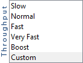

# Campaign으로 MX 서버 사용 {#using-mx-servers}

MX 서버가 Adobe Campaign Classic에서 작동하는 방식에 대해 알아봅니다.

## 서버 {#mx-servers}

### MX 서버란?

메일 교환기 레코드(MX 레코드)는 도메인 대신 전자 메일 메시지 수신을 담당하는 메일 서버를 지정하는 DNS(Domain Name System)에 있는 리소스 레코드 유형입니다.

### MX 서버는 어떻게 작동합니까?

이메일을 보내면 소프트웨어 서버가 수신자 도메인 서버와 연결을 설정합니다. 두 서버 간의 통신은 SMTP 언어를 사용하며 한 도메인은 두 개 이상의 MX 서버를 가질 수 있습니다. 이 도메인에 대한 연결은 가장 높은 우선 순위(가장 작은 그림)에서 시작되며 다른 서버는 &quot;백업&quot; 서버라고 합니다. 연결 프로토콜을 준수해야 합니다.

### MX 서버는 Adobe Campaign에서 어떻게 작동합니까?

연결 프로토콜에서는 서버 스팸 및 독점을 방지하기 위한 규칙을 준수해야 합니다. 가장 중요한 사항은 다음과 같습니다.

* **허용되는 최대 연결 수**: 이 번호가 존중되면 추가 연결로 인해 IP가 차단 목록에 있지 않고 이메일이 거부되지 않습니다.
* **최대 메시지 수**: 연결 중에 전송할 수 있는 메시지 수를 정의해야 합니다. 이 번호가 정의되지 않으면 서버는 가능한 한 많은 번호를 전송합니다. 그 결과 스팸으로 식별되고 ISP에 의해 차단 목록에 추가된다.
* **시간당 메시지**: Adobe Campaign은 전자 평판에 맞게 IP가 시간당 전송할 수 있는 이메일 수를 제어합니다. 차단 목록 이 시스템은 이메일 거부 또는/으로부터 사용자를 보호합니다.

## 인바운스 이메일

### Inbounce 이메일이란 무엇입니까?

Adobe Campaign에서 서버 통신 중 오류를 처리하는 데 사용하는 프로세스입니다.

### Inbounce 전자 메일은 어떻게 작동합니까?

오류 주소는 ISP에 의해 다시 전송된 바운스를 처리합니다. 이 프로세스는 다양한 SMTP 오류 코드를 분석하고 RegEx 표준에 따라 올바른 작업을 적용합니다.

예를 들어 이메일 주소에 ISP에서 보낸 피드백 &quot;550 사용자 알 수 없음&quot;이 있습니다. 이 오류 코드는 Adobe Campaign 오류 주소(returnpath 주소)에서 처리합니다. 그런 다음 이 오류를 RegEx 표준과 비교하고 올바른 규칙이 적용됩니다. 이메일은 다음과 같습니다. *하드 바운스* (유형과 일치) *알 수 없는 사용자* (이유 일치) 및 가 첫 번째 루프 이후에 격리되었습니다.

### Adobe Campaign은 어떻게 관리하고 있습니까?

Adobe Campaign은 오류 유형과 원인 간에 일치하는 항목을 사용하여 이 프로세스를 관리합니다.

* **[!UICONTROL User Unknown]**: 구문상 정확하지만 존재하지 않는 주소입니다. 이 오류는 하드 바운스로 분류되며 첫 번째 오류 내에 격리됩니다.
* **[!UICONTROL Mailbox full]**: 최대 용량에 도달한 사서함입니다. 이 오류는 사용자가 이 사서함을 더 이상 사용하지 않음을 나타낼 수도 있습니다. 이 오류는 소프트 바운스로 분류되고 세 번째 오류 내에 격리로 푸시되어 30일 후 격리에서 제거됩니다.
* **[!UICONTROL Inactive User]**: 지난 6개월 동안 비활성 사용자로 인해 ISP에 의해 사서함이 비활성화되었습니다. 이 오류는 소프트 바운스로 분류되고 세 번째 오류 내에 격리됩니다.
* **[!UICONTROL Invalid domain]**: 이메일 주소의 도메인이 존재하지 않습니다. 이 오류는 소프트 바운스로 분류되고 세 번째 오류 내에 격리됩니다.
* **[!UICONTROL Refused]**: ISP가 사용자에게 이메일 전달을 거부했습니다. 이 오류는 이메일 주소와 연결되지 않고 IP 또는 도메인 신뢰도와 연결되어 있으므로 소프트 바운스로 분류되고 격리로 푸시되지 않습니다.

>[!NOTE]
>
>게재 실패 유형 및 이유에 대한 자세한 내용은 다음을 참조하십시오. [섹션](../../delivery/using/understanding-delivery-failures.md#delivery-failure-types-and-reasons).

## 게재 가능성 인스턴스 {#deliveratbility-env}

MX 규칙 및 인바운스 규칙의 일별 업데이트는 이러한 규칙의 게재 가능성 인스턴스 소유자에 연결된 클라이언트 인스턴스의 특정 워크플로우에 의해 관리됩니다.

이 일별 업데이트는 투명도 프로세스를 통해 인스턴스를 최신 상태로 유지하고자 하는 모든 클라이언트에 대해 실행됩니다.

MX 규칙에는 램프 업 프로세스 중에 주로 사용되는 6개의 서로 다른 처리 수준이 있습니다.

사용자 지정 모드는 자체 MX 규칙을 설정하려는 고급 클라이언트를 위한 것입니다. 사용자 지정 모드가 활성화되면 동기화가 꺼지기 때문에 게재 기능 인스턴스에서 클라이언트를 업데이트하지 않습니다.

## 바운스 예

* **알 수 없는 사용자** (하드 바운스): 550 5.1.1 ... 사용자를 알 수 없습니다. {mx003}
* **사서함 가득 참** (소프트 바운스): 550 5.2.2 사용자 할당량 초과
* **비활성 사서함** (소프트 바운스): 550 5.7.1 : 수신자 주소 거부됨: 비활성 MailBox, 6개월 이상 포핑되지 않음
* **잘못된 도메인** (소프트 바운스): &#39;ourdan.com&#39;에 대한 DNS 쿼리 실패
* **거부됨** (소프트 바운스): 인바운드 이메일 바운스(규칙 &#39;Feedback_loop_Hotmail&#39;이 이 바운스와 일치함)
* **연결할 수 없음** (소프트 바운스): 421 4.16.55 [TS01] 과도한 사용자 컴플레인으로 인해 x.x.x.x의 메시지가 일시적으로 지연됨

**관련 항목:**
* [MX 구성](../../installation/using/email-deliverability.md#mx-configuration)
* [기술 이메일 구성](../../installation/using/email-deliverability.md)
* [게재 실패 이해](../../delivery/using/understanding-delivery-failures.md)
* [Campaign Classic - 기술 Recommendations](https://experienceleague.adobe.com/docs/deliverability-learn/deliverability-best-practice-guide/additional-resources/campaign/acc-technical-recommendations.html)
