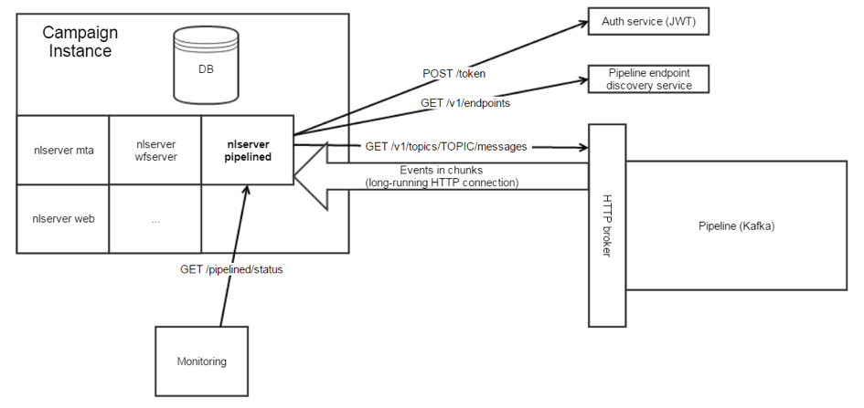

# Adobe Experience Cloud 트리거 기본 정보{#about-adobe-experience-triggers}

[!DNL Triggers] 는 파이프라인을 사용하여 Adobe Campaign과 Adobe Analytics 간의 통합입니다. 파이프라인은 웹 사이트에서 사용자의 작업 또는 트리거를 검색합니다. 장바구니 포기는 트리거의 예입니다. 트리거가 Adobe Campaign에서 처리되어 거의 실시간으로 이메일을 전송합니다.

[!DNL Triggers] 사용자의 조치에 따라 짧은 시간 내에 마케팅 작업을 실행합니다. 일반적인 응답 시간은 1시간 미만입니다.

구성이 최소화되고 서드파티와 관련이 없기 때문에 더욱 민첩한 통합이 가능합니다.
또한 마케팅 활동의 성과에 영향을 주지 않고 많은 양의 트래픽을 지원합니다. 예를 들어 통합은 시간당 100만 개의 트리거를 처리할 수 있습니다.

## [!DNL Triggers] 아키텍처 {#triggers-architecture}

### 파이프라인 소개 {#pipeline-explanation}

>[!CAUTION]
>
>Adobe Cloud 솔루션만이 Adobe의 파이프라인 서비스에서 이벤트를 생성하고 사용할 수 있습니다. Adobe 외부 시스템은 사용할 수 없습니다.

파이프라인은 [Apache Kafka를 사용하는 Experience Cloud에서 호스팅되는 메시징 시스템입니다](http://kafka.apache.org/). 솔루션 간에 데이터를 손쉽게 전달할 수 있는 방법입니다. 또한 파이프라인은 데이터베이스가 아닌 메시지 대기열입니다. 제작자는 전달 과정에서 이벤트를 전달하고, 소비자는 전달 흐름을 듣고 이벤트를 사용하여 원하는 것을 합니다. 행사는 며칠 동안 진행되지만 더 이상은 없다. 목적은 24시간 연중무휴로 듣고 이벤트를 즉시 처리하는 것입니다.

### Pipeline은 어떻게 작동합니까? {#how-pipeline-work}

이 [!DNL pipelined] 프로세스는 항상 Adobe Campaign 마케팅 서버에서 실행됩니다. 파이프라인에 연결하여 이벤트를 검색하고 즉시 처리합니다.

프로세스는 인증 서비스를 사용하여 Experience Cloud에 로그인하고 개인 키를 전송합니다. [!DNL pipelined] 인증 서비스는 토큰을 반환합니다. 토큰을 사용하여 이벤트를 검색할 때 인증합니다. [!DNL Triggers] 단순 GET 요청을 사용하여 REST 웹 서비스에서 검색됩니다. 응답은 JSON 형식입니다. 요청의 매개 변수에는 트리거 이름과 마지막으로 검색된 메시지를 나타내는 포인터가 포함됩니다. 자동으로 [!DNL pipelined] 처리됩니다.

## Adobe Experience Cloud Triggers와 Adobe Campaign Classic 통합 사용

다음은 몇 가지 [!DNL Triggers] 우수 사례입니다.

* 데이터는 Campaign과 같이 저장해야 [!DNL Trigger] 합니다. 지연을 만들므로 직접 처리되지 않아야 합니다.
* 데이터 베이스에서 타임스탬프를 확인하지 않고 메시지에서 확인해야 합니다.
* TriggerTimestamp를 사용하고 ID를 트리거하여 중복 항목을 제거합니다.

>[!CAUTION]
>
>아래 예는 기본적으로 제공되지 않습니다. 이 예는 다양한 구현 방법의 특정 예입니다.

파이프라인 이벤트는 자동으로 다운로드됩니다. 이러한 이벤트는 양식을 사용하여 모니터링할 수 있습니다.

파이프라인 이벤트 노드는 내장되어 있지 않으므로 Campaign에서 관련 양식과 함께 추가해야 합니다. 이러한 작업은 전문가 사용자로만 제한됩니다. 자세한 내용은 다음 섹션을 참조하십시오. [탐색 계층](../../configuration/using/about-navigation-hierarchy.md) 및 [양식](../../configuration/using/editing-forms.md)편집

반복적인 캠페인 워크플로우는 트리거에 대해 쿼리하고 마케팅 기준과 일치하는 경우 배달을 시작합니다.

