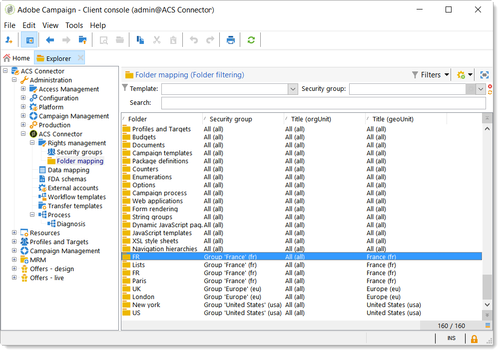

# ACS 커넥터 시작{#acs-connector-gs}

ACS 커넥터는 Adobe Campaign v7 및 Adobe Campaign Standard을 브리징합니다. Campaign v7의 통합 기능으로 데이터를 Campaign Standard에 자동으로 복제하여 두 애플리케이션 중 최고의 성능을 제공합니다. Campaign v7에는 기본 마케팅 데이터베이스를 관리하는 고급 도구가 있습니다. Campaign v7에서 데이터 복제를 통해 Campaign Standard은 사용자에게 친숙한 환경에서 풍부한 데이터를 활용할 수 있습니다.

ACS 커넥터를 사용하면, Campaign Standard은 디지털 마케터가 캠페인을 디자인, 타겟팅 및 실행하는 데 계속 사용되는 반면, Campaign v7은 데이터베이스 마케터와 같은 데이터 기반 사용자를 위해 맞춤형으로 제작됩니다.

>[!IMPORTANT]
>
>ACS Connector는 Adobe Campaign Prime 서비스의 일부로서만 사용할 수 있습니다. Adobe Campaign Prime의 라이선스 방법에 대한 자세한 내용은 계정 관리자에게 문의하십시오.
>
>ACS 커넥터는 호스팅 및 하이브리드 아키텍처에서만 사용할 수 있습니다. 전체 On-Premise 설치에는 사용할 수 없습니다.
>
>이 기능을 사용하려면 Campaign에 IMS(Adobe ID)을 연결해야 합니다. 자세한 내용은 [Adobe ID을 통해 연결](../../integrations/using/about-adobe-id.md).

이 문서에서는 ACS 커넥터 기능에 대해 설명합니다. 아래 섹션에서는 기능이 데이터를 복제하는 방법과 복제된 프로필로 작업하는 방법에 대한 지침을 제공합니다.

* [프로세스](#process): ACS 커넥터 및 데이터 복제 관리 방법에 대한 개요입니다.
* [구현](#implementation): ACS 커넥터 시작 방법과 기본 및 고급 데이터를 복제하는 방법에 대한 지침입니다.
* [프로필 동기화](../../integrations/using/synchronizing-profiles.md): 프로필을 복제하는 방법과 프로필을 사용하여 게재를 만드는 방법에 대한 지침입니다.
* [대상자 동기화](../../integrations/using/synchronizing-audiences.md): Campaign v7에서 수신자 목록을 타겟팅한 다음 목록을 Campaign Standard으로 복제하는 방법에 대한 지침입니다.
* [웹 애플리케이션 동기화](../../integrations/using/synchronizing-web-applications.md): Campaign v7 웹 애플리케이션을 Campaign Standard에 연결하는 방법에 대한 지침입니다.
* [ACS 커넥터 문제 해결](../../integrations/using/troubleshooting-the-acs-connector.md): 일반적인 문제에 대한 답변을 검토합니다.

>[!NOTE]
>
>ACS Connector는 사용권 계약에 따라 Campaign v7에 포함되어 있습니다. ACS 커넥터를 사용하려면 Campaign v7과 Campaign Standard 간을 전환할 수 있는지 확인하십시오. 버전 및 포함된 기능을 잘 모르는 경우 관리자에게 문의하십시오.

## 배합 색상 {#process}

### 데이터 복제 {#data-replication}

ACS 커넥터 는 Campaign v7에서 Campaign Standard으로 정기적으로 다음 항목을 복제합니다.

* **수신자**
* **구독**
* **서비스**
* **랜딩 페이지**

기본적으로 ACS 커넥터에 대한 주기적 복제는 15분마다 한 번씩 수행됩니다. 주기적 복제의 범위는 사용자의 요구 사항에 맞게 조정할 수 있습니다. 변경해야 하는 경우 컨설턴트에게 문의하십시오.

수신자, 구독, 서비스 및 랜딩 페이지에 대한 데이터 복제는 증분 방식이므로 새 수신자와 기존 수신자에 대한 수정 사항만 Campaign v7에서 Campaign Standard으로 복제됩니다. 그러나 대상에 대한 복제는 단일 인스턴스에서 발생합니다. Campaign v7에서 대상을 만든 다음 한 번 복제하여 Campaign Standard에 복제할 수 있습니다. 복제는 즉시 적용되므로 일반 업데이트에 대해 구성할 수 없습니다. 자세한 내용은 [대상 동기화](../../integrations/using/synchronizing-audiences.md).

>[!NOTE]
>
>몇 시간이 걸릴 수 있으므로 대규모 데이터베이스의 초기 복제를 기다려 주십시오. 그러나 후속 복제 작업은 증가분 및 훨씬 빠릅니다.

ACS Connector는 Campaign Standard에서 Campaign v7로 정기적으로 다음 항목을 복제합니다.

* **[!UICONTROL Delivery IDs]**
* **[!UICONTROL Email broad logs]**
* **[!UICONTROL Email tracking logs]**

게재 ID 및 이메일 로그를 복제하면 Campaign v7에서 v7 수신자에 대한 게재 및 추적 데이터 기록에 액세스할 수 있습니다.

>[!IMPORTANT]
>
>이메일 브로드로그 및 추적 로그만 Campaign Standard에서 Campaign v7로 복제됩니다.

### 데이터 동기화 {#data-synchronization}

ACS 커넥터는 Campaign v7과 Campaign Standard 간에 격리를 동기화합니다.

예를 들어 Campaign v7에서 Campaign Standard으로 복제된 프로필에 이메일 주소가 포함됩니다. 이메일 주소가 Campaign Standard에 의해 격리되면 그 다음 동기화 중에 데이터가 Campaign v7로 전달됩니다. 격리에 대한 자세한 내용은 [격리 관리](../../delivery/using/understanding-quarantine-management.md) 및 [Campaign Standard 격리](https://experienceleague.adobe.com/docs/campaign-standard/using/testing-and-sending/monitoring-messages/understanding-quarantine-management.html).

### 복제된 프로필 사용 {#using-replicated-profiles}

복제된 프로필은 마케팅 캠페인의 워크플로우를 타겟팅하기 위해 Campaign Standard 및 Campaign v7에서 사용할 수 있습니다.

복제된 프로필을 사용하여 Campaign Standard에서 게재를 보내는 방법에 대한 지침은 [프로필 동기화](../../integrations/using/synchronizing-profiles.md). Campaign v7와 Campaign Standard 간에 구독 취소 데이터를 공유하는 추가 지침이 제공됩니다.

### 제한 사항 {#limitations}

복제된 프로필은 게재에 쉽게 사용할 수 있지만 Campaign Standard에 특정 제한 사항이 있습니다. 아래 항목을 검토하여 관리하는 방법을 알아보십시오.

* **Campaign Standard에 대한 읽기 전용 프로필**: 복제된 프로필은 Campaign Standard에서 읽기 전용입니다. 그러나 Campaign v7에서 수신자를 편집할 수 있으며 수정 사항은 ACS 커넥터에 의해 Campaign Standard에서 자동으로 업데이트됩니다.
* **Campaign Standard에서 만든 프로필**: ACS 커넥터는 한 방향으로 수신자 데이터를 Campaign v7에서 Campaign Standard으로 복제합니다. 따라서 Campaign Standard에서 생성된 프로필은 Campaign v7에 복제되지 않습니다.
* **Campaign Standard에 대한 기본 수신자 데이터**: ACS 커넥터는 Campaign Standard에 적합한 수신자 데이터를 복제합니다. 여기에는 수신자의 이름, 주소, 이메일 주소, 휴대전화 번호, 집 전화 번호 및 기타 관련 연락처 정보가 포함됩니다. 워크플로우에 Campaign v7에서 사용할 수 있는 추가 수신자 필드와 사용자 지정 타겟팅 표가 중요한 경우 컨설턴트에게 문의하십시오.
* **격리된 프로필 가져오기**: 연결하지 않으려는 프로필 목록을 Campaign v7로 가져오거나 격리된 프로필로 Campaign Standard할 수 있습니다. 프로필의 상태는 애플리케이션 간의 격리 동기화에 포함되어 있으며 게재에는 사용되지 않습니다.
* **Campaign Standard에서 서비스 구독 취소**: Campaign Standard에서 Campaign v7로 구독을 취소할 수 없습니다. 그러나 Campaign Standard 전달을 구성하여 구독 취소 링크를 Campaign v7로 보낼 수 있습니다. 구독 취소 링크를 클릭하는 수신자의 프로필이 Campaign v7에서 업데이트되고 데이터가 Campaign Standard에 복제됩니다. 자세한 내용은 [구독 취소 링크 변경](../../integrations/using/synchronizing-profiles.md#changing-the-unsubscription-link).
* 이메일 브로드로그 및 추적 로그만 Campaign Standard에서 Campaign v7로 복제됩니다.

### 과금 {#billing}

청구에는 전송, Campaign v7 또는 Campaign Standard을 전송할 애플리케이션의 선택으로 인해 영향을 받지 않습니다. 청구 정보는 Campaign v7과 Campaign Standard 간에 조정됩니다. 따라서 두 애플리케이션을 모두 사용하여 동일한 수신자에게 게재를 보내는 경우에는 여전히 하나의 활성 프로필로 계산됩니다.

## 구현 {#implementation}

ACS 커넥터에 대해 두 가지 유형의 구현이 있습니다. 이 두 작업 모두 Adobe Campaign 컨설팅 팀이 항상 수행합니다.

>[!IMPORTANT]
>
>이 섹션은 전문가 사용자만 대상으로 하며 구현 프로세스와 주요 단계에 대한 전역 보기를 제공합니다.
>
>어떤 방법으로든 이러한 구현을 직접 수행하려고 하지 마십시오. Adobe Campaign 컨설턴트에게는 엄격히 제한되어 있습니다.

다음 **기본 구현** 수신자(기본 필드), 서비스 및 구독, 웹 애플리케이션 및 대상을 복제할 수 있습니다. 이는 Campaign v7에서 Campaign Standard으로 단방향 복제입니다.

다음 **고급 구현** 을 사용하면 보다 복잡한 사용 사례를 수행할 수 있습니다. 예를 들어 추가적인 수신자 필드나 사용자 지정 수신자 테이블(예: 트랜잭션 테이블)이 있는 경우 이러한 작업을 수행할 수 있습니다. 자세한 내용은 [고급 구현](#advanced-implementation).

### 패키지 설치 {#installing-the-package}

이 기능을 사용하려면 **[!UICONTROL ACS Connector]** 패키지를 설치해야 합니다. 이 작업은 항상 Adobe 기술 관리자 또는 컨설턴트가 수행합니다.

ACS 커넥터와 관련된 모든 기술 요소는 **[!UICONTROL Administration > ACS Connector]** 노드 아래에 있는 노드 아래에 있는 노드 아래에 있는 노드 아래에 있는 노드 아래에 있는 노드 아래에 있는 노드 이름을 지정합니다.

### 기술 및 복제 워크플로우 {#technical-and-replication-workflows}

패키지를 설치한 후 다음 두 가지 기술 워크플로우를 사용할 수 있습니다 **[!UICONTROL Administration > ACS Connector > Process]**.

>[!IMPORTANT]
>
>이러한 워크플로우를 수정하지 마십시오. 오류 또는 일시 중지되어서는 안 됩니다. 이러한 경우 Adobe Campaign 컨설턴트에게 문의하십시오.

* **[!UICONTROL `[ACS] Quarantine synchronization`]** (quarantineSync): 이 워크플로우는 모든 격리 정보를 동기화합니다. Campaign v7의 모든 새 격리가 Campaign Standard에 복제됩니다. Campaign Standard의 모든 새 격리가 Campaign v7에 복제됩니다. 이렇게 하면 모든 제외 규칙이 Campaign v7과 Campaign Standard 간에 동기화됩니다.
* **[!UICONTROL `[ACS] Security group synchronization`]** (securityGroupSync): 이 워크플로우는 권한 변환에 사용됩니다. 자세한 내용은 [권한 전환](#rights-conversion).

다음 복제 워크플로우를 &quot;사용 준비&quot; 템플릿으로 사용할 수 있습니다. Adobe Campaign 컨설턴트가 구현해야 합니다.

* **[!UICONTROL `[ACS] Profile replication`]** (newProfileReplication): 이 증분 워크플로우는 수신자를 Campaign Standard에 복제합니다. 기본적으로 모든 기본 수신자 필드를 복제합니다. 자세한 내용은 [기본 수신자 필드](#default-recipient-fields).
* **[!UICONTROL `[ACS] Service replication`]** (newServiceReplication): 이 증분 워크플로우는 선택한 서비스를 Campaign Standard에 복제합니다. 사용 사례를 참조하십시오 [웹 애플리케이션 동기화](../../integrations/using/synchronizing-web-applications.md).
* **[!UICONTROL `[ACS] Landing pages replication`]** (newLandingPageReplication): 이 증분 워크플로우는 선택한 웹 애플리케이션을 Campaign Standard에 복제합니다. Campaign v7 웹 애플리케이션은 Campaign Standard에서 랜딩 페이지로 표시됩니다. 사용 사례를 참조하십시오 [웹 애플리케이션 동기화](../../integrations/using/synchronizing-web-applications.md).
* **[!UICONTROL `[ACS] New replication`]** (newReplication): 이 증분 워크플로우는 사용자 지정 테이블을 복제하는 데 사용할 수 있는 예입니다. 자세한 내용은 [고급 구현](#advanced-implementation).
* **[!UICONTROL `[ACS] Delivery-message replication`]** (newDlvMsgQualification): 이 증분 워크플로우는 게재 메시지를 Campaign Standard에서 Campaign v7로 복제합니다.
* **[!UICONTROL `[ACS] Profile delivery log replication`]** (newRcpDeliveryLogReplication): 이 증분 워크플로우는 게재 ID, 이메일 브로드 로그 및 이메일 추적 로그를 Campaign Standard에서 Campaign v7로 복제합니다. Campaign Standard에서 Campaign v7의 nms:recipients 테이블에 속하는 프로필로 전송된 게재만 고려합니다.
* **[!UICONTROL `[ACS] New delivery log replication`]** (newRcpDeliveryLogReplication): 이 증분 워크플로우는 게재 ID, 이메일 브로드 로그 및 이메일 추적 로그를 Campaign Standard에서 Campaign v7로 복제합니다. Campaign Standard에서 Campaign v7의 특정 테이블(nms:recipients 제외)에 속하는 프로필로 전송된 게재만 고려합니다.

### 기본 수신자 필드 {#default-recipient-fields}

추가 필드나 사용자 지정 테이블(예: 트랜잭션 테이블)이 있는 경우 기본적으로 복제되지 않습니다. 고급 구성을 수행해야 합니다. 자세한 내용은 [고급 구현](#advanced-implementation).

기본 구현과 함께 복제되는 수신자 필드 목록 아래에 나와 있습니다. 다음은 기본적으로 제공되는 필드입니다.

<table> 
 <tbody> 
  <tr> 
   <td> <strong>레이블</strong>  </td> 
   <td> <strong>내부 이름</strong>  </td> 
  </tr> 
  <tr> 
   <td> 소스 Id  </td> 
   <td> @sourceId  </td> 
  </tr> 
  <tr> 
   <td> 생성 날짜  </td> 
   <td> @created  </td> 
  </tr> 
  <tr> 
   <td> 수정 날짜  </td> 
   <td> @lastModified  </td> 
  </tr> 
  <tr> 
   <td> 이메일  </td> 
   <td> @email  </td> 
  </tr> 
  <tr> 
   <td> 성  </td> 
   <td> @lastName  </td> 
  </tr> 
  <tr> 
   <td> 이름  </td> 
   <td> @firstName  </td> 
  </tr> 
  <tr> 
   <td> 중간 이름  </td> 
   <td> @middleName  </td> 
  </tr> 
  <tr> 
   <td> 모바일  </td> 
   <td> @mobilePhone  </td> 
  </tr> 
  <tr> 
   <td> 생년월일  </td> 
   <td> @birthDate  </td> 
  </tr> 
  <tr> 
   <td> 성별  </td> 
   <td> @gender  </td> 
  </tr> 
  <tr> 
   <td> 인사말  </td> 
   <td> @salutation  </td> 
  </tr> 
  <tr> 
   <td> 더 이상 연락하지 않음(채널별로)  </td> 
   <td> @blackList  </td> 
  </tr> 
  <tr> 
   <td> 더 이상 전자 메일로 연락하지 않음  </td> 
   <td> @blackListEmail  </td> 
  </tr> 
  <tr> 
   <td> 더 이상 SMS로 연락하지 않습니다.  </td> 
   <td> @blackListMobile  </td> 
  </tr> 
  <tr> 
   <td> 전화  </td> 
   <td> @phone  </td> 
  </tr> 
  <tr> 
   <td> 팩스  </td> 
   <td> @fax  </td> 
  </tr> 
  <tr> 
   <td> 주소 1(아파트)  </td> 
   <td> [위치/@address1]  </td> 
  </tr> 
  <tr> 
   <td> 주소 2  </td> 
   <td> [위치/@address2]  </td> 
  </tr> 
  <tr> 
   <td> 주소 3(번호 및 주소)  </td> 
   <td> [위치/@address3]  </td> 
  </tr> 
  <tr> 
   <td> 주소 4(군)  </td> 
   <td> [위치/@address4]  </td> 
  </tr> 
  <tr> 
   <td> 우편 번호  </td> 
   <td> [위치/@zipCode]  </td> 
  </tr> 
  <tr> 
   <td> 구/군/시  </td> 
   <td> [위치/@city]  </td> 
  </tr> 
  <tr> 
   <td> 시/도 코드  </td> 
   <td> [위치/@stateCode]  </td> 
  </tr> 
  <tr> 
   <td> 국가 코드  </td> 
   <td> [위치/@countryCode]  </td> 
  </tr> 
 </tbody> 
</table>

### 권한 전환 {#rights-conversion}

권한은 Campaign v7 및 Campaign Standard에서 다르게 처리됩니다. Campaign v7에서는 권한 관리가 폴더를 기반으로 하는 반면 Campaign Standard에서는 단위 액세스(조직/지리적 단위)를 기반으로 합니다. Campaign Standard 사용자는 제한 컨텍스트를 포함하는 보안 그룹에 속합니다. 따라서 Campaign v7 권한 시스템을 Campaign Standard 시스템과 일치하도록 변환해야 합니다. 권한 전환을 수행하는 방법에는 여러 가지가 있습니다. 구현의 예는 아래에 나와 있습니다.

1. 아래 **[!UICONTROL Administration > ACS Connector > Rights management > Security groups]**&#x200B;를 사용하려면 **[!UICONTROL Synchronize]** 모든 Campaign Standard 보안 그룹을 검색하는 단추입니다. 기본 제공 Campaign Standard 그룹은 제외됩니다.

   

1. 권한 관리가 폴더 기반인 경우 다음 위치로 이동하십시오. **[!UICONTROL Administration > ACS Connector > Rights management > Folder mapping]** 필요한 각 폴더를 보안 그룹에 매핑합니다.

   

1. 그런 다음 복제 워크플로우에서 이 정보를 사용하고 각 개체에 해당 조직/지리적 단위를 추가하여 복제합니다.

### 고급 구현 {#advanced-implementation}

이 섹션에서는 고급 구현 측면에서 몇 가지 가능성을 설명합니다.

>[!IMPORTANT]
>
>이 정보는 일반 지침으로만 사용할 수 있습니다. 구현은 Adobe Campaign 컨설턴트에게 문의하십시오.

고급 구현을 통해 고객의 요구에 따라 사용자 지정 복제 워크플로우를 추가할 수 있습니다. 다음은 몇 가지 예입니다.

* 게재 복제
* Campaign 복제
* 프로그램 복제
* 초기 멤버 복제
* 트랜잭션 복제
* 등.

**수신자에 대한 확장 필드 복제**

기본 구현을 통해 기본 수신자 필드가 복제됩니다. 수신자 스키마에 추가한 사용자 지정 필드를 복제하려면 해당 필드를 식별해야 합니다.

1. 아래 **[!UICONTROL Administration > ACS Connector > Data mapping]**&#x200B;에서 타겟팅 매핑을 만듭니다. **[!UICONTROL nms:recipient]** 테이블.

   

1. 복제할 추가 필드와 기타 필요한 정보(인덱스, 링크, 식별 키)를 선택합니다.

   

1. 전용 프로필 복제 워크플로우(템플릿이 아니라 워크플로우 인스턴스 자체)를 엽니다. 수정 **[!UICONTROL Query]** 및 **[!UICONTROL Update data]** 활동은 이러한 필드를 포함합니다. 자세한 내용은 [기술 및 복제 워크플로우](#technical-and-replication-workflows).

   

   

**사용자 지정 프로필 테이블 복제**

기본 구현을 통해 기본 제공 수신자 테이블이 복제됩니다. 사용자 지정 수신자 테이블을 추가한 경우 이를 식별하는 방법이 여기에 있습니다.

1. 아래 **[!UICONTROL Administration > ACS Connector > Data mapping]**&#x200B;를 사용하여 사용자 지정 프로필 테이블에서 타겟팅 매핑을 만듭니다.

   

1. 복제할 ID 데이터, 인덱스, 링크 및 필드를 정의합니다.

   

1. 권한 관리가 폴더 기반인 경우 다음 위치로 이동하십시오. **[!UICONTROL Administration > ACS Connector > Rights management > Folder mapping]**&#x200B;및 사용자 정의 테이블에 연결된 폴더의 보안 그룹을 정의합니다. 자세한 내용은 [권한 전환](#rights-conversion).
1. 를 사용하십시오 **[!UICONTROL New replication]** 사용자 지정 테이블과 복제할 필드를 포함하는 워크플로우(템플릿이 아니라 워크플로우 인스턴스 자체)입니다. 자세한 내용은 [기술 및 복제 워크플로우](#technical-and-replication-workflows).
