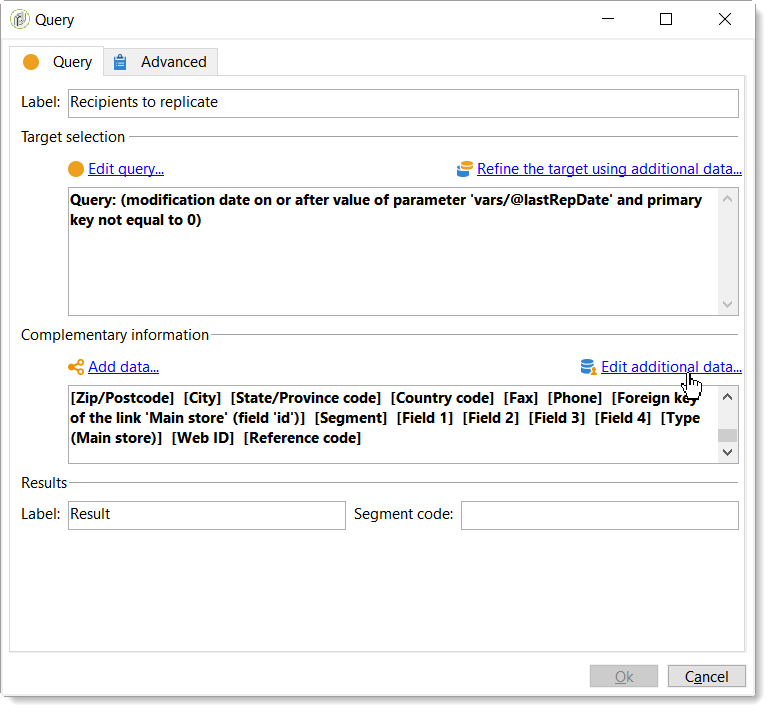

# ACS 커넥터 시작{#acs-connector-gs}

ACS 커넥터는 Adobe Campaign v7 및 Adobe Campaign Standard을 연결합니다. 이 기능은 데이터를 자동으로 Campaign Standard에 복제하여 두 애플리케이션의 최고를 결합하는 Campaign v7의 통합 기능입니다. Campaign v7에는 기본 마케팅 데이터베이스를 관리하는 고급 도구가 있습니다. Campaign v7의 데이터 복제를 통해 Campaign Standard은 사용자 친화적인 환경에서 풍부한 데이터를 활용할 수 있습니다.

ACS 커넥터를 사용하면 디지털 마케터가 캠페인을 디자인, 타깃팅 및 실행하는 데 Campaign Standard을 계속 사용할 수 있지만 Campaign v7은 데이터베이스 마케터와 같은 데이터 지향 사용자를 위해 맞춤 설정됩니다.

>[!IMPORTANT]
>
>ACS 커넥터는 Adobe Campaign Prime 제품의 일부로서만 사용할 수 있습니다. Adobe Campaign Prime 라이선스 방법에 대한 자세한 내용은 계정 관리자에게 문의하십시오.
>
>ACS 커넥터는 호스팅 및 하이브리드 아키텍처에만 사용할 수 있습니다. 전체 온프레미스 설치에는 사용할 수 없습니다.
>
>이 기능을 사용하려면 Adobe ID(IMS)를 사용하여 Campaign에 연결해야 합니다. 다음을 참조하십시오 [Adobe ID을 통해 연결](../../integrations/using/about-adobe-id.md).

이 문서에서는 ACS 커넥터 기능에 대해 설명합니다. 아래 섹션에서는 기능이 데이터를 복제하는 방법에 대한 정보와 복제된 프로필로 작업하는 방법에 대한 지침을 제공합니다.

* [프로세스](#process): ACS 커넥터 개요 및 데이터 복제 관리 방법.
* [구현](#implementation): ACS 커넥터를 시작하는 방법에 대한 개요와 기본 및 고급 데이터를 복제하는 방법에 대한 지침.
* [프로필 동기화](../../integrations/using/synchronizing-profiles.md): 프로필을 복제하는 방법과 프로필을 사용하여 게재를 만드는 방법에 대한 지침입니다.
* [대상자 동기화](../../integrations/using/synchronizing-audiences.md): Campaign v7에서 수신자 목록을 타겟팅한 다음 목록을 Campaign Standard 대상으로 복제하는 방법에 대한 지침입니다.
* [웹 애플리케이션 동기화](../../integrations/using/synchronizing-web-applications.md): Campaign v7 웹 애플리케이션을 Campaign Standard에 연결하는 방법에 대한 지침
* [ACS 커넥터 문제 해결](../../integrations/using/troubleshooting-the-acs-connector.md): 일반적인 문제에 대한 답변을 검토합니다.

>[!NOTE]
>
>ACS 커넥터는 사용권 계약에 따라 Campaign v7에 포함됩니다. ACS 커넥터를 사용하려면 Campaign v7과 Campaign Standard 간을 전환할 수 있는지 확인하십시오. 버전과 포함된 기능이 확실하지 않은 경우 관리자에게 문의하십시오.

## 배합 색상 {#process}

### 데이터 복제 {#data-replication}

ACS 커넥터는 Campaign v7에서 Campaign Standard으로 정기적으로 다음 항목을 복제합니다.

* **수신자**
* **구독**
* **서비스**
* **랜딩 페이지**

기본적으로 ACS 커넥터의 정기 복제는 15분마다 한 번씩 수행됩니다. 주기적인 복제 범위는 사용자의 요구 사항에 맞게 조정할 수 있습니다. 변경이 필요한 경우 컨설턴트에게 문의하십시오.

수신자, 구독, 서비스 및 랜딩 페이지에 대한 데이터 복제는 증분 복제이므로, 새 수신자와 기존 수신자에 대한 수정 사항만 Campaign v7에서 Campaign Standard으로 복제됩니다. 단, 대상에 대한 복제는 단일 인스턴스에서 발생합니다. Campaign v7에서 대상을 만든 다음 Campaign Standard에 한 번 복제할 수 있습니다. 복제는 즉시 실행되며 일반 업데이트에 대해 구성할 수 없습니다. 자세한 내용은 [대상자 동기화](../../integrations/using/synchronizing-audiences.md).

>[!NOTE]
>
>몇 시간이 걸릴 수 있으므로 대규모 데이터베이스의 초기 복제에 대해 기다려 주십시오. 그러나 후속 복제는 증가분 복제이며 훨씬 빨라집니다.

ACS 커넥터는 Campaign Standard에서 Campaign v7로 정기적으로 다음 항목을 복제합니다.

* **[!UICONTROL Delivery IDs]**
* **[!UICONTROL Email broad logs]**
* **[!UICONTROL Email tracking logs]**

게재 ID 및 이메일 로그를 복제하면 Campaign v7에서 v7 수신자의 게재 내역 및 추적 데이터에 액세스할 수 있습니다.

>[!IMPORTANT]
>
>이메일 브로드로그 및 추적 로그만 Campaign Standard에서 Campaign v7으로 복제됩니다.

### 데이터 동기화 {#data-synchronization}

ACS 커넥터는 Campaign v7과 Campaign Standard 간의 격리를 동기화합니다.

예를 들어 Campaign v7에서 Campaign Standard으로 복제된 프로필에는 이메일 주소가 포함됩니다. Campaign Standard에 의해 이메일 주소가 격리된 경우, 다음 동기화 중에 데이터가 Campaign v7으로 전달됩니다. 격리에 대한 자세한 내용은 [격리 관리](../../delivery/using/understanding-quarantine-management.md) 및 [Campaign Standard 격리](https://experienceleague.adobe.com/docs/campaign-standard/using/testing-and-sending/monitoring-messages/understanding-quarantine-management.html).

### 복제된 프로필 사용 {#using-replicated-profiles}

복제된 프로필은 Campaign Standard 및 Campaign v7에서 마케팅 캠페인의 타겟팅 워크플로우에 사용할 수 있습니다.

복제된 프로필을 사용하여 Campaign Standard에서 게재를 보내는 방법에 대한 지침은 [프로필 동기화](../../integrations/using/synchronizing-profiles.md). Campaign v7과 Campaign Standard 간에 구독 취소 데이터를 공유하기 위한 추가 지침이 제공됩니다.

### 제한 사항 {#limitations}

복제된 프로필은 게재에 쉽게 사용할 수 있지만 Campaign Standard에 특정 제한이 있습니다. 아래 항목을 검토하여 가장 효과적으로 관리하는 방법을 알아보십시오.

* **Campaign Standard을 위한 읽기 전용 프로필**: 복제된 프로필은 Campaign Standard 시 읽기 전용입니다. 그러나 Campaign v7에서 수신자를 편집할 수 있으며 수정 사항은 ACS 커넥터가 Campaign Standard 시 자동으로 업데이트됩니다.
* **Campaign Standard에서 생성된 프로필**: ACS 커넥터는 수신자 데이터를 Campaign v7에서 Campaign Standard으로 한 방향으로 복제합니다. 따라서 Campaign Standard에서 생성된 프로필은 Campaign v7에 복제되지 않습니다.
* **Campaign Standard을 위한 기본 수신자 데이터**: ACS 커넥터는 Campaign Standard에 적합한 수신자 데이터를 복제합니다. 여기에는 수신자의 이름, 주소, 이메일 주소, 휴대폰 번호, 집 전화번호 및 기타 관련 연락처 정보가 포함됩니다. Campaign v7에서 사용할 수 있는 추가 수신자 필드 및 사용자 지정 타깃팅 테이블이 워크플로에 중요한 경우 컨설턴트에게 문의하십시오.
* **격리된 프로필 가져오기**: 연락을 원치 않는 프로필 목록은 격리된 프로필로 Campaign v7 또는 Campaign Standard에 가져올 수 있습니다. 프로필의 상태는 애플리케이션 간의 격리 동기화에 포함되며 게재에서 사용되지 않습니다.
* **Campaign Standard에서 서비스 구독 취소**: 게재 구독 취소 선택이 Campaign Standard에서 Campaign v7로 동기화되지 않습니다. 그러나 Campaign Standard 전달 시 구독 취소 링크를 Campaign v7로 보내도록 구성할 수 있습니다. 구독 취소 링크를 클릭하는 수신자의 프로필이 Campaign v7에서 업데이트되고 데이터가 Campaign Standard에 복제됩니다. 다음을 참조하십시오 [구독 취소 링크 변경](../../integrations/using/synchronizing-profiles.md#changing-the-unsubscription-link).
* 이메일 브로드로그 및 추적 로그만 Campaign Standard에서 Campaign v7으로 복제됩니다.

### 과금 {#billing}

애플리케이션 선택에 따라 게재, Campaign v7 또는 Campaign Standard을 보내도 청구에 영향을 주지 않습니다. 청구 정보는 Campaign v7과 Campaign Standard 간에 조정됩니다. 따라서 두 애플리케이션을 모두 사용하여 동일한 수신자에게 게재를 전송하는 경우에도 여전히 하나의 활성 프로필로 계산됩니다.

## 구현 {#implementation}

ACS Connector에는 두 가지 유형의 구현이 있습니다. 두 가지 모두 Adobe Campaign 컨설팅 팀에서 항상 수행합니다.

>[!IMPORTANT]
>
>이 섹션은 전문 사용자만을 대상으로 하며 구현 프로세스 및 주요 단계에 대한 전체적인 보기를 제공합니다.
>
>이러한 구현을 직접 수행하지 마십시오. Adobe Campaign 컨설턴트에게 엄격히 할당되어 있습니다.

다음 **기본 구현** 에서는 수신자(기본 제공 필드), 서비스 및 구독, 웹 애플리케이션 및 대상을 복제할 수 있습니다. Campaign v7에서 Campaign Standard으로의 단방향 복제입니다.

다음 **고급 구현** 추가 수신자 필드 또는 사용자 지정 수신자 테이블(예: 트랜잭션 테이블)이 있는 경우 등 보다 복잡한 사용 사례를 수행할 수 있습니다. 다음을 참조하십시오 [고급 구현](#advanced-implementation).

### 패키지 설치 {#installing-the-package}

이 기능을 사용하려면 **[!UICONTROL ACS Connector]** 패키지를 설치해야 합니다. 이 작업은 항상 Adobe 기술 관리자나 컨설턴트가 수행합니다.

ACS 커넥터와 관련된 모든 기술 요소는 **[!UICONTROL Administration > ACS Connector]** 탐색기의 노드입니다.

### 기술 및 복제 워크플로 {#technical-and-replication-workflows}

패키지를 설치하면 다음 두 가지 기술 워크플로우가 제공됩니다. **[!UICONTROL Administration > ACS Connector > Process]**.

>[!IMPORTANT]
>
>이러한 워크플로는 절대 수정하지 마십시오. 오류이거나 일시 중지되면 안 됩니다. 이 경우 Adobe Campaign 컨설턴트에게 문의하십시오.

* **[!UICONTROL `[ACS] Quarantine synchronization`]** (quarantineSync): 이 워크플로우는 모든 격리 정보를 동기화합니다. Campaign v7의 모든 새 격리 기능은 Campaign Standard에 복제됩니다. Campaign Standard의 모든 새 격리가 Campaign v7에 복제됩니다. 이렇게 하면 모든 제외 규칙이 Campaign v7과 Campaign Standard 간에 동기화됩니다.
* **[!UICONTROL `[ACS] Security group synchronization`]** (securityGroupSync): 이 워크플로는 권한 변환에 사용됩니다. 다음을 참조하십시오 [권한 전환](#rights-conversion).

다음 복제 워크플로우는 &quot;사용 준비&quot; 템플릿으로 사용할 수 있습니다. Adobe Campaign 컨설턴트가 구현해야 합니다.

* **[!UICONTROL `[ACS] Profile replication`]** (newProfileReplication): 이 증분 워크플로는 수신자를 Campaign Standard에 복제합니다. 기본적으로 모든 기본 수신자 필드를 복제합니다. 다음을 참조하십시오 [기본 수신자 필드](#default-recipient-fields).
* **[!UICONTROL `[ACS] Service replication`]** (newServiceReplication): 이 증분 워크플로는 선택한 서비스를 Campaign Standard에 복제합니다. 사용 사례 보기 [웹 애플리케이션 동기화](../../integrations/using/synchronizing-web-applications.md).
* **[!UICONTROL `[ACS] Landing pages replication`]** (newLandingPageReplication): 이 증분 워크플로우는 선택한 웹 애플리케이션을 Campaign Standard에 복제합니다. Campaign v7 웹 애플리케이션은 Campaign Standard에 랜딩 페이지로 표시됩니다. 사용 사례 보기 [웹 애플리케이션 동기화](../../integrations/using/synchronizing-web-applications.md).
* **[!UICONTROL `[ACS] New replication`]** (newReplication): 이 증분 워크플로우는 사용자 지정 테이블을 복제하는 데 사용할 수 있는 예입니다. 다음을 참조하십시오 [고급 구현](#advanced-implementation).
* **[!UICONTROL `[ACS] Delivery-message replication`]** (newDlvMsgQualification): 이 증분 워크플로우는 게재 메시지를 Campaign Standard에서 Campaign v7로 복제합니다.
* **[!UICONTROL `[ACS] Profile delivery log replication`]** (newRcpDeliveryLogReplication): 이 증분 워크플로우는 게재 ID, 이메일 광범위한 로그 및 이메일 추적 로그를 Campaign Standard에서 Campaign v7으로 복제합니다. Campaign v7의 nms:recipients 표에 포함된 프로필로 Campaign Standard에서 보낸 게재만 고려합니다.

   >[!NOTE]
   >
   > Campaign Classic 인스턴스와 Campaign Standard 인스턴스가 모두 추적된 URL이 있는 이메일을 보내는 데 사용되는 경우 동기화 중에 중복 URL tagIds 문제가 발생할 수 있습니다. 이 문제가 발생하지 않도록 하려면 **추적 URL 업데이트** (writerTrackingUrls) 활동을 워크플로우에서 실행하고 &quot;ACS&quot; 접두사를 @tagId 소스 표현식에 추가합니다.

* **[!UICONTROL `[ACS] New delivery log replication`]** (newRcpDeliveryLogReplication): 이 증분 워크플로우는 게재 ID, 이메일 광범위한 로그 및 이메일 추적 로그를 Campaign Standard에서 Campaign v7으로 복제합니다. Campaign Standard에서 Campaign v7의 특정 테이블(nms:recipients 이외 정의 대상)에 속한 프로필로 전송된 게재만 고려합니다.

### 기본 수신자 필드 {#default-recipient-fields}

추가 필드 또는 사용자 정의 테이블(예: 트랜잭션 테이블)이 있는 경우 기본적으로 복제되지 않습니다. 고급 구성을 수행해야 합니다. 다음을 참조하십시오 [고급 구현](#advanced-implementation).

다음은 기본 구현과 함께 복제되는 수신자 필드 목록입니다. 기본 제공 필드는 다음과 같습니다.

<table> 
 <tbody> 
  <tr> 
   <td> <strong>레이블</strong>  </td> 
   <td> <strong>내부 이름</strong>  </td> 
  </tr> 
  <tr> 
   <td> 소스 ID  </td> 
   <td> @sourceId  </td> 
  </tr> 
  <tr> 
   <td> 생성일  </td> 
   <td> @created  </td> 
  </tr> 
  <tr> 
   <td> 수정일  </td> 
   <td> @lastModified  </td> 
  </tr> 
  <tr> 
   <td> 이메일  </td> 
   <td> @이메일  </td> 
  </tr> 
  <tr> 
   <td> 성  </td> 
   <td> @lastName  </td> 
  </tr> 
  <tr> 
   <td> 이름  </td> 
   <td> @firstName  </td> 
  </tr> 
  <tr> 
   <td> 가운데 이름  </td> 
   <td> @middleName  </td> 
  </tr> 
  <tr> 
   <td> 모바일  </td> 
   <td> @mobilePhone  </td> 
  </tr> 
  <tr> 
   <td> 생년월일  </td> 
   <td> @birthDate  </td> 
  </tr> 
  <tr> 
   <td> 성별  </td> 
   <td> @gender  </td> 
  </tr> 
  <tr> 
   <td> 인사말  </td> 
   <td> @salutation  </td> 
  </tr> 
  <tr> 
   <td> 더 이상 연락하지 않음(모든 채널에서)  </td> 
   <td> @blackList  </td> 
  </tr> 
  <tr> 
   <td> 더 이상 연락하지 않음(이메일)  </td> 
   <td> @blackListEmail  </td> 
  </tr> 
  <tr> 
   <td> 더 이상 연락하지 않음(SMS  </td> 
   <td> @blackListMobile  </td> 
  </tr> 
  <tr> 
   <td> 휴대폰  </td> 
   <td> @phone  </td> 
  </tr> 
  <tr> 
   <td> 팩스  </td> 
   <td> @fax  </td> 
  </tr> 
  <tr> 
   <td> 주소 1(아파트)  </td> 
   <td> [위치/@address1]  </td> 
  </tr> 
  <tr> 
   <td> 주소 2  </td> 
   <td> [위치/@address2]  </td> 
  </tr> 
  <tr> 
   <td> 주소 3 (번호 및 거리)  </td> 
   <td> [위치/@address3]  </td> 
  </tr> 
  <tr> 
   <td> 주소 4(카운티)  </td> 
   <td> [위치/@address4]  </td> 
  </tr> 
  <tr> 
   <td> Zip/우편 번호  </td> 
   <td> [위치/@zipCode]  </td> 
  </tr> 
  <tr> 
   <td> 시  </td> 
   <td> [위치/@city]  </td> 
  </tr> 
  <tr> 
   <td> 주/시/도 코드  </td> 
   <td> [위치/@stateCode]  </td> 
  </tr> 
  <tr> 
   <td> 국가 코드  </td> 
   <td> [위치/@countryCode]  </td> 
  </tr> 
 </tbody> 
</table>

### 권한 전환 {#rights-conversion}

권한은 Campaign v7 및 Campaign Standard에서 다르게 처리됩니다. Campaign v7에서는 권한 관리가 폴더 기반이지만 Campaign Standard에서 단위 액세스(조직/지리적 단위)를 기반으로 합니다. Campaign Standard 사용자는 제한 컨텍스트를 포함하는 보안 그룹에 속합니다. 따라서 Campaign v7 권한 시스템을 Campaign Standard 시스템과 일치하도록 변환해야 합니다. 권한 변환을 수행하는 방법에는 몇 가지가 있습니다. 구현의 예는 아래에 나와 있습니다.

1. 아래 **[!UICONTROL Administration > ACS Connector > Rights management > Security groups]**, 사용 **[!UICONTROL Synchronize]** 모든 Campaign Standard 보안 그룹을 검색하는 단추입니다. 기본 제공 Campaign Standard 그룹은 제외됩니다.

   

1. 권한 관리가 폴더 기반인 경우 **[!UICONTROL Administration > ACS Connector > Rights management > Folder mapping]** 필요한 각 폴더를 보안 그룹에 매핑합니다.

   

1. 그런 다음 복제 워크플로우는 이 정보를 사용하고 복제할 각 개체에 해당 조직/지리적 단위를 추가합니다.

### 고급 구현 {#advanced-implementation}

이 섹션에서는 고급 구현 측면에서 몇 가지 가능성에 대해 설명합니다.

>[!IMPORTANT]
>
>이 정보는 일반 지침으로만 사용할 수 있습니다. 구현은 Adobe Campaign 컨설턴트에게 문의하십시오.

고급 구현에서는 고객의 요구 사항에 따라 사용자 정의 복제 워크플로우를 추가합니다. 다음은 몇 가지 예입니다.

* 게재 복제
* 캠페인 복제
* 프로그램 복제
* 시드 멤버 복제
* 트랜잭션 복제
* 등

**수신자에 대한 확장 필드 복제**

기본 구현에서는 기본 수신자 필드가 복제됩니다. 수신자 스키마에 추가한 사용자 정의 필드를 복제하려면 해당 필드를 식별해야 합니다.

1. 아래 **[!UICONTROL Administration > ACS Connector > Data mapping]**, 다음에 대한 타겟팅 매핑 만들기 **[!UICONTROL nms:recipient]** 테이블.

   

1. 복제할 추가 필드 및 기타 필요한 정보(인덱스, 링크, 식별 키)를 선택합니다.

   

1. 전용 프로필 복제 워크플로(템플릿이 아니라 워크플로 인스턴스 자체)를 엽니다. 수정 **[!UICONTROL Query]** 및 **[!UICONTROL Update data]** 이러한 필드를 포함하는 활동. 다음을 참조하십시오 [기술 및 복제 워크플로](#technical-and-replication-workflows).

   

   

**사용자 정의 프로필 테이블 복제**

기본 구현에서는 기본 수신자 테이블이 복제됩니다. 사용자 지정 수신자 테이블을 추가한 경우 식별 방법은 다음과 같습니다.

1. 아래 **[!UICONTROL Administration > ACS Connector > Data mapping]**, 사용자 지정 프로필 표에 타깃팅 매핑을 만듭니다.

   

1. 복제할 ID 데이터, 인덱스, 링크 및 필드를 정의합니다.

   

1. 권한 관리가 폴더 기반인 경우 **[!UICONTROL Administration > ACS Connector > Rights management > Folder mapping]**&#x200B;을 클릭하고 사용자 지정 테이블에 연결된 폴더의 보안 그룹을 정의합니다. 다음을 참조하십시오 [권한 전환](#rights-conversion).
1. 사용 **[!UICONTROL New replication]** 사용자 지정 테이블 및 복제할 필드를 포함하는 워크플로(템플릿이 아닌 워크플로 인스턴스 자체). 다음을 참조하십시오 [기술 및 복제 워크플로](#technical-and-replication-workflows).
