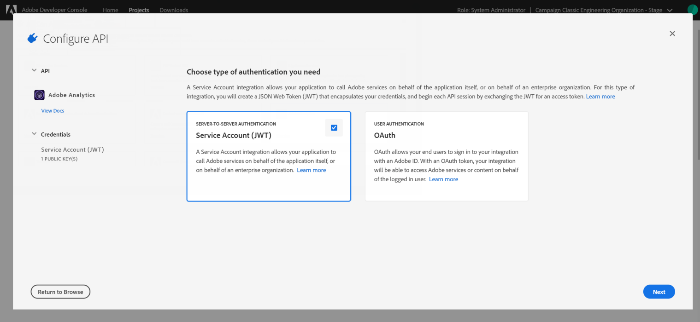

# Configuring Adobe I/O for Adobe Experience Cloud Triggers {#configuring-adobe-io}

>[!CAUTION]
>
>iAuth 인증을 통해 이전 버전의 트리거 통합을 사용하는 **경우 아래**&#x200B;설명에 따라 Adobe I/O로 이동해야 합니다. 기존 Auth 인증 모드는 2021년 4월 30일에 종료됩니다. [자세히 알아보기](https://github.com/AdobeDocs/analytics-1.4-apis/blob/master/docs/APIEOL.md)

## 사전 요구 사항 {#adobe-io-prerequisites}

이 구현을 시작하기 전에 다음을 확인하십시오.

* 최신 버전의 Adobe Campaign(20.2.1 이상),
* 유효한 IMSOrgID:identity management 시스템(IMS) 조직 식별자는 Adobe Experience Cloud 내의 고유 식별자이며, VisitorID 서비스 및 IMS SSO(Single-Sign On),
* IMS 조직에 대한 개발자 액세스.

>[!NOTE]
>
>IMS 조직에 대한 시스템 관리자 권한을 요청해야 하는 경우 이 페이지 [에](https://helpx.adobe.com/ca/enterprise/admin-guide.html/ca/enterprise/using/manage-developers.ug.html) 설명된 절차에 따라 모든 제품 프로필에 대한 이 액세스 권한을 제공합니다.


## 1단계:Adobe I/O 프로젝트 만들기/업데이트 {#creating-adobe-io-project}

1. Adobe I/O에 액세스하고 IMSorg의 시스템 관리자 권한으로 로그인합니다.

   >[!NOTE]
   >
   > 올바른 IMSorg 포털에 로그인되어 있는지 확인하십시오.

1. 인스턴스 구성 파일 ims/authIMSTAClientId에서 기존 통합 클라이언트 ID를 추출합니다. 존재하지 않거나 비어 있는 속성은 클라이언트 ID가 구성되지 않았음을 나타냅니다.

   >[!NOTE]
   >
   >클라이언트 ID가 비어 있는 경우 Adobe I/O **[!UICONTROL Create a New project]** 에서 직접 액세스할 수 있습니다.

1. 추출된 클라이언트 ID를 사용하여 기존 프로젝트를 식별합니다. 이전 단계에서 추출한 것과 동일한 클라이언트 ID를 가진 기존 프로젝트를 찾습니다.

   

1. 선택하고 **[!UICONTROL + Add to Project]** 선택합니다 **[!UICONTROL API]**.

   

1. In the **[!UICONTROL Add an API]** window, select **[!UICONTROL Adobe Analytics]**.

   

1. 인증 유형 **[!UICONTROL Service Account (JWT)]** 으로 선택합니다.

   

1. 클라이언트 ID가 비어 있는 경우 공개 및 개인 키 **[!UICONTROL Generate a key pair]** 를 만들도록 선택합니다.

   

1. 공개 키를 업로드하고 을 클릭합니다 **[!UICONTROL Next]**.

   

1. Analytics-&lt; 조직 **이름>** 제품 프로필을 선택하고 을 **[!UICONTROL Save configured API]**&#x200B;클릭합니다.

   

1. 프로젝트에서 다음 정보 **[!UICONTROL Service Account (JWT)]** 를 선택하고 복사합니다.
   * **[!UICONTROL Client ID]**
   * **[!UICONTROL Client Secret]**
   * **[!UICONTROL Technical account ID]**
   * **[!UICONTROL Organization ID]**

   

## 2단계:Adobe Campaign에서 프로젝트 자격 증명 추가 {#add-credentials-campaign}

Adobe Campaign에서 프로젝트 자격 증명을 추가하려면, 다음 명령을 Adobe Campaign 인스턴스의 모든 컨테이너에 &#39;neolane&#39; 사용자로 실행하여 인스턴스 구성 파일에 자격 증명을 **[!UICONTROL Technical Account]** 삽입합니다.

```
nlserver config -instance:<instance name> -setimsjwtauth:Organization_Id/Client_Id/Technical_Account_ID[/Client_Secret[/Base64_encoded_Private_Key]]
```

>[!NOTE]
>
>개인 키는 base64 UTF-8 형식으로 인코딩해야 합니다. 개인 키를 제외하고 새 줄을 인코딩하기 전에 키에서 제거해야 합니다. 비공개 키는 통합을 만드는 데 사용한 키와 동일해야 합니다.

## 3단계:피펜드 태그 업데이트 {#update-pipelined-tag}

태그를 업데이트하려면 다음과 같이 구성 파일 [!DNL pipelined] config-&lt; instance-name >.xml **** 에서 인증 유형을 Adobe I/O 프로젝트로 업데이트해야 합니다.

```
<pipelined ... authType="imsJwtToken"  ... />
```
