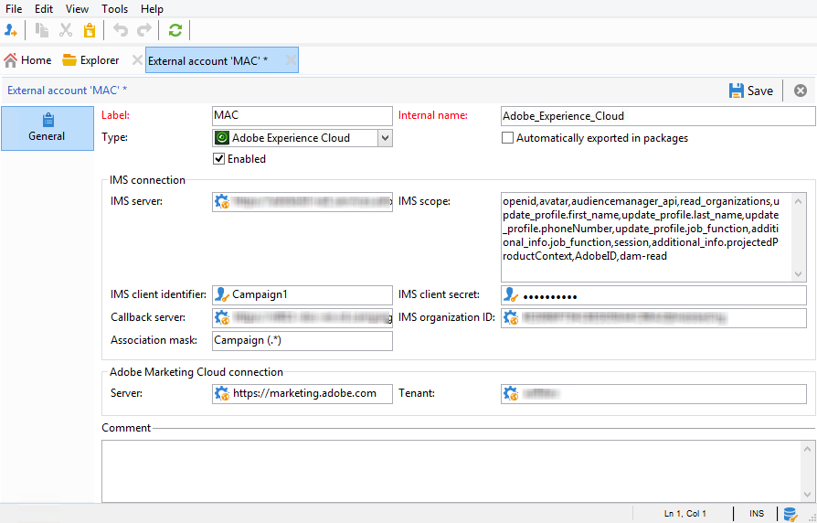

# IMS 구성.{#configuring-ims}

## 사전 요구 사항 {#prerequisites}

IMS와 통합을 사용하려면:

* Adobe Marketing Cloud 조직 및 IMS ID가 있어야 합니다(Adobe Marketing Cloud에 처음 연결할 때 제공).
* Marketing Cloud에서 사용자를 추가해야 합니다. 자세한 내용은 다음 페이지를 참조하십시오.https://marketing.adobe.com/resources/help/en_US/mcloud/admin_getting_started.html .

>[!NOTE]
>
>사용자가 Adobe Campaign과 동기화할 Adobe Marketing Cloud 그룹에 연결되어 있는지 확인합니다. 외부 [계정](#configuring-the-external-account)구성을 참조하십시오.

## 콘솔 업데이트 {#updating-the-console}

이 기능을 사용하려면 최신 버전의 콘솔을 설치해야 합니다.

## 패키지 설치 {#installing-the-package}

패키지를 설치해야 **[!UICONTROL Integration with the Adobe Experience Cloud]** 합니다. 통합 패키지를 설치하는 것은 [이 페이지에](../../installation/using/installing-campaign-standard-packages.md)자세히 설명된 표준 패키지를 설치하는 것과 같습니다.

## 외부 계정 구성 {#configuring-the-external-account}

에서 **Adobe Experience Cloud** 외부 계정을 구성합니다 **[!UICONTROL Administration > Platform > External accounts]**.

>[!CAUTION]
>
>이 구성은 기술 관리자를 위해 예약되어 있습니다.

다음 정보를 입력합니다.

* 사용된 IMS 서버에 대한 연결 정보(ID 및 암호). 이 정보는 Adobe 지원으로 제공됩니다. 자세한 내용은 Adobe Experience Cloud [관리자를 위한 FAQ를 참조하십시오](https://marketing.adobe.com/resources/help/en_US/mcloud/faq.html).

   주소는 **[!UICONTROL Callback server]** https ****&#x200B;로 지정해야 합니다. 이 필드는 Adobe Campaign 인스턴스의 액세스 URL에 해당합니다.

* IMS 조직 ID:이 정보는 Experience Cloud( **[!UICONTROL Administration > Experience Cloud Details]** )에서 사용할 수 있으며 Adobe Experience Cloud에 처음 연결할 때 제공됩니다.
* 연결 마스크:이 필드를 사용하면 Enterprise Dashboard의 구성 이름을 Adobe Campaign의 그룹과 동기화할 수 있는 구문을 정의할 수 있습니다. &quot;Campaign - tenant_id - (.*)&quot;, Adobe Campaign에서 만든 보안 그룹이 Enterprise Dashboard의 구성 이름 &quot;Campaign - tenant_id - internal_name&quot;에 연결됩니다.

   >[!CAUTION]
   >
   >연결 마스크는 Adobe ID를 통한 연결이 올바르게 작동하기 위해 필요합니다.

* Adobe Experience Cloud 연결 정보, 특히 Adobe Experience Cloud 임차인 이름입니다.

