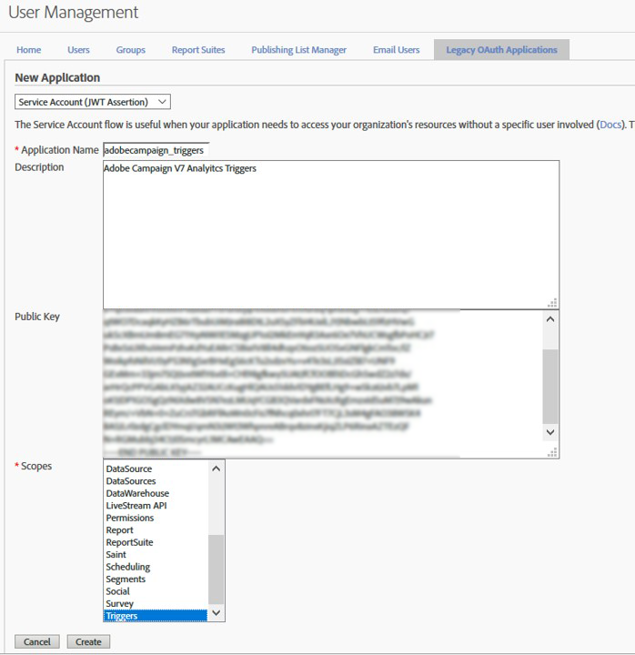

# 파이프라인 구성 {#configuring-pipeline}

고객 ID, 개인 키 및 인증 끝점과 같은 인증 매개 변수가 인스턴스 구성 파일에 구성됩니다.
처리할 트리거 목록은 옵션으로 구성됩니다. JSON 형식입니다.
Javascript 코드를 사용하여 트리거가 즉시 처리됩니다. 더 이상 실시간으로 처리되지 않고 데이터베이스 테이블에 저장됩니다.
트리거는 이메일을 전송하는 캠페인 워크플로우의 타깃팅에 사용됩니다. 두 개의 트리거 이벤트가 있는 고객이 이메일을 받을 수 있도록 캠페인이 설정됩니다.

## 사전 요구 사항 {#prerequisites}

캠페인 [!DNL Experience Cloud Triggers] 에서 사용하려면 다음이 필요합니다.

* Adobe Campaign 버전 6.11 빌드 8705 이상
* Adobe Analytics Ultimate, Premium, Foundation, OD, Select, Prime, Mobile Apps, Select 또는 Standard.

사전 요구 사항 구성은 다음과 같습니다.

* 개인 키 파일을 만든 다음 해당 키로 등록된 oAuth 응용 프로그램 만들기를 참조하십시오.
* Adobe Analytics의 트리거 구성

Adobe Analytics 구성은 이 문서의 범위를 벗어납니다.

Adobe Campaign을 사용하려면 Adobe Analytics의 다음 정보가 필요합니다.

* oAuth 응용 프로그램의 이름입니다.
* Experience Cloud 고객의 식별자입니다.
* Analytics에 구성된 트리거의 이름.
* 마케팅 데이터베이스와 대사할 데이터 필드의 이름 및 형식.

이 구성의 일부는 사용자 정의 개발이며 다음을 필요로 합니다.

* Adobe Campaign의 JSON, XML 및 Javascript 구문 분석에 대한 작업 지식
* QueryDef 및 Writer API에 대한 작업 지식
* 개인 키를 사용한 암호화 및 인증 작업

>[!NOTE]
>
>JS 코드를 편집하려면 기술 기술이 필요하므로 제대로 이해하지 않으면 시도하지 마십시오. <br>트리거는 데이터베이스 테이블에 저장됩니다. 따라서 트리거 데이터는 타깃팅 워크플로우에서 마케팅 운영자가 안전하게 사용할 수 있습니다.

## 인증 및 구성 파일 {#authentication-configuration}

파이프라인이 Adobe Experience Cloud에서 호스팅되므로 인증이 필요합니다.
Marketing Server가 온-프레미스에서 호스팅되는 경우 파이프라인에 로그인할 때 보안 연결을 갖도록 인증해야 합니다.
공개 및 개인 키를 사용합니다. 이 프로세스는 사용자/암호와 동일한 기능으로 보안이 강화됩니다.

### IMSOrgId {#imsorgid}

IMSOrgId는 Adobe Experience Cloud에서 고객의 식별자입니다.
IMSOrgId 속성 아래의 인스턴스 serverConf.xml 파일에서 설정합니다.
예:

```
<redirection IMSOrgId="C5E715(…)98A4@AdobeOrg" (…)
```

### 키 생성 {#key-generation}

열쇠는 파일 한 쌍이다. RSA 포맷이고 길이가 4096바이트입니다. OpenSSL과 같은 오픈 소스 도구를 사용하여 생성할 수 있습니다. 도구가 실행될 때마다 새 키가 무작위로 생성됩니다.
편의를 위해 이 단계는 다음과 같습니다.

* ```openssl genrsa -out <private_key.pem> 4096```

* ```openssl rsa -pubout -in <private_key.pem> -out <public_key.pem>```

private_key.pem 파일 예:

```
----BEGIN RSA PRIVATE KEY----
MIIEowIBAAKCAQEAtqcYzt5WGGABxUJSfe1Xy8sAALrfVuDYURpdgbBEmS3bQMDb
(…)
64+YQDOSNFTKLNbDd+bdAA+JoYwUCkhFyvrILlgvlSBvwAByQ2Lx
----END RSA PRIVATE KEY----
```

public_key.pem 파일 예:

```
----BEGIN PUBLIC KEY----
MIIBIjANBgkqhkiG9w0BAQEFAAOCAQ8AMIIBCgKCAQEAtqcYzt5WGGABxUJSfe1X
(…)
EwIDAQAB
----END PUBLIC KEY----
```

>[!NOTE]
>
>PuttyGen에서 키를 생성하지 않아야 합니다. OpenSSL이 가장 적합합니다.

### Adobe Experience Cloud에서 Auth 클라이언트 생성 {#oauth-client-creation}

JWT 유형의 응용 프로그램은 **[!UICONTROL Admin]** > **[!UICONTROL User Management]** > 아래의 올바른 조직 계정에서 Adobe Analytics에 로그인하여 만들어야 합니다 **[!UICONTROL Legacy Oath application]**.

다음 단계를 따르십시오.

1. 을 **[!UICONTROL Service Account (JWT Assertion)]**&#x200B;선택합니다.
1. 를 **[!UICONTROL Application Name]**&#x200B;입력합니다.
1. 등록하십시오 **[!UICONTROL Public key]**.
1. 트리거 항목을 선택합니다 **[!UICONTROL Scopes]**.

   

1. 아이콘을 **[!UICONTROL Create]** 클릭하고 **[!UICONTROL Application ID]** 만든 후 **[!UICONTROL Application Secret]** 만듭니다.

   

### Adobe Campaign Classic의 응용 프로그램 이름 등록 {#application-name-registration}

생성된 oAuth 클라이언트의 응용 프로그램 ID는 Adobe Campaign에서 구성해야 합니다. 요소의 인스턴스 구성 파일, 특히 appName 속성을 편집하여 [!DNL pipelined] 수행할 수 있습니다.

예:

```
<pipelined autoStart="true" appName="applicationID" authPrivateKey="@qQf146pexBksGvo0esVIDO(…)"/>
```

### 키 암호화 {#key-encription}

개인 키를 암호화해야 [!DNL pipelined]합니다. 암호화는 cryptString Javascript 함수를 사용하여 수행되며 동일한 인스턴스에서 수행해야 합니다 [!DNL pipelined].

이 [페이지에서 JavaScript를 사용한 개인 키 암호화 샘플을 사용할 수 있습니다](../../integrations/using/pipeline-troubleshooting.md).

암호화된 개인 키는 Adobe Campaign에 등록되어 있어야 합니다. 요소의 인스턴스 구성 파일, 특히 authPrivateKey 속성을 편집하여 [!DNL pipelined] 수행할 수 있습니다.

예:

```
<pipelined autoStart="true" appName="applicationID" authPrivateKey="@qQf146pexBksGvo0esVIDO(…)"/>
```

### 파이프라인 프로세스 자동 시작 {#pipelined-auto-start}

이 [!DNL pipelined] 프로세스는 자동으로 시작되어야 합니다.
이렇게 하려면 구성 파일의 요소를 autostart=&quot;true&quot;로 설정합니다.

```
<pipelined autoStart="true" appName="applicationID" authPrivateKey="@qQf146pexBksGvo0esVIDO(…)"/>
```

### 파이프라인 프로세스 다시 시작 {#pipelined-restart}

또한 명령줄을 사용하여 수동으로 시작할 수도 있습니다.

```
nlserver start pipelined@instance
```

변경 사항을 적용하려면 다시 시작해야 합니다.

```
nlserver restart pipelined@instance
```

오류가 발생하면 표준 출력(수동으로 시작한 경우) 또는 [!DNL pipelined] 로그 파일에서 오류를 찾습니다. 문제 해결에 대한 자세한 내용은 이 문서의 문제 해결 섹션을 참조하십시오.

### 파이프라인 구성 옵션 {#pipelined-configuration-options}

| 옵션 | 설명 |
|:-:|:-:|
| appName | Adobe Analytics에 등록된 OAuth 응용 프로그램(응용 프로그램 ID)의 ID(공개 키가 업로드된 경우): 관리 > 사용자 관리 > 기존 선서 응용 프로그램. 이[섹션을 참조하십시오](../../integrations/using/configuring-pipeline.md#oauth-client-creation). |
| authGatewayEndpoint | &quot;게이트웨이 토큰&quot;을 가져오기 위한 URL. <br> 기본값: https://api.omniture.com |
| authPrivateKey | 개인 키(Adobe Analytics에 업로드된 공개 부분(이 섹션 참조). XtkSecretKey 옵션을 사용하여 암호화된 AES: xtk.session.EncryptPassword(&quot;PRIVATE_KEY&quot;); |
| disableAuth | 인증 비활성화(게이트웨이 토큰 없이 연결하는 것은 일부 개발 파이프라인 끝점에서만 허용됨) |
| discoverPipelineEndpoint | 이 테넌트에 사용할 파이프라인 서비스 끝점을 검색하는 URL입니다. 기본값: https://producer-pipeline-pnw.adobe.net |
| dumpStatePeriodSec | var/INSTANCE/pipelined.json의 프로세스 내부 상태를 2번 덤프할 때의 기간 내역은 http://INSTANCE/pipelined/status에서 온디맨드(포트 7781)에 액세스할 수 있습니다. |
| forcedPipelineEndpoint | PipelineServicesEndpoint의 검색을 비활성화하고 강제 적용 |
| monitorServerPort | 이 [!DNL pipelined] 프로세스는 http://INSTANCE/pipelined/status에서 프로세스 내부 상태를 제공하기 위해 이 포트를 수신합니다(포트 7781). |
| 포인터FlushMessageCount | 이 수의 메시지가 처리되면 오프셋이 데이터베이스에 저장됩니다. 기본값은 1000입니다. |
| 포인터FlushPeriodSec | 이 기간이 지나면 옵셋이 데이터베이스에 저장됩니다. 기본값은 5초입니다. |
| processingJSThreads | 사용자 지정 JS 커넥터를 사용하는 전용 스레드 처리 메시지 수입니다. 기본값은 4입니다. |
| processingThreads | 내장 코드가 있는 전용 스레드 처리 메시지 수입니다. 기본값은 4입니다. |
| retryPeriodSec | 재시도 간 지연(처리 오류가 있는 경우). 기본값은 30초입니다. |
| retryValiditySec | 이 기간 이후에 처리되지 않으면 메시지를 취소합니다(너무 많은 재시도). 기본값은 300초입니다. |
