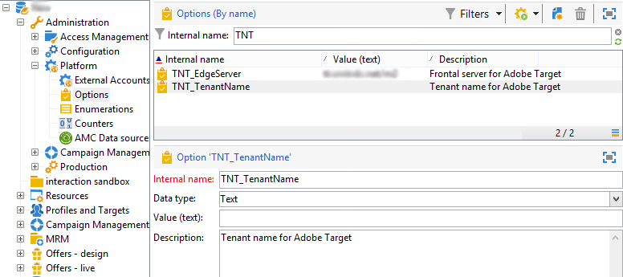

# Configuring the integration with Adobe Target{#configuring-the-integration-with-adobe-target}

## 사전 요구 사항 {#prerequisites}

Adobe Campaign과 Adobe Target 간의 통합을 사용하려면 다음을 수행해야 합니다.

* Adobe Experience Cloud 및 Adobe Target 조직
* Adobe Campaign와의 연결을 설정하기 위해 지정된 Adobe Target rawbox

## Adobe Campaign 구성 {#configuring-adobe-campaign}

Adobe Campaign을 구성하려면:

1. 표준 패키지를 **[!UICONTROL Integration with the Adobe Experience Cloud]** 설치합니다. 통합 패키지 설치는 표준 패키지를 설치하는 것과 동일하며 [패키지 가져오기](../../platform/using/working-with-data-packages.md#importing-packages) 섹션에 자세히 설명되어 있습니다. 이렇게 하면 디지털 자산 관리자를 통해 공유 자산에 액세스할 수 있습니다.
1. IMS(Adobe ID 연결 서비스)를 통해 연결을 활성화하면 이메일에 Adobe Experience Cloud을 통해 공유된 이미지를 사용할 수 있습니다. IMS에 대한 섹션 [을 참조하십시오.](../../integrations/using/about-adobe-id.md).
1. 에서 Adobe Target **[!UICONTROL Administration > Platform > Options]**&#x200B;에 대한 서버 및 조직(테넌트) 옵션을 구성합니다.

   * **[!UICONTROL TNT_EdgeServer]** :통합에 사용된 Adobe Target 서버 이 옵션은 기본적으로 이미 선택되어 있습니다. 이 값은 Adobe Target **[!UICONTROL Domain Server]**&#x200B;에 해당하고 값 **/m2에**&#x200B;해당합니다. 예: **tt.omtrdc.net/m2**.
   * **[!UICONTROL TNT_TenantName]** :Adobe Target 조직명. 이 값은 Adobe Target의 이름에 해당합니다 **[!UICONTROL Client]**.

   

