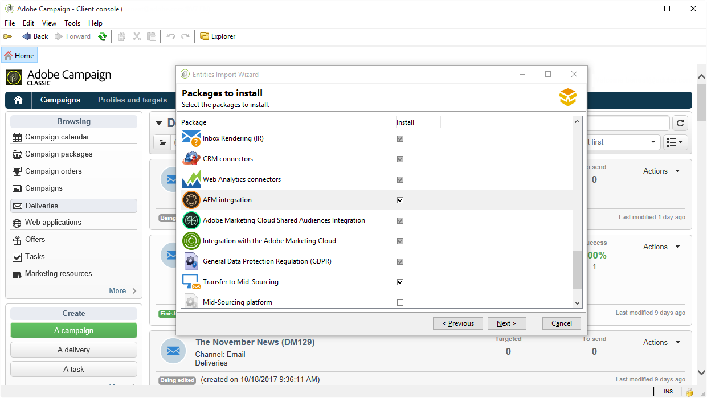

# Campaign-AEM 통합 구성{#configuring-the-integration}


## Adobe Campaign의 구성 단계 {#configuring-in-adobe-campaign}

이 두 솔루션을 함께 사용하려면 서로 연결하도록 구성해야 합니다.

아래 절차에 따라 Adobe Campaign에서 구성을 시작하십시오.

1. [Adobe Campaign에 AEM 통합 패키지 설치](#install-the-aem-integration-package-in-adobe-campaign)
1. [외부 계정 구성](#configure-the-external-account)
1. [AEM 리소스 필터링 구성](#configure-aem-resources-filtering)

개인화 필드 및 블록 관리와 같은 고급 구성의 경우. Adobe Experience Manager 를 참조하십시오 [설명서](https://helpx.adobe.com/experience-manager/6-5/sites/administering/using/campaignonpremise.html).

### Adobe Campaign에 AEM 통합 패키지 설치 {#install-the-aem-integration-package-in-adobe-campaign}

먼저 을(를) 설치해야 합니다 **[!UICONTROL AEM integration]** 패키지.

1. Adobe Campaign 인스턴스에서 을 선택합니다 **[!UICONTROL Tools]** 상단 도구 모음에서 를 클릭합니다.
1. **[!UICONTROL Tools > Advanced > Import package...]**&#x200B;을(를) 선택합니다.

   

1. **[!UICONTROL Install a standard package]**&#x200B;을(를) 선택합니다.
1. 확인 **[!UICONTROL AEM integration]** 그런 다음 **[!UICONTROL Next]** 버튼을 클릭합니다.

   

1. 다음 창에서 **[!UICONTROL Start]** 패키지 설치를 시작하는 단추입니다. 설치가 완료되면 창을 닫습니다.

### AEM 연산자에 대한 보안 영역 구성 {#configure-the-security-zone-for-aem-operator}

다음 **[!UICONTROL AEM integration]** 패키지 는 **[!UICONTROL aemserver]** 연산자를 사용할 수 있습니다. 이 연산자는 Adobe Experience Manager 서버를 Adobe Campaign에 연결하는 데 사용됩니다.

Adobe Experience Manager을 통해 Adobe Campaign에 연결하기 위해 이 연산자가 보안 영역을 구성해야 합니다.

>[!CAUTION]
>
>보안 문제를 방지하기 위해 AEM 전용 보안 영역을 만드는 것이 좋습니다. 자세한 내용은 설치 를 참조하십시오 [안내서](../../installation/using/security-zones.md).

Campaign 인스턴스가 Adobe에 의해 호스팅되는 경우 [고객 지원 Adobe](https://helpx.adobe.com/kr/enterprise/admin-guide.html/enterprise/using/support-for-experience-cloud.ug.html) 팀 Campaign On-Premise를 사용하는 경우 아래 절차를 따르십시오.

1. 를 엽니다. **serverConf.xml** 구성 파일.
1. 액세스 권한 **allowUserPassword** 선택한 보안 영역의 속성 및 **true**.

   이렇게 하면 Adobe Experience Manager에서 로그인/암호를 통해 Adobe Campaign에 연결할 수 있습니다.

### 외부 계정 구성 {#configure-the-external-account}

다음 **[!UICONTROL AEM integration]** 패키지를 통해 Adobe Experience Cloud에 대한 외부 계정을 만들었습니다. 이제 Adobe Experience Manager 인스턴스와 연결하도록 구성해야 합니다.

AEM 외부 계정을 구성하려면 아래 단계를 수행하십시오.

1. **[!UICONTROL Explorer]** 버튼을 클릭합니다.

   

1. **[!UICONTROL Administration > Platform > External accounts]**&#x200B;을(를) 선택합니다.
1. 에서 **[!UICONTROL External account]** 목록, 선택 **[!UICONTROL AEM instance]**.
1. AEM 작성 인스턴스에 대한 매개 변수를 입력합니다.

   * **[!UICONTROL Server]**
   * **[!UICONTROL Account]**
   * **[!UICONTROL Password]**

   >[!NOTE]
   >
   >다음 사항을 확인하십시오. **[!UICONTROL Server]** 주소가 슬래시로 끝나지 않습니다.

   

1. 을(를) 확인합니다. **[!UICONTROL Enabled]** 상자.
1. **[!UICONTROL Save]** 버튼을 클릭합니다.

### AEM 리소스 필터링 구성 {#configure-aem-resources-filtering}

다음 **AEMRessourceTypeFilter** Adobe Campaign에서 사용할 수 있는 Experience Manager 리소스 유형을 필터링하는 데 옵션이 사용됩니다. 이렇게 하면 Adobe Campaign에서 Adobe Campaign에서만 사용하도록 특별히 디자인된 Experience Manager 콘텐츠를 검색할 수 있습니다.

다음을 확인하려면 **[!UICONTROL AEMResourceTypeFilter]** 옵션이 구성되었습니다.

1. **[!UICONTROL Explorer]** 버튼을 클릭합니다.
1. **[!UICONTROL Administration > Platform > Options]**&#x200B;을(를) 선택합니다.
1. 에서 **[!UICONTROL Options]** 목록, 선택 **[!UICONTROL AEMResourceTypeFilter]**.
1. 에서 **[!UICONTROL Value (text)]** 필드. 경로는 다음과 같습니다.

   ```
   mcm/campaign/components/newsletter,mcm/campaign/components/campaign_newsletterpage,mcm/neolane/components/newsletter
   ```

   또는 경우에 따라 다음을 수행합니다.

   ```
   mcm/campaign/components/newsletter
   ```

   

## Adobe Experience Manager의 구성 단계 {#configuring-in-adobe-experience-manager}

아래 절차에 따라 Adobe Experience Manager에서 구성을 시작하십시오.

1. 구성 **복제** AEM 작성 인스턴스에서 AEM 게시 인스턴스로 복제하려면 다음을 수행하십시오.

   복제 구성 방법에 대한 자세한 내용은 Adobe Experience Manager 를 참조하십시오 [설명서](https://helpx.adobe.com/experience-manager/6-5/sites/deploying/using/replication.html).

1. 통합 설치 **FeaturePack** 작성 인스턴스에서 게시 인스턴스에 설치를 복제합니다. (AEM 버전 5.6.1 및 6.0의 경우).

   FeaturePack 설치 방법에 대한 자세한 내용은 Adobe Experience Manager 를 참조하십시오 [설명서](https://helpx.adobe.com/experience-manager/aem-previous-versions.html).

1. 전용 구성 을 통해 Adobe Experience Manager과 Adobe Campaign 연결하기 **Cloud Service**.

   Cloud Services을 통해 두 솔루션을 모두 연결하는 방법에 대해 알아보려면 Adobe Experience Manager 를 참조하십시오 [설명서](https://helpx.adobe.com/experience-manager/6-5/sites/administering/using/campaignonpremise.html#ConfiguringAdobeExperienceManager) .

1. 구성 **외부 도우미 서비스**.

   구성하는 방법에 대한 자세한 내용은 Adobe Experience Manager 를 참조하십시오 [설명서](https://helpx.adobe.com/experience-manager/6-5/sites/developing/using/externalizer.html).
