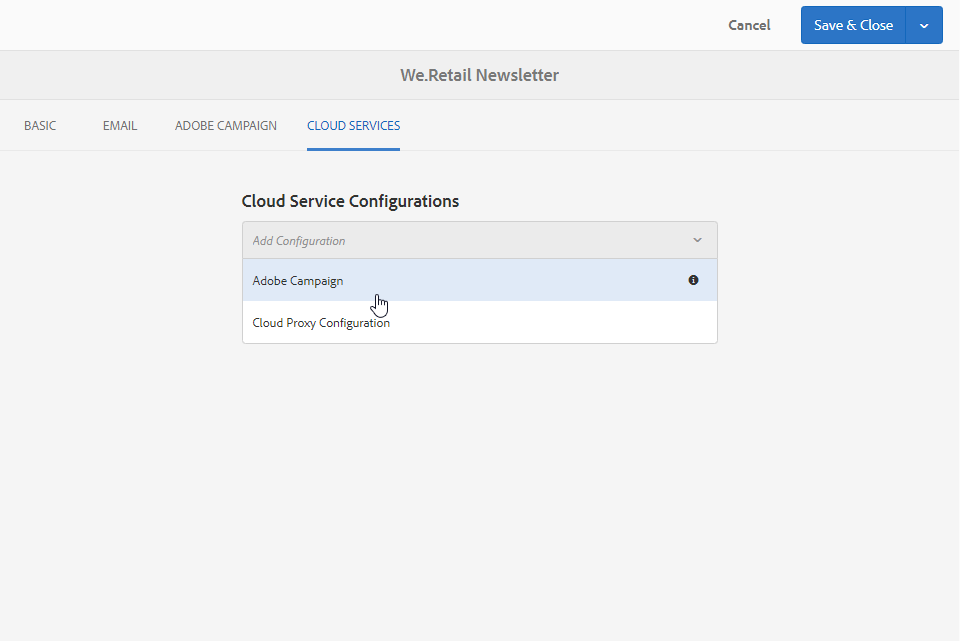
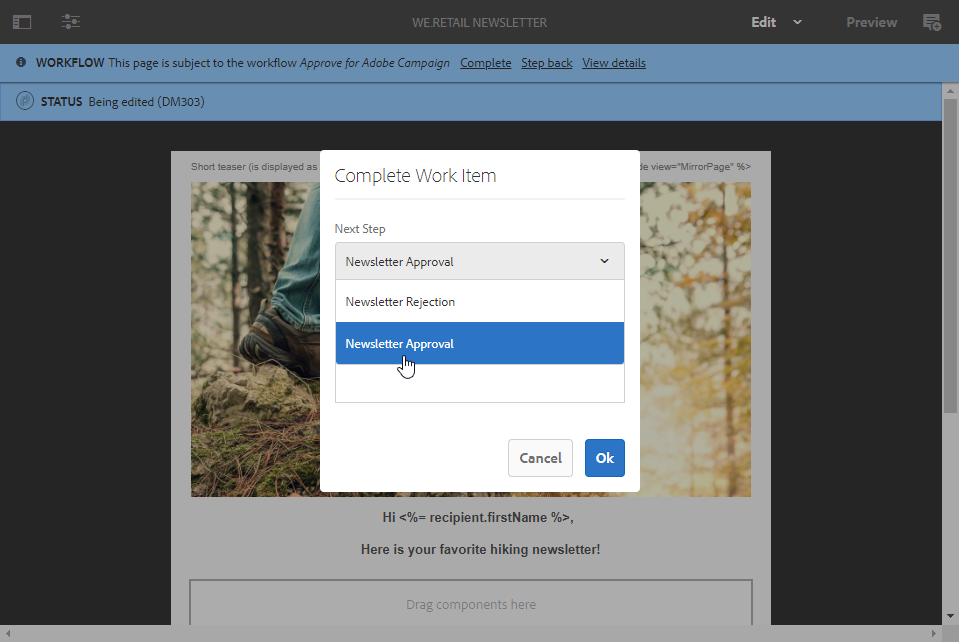
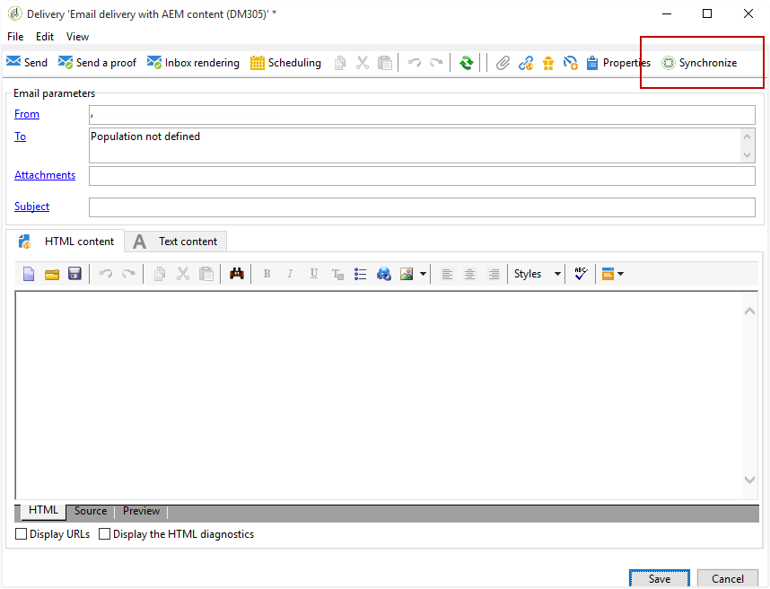

# Experience Manager 뉴스레터 만들기{#creating-an-experience-manager-newsletter}

이 통합은 예를 들어 Adobe Experience Manager에서 뉴스레터를 만든 다음 Adobe Campaign에서 이메일 캠페인의 일부로 사용할 수 있습니다.

이 통합을 사용하는 방법에 대한 자세한 예는 이 [단계별 가이드를](https://docs.campaign.adobe.com/doc/AC/getting_started/EN/aem.html)참조하십시오.

**Adobe Experience Manager에서**

1. AEM 작성자 인스턴스에서 페이지 **왼쪽** 상단에 있는 Adobe Experience 로고를 클릭하고 **[!UICONTROL Sites]**&#x200B;선택합니다.

   

1. 을 **[!UICONTROL Campaigns > Name of your brand (here We.Retail) > Master Area > Email campaigns]**&#x200B;선택합니다.
1. 페이지 오른쪽 위에 있는 **[!UICONTROL Create]** 단추를 클릭한 다음 **[!UICONTROL Page]**&#x200B;선택합니다.

   

1. 템플릿을 **[!UICONTROL Adobe Campaign Email (AC 6.1)]** 선택하고 뉴스레터의 이름을 지정합니다.
1. 페이지가 만들어지면 **[!UICONTROL Page information]** 메뉴에 액세스하고 을 클릭합니다 **[!UICONTROL Open Properties]**.

   

1. 탭에서 두 번째 드롭다운에서 **[!UICONTROL Cloud Services]** Adobe Campaign **[!UICONTROL Adobe Campaign]** **[!UICONTROL Cloud service configuration]** 인스턴스와 함께 선택합니다.

   

1. 구성 요소(예: Adobe Campaign의 개인화 필드)를 추가하여 이메일 컨텐츠를 편집합니다.
1. 이메일이 준비되면 **[!UICONTROL Page information]** 메뉴에 액세스하고 을 클릭합니다 **[!UICONTROL Start workflow]**.

   

1. 첫 번째 드롭다운에서 워크플로우 **[!UICONTROL Publish to Adobe Campaign]** 모델로 선택하고 을 클릭합니다 **[!UICONTROL Start workflow]**.

   

1. 그런 다음 이전 단계로 **[!UICONTROL Approve for Campaign]** 워크플로우를 시작합니다.
1. 고지 사항이 페이지 상단에 표시됩니다. 검토를 **[!UICONTROL Complete]** 확인하려면 을 클릭하고 을 클릭합니다 **[!UICONTROL Ok]**.

   

1. 다시 **[!UICONTROL Complete]** 클릭하고 **[!UICONTROL Newsletter approval]****[!UICONTROL Next Step]** 드롭다운에서 선택합니다.

   

이제 Adobe Campaign에서 뉴스레터를 준비하고 동기화할 수 있습니다.

**Adobe Campaign에서:**

1. 탭에서 을 **[!UICONTROL Campaigns]** 클릭한 **[!UICONTROL Deliveries]** **[!UICONTROL Create]**&#x200B;다음

   

1. 드롭다운에서 **[!UICONTROL Delivery template]** **[!UICONTROL Email delivery with AEM content (mailAEMContent)]** 템플릿을 선택합니다.

   

1. 전달에 **[!UICONTROL Label]** 을 추가하고 을 클릭합니다 **[!UICONTROL Continue]**.
1. 단추를 **[!UICONTROL Synchronize]** 클릭합니다.

   인터페이스에 이 단추가 표시되지 않으면 **[!UICONTROL Properties]** 단추를 클릭하고 **[!UICONTROL Advanced]** 탭을 선택합니다. 필드는 **[!UICONTROL Content editing mode]** 필드에서 AEM **[!UICONTROL AEM]** **[!UICONTROL AEM account]** 인스턴스와 함께 설정해야 합니다.

   

1. Adobe Experience Manager에서 이전에 만든 제공을 선택하고 을 **[!UICONTROL Ok]**&#x200B;클릭합니다.
1. AEM 전달에 일부 변경 사항이 적용되면 즉시 **[!UICONTROL Refresh content]** 단추를 클릭합니다.

   

이제 고객에게 이메일을 보낼 준비가 되었습니다.
