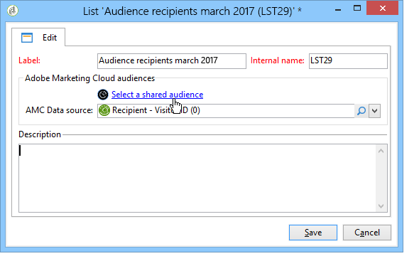

# Importing and exporting audiences{#importing-and-exporting-audiences}

## 대상자 가져오기 {#importing-an-audience}

수신자 목록을 통해 Audience Manager 또는 사람 핵심 서비스의 대상/세그먼트를 Adobe Campaign으로 가져올 수 있습니다.

1. Adobe Campaign 탐색기에서 **[!UICONTROL Profiles and Targets]** > **[!UICONTROL Lists]** 노드로 이동합니다.
1. 작업 표시줄에서 **[!UICONTROL New]** > **[!UICONTROL Create a shared audience...]**&#x200B;을 선택합니다.

   

1. 표시되는 창에서 을 클릭하여 다른 Adobe Experience Cloud 솔루션에서 사용할 수 있는 공유 대상/세그먼트 목록으로 이동합니다. **[!UICONTROL Select a shared audience]**
1. 대상을 선택하고 확인합니다. 대상의 정보는 자동으로 완료됩니다.

   공유 대상을 가져오려면 관리 콘솔에서 **[!UICONTROL Audience library]** 제품을 할당받고 Audience Manager에서 관리자가 되어야 합니다. 자세한 내용은 관리 콘솔 [설명서를](https://helpx.adobe.com/enterprise/managing/user-guide.html)참조하십시오.

   

1. 필드에서 AMC 데이터 소스를 **[!UICONTROL AMC Data source]** 선택하여 예상 데이터 유형을 정의합니다.

   

1. 고객 저장

대상은 기술 워크플로우를 통해 가져옵니다. 가져온 목록에는 AMC 데이터 소스를 사용하여 조정할 수 있는 요소가 포함되어 있습니다. Adobe Campaign에서 인식할 수 없는 요소는 가져오지 않습니다.

세그먼트를 People 코어 서비스 또는 Audience Manager에서 직접 가져오는 경우 가져오기 프로세스는 24-36시간이 걸립니다. 이 기간이 지나면 Adobe Campaign에서 새 대상을 찾아 사용할 수 있습니다.

>[!NOTE]
>
>Adobe Analytics에서 Adobe Campaign으로 대상을 가져오는 경우, 이러한 대상은 사람 코어 서비스 또는 Audience Manager에서 먼저 공유해야 합니다. 이 프로세스는 12-24시간이 소요되며, 이 프로세스는 Campaign과 24-36시간 동기화에 추가해야 합니다.
>
>이 경우 대상 공유 기간은 최대 60시간까지 될 수 있습니다. People 코어 서비스 및 Audience Manager에서 Adobe Analytics의 고객 공유에 대한 자세한 내용은 이 [문서를](https://marketing.adobe.com/resources/help/en_US/mcloud/t_publish_audience_segment.html)참조하십시오.

대상 데이터가 동기화될 때마다 완전히 교체됩니다. 세그먼트만 가져올 수 있습니다. 키-값 쌍, 트레이트 및 규칙을 포함한 세부적인 데이터는 지원되지 않습니다.

## 대상자 내보내기 {#exporting-an-audience}

워크플로우를 사용하여 Adobe Campaign에서 Audience Manager 또는 People 코어 서비스로 대상을 내보낼 수 있습니다. 워크플로우를 만들고 사용하는 프로세스는 [이 문서에서](../../workflow/using/building-a-workflow.md)자세히 설명합니다. 내보낸 대상은 사람 핵심 서비스에서 세그먼트로 저장됩니다.

1. 새 타깃팅 워크플로우를 만듭니다.
1. 사용할 수 있는 다른 활동을 사용하여 수신자 집합을 타깃팅합니다.
1. 타깃팅 후 **[!UICONTROL Update shared audience]** 활동을 드래그하여 놓은 다음 엽니다.

   

1. 옵션을 통해 내보낼 대상을 **[!UICONTROL Select a shared audience]** 정의합니다. 표시되는 창에서 기존 대상자를 선택하거나 새 대상자를 만들 수 있습니다.

   기존 대상을 선택하면 새 레코드만 대상에 추가됩니다.

   새 대상의 수신자 목록을 내보내려면 **[!UICONTROL Segment name]** 필드를 완료한 다음 새로 만든 대상자를 선택하기 **[!UICONTROL Create]** 전에 을 클릭합니다.

   창 오른쪽 상단에 있는 확인 기호를 클릭한 다음 **[!UICONTROL OK]** 단추를 클릭하여 작업을 완료합니다.

1. 예상 데이터 유형을 **[!UICONTROL AMC Data source]** 지정하려면 을 선택합니다. 스키마는 자동으로 결정됩니다.

   

1. 고객 저장

대상을 내보냅니다. 대상자 저장 활동에는 두 개의 아웃바운드 전환이 있습니다. 기본 전환에는 성공적으로 내보낸 수신자가 포함됩니다. 추가 전환에는 방문자 ID 또는 선언된 ID로 매핑할 수 없었던 수신자가 포함됩니다.

Adobe Campaign과 People 코어 서비스 간의 동기화는 24-36시간이 소요됩니다. 이 기간이 지나면 People 코어 서비스에서 신규 고객을 찾아 다른 Adobe Experience Cloud 솔루션에서 재사용할 수 있습니다. Adobe People 코어 서비스에서 Adobe Campaign 공유 대상 사용에 대한 자세한 내용은 이 [설명서를](https://marketing.adobe.com/resources/help/en_US/mcloud/t_audience_create.html)참조하십시오.

>[!NOTE]
>
>대사하려면 Adobe Experience Cloud ID(&#39;방문자 ID&#39; 또는 &#39;선언된 ID&#39;)가 있어야 합니다. 대상을 내보내고 가져올 때 Adobe Experience Cloud ID가 없는 레코드는 무시됩니다.

