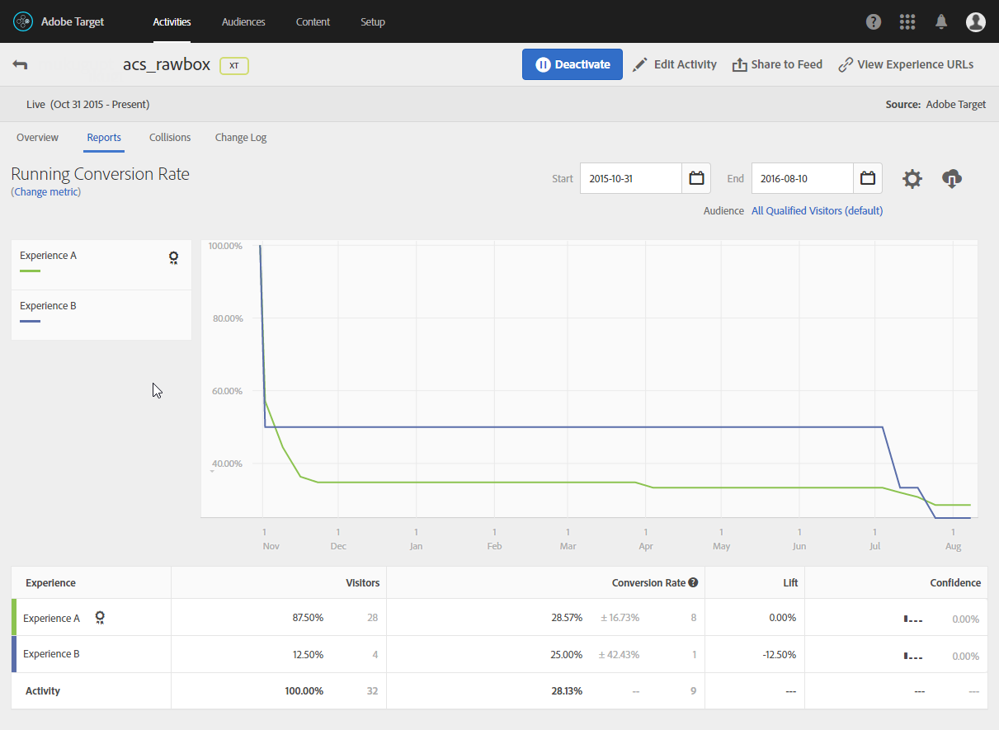

# 동적 이미지 삽입{#inserting-a-dynamic-image}

이 섹션에서는 Adobe Target의 이미지를 이메일에 통합하는 Adobe Campaign에서 수행하는 단계를 자세히 설명합니다.

Adobe Target에서 미리 다음 작업을 수행해야 합니다.

* 사용할 이미지의 URL을 지정해야 하는 하나 이상의 [리디렉션 오퍼를](https://docs.adobe.com/help/en/target/using/experiences/offers/offer-redirect.html)만듭니다.
* 하나 또는 여러 [대상을](https://marketing.adobe.com/resources/help/en_US/target/target/t_create-audience.html)만들어 활동 대상을 정의합니다.
* 양식 [기반 경험 작성기](https://docs.adobe.com/content/help/en/target/using/activities/abtest/create/test-create-ab.html) 활동을 만듭니다. 이 활동은 rawbox를 선택하고 생성된 리디렉션 오퍼의 수에 따라 여러 경험을 지정해야 합니다. 각 경험에 대해 생성된 리디렉션 오퍼 중 하나를 선택해야 합니다.

   이러한 경험을 지정하려면 Adobe Campaign의 정보를 사용하여 세그먼트를 만듭니다. 오퍼의 선택 규칙에서 Adobe Campaign의 데이터를 사용하려면 Adobe Target의 rawbox에 데이터를 지정해야 합니다.

Adobe Campaign 게시에 Adobe Target 이미지를 삽입하려면:

1. 이메일 배달 만들기
1. 사용 가능한 개인화 필드에서 을 **[!UICONTROL Include > Dynamic image served by Adobe Target]**&#x200B;선택합니다.

   

1. 표시되는 창에서 이메일에 기본적으로 표시되는 이미지를 선택합니다. 이미지 URL을 지정하거나 [공유 이미지를](../../integrations/using/sharing-assets-with-adobe-experience-cloud.md)사용할 수 있습니다.
1. Adobe Target에 지정된 rawbox의 이름을 입력합니다.
1. 기본 이미지를 기본 랜딩 페이지로 리디렉션하려면 **[!UICONTROL Landing Page]** 필드에 URL을 입력합니다. 이 URL은 기본 이미지가 최종 이메일에 표시되고 선택 사항인 경우에만 해당됩니다.
1. Adobe Target의 설정에서 Enterprise 권한을 사용하는 경우 이 필드에 해당 속성을 추가합니다. 이 [페이지에서](https://marketing.adobe.com/resources/help/en_US/target/target/properties-overview.html)Target Enterprise 권한에 대해 자세히 알아보십시오. 이 필드는 선택 사항이며 Target에서 엔터프라이즈 권한을 사용하지 않는 경우 필수가 아닙니다.
1. 에서 **[!UICONTROL Additional decision parameters]** Adobe Target 세그먼트에 정의된 필드와 Adobe Campaign 필드 간의 매핑을 지정합니다. 사용된 Adobe Campaign 필드는 rawbox에 지정되어 있어야 합니다.

   

   Adobe Target에서 매개 변수 정의는 Adobe Campaign에서 Target 이미지를 통합할 때 생성된 rawbox와 구체화 **옵션을 통해 수행됩니다** .

   

   여기에 표시된 예는 남성과 여성에 대해 서로 다른 경험을 정의하는 방법을 보여줍니다.

사용자의 이메일 도메인 및 주소를 기반으로 여러 사례를 정의할 수도 있습니다. 이메일이 열리면 사용자의 브라우저에서 데이터가 자동으로 복구됩니다.

이메일을 미리 볼 때 다른 프로필을 선택할 때 이미지가 Adobe Target 활동 및 Adobe Campaign에 지정된 매개 변수에 따라 변경되었음을 확인할 수 있습니다.

Adobe Target에서 전송 결과를 측정할 수 있습니다.

