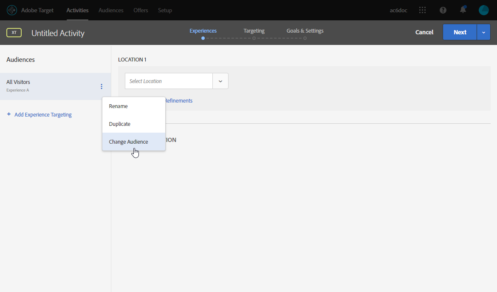

# Target 동적 컨텐츠 삽입 {#inserting-a-dynamic-image}

이 안내서에서는 Target의 동적 오퍼를 Adobe Campaign의 이메일에 통합하는 방법을 설명합니다.

받는 사람의 국가에 따라 동적으로 변경되는 이미지 블록을 포함하는 배달을 만듭니다. 데이터는 각 mbox 요청과 함께 전송되며 방문자의 IP 주소에 따라 달라집니다.

이 이메일에서 다음 사용자 경험에 따라 이미지 중 하나가 동적으로 달라지기를 원합니다.

* 이 이메일은 프랑스에서 열립니다.
* 이 이메일은 미국에서 열립니다.
* 이러한 조건이 적용되지 않으면 기본 이미지가 표시됩니다.

이를 수행하려면 Adobe Campaign과 Target에서 다음 단계를 수행해야 합니다.

1. [이메일에 동적 오퍼 삽입](../../integrations/using/inserting-a-dynamic-image.md#inserting-dynamic-offer)
1. [리디렉션 오퍼 만들기](../../integrations/using/inserting-a-dynamic-image.md#create-redirect-offers)
1. [대상자 만들기](../../integrations/using/inserting-a-dynamic-image.md#audiences-target)
1. [경험 타깃팅 활동 만들기](../../integrations/using/inserting-a-dynamic-image.md#creating-targeting-activity)
1. [이메일 미리 보기 및 보내기](../../integrations/using/inserting-a-dynamic-image.md#preview-send-email)

## 이메일에 동적 오퍼 삽입 {#inserting-dynamic-offer}

Adobe Campaign에서 이메일의 타겟 및 컨텐츠 정의가 완료되면 Target에서 동적 이미지를 삽입할 수 있습니다.

이렇게 하려면 기본 이미지의 URL, 위치 이름 및 Target으로 전송할 필드를 지정합니다.

Adobe Campaign에서는 Target의 동적 이미지를 이메일에 삽입하는 두 가지 방법이 있습니다.

* 디지털 컨텐츠 편집기를 사용하는 경우 기존 이미지를 선택하고 도구 모음에서 **[!UICONTROL Insert]** > 를 선택합니다 **[!UICONTROL Dynamic image served by Adobe Target]** .

   

* 표준 편집기를 사용하는 경우 이미지를 삽입할 위치에 커서를 놓고 개인화 드롭다운 메뉴에서 **[!UICONTROL Include]** > **[!UICONTROL Dynamic image served by Adobe Target...]** 를 선택합니다.

   

### 이미지 매개 변수 정의 {#defining-image-parameters}

* The **[!UICONTROL Default image]** s URL:조건이 충족되지 않을 때 표시되는 이미지입니다. 자산 라이브러리에서 이미지를 선택할 수도 있습니다.
* The **[!UICONTROL Target location]**:동적 오퍼 위치의 이름을 입력합니다. Target 활동에서 이 위치를 선택해야 합니다.
* The **[!UICONTROL Landing Page]**:기본 이미지를 기본 랜딩 페이지로 리디렉션하려면 이 URL은 기본 이미지가 최종 이메일에 표시되고 선택 사항인 경우에만 해당됩니다.
* The **[!UICONTROL Additional decision parameters]**:Adobe Target 세그먼트에 정의된 필드와 Adobe Campaign 필드 간의 매핑을 지정합니다. 사용된 Adobe Campaign 필드는 rawbox에 지정되어 있어야 합니다. 이 예에서는 국가 필드를 추가했습니다.

Adobe Target의 설정에서 Enterprise 권한을 사용하는 경우 이 필드에 해당 속성을 추가합니다. 이 [페이지에서](https://marketing.adobe.com/resources/help/en_US/target/target/properties-overview.html)Target Enterprise 권한에 대해 자세히 알아보십시오.

## 리디렉션 오퍼 만들기 {#create-redirect-offers}

Target에서 다른 버전의 오퍼를 만들 수 있습니다. 각 사용자 경험에 따라 리디렉션 오퍼를 만들고 표시할 이미지를 지정할 수 있습니다.

이 경우 두 개의 리디렉션 오퍼가 필요합니다. 세 번째 리디렉션 오퍼는 Adobe Campaign에 정의되어 있어야 합니다.

1. Target Standard에서 새 리디렉션 오퍼를 만들려면 **[!UICONTROL Content]** 탭에서 을 클릭합니다 **[!UICONTROL Code offers]**.

1. 을 **[!UICONTROL Create]** 클릭한 **[!UICONTROL Redirect Offer]**&#x200B;다음

   

1. 오퍼 이름과 이미지의 URL을 입력합니다.

   

1. 나머지 리디렉션 오퍼에 대해 동일한 절차를 따르십시오. 자세한 내용은 이 [페이지를](https://docs.adobe.com/help/en/target/using/experiences/offers/offer-redirect.html)참조하십시오.

## 대상자 만들기 {#audiences-target}

Target에서는 오퍼를 방문하는 사람이 전달될 서로 다른 컨텐츠를 위해 분류될 두 대상을 만들어야 합니다. 각 대상에 대해 규칙을 추가하여 오퍼를 볼 수 있는 사람을 정의합니다.

1. Target에서 새 대상을 만들려면 **[!UICONTROL Audiences]** 탭에서 을 클릭합니다 **[!UICONTROL Create Audience]**.

   

1. 대상에 이름을 추가합니다.

   

1. 카테고리를 **[!UICONTROL Add a rule]** 클릭하고 선택합니다. 규칙은 특정 기준을 사용하여 방문자를 타깃팅합니다. 조건을 추가하거나 다른 카테고리에 새 규칙을 만들어 규칙을 조정할 수 있습니다.

1. 나머지 대상에 대해 동일한 절차를 따르십시오.

## 경험 타깃팅 활동 만들기 {#creating-targeting-activity}

Target에서 경험 타깃팅 활동을 만들고, 다른 경험을 정의하고, 해당 오퍼와 연결해야 합니다.

### 대상 정의 {#defining-the-audience}

1. 경험 타깃팅 활동을 만들려면 **[!UICONTROL Activities]** 탭에서 **[!UICONTROL Create Activity]** 을 **[!UICONTROL Experience Targeting]**&#x200B;클릭합니다.

   

1. 다른 **[!UICONTROL Form]** 이름으로 **[!UICONTROL Experience Composer]**&#x200B;선택합니다.

1. 단추를 클릭하여 대상을 **[!UICONTROL Change audience]** 선택합니다.

   

1. 이전 단계에서 만든 대상을 선택합니다.

   

1. 을 클릭하여 다른 경험을 만듭니다 **[!UICONTROL Add Experience Targeting]**.

### 위치 및 컨텐츠 정의 {#defining-location-content}

각 대상에 대한 컨텐츠를 추가합니다.

1. Adobe Campaign에 동적 오퍼를 삽입할 때 선택한 위치 이름을 선택합니다.

   

1. 드롭다운 단추를 클릭하고 **[!UICONTROL Change Redirect Offer]**&#x200B;선택합니다.

   

1. 이전에 만든 리디렉션 오퍼를 선택합니다.

   

1. 두 번째 경험에 대해 동일한 단계를 수행합니다.

### 활동 정의 {#defining-activity}

창에 활동이 요약됩니다. **[!UICONTROL Target]** 필요한 경우 다른 경험을 추가할 수 있습니다.

이 **[!UICONTROL Goal & Settings]** 창에서는 우선순위, 목표 또는 기간을 설정하여 활동을 개인화할 수 있습니다.

이 **[!UICONTROL Reporting Settings]** 섹션에서는 작업을 선택하고 목표가 달성되는 시기를 결정할 매개 변수를 편집할 수 있습니다.

## Campaign Classic에서 이메일 미리 보기 및 보내기 {#preview-send-email}

이제 Adobe Campaign에서 이메일을 미리 보고 다른 수신자에 대한 렌더링을 테스트할 수 있습니다. 이미지가 만들어진 다양한 경험에 따라 변경된다는 것을 알 수 있습니다. 이메일 작성에 대한 자세한 내용은 이 [페이지를](../../delivery/using/defining-the-email-content.md)참조하십시오.

이제 Target의 동적 오퍼를 포함하여 이메일을 보낼 준비가 되었습니다.

