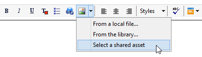

# 공유 자산 삽입{#inserting-a-shared-asset}

Adobe Experience Cloud에서 공유된 자산은 다음과 같이 이메일 및 랜딩 페이지에서 사용할 수 있습니다.

1. 새 이메일 또는 새 랜딩 페이지를 만듭니다.

   Adobe Experience Manager 자산 라이브러리의 자산을 사용하는 경우 [통합](../../integrations/using/configuring-access-to-assets.md#integrating-with-aem-assets)을 구성할 때 만든 배달 템플릿을 사용합니다.

   이 특정 템플릿이 없는 경우 배달 **속성**&#x200B;에서 **[!UICONTROL Content editing mode]**(**[!UICONTROL Advanced]** 탭)이 **DCE**&#x200B;로 설정되어 있고 AEM Assets 리소스 라이브러리에 액세스하는 데 사용할 AEM 외부 계정이 제공되는지 확인하십시오.

1. 편집 창에서 이미지를 추가할 옵션을 선택합니다.

   * [표준 편집 모드](../../delivery/using/defining-the-email-content.md#adding-images)를 사용하는 경우 **[!UICONTROL Image]** > **[!UICONTROL Select a shared asset]**&#x200B;을 선택합니다.

      

   * [고급 편집 모드](../../web/using/about-campaign-html-editor.md)(DCE)를 사용하는 경우 이미지 블록으로 이동한 다음 상황에 맞는 메뉴를 통해 **[!UICONTROL Select a shared asset]**&#x200B;를 선택합니다.

      

      >[!NOTE]
      >
      >DCE를 사용하는 경우 [웹 액세스](../../platform/using/adobe-campaign-workspace.md#console-and-web-access)에 Adobe Campaign의 공유 이미지를 삽입할 수 없습니다.

1. 열려 있는 선택 창에서 이미지를 선택한 다음 확인합니다.

   사용 가능한 이미지는 Adobe Campaign 인스턴스가 구성된 방식에 따라 Adobe Experience Cloud 라이브러리 또는 AEM Assets 라이브러리에서 가져옵니다. [자산](../../integrations/using/configuring-access-to-assets.md)에 대한 액세스 권한 구성 섹션을 참조하십시오.

   

>[!NOTE]
>
>Adobe Target와의 통합을 사용하는 경우 공유 이미지를 기본 이미지로 사용할 수 있습니다. [이 페이지](../../integrations/using/integrating-with-adobe-target.md)를 참조하십시오.

