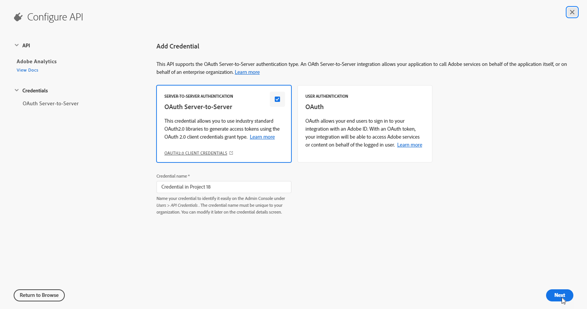

# Adobe 기술 계정 만들기 {#create-service-account}

서버 간 인증 자격 증명을 사용하면 애플리케이션 서버에서 액세스 토큰을 생성하고 애플리케이션 자체를 대신하여 API를 호출할 수 있습니다. [자세히 알아보기](https://developer.adobe.com/developer-console/docs/guides/authentication/ServerToServerAuthentication/)

## 기존 통합 마이그레이션 {#migrate-jwt}

서비스 계정(JWT) 자격 증명은 Adobe에서 더 이상 사용되지 않습니다. 이제 Adobe 솔루션 및 앱과의 Campaign 통합은 OAuth 서버 간 자격 증명을 사용해야 합니다.

2024년 6월 이전에 Campaign과 인바운드 또는 아웃바운드 통합을 구현한 경우 자세히 설명한 대로 Campaign 환경을 v7.4.1로 업그레이드하고 기술 계정을 oAuth로 마이그레이션해야 합니다 [이 설명서에서](https://developer.adobe.com/developer-console/docs/guides/authentication/ServerToServerAuthentication/migration){target="_blank"}. 기존 서비스 계정(JWT) 자격 증명은 **2025년 1월 27일**.

마이그레이션이 완료되면 의 설명에 따라 새 자격 증명을 Campaign에 연결해야 합니다. [이 섹션](#add-credentials).

## 새 통합을 위한 새 OAuth 기술 계정 만들기 {#oauth-service}

새 통합을 위해 OAuth 기술 계정을 만들려면 다음 단계를 수행합니다.

1. Adobe Developer 콘솔에 액세스하고 다음으로 로그인 **시스템 관리자** 을 참조하십시오.

   관리자 역할에 대한 자세한 내용은 다음을 참조하십시오. [페이지](https://helpx.adobe.com/enterprise/using/admin-roles.html).

1. **[!UICONTROL Create a new project]**&#x200B;를 클릭합니다.

   

1. 클릭 **[!UICONTROL Add to Project]** 및 선택 **[!UICONTROL API]**.

   

1. Campaign과 통합할 제품을 선택하고 **[!UICONTROL Next]**.

1. 선택 **[!UICONTROL OAuth Server-to-Server]** 인증 유형으로 다음을 클릭: **[!UICONTROL Next]**.

   

1. 다음 항목 선택 **[!UICONTROL Product profile]** 프로젝트에 연결합니다.

   필요한 경우 새 폴더를 만들 수 있습니다. [자세히 알아보기](https://helpx.adobe.com/enterprise/using/manage-product-profiles.html)

1. 그런 다음 을 클릭합니다. **[!UICONTROL Save Configured API]**.

   

1. 프로젝트에서 자격 증명 아래에 을(를) 선택합니다 [!DNL OAuth Server-to-Server] 다음 정보를 복사합니다.

   * **[!UICONTROL Client ID]**
   * **[!UICONTROL Client secret]**
   * **[!UICONTROL Technical account ID]**
   * **[!UICONTROL Organization ID]**

## Adobe Campaign에서 OAuth 프로젝트 자격 증명 추가 {#add-credentials}

Adobe Campaign에서 OAuth 프로젝트 자격 증명을 추가하려면 아래 단계를 따르십시오.

1. Adobe Campaign 인스턴스가 설치된 각 컨테이너에 SSH를 통해 로그인합니다.

1. 다음 명령을 실행하여 Adobe Campaign에서 OAuth 프로젝트 자격 증명을 추가합니다. `neolane` 사용자. 이렇게 하면 **[!UICONTROL Technical Account]** 인스턴스 구성 파일의 자격 증명입니다.

   ```
   nlserver config -instance:<instance_name> -setimsoauth:ims-org-id/client-id/technical-account-id/client-secret
   ```
