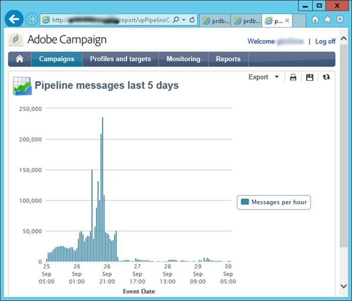

# 파이프라인 모니터링 {#pipeline-monitoring}

[!DNL pipelined] 상태 웹 서비스는 [!DNL pipelined] 프로세스의 상태에 대한 정보를 제공합니다.

브라우저를 사용하여 수동으로 또는 모니터링 애플리케이션을 통해 자동으로 액세스할 수 있습니다.

아래 설명된 REST 형식입니다.

## 지표 {#indicators}

이 섹션에는 상태 웹 서비스의 표시기가 나열됩니다.

모니터링할 권장 표시기가 강조 표시됩니다.

* 소비자:트리거를 가져오는 클라이언트의 이름입니다. 파이프라인 옵션에 구성됩니다.
* http-request
   * last-alive-ms-ago:연결 검사를 수행한 후 밀리초 단위 시간입니다.
   * last-failed-cnx-ms-ago:연결 검사가 마지막으로 실패한 이후 시간(밀리초)입니다.
   * 파이프라인 호스트:파이프라인 데이터를 가져오는 호스트의 이름입니다.
* 포인터
   * 현재 오프셋:하위 스레드당 파이프라인에 대한 포인터 값입니다.
   * last-flush-ms-ago:트리거 일괄 처리가 검색된 이후(ms) 시간입니다.
   * next-offsets-flush:작업이 완료되면 다음 배치를 기다릴 시간입니다.
   * processed-since-last-flush:마지막 배치에서 처리된 트리거 수입니다.
* 라우팅
   * 트리거:검색된 트리거 목록입니다. [!DNL pipelined] 옵션에 구성되었습니다.
* stats
   * average-pointer-flush-time-ms:하나의 트리거 일괄 처리에 대한 평균 처리 시간입니다.
   * 평균 트리거 처리 시간(ms):트리거 데이터를 구문 분석하는 데 걸린 평균 시간입니다.
   * 바이트 읽기:프로세스가 시작된 이후 큐에서 읽은 바이트 수입니다.
   * 현재 메시지:큐에서 끌어와서 처리를 기다리는 현재 대기 중인 메시지 수입니다. **이 표시기는 0에 가까워야 합니다**.
   * 현재 다시 시도:처리 실패 및 다시 시도를 기다리는 현재 메시지 수입니다.
   * 최대 메시지 수:프로세스가 시작된 이후 처리 중인 최대 대기 중인 메시지 수입니다.
   * 포인터 플러시:시작 이후 처리된 메시지 일괄 처리 수입니다.
   * routing-JS-custom:사용자 지정 JS에서 처리한 메시지 수입니다.
   * 트리거 삭제:처리 오류로 인해 너무 많은 다시 시도 후 삭제된 메시지 수입니다.
   * 트리거 처리:오류 없이 처리된 메시지 수입니다.
   * 트리거 수신:큐에서 받은 메시지 수입니다.

이러한 상태는 처리 스레드마다 표시됩니다.

* 평균 트리거 처리 시간(ms):트리거 데이터를 구문 분석하는 데 걸린 평균 시간입니다.
* is-JS-processor:값 &quot;1&quot;(이 스레드에서 사용자 지정 JS를 사용하는 경우)
* 트리거 삭제:처리 오류로 인해 너무 많은 다시 시도 후 삭제된 메시지 수입니다. **이 표시기는 0이어야 합니다**.
* 트리거 실패:js의 처리 오류 수입니다. **이 표시기는 0이어야 합니다**.
* 트리거 수신:큐에서 받은 메시지 수입니다.

* 설정:구성 파일에서 설정됩니다.
   * flush-pointer-msg-count:일괄 처리의 메시지 수입니다.
   * flush-pointer-period-ms:두 배치 사이의 시간(밀리초 단위)
   * processing-threads-JS:사용자 지정 JS를 실행하는 처리 스레드 수입니다.
   * retry-period-ms:처리 오류가 발생할 때 두 번 다시 시도 사이의 시간입니다.
   * retry-validity-duration-ms:시간 처리부터 메시지가 삭제될 때까지 시간이 재시도됩니다.
   * 파이프라인 메시지 보고서

## 파이프라인 메시지 보고서 {#pipeline-report}

이 보고서는 최근 5일 동안의 시간당 메시지 수를 표시합니다.

