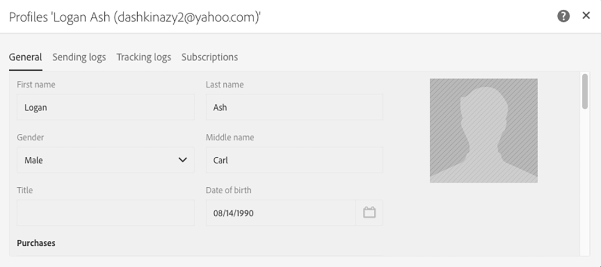

# 프로필 동기화{#synchronizing-profiles}

ACS 커넥터는 Campaign v7에서 Campaign Standard로 데이터를 복제합니다. Campaign v7에서 받은 데이터를 Campaign Standard에서 사용하여 배달을 만들 수 있습니다. 아래 나열된 작업을 수행하여 프로필이 어떻게 동기화되는지 확인할 수 있습니다.

* **새 받는 사람 추가**: Campaign v7에서 새 수신자를 만들고 해당 프로필이 Campaign Standard에 복제되었는지 확인합니다. 새 수신자 [만들기를 참조하십시오](#creating-a-new-recipient).
* **받는 사람**&#x200B;업데이트: Campaign v7에서 새 수신자를 편집하고 Campaign Standard에서 해당 프로필을 확인하여 업데이트가 복제되었는지 확인합니다. 수신자 [편집을 참조하십시오](#editing-a-recipient).
* **Campaign Standard에서 작업 흐름을 만듭니다**. Campaign v7에서 복제한 대상 또는 프로필이 있는 쿼리를 포함하는 Campaign Standard에서 워크플로우를 만듭니다. 워크플로우 [만들기를 참조하십시오](#creating-a-workflow).
* **Campaign Standard에서 배달 만들기**: 워크플로우에 따라 전달을 보냅니다. 배달 [만들기를 참조하십시오](#creating-a-delivery).
* **구독 취소 링크를 확인합니다**. Campaign v7 웹 애플리케이션을 사용하여 서비스 가입 해지를 선택한 수신자가 Campaign v7 데이터베이스로 전송되도록 합니다. 서비스 수신을 중지하는 옵션은 Campaign Standard에 복제됩니다. 구독 [취소 링크 변경을 참조하십시오](#changing-the-unsubscription-link).

## 사전 요구 사항 {#prerequisites}

다음 섹션에서는 ACS 커넥터를 통해 Campaign v7에서 수신자를 추가 및 편집한 다음 Campaign Standard 전달에서 사용하는 방법을 설명합니다. ACS 커넥터에는 다음이 필요합니다.

* Campaign v7의 수신자가 Campaign Standard에 복제되었습니다.
* Campaign v7 및 Campaign Standard 모두에서 워크플로우를 실행할 사용자 권한
* Campaign Standard에서 배달을 만들고 실행할 사용자 권한

## 구독 취소 링크 변경 {#changing-the-unsubscription-link}

수신자가 Campaign Standard가 보낸 이메일의 구독 취소 링크를 클릭하면 Campaign Standard의 해당 프로필이 업데이트됩니다. 복제된 프로필에 서비스에 대한 가입 해지를 선택할 수 있는 사용자의 선택이 포함되어 있는지 확인하려면 Campaign Standard가 아닌 Campaign v7으로 정보를 보내야 합니다. 변경 사항을 실행하기 위해 구독 취소 서비스는 Campaign Standard가 아닌 Campaign v7 웹 애플리케이션에 연결됩니다.

>[!NOTE]
>
>아래 단계를 수행하기 전에 컨설턴트에게 구독 취소 서비스에 대한 웹 응용 프로그램을 구성하도록 요청하십시오.

## Creating a new recipient {#creating-a-new-recipient}

1. Campaign Standard에 복제하기 위해 Campaign v7에서 새 수신자를 만듭니다. 받는 사람의 성, 이름, 이메일 주소, 우편 주소 등 가능한 많은 정보를 입력합니다. 그러나 다음 섹션에 추가되기 **[!UICONTROL Salutation]** 때문에 받는 사람 [편집](#editing-a-recipient). 자세한 내용은 수신자 [추가를 참조하십시오](../../platform/using/adding-profiles.md).

   

1. 새 수신자가 Campaign Standard에 추가되었는지 확인합니다. 프로필을 검토할 때 Campaign v7에 입력한 데이터를 Campaign Standard에서도 사용할 수 있도록 하십시오. Campaign Standard에서 프로필을 찾는 위치를 알려면 탐색 기본 사항 [을 참조하십시오](https://docs.adobe.com/content/help/en/campaign-standard/using/getting-started/discovering-the-interface/interface-description.html).

   

   기본적으로 ACS 커넥터에 대한 주기적 복제는 15분마다 한 번씩 수행됩니다. 자세한 내용은 [데이터 복제를 참조하십시오](../../integrations/using/acs-connector-principles-and-data-cycle.md#data-replication).

## 수신자 편집 {#editing-a-recipient}

단일 데이터 포인트를 변경하는 아래의 단계는 데이터 복제를 사용할 때 Campaign v7이 Campaign Standard의 마스터 데이터베이스가 되는 간단한 예를 제공합니다. Campaign v7에서 복제된 데이터를 수정하거나 삭제하는 것은 Campaign Standard의 해당 데이터에 동일한 영향을 줍니다.

1. 새 받는 사람 만들기 [에서 새로 만든 받는](#creating-a-new-recipient) 사람을 선택하고 받는 사람의 이름을 편집합니다. 예를 들어 수신자 **[!UICONTROL Salutation]** (예: Mr. 또는 Mrs.)에 대해 선택합니다. 자세한 내용은 프로필 [편집을 참조하십시오](../../platform/using/editing-a-profile.md).

   

1. 받는 사람의 이름이 Campaign Standard에서 업데이트되었는지 확인합니다. Campaign Standard에서 프로필을 찾는 위치를 알려면 탐색 기본 사항 [을 참조하십시오](https://docs.adobe.com/content/help/en/campaign-standard/using/getting-started/discovering-the-interface/interface-description.html).

   

   기본적으로 ACS 커넥터에 대한 주기적 복제는 15분마다 한 번씩 수행됩니다. 자세한 내용은 [데이터 복제를 참조하십시오](../../integrations/using/acs-connector-principles-and-data-cycle.md#data-replication).

## 워크플로우 만들기 {#creating-a-workflow}

Campaign v7에서 복제된 프로파일과 서비스는 디지털 마케터가 Campaign Standard에서 풍부한 데이터를 활용할 수 있습니다. 아래 지침은 Campaign Standard 워크플로우에 쿼리를 추가한 다음 복제된 데이터베이스와 함께 사용하는 방법을 보여줍니다.

Campaign Standard 워크플로우에 대한 자세한 내용 및 전체 지침은 워크플로우를 [참조하십시오](../../workflow/using/about-workflows.md).

1. Campaign Standard로 이동하고 을 클릭합니다 **[!UICONTROL Marketing Activities]**.
1. 오른쪽 위 **[!UICONTROL Create]** 를 클릭합니다.
1. **[!UICONTROL Workflow]**&#x200B;을 클릭합니다.
1. 를 **[!UICONTROL New workflow]** 클릭하고 **[!UICONTROL Next]**&#x200B;있습니다.
1. 필드에 워크플로우 이름과 필요한 경우 추가 정보를 **[!UICONTROL Label]** 입력합니다. **[!UICONTROL Next]**&#x200B;을 클릭합니다.
1. 왼쪽에서 **[!UICONTROL Targeting]** **[!UICONTROL Query]** 대상을 작업 영역으로 드래그합니다.

   

1. 활동을 두 번 **[!UICONTROL Query]** 클릭하고 복제된 데이터베이스와 함께 사용할 수 있는 매개 변수를 선택합니다. 예를 들어 다음을 수행할 수 있습니다.

   * 작업 영역 **[!UICONTROL Profiles]** 으로 드래그합니다. 필드 풀다운 메뉴를 사용하여 Campaign v7에서 복제된 프로필 **[!UICONTROL Is external resource]** 을 찾도록 선택합니다.
   * 다른 쿼리 매개 변수를 드래그하여 복제된 프로파일을 추가로 타깃팅합니다.

## 배달 만들기 {#creating-a-delivery}

>[!NOTE]
>
>배달 만들기에 대한 지침은 워크플로우 만들기로 시작한 워크플로우 [를 계속합니다](#creating-a-workflow).

디지털 마케터는 Campaign v7 웹 애플리케이션을 활용하여 서비스 가입 해지를 선택하는 수신자의 선택이 Campaign v7 데이터베이스로 전송되도록 할 수 있습니다. 수신자가 구독 취소 링크를 클릭하면 서비스 수신을 중지하는 옵션이 Campaign v7에서 Campaign Standard로 복제됩니다. 자세한 내용은 구독 취소 링크 [변경을 참조하십시오](#changing-the-unsubscription-link).

Campaign v7에서 만든 구독 취소 서비스를 사용하여 기존 워크플로우에 이메일 배달을 추가하려면 아래 절차를 따르십시오. Campaign Standard 워크플로우에 대한 자세한 내용 및 전체 지침은 이 [문서를 참조하십시오](../../workflow/using/about-workflows.md).

>[!NOTE]
>
>아래 단계를 수행하기 전에 컨설턴트에게 구독 취소 서비스에 대한 웹 응용 프로그램을 구성하도록 요청하십시오.

1. 왼쪽 **[!UICONTROL Channels]** 을 클릭합니다.
1. 작업 공간 **[!UICONTROL Email delivery]** 의 기존 워크플로우로 드래그합니다.

   

1. 활동을 두 번 **[!UICONTROL Email delivery]** 클릭하고 **[!UICONTROL Single send email]** 또는 를 선택합니다 **[!UICONTROL Recurring email]**. 옵션을 선택하고 을 클릭합니다 **[!UICONTROL Next]**.
1. 을 **[!UICONTROL Send via email]** 클릭하고 클릭합니다 **[!UICONTROL Next]**.

   

1. 필요에 따라 필드에 게재의 이름과 추가 정보를 **[!UICONTROL Label]** 입력합니다. **[!UICONTROL Next]**&#x200B;을 클릭합니다.

   

1. 받는 사람의 **[!UICONTROL Subject]** 이메일 받은 편지함에 나타날 제목을 필드에 입력합니다.
1. HTML 템플릿 **[!UICONTROL Change content]** 을 추가하려면 클릭합니다.

   

1. 서비스 가입 해지를 위한 링크가 포함된 컨텐츠를 선택하십시오. **[!UICONTROL Confirm]**&#x200B;을 클릭합니다.

   

1. 현재 구독 취소 링크는 컨설턴트가 만든 웹 응용 프로그램을 사용하는 새 링크로 대체되어야 합니다. 이메일 콘텐츠 하단에서 구독 취소 링크를 찾아 한 번 클릭합니다. 링크를 삭제하려면 휴지통 아이콘을 클릭합니다.

   

1. 동일한 컨텐츠 영역 내부를 클릭하고 **구독 취소 링크를 입력합니다**.

   

1. 커서로 텍스트를 강조 표시하고 체인 아이콘을 클릭합니다.
1. **[!UICONTROL Link to a landing page]**&#x200B;을 클릭합니다.

   

1. 폴더 아이콘을 클릭하여 랜딩 페이지를 선택합니다.

   

1. 컨설턴트가 만든 웹 애플리케이션을 선택하고 을 클릭합니다 **[!UICONTROL Confirm]**.

   

1. **[!UICONTROL Create]**&#x200B;을 클릭합니다.
1. 배달 이름을 클릭하여 워크플로우로 돌아갑니다.

   

1. 배달 **[!UICONTROL Start]** 을 보내려면 을 클릭합니다. 이메일 배달 아이콘은 배달 준비 중임을 나타내는 깜박입니다.

   

1. 채널을 두 번 **[!UICONTROL Email delivery]** 클릭하고 이메일 **[!UICONTROL Confirm]** 을 보내도록 선택합니다. 메시지 **[!UICONTROL OK]** 를 보내려면 을 클릭합니다.

   

## 구독 취소 서비스 확인 {#verifying-the-unsubscription-service}

워크플로우 [만들기](#creating-a-workflow) 및 전달 [의 지침에 따라](#creating-a-delivery) 아래 단계로 이동합니다.

1. 수신자가 이메일 배달에서 구독 취소 링크를 클릭합니다.

   

1. 수신자가 가입 취소를 확인합니다.

   

1. Campaign v7의 수신자 데이터는 사용자가 구독을 취소했음을 반영하도록 업데이트됩니다. 수신자에 대해 상자 **[!UICONTROL No longer contact (by any channel)]** 가 선택되었는지 확인합니다. Campaign v7에서 수신자를 보는 방법을 알아보려면 프로필 [편집을 참조하십시오](../../platform/using/editing-a-profile.md).

   

1. Campaign Standard로 이동하고 수신자에 대한 프로필 세부 정보를 엽니다. 옆에 확인란이 표시되는지 **[!UICONTROL No longer contact (by any channel)]**&#x200B;확인합니다. Campaign Standard에서 프로필을 찾는 위치를 알려면 탐색 기본 사항 [을 참조하십시오](https://docs.adobe.com/content/help/en/campaign-standard/using/getting-started/discovering-the-interface/interface-description.html).

   

