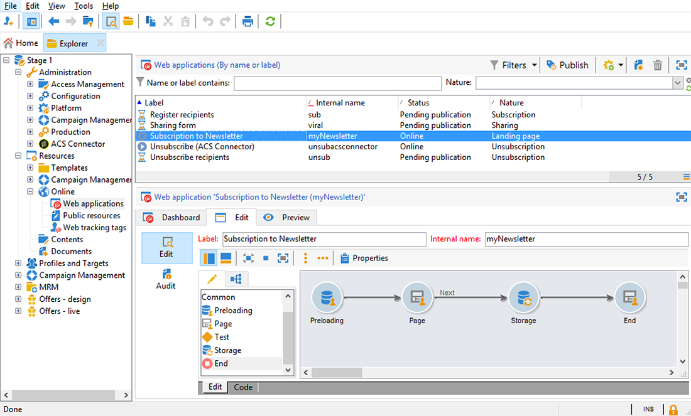
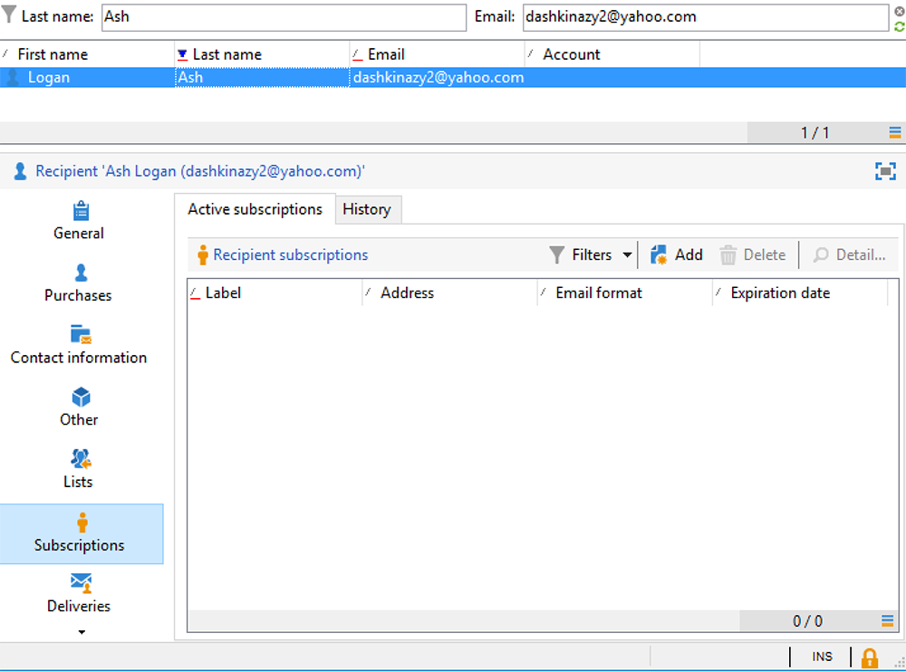
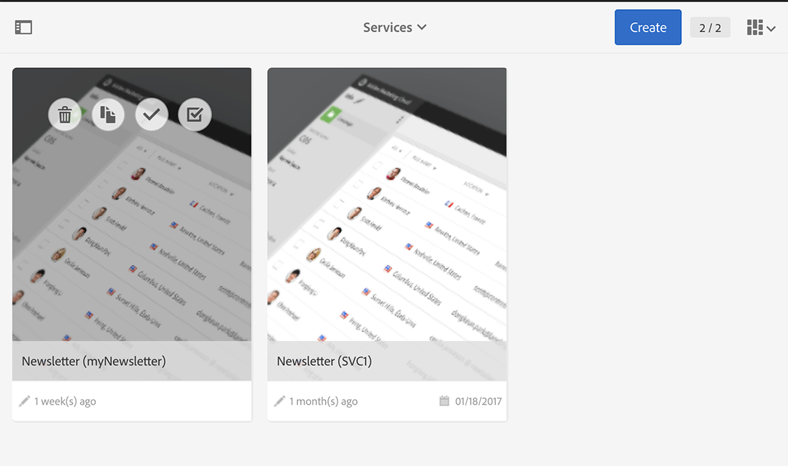
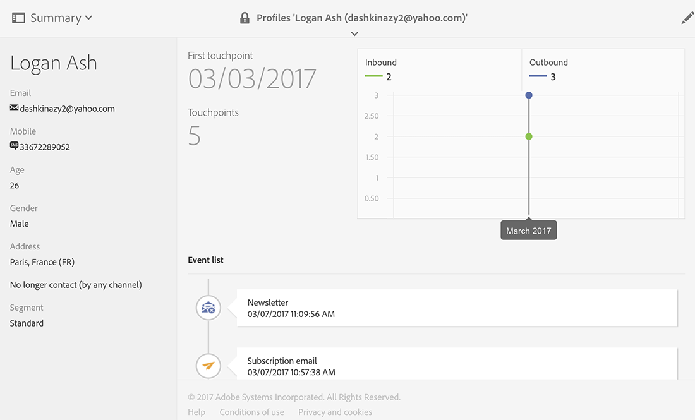

# 웹 애플리케이션 동기화{#synchronizing-web-applications}

이 경우 Campaign Standard을 사용하여 Campaign v7 웹 애플리케이션에 대한 링크가 포함된 통신을 보냅니다. 수신자가 이메일의 링크를 클릭하면 웹 응용 프로그램에 수신자의 데이터가 미리 로드되는 필드 및 뉴스레터에 대한 구독 링크가 포함된 양식이 표시됩니다. 수신자는 데이터를 업데이트하고 서비스를 구독할 수 있습니다. 이 프로필은 Campaign v7에서 업데이트되며 정보는 Campaign Standard에서 복제됩니다.

Campaign v7에 많은 서비스 및 웹 애플리케이션이 있는 경우 Campaign Standard에서 모두 다시 만들지 않도록 선택할 수 있습니다. ACS 커넥터를 사용하면 모든 기존 Campaign v7 웹 애플리케이션 및 서비스를 사용하고 이를 Campaign Standard이 보낸 게재에 연결할 수 있습니다.

## 사전 요구 사항 {#prerequisites}

이를 실현하려면 다음을 수행해야 합니다.

* 수신자는 Campaign v7 데이터베이스에 저장되고 Campaign Standard과 동기화됩니다. 프로필 동기화 [섹션을](../../integrations/using/synchronizing-profiles.md) 참조하십시오.
* Campaign v7에서 만들고 게시한 서비스 및 웹 애플리케이션입니다.
* 웹 응용 프로그램에는 식별 방법을 사용하는 **[!UICONTROL Pre-loading]** 활동이 **[!UICONTROL Adobe Campaign encryption]** 포함되어야 합니다.

## 웹 응용 프로그램 및 서비스 만들기 {#creating-the-web-application-and-service}

Campaign v7에서 수신자가 서비스에 가입하도록 허용하는 웹 애플리케이션을 만들 수 있습니다. 웹 응용 프로그램 및 서비스는 Campaign v7에서 설계 및 저장되며 Campaign Standard 통신을 통해 이 서비스를 업데이트할 수 있습니다. Campaign v7의 웹 애플리케이션에 대한 자세한 내용은 [이 섹션을 참조하십시오](../../web/using/adding-fields-to-a-web-form.md#subscription-checkboxes).

Campaign v7에서 다음 개체가 만들어졌습니다.

* 뉴스레터 서비스
* 활동, **[!UICONTROL Pre-loading]**&#x200B;활동 **[!UICONTROL Page]** 및 활동이 포함된 웹 **[!UICONTROL Storage]** 응용 프로그램.

1. 기존 웹 응용 프로그램 **[!UICONTROL Resources > Online > Web applications]** 으로 이동하여 선택합니다.

   

1. 활동을 **[!UICONTROL Preloading]** 편집합니다. 이 **[!UICONTROL Auto-load data referenced in the form]** 상자를 선택하면 **[!UICONTROL Adobe Campaign encryption]** 식별 방법이 선택됩니다. 이렇게 하면 웹 응용 프로그램이 Adobe Campaign 데이터베이스에 저장된 데이터로 양식 필드를 미리 로드할 수 있습니다. 이 문서 [를 참조하십시오](../../web/using/publishing-a-web-form.md#pre-loading-the-form-data).

   

1. 를 **[!UICONTROL Page]**&#x200B;편집합니다. 수신자가 뉴스레터(서비스)에 가입하도록 초대하는 확인란뿐만 아니라 이름, 이메일 및 전화 필드 세 개가&#x200B;**[!UICONTROL Newsletter]** 포함되어 있습니다.

   

1. 서비스 **[!UICONTROL Profiles and Target > Services and subscriptions]** 를 **[!UICONTROL Newsletter]** 엽니다. Campaign Standard 통신에서 업데이트되는 서비스입니다. 받는 사람이 이 서비스를 아직 구독하지 않은 것을 확인할 수 있습니다.

   

1. 수신자로 이동 **[!UICONTROL Profiles and Targets > Recipient]** 및 선택합니다. 그가 아직 그 서비스에 가입하지 않은 것을 볼 수 있다.

   

## 데이터 복제 {#replicating-the-data}

Campaign v7과 Campaign Standard 간에 필요한 데이터를 복제하기 위해 여러 복제 워크플로우 템플릿을 사용할 수 있습니다. 이 **[!UICONTROL Profiles replication]** 워크플로우는 모든 Campaign v7 수신자를 Campaign Standard에 자동으로 복제합니다. 기술 [및 복제 워크플로우를 참조하십시오](../../integrations/using/acs-connector-principles-and-data-cycle.md#technical-and-replication-workflows). 이 **[!UICONTROL Landing pages replication]** 워크플로우는 Campaign Standard에서 사용할 웹 애플리케이션을 복제할 수 있도록 합니다.

데이터가 올바르게 복제되었는지 확인하려면 Campaign Standard에서 다음 단계를 수행하십시오.

1. 홈 화면에서 을 클릭합니다 **[!UICONTROL Customer profiles]**.

   

1. 캠페인 v7 수신자를 검색하고 해당 수신자가 Campaign Standard에 표시되는지 확인합니다.

   

1. 상단 막대에서 을 클릭하고 Campaign v7 웹 응용 프로그램 **[!UICONTROL Marketing activities]**&#x200B;을 검색합니다. Campaign Standard에 랜딩 페이지로 표시됩니다.

   

1. 왼쪽 상단 모서리에서 **[!UICONTROL Adobe Campaign]** 로고를 클릭한 다음 프로필 및 대상 **> 서비스를** 선택하고 Newsletter 서비스도 있는지 확인합니다.

   

## 이메일 디자인 및 보내기 {#designing-and-sending-the-email}

이 부분에서는 Campaign Standard 이메일에 Campaign v7 웹 애플리케이션에서 복제된 랜딩 페이지에 대한 링크를 포함하는 방법을 알아봅니다.

이메일을 만들고 디자인하고 보내는 단계는 클래식 이메일과 동일합니다. 자세한 내용은 [Adobe Campaign Standard](https://helpx.adobe.com/support/campaign/standard.html) 설명서를 참조하십시오.

1. 새 이메일을 만들고 대상이 되는 복제된 프로필을 하나 이상 선택합니다.
1. 컨텐츠를 편집하고 내용을 삽입하십시오 **[!UICONTROL Link to a landing page]**.

   

1. Campaign v7 웹 애플리케이션에서 복제된 랜딩 페이지를 선택합니다.

   

1. 이메일 준비, 증거 자료 전송, 최종 이메일 전송
1. 받는 사람 중 한 명이 이메일을 열고 뉴스레터 가입에 대한 링크를 클릭합니다.

   

1. 그는 전화 번호를 추가하고 뉴스레터 구독 상자를 확인합니다.

   

## 업데이트된 정보 검색 {#retrieving-the-updated-information}

받는 사람이 웹 응용 프로그램을 통해 자신의 데이터를 업데이트할 때 Adobe Campaign v7은 업데이트된 정보를 동기적으로 검색합니다. 그런 다음 Campaign v7에서 Campaign Standard으로 복제됩니다.

1. Campaign v7에서 서비스 **[!UICONTROL Profiles and Target > Services and subscriptions]** 로 이동하여 **[!UICONTROL Newsletter]** 엽니다. 이제 수신자가 가입자 목록에 나타납니다.

   

1. 수신자로 이동 **[!UICONTROL Profiles and Targets > Recipient]** 및 선택합니다. 이제 전화 번호가 저장되었음을 알 수 있습니다.

   

1. 또한 **[!UICONTROL Subscriptions]** 탭에서 뉴스레터 서비스에 가입했음을 확인할 수 있습니다.

   

1. 프로필 복제 워크플로가 실행될 때까지 몇 분 정도 기다립니다.
1. Campaign Standard에서 수신자 프로필에 액세스하여 업데이트된 데이터가 Campaign v7에서 올바르게 복제되었는지 확인합니다.

   

1. 프로필을 편집합니다. 전화 번호가 업데이트되었다는 것을 알 수 있습니다.

   

1. Click on the **[!UICONTROL Subscriptions]** tab. 이제 뉴스레터 서비스가 나타납니다.

   

