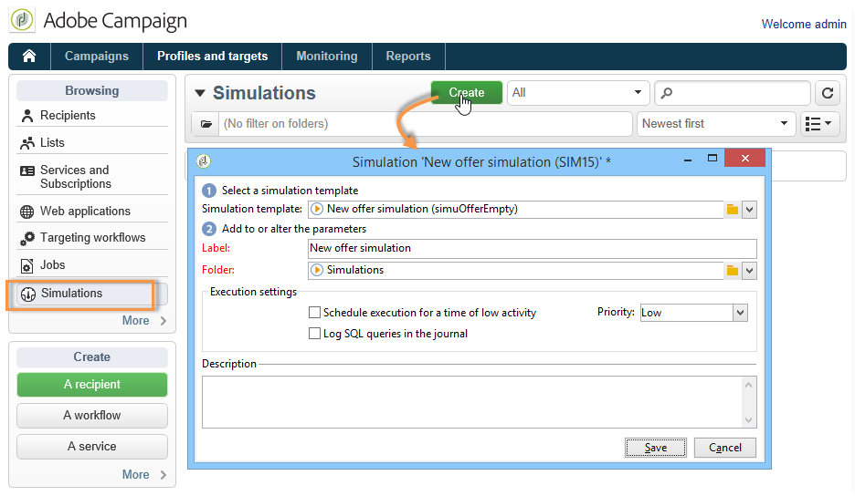
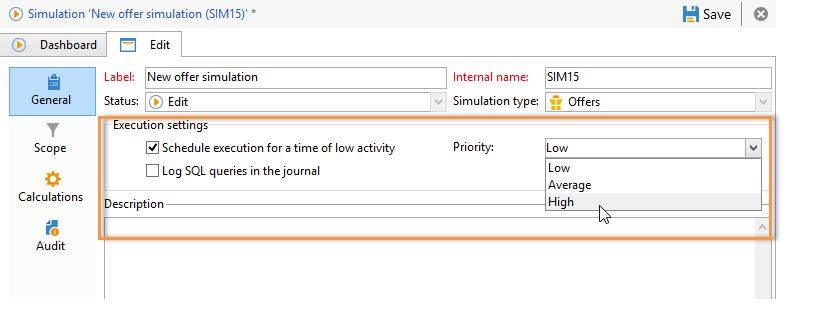

# 오퍼 시뮬레이션 정보{#about-offers-simulation}

시뮬레이션 **모듈을** 사용하면 제안을 수신자에게 보내기 전에 카테고리 또는 환경에 속하는 오퍼의 배포를 테스트할 수 있습니다.

시뮬레이션은 이전에 오퍼에 적용된 컨텍스트 및 자격 조건 규칙(오퍼 [카탈로그 개요](../../interaction/using/offer-catalog-overview.md)참조)과 프레젠테이션 규칙을 고려합니다(오퍼 프레젠테이션 [관리](../../interaction/using/managing-offer-presentation.md)참조). 따라서 시뮬레이션은 타깃팅된 수신자에게 영향을 주지 않으므로 오퍼를 실제로 사용하거나 대상을 오버하거나 요청하지 않고도 다양한 버전의 제안 제안을 테스트 및 조정할 수 있습니다.

오퍼를 시뮬레이션하는 방법에 대해 알아보려면 아래 단계를 참조하십시오. 이 [비디오를](https://helpx.adobe.com/campaign/classic/how-to/simulate-offer-in-acv6.html?playlist=/ccx/v1/collection/product/campaign/classic/segment/digital-marketers/explevel/intermediate/applaunch/introduction/collection.ccx.js&ref=helpx.adobe.com)볼 수도 있습니다.

## 시뮬레이션을 만들기 위한 기본 단계 {#main-steps-for-creating-a-simulation}

오퍼의 시뮬레이션을 실행하려면 다음 단계를 적용합니다.

1. 우주에서 **[!UICONTROL Profiles and Targets]** 링크를 클릭한 다음 **[!UICONTROL Simulations]** **[!UICONTROL Create]** 단추를 클릭합니다.

   

1. 방금 만든 시뮬레이션을 저장하고 편집합니다.
1. 탭으로 이동하여 실행 설정을 지정합니다 **[!UICONTROL Edit]** .

   자세한 내용은 실행 [설정을](../../interaction/using/execution-settings.md)참조하십시오.

   

   >[!NOTE]
   >
   >실행 설정은 캠페인과 상호 작용을 사용하는 경우에만 사용할 수 있습니다.

1. 시뮬레이션 범위를 지정합니다.

   자세한 내용은 [범위](../../interaction/using/simulation-scope.md#definition-of-the-scope)정의를 참조하십시오.

   

1. 보고 축을 추가하여 보고서를 향상시킵니다(선택 사항). **[!UICONTROL Offer distribution by rank]**

   자세한 내용은 보고 축 [추가를 참조하십시오](../../interaction/using/simulation-scope.md#adding-reporting-axes).

   

1. 을 **[!UICONTROL Save]** 클릭하여 시뮬레이션 설정을 기록합니다.
1. 대시보드를 통해 시뮬레이션을 시작합니다.

   

1. 시뮬레이션 결과를 확인하고 분석 보고서를 표시합니다.

   자세한 내용은 시뮬레이션 추적을 [참조하십시오](../../interaction/using/simulation-tracking.md).

   
