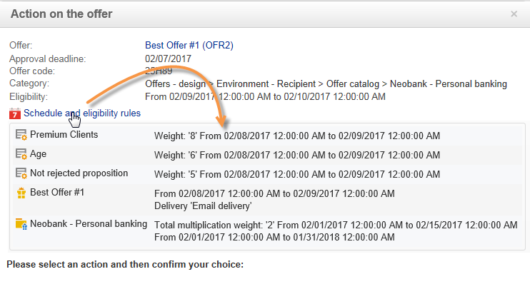
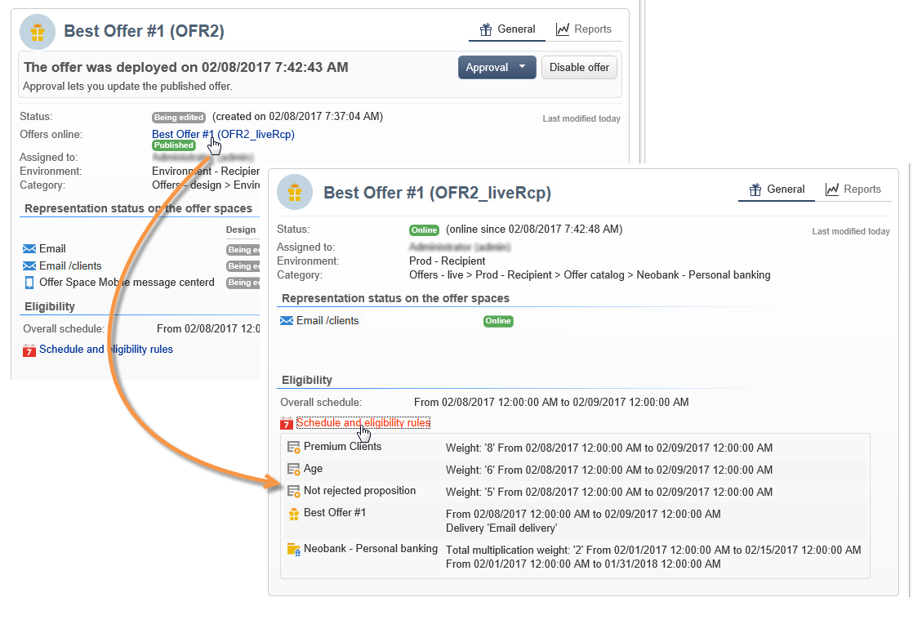

# 오퍼 승인 및 활성화{#approving-and-activating-an-offer}

오퍼 컨텐츠가 완료되면 승인해야 라이브 환경에 복제되어 전달됩니다. 승인은 오퍼 컨텐츠와 해당 자격 조건에 대한 것입니다.

오퍼 대시보드의 배너는 오퍼가 승인 주기를 거쳐야 하는지 여부를 알려줍니다.

## 오퍼 컨텐츠 승인 {#approving-offer-content}

오퍼 컨텐츠를 승인한다는 것은 라이브 환경에서 사용할 표현을 선택하는 것을 의미합니다.

오퍼의 컨텐츠에는 공간당 하나의 표현이 있습니다. 각 오퍼 공간에 자체 구조와 자체 렌더링 기능이 있으므로 오퍼 표현이 달라질 수 있습니다.

사용 가능한 특정 공간에 대한 오퍼 컨텐츠를 승인하도록 선택하고 다른 스페이스에 대해 거부할 수 있습니다.

>[!CAUTION]
>
>오퍼의 컨텐츠와 자격 조건이 승인되면 게시 워크플로우(오퍼 알림)가 자동으로 실행되고 모든 활성화된 공간에서 오퍼를 실시간으로 사용할 수 있습니다.

오퍼 컨텐츠를 승인하려면 다음 단계를 적용합니다.

1. 단추를 **[!UICONTROL Approval]** 클릭하고 팝업으로 **[!UICONTROL Approve content]** 선택합니다.

   

1. 드롭다운 목록을 사용하여 계속 편집할 표현을 선택하거나 라이브 환경에 게시할 표현을 선택한 다음 을 **[!UICONTROL Content approval]**&#x200B;클릭합니다.

   

   오퍼 컨텐츠가 승인되면 오퍼 대시보드 테이블에서 정보가 업데이트됩니다.

   

   >[!NOTE]
   >
   >언급이라고 해서 모든 오퍼 표현이 활성화되고 승인되었다는 것은 **[!UICONTROL Content approved]** 아닙니다. 모든 오퍼가 활성화/승인되었는지 여부와 상관없이 컨텐츠 승인 프로세스가 달성되었음을 나타냅니다.

## 오퍼 자격 승인 {#approving-offer-eligibility}

오퍼 자격 승인은 오퍼 가중치와 제안에도 구성되거나 상위 카테고리에서 생성된 규칙에서 상속된 자격 조건 규칙을 수락하거나 거부하는 것을 의미합니다.

>[!CAUTION]
>
>오퍼의 컨텐츠와 자격 조건이 승인되면 게시 워크플로우(오퍼 알림)가 자동으로 실행되고 모든 활성화된 공간에서 오퍼를 실시간으로 사용할 수 있습니다.

* 전체 규칙 목록은 클릭하여 볼 수 **[!UICONTROL Schedule and eligibility rules]**&#x200B;있습니다.

   

* 자격 조건 규칙을 변경하려면 을 **[!UICONTROL Reject]**&#x200B;클릭한 다음 을 클릭합니다 **[!UICONTROL Eligibility approval]**.

   

   다양한 상태가 오퍼 대시보드에서 업데이트됩니다.

   

* 오퍼 자격 조건을 수락하려면 을 클릭합니다 **[!UICONTROL Approve eligibility]**.

   

   자격 조건을 승인하고 필요한 경우 주석을 추가한 다음 을 **[!UICONTROL Eligibility approval]**&#x200B;클릭합니다.

   

   다양한 상태가 오퍼 대시보드에서 업데이트됩니다.

   

## 승인 추적 {#approval-tracking}

승인 추적은 오퍼 대시보드에서 사용할 수 있습니다. 클릭하여 **[!UICONTROL Hide/display logs]** 액세스합니다.

>[!NOTE]
>
>또한 검토자의 주석에 대한 세부 정보와 함께 오퍼의 **[!UICONTROL Audit]** 탭에서도 추적을 사용할 수 있습니다.

## 승인 다시 시작 {#restart-the-approval}

승인이 실행되면 다시 시작할 수 있습니다. 이렇게 하려면 다음 지침을 따르십시오.

1. 오퍼 **[!UICONTROL Content approved]** 대시보드를 클릭합니다.
1. 표시되는 **[!UICONTROL Edit]** 창에서 다시 시작할 승인을 선택한 다음 을 클릭합니다 **[!UICONTROL Re-initialize approval to submit it again]**.
1. 을 클릭하여 **[!UICONTROL Ok]**&#x200B;확인합니다.

## 오퍼 게시 {#publishing-the-offer}

오퍼의 컨텐츠와 자격 조건이 모두 승인되면 승인 주기가 완료된 각 오퍼에 대해 자동으로 실행되는 워크플로우에 의해 오퍼가 게시됩니다. 또한 **[!UICONTROL Offer notification]** 워크플로우는 필요한 경우 오퍼 카탈로그에 포함된 공백과 카테고리를 디자인 환경에서 라이브 환경으로 동기화하기 위해 매시간마다 실행됩니다.

디자인 환경에서 사용할 수 있는 오퍼의 대시보드에는 라이브 환경에서 일치하는 오퍼의 이름을 포함하여 게시와 관련된 정보가 포함됩니다.

라이브 환경에서 사용할 수 있는 오퍼를 표시하려면 오퍼 레이블을 클릭합니다.라이브 오퍼에는 모든 관련 정보가 포함된 대시보드가 있습니다.

## 오퍼 비활성화 {#disabling-an-offer}

오퍼가 승인되면 비활성화할 수 있습니다.

이렇게 하려면 대시보드에서 온라인 오퍼 또는 온라인 이동을 기다리는 오퍼를 선택한 다음 을 클릭합니다 **[!UICONTROL Disable offer]**.

탭으로 이동하여 **[!UICONTROL Eligibility]** **[!UICONTROL Enabled]** 상자를 선택하여 범주를 직접 비활성화할 수도 있습니다.

>[!NOTE]
>
>디자인 환경에서 오퍼가 삭제되면 연결된 온라인 환경에서 자동으로 비활성화됩니다. 제안 보존 기간이 지나면 비활성화된 오퍼가 온라인 환경에서 삭제됩니다.

