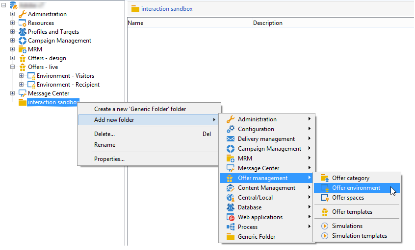
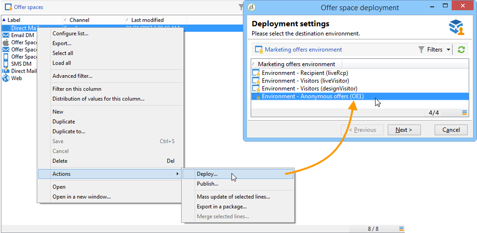

# 테스트 환경 만들기{#creating-a-test-environment}

테스트 환경(샌드박스 모드)을 만들려면 다음 단계를 적용합니다.

>[!IMPORTANT]
>
>테스트 환경에 대해서만 이 환경 만들기 방법을 사용하십시오. 다른 모든 경우에는 대상 매핑 마법사를 사용합니다. 자세한 내용은 오퍼 환경 [만들기를 참조하십시오](../../interaction/using/live-design-environments.md#creating-an-offer-environment).

1. Adobe Campaign 탐색기를 실행하고 인스턴스 루트로 이동합니다.
1. 마우스 오른쪽 버튼을 클릭하고 드롭다운 메뉴를 **[!UICONTROL Generic folder]** 사용하여 추가합니다.

   

1. 그런 다음 방금 만든 폴더로 이동하여 마우스 오른쪽 단추 클릭 메뉴를 **[!UICONTROL Offer environment]** 사용하여 메뉴를 추가합니다.

   

1. 동일한 프로세스를 적용하여 환경 하위 폴더 및 요소를 만듭니다.
1. 테스트가 완료되고 프로덕션 환경에서 환경을 사용하려는 경우 디자인 환경에서 오퍼와 공간을 복제합니다. (마우스 오른쪽 단추를 클릭하여 > **[!UICONTROL Actions]** > **[!UICONTROL Deploy]** ).

   

