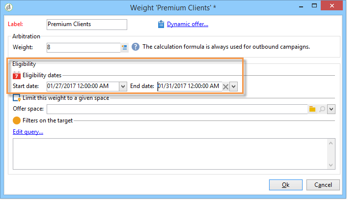

# 오퍼 만들기{#creating-an-offer}

## 오퍼 만들기 {#creating-the-offer}

오퍼를 만들려면 다음 단계를 적용합니다.

1. 우주로 **[!UICONTROL Campaigns]** 이동하고 **[!UICONTROL Offers]** 링크를 클릭합니다.

   

1. 단추를 **[!UICONTROL Create]** 클릭합니다.

   

1. 레이블을 변경하고 오퍼가 속할 범주를 선택합니다.

   

1. 을 **[!UICONTROL Save]** 클릭하여 오퍼를 만듭니다.

   

   오퍼는 플랫폼에서 사용할 수 있으며 해당 컨텐츠를 구성할 수 있습니다.

   

## 오퍼 자격 구성 {#configuring-offer-eligibility}

이 **[!UICONTROL Eligibility]** 탭에서 오퍼가 유효하고 표시할 수 있는 기간, 대상에 적용할 필터 및 오퍼 가중치를 정의합니다.

### 오퍼 자격 기간 정의 {#defining-the-eligibility-period-of-an-offer}

오퍼의 자격 기간을 정의하려면 드롭다운 목록을 사용하고 달력에서 시작 및 종료 날짜를 선택합니다.


이러한 날짜 외에는 상호 작용 엔진에서 오퍼를 선택하지 않습니다. 오퍼 카테고리에 대한 자격 날짜도 구성한 경우 가장 제한적인 기간이 적용됩니다.

### 타겟의 필터 {#filters-on-the-target}

필터를 오퍼 대상에 적용할 수 있습니다.

이렇게 하려면 **[!UICONTROL Edit query]** 링크를 클릭하고 적용할 필터를 선택합니다. ( [이 섹션](../../platform/using/steps-to-create-a-query.md#step-4---filter-data)참조).


미리 정의된 필터가 이미 만들어진 경우 사용자 필터 목록에서 선택할 수 있습니다. 자세한 내용은 사전 정의된 필터 [만들기를 참조하십시오](../../interaction/using/creating-predefined-filters.md).


### 오퍼 중량 {#offer-weight}

엔진이 대상이 자격이 있는 여러 오퍼 중에서 결정할 수 있도록 하려면 오퍼에 가중치를 하나 이상 할당해야 합니다. 필요한 경우 대상에 필터를 적용하거나 가중치가 적용되는 오퍼 공간을 제한할 수도 있습니다. 더 많은 무게의 오퍼는 적은 무게의 제안보다 선호될 것이다.

같은 오퍼에 대해 여러 가중치를 구성할 수 있습니다. 예를 들어, 가입 기간, 특정 타겟 또는 오퍼 공간을 구분할 수 있습니다.

예를 들어, 오퍼는 18세에서 25세 사이의 연락처의 경우 A의 중량을 가질 수 있고, 해당 범위 이상의 연락처의 경우 B의 중량을 가질 수 있습니다. 만약 이 제안이 여름 내내 유효하다면, 그것은 또한 7월에 A의 중량과 8월에 B의 중량을 가질 수 있습니다.

>[!NOTE]
>
>할당된 가중치는 오퍼가 속한 카테고리의 매개 변수에 따라 일시적으로 수정할 수 있습니다. 자세한 내용은 오퍼 [카테고리](../../interaction/using/creating-offer-categories.md)만들기를 참조하십시오.

오퍼에서 가중치를 만들려면 다음 단계를 적용합니다.

1. 클릭 **[!UICONTROL Add]**.

   

1. 레이블을 변경하고 가중치를 지정합니다. 기본적으로 1입니다.

   

   >[!CAUTION]
   >
   >가중치를 입력하지 않은 경우(0) 타겟은 오퍼에 적합한 것으로 간주되지 않습니다.

1. 주어진 기간에 가중치를 적용하려면 자격 일자를 정의합니다.

   

1. 필요한 경우 중량을 특정 오퍼 공간으로 제한합니다.

   

1. 대상에 필터를 적용합니다.

   

1. 을 **[!UICONTROL OK]** 클릭하여 두께를 저장합니다.

   

   >[!NOTE]
   >
   >선택한 오퍼에 대해 대상이 여러 가중치에 적합한 경우 엔진은 최고(최고) 가중치를 유지합니다. 오퍼 엔진을 호출할 때 오퍼는 연락처당 최대 한 번 선택됩니다.

### 오퍼 자격 규칙 요약 {#a-summary-of-offer-eligibility-rules}

구성이 완료되면 자격 조건 규칙 요약을 오퍼 대시보드에서 사용할 수 있습니다.

보려면 해당 **[!UICONTROL Schedule and eligibility rules]** 링크를 클릭합니다.


## 오퍼 컨텐츠 만들기 {#creating-the-offer-content}

1. 탭을 **[!UICONTROL Edit]** 클릭한 다음 **[!UICONTROL Content]** 탭을 클릭합니다.

   

1. 오퍼 컨텐츠의 다양한 필드를 완료합니다.

   * **[!UICONTROL Title]** :오퍼에 표시할 제목을 지정합니다. 경고:이것은 **[!UICONTROL General]** 탭에 정의된 오퍼 레이블을 참조하지 않습니다.
   * **[!UICONTROL Destination URL]** :오퍼의 URL을 지정합니다. 올바르게 처리하려면 &quot;http://&quot; 또는 &quot;https://&quot;로 시작해야 합니다.
   * **[!UICONTROL Image URL]** :오퍼 이미지에 대한 URL 또는 액세스 경로를 지정합니다.
   * **[!UICONTROL HTML content]** / **[!UICONTROL Text content]** :원하는 탭에 오퍼 본문을 입력합니다. 추적을 생성하려면 **[!UICONTROL HTML content]** `<div>` 유형 요소로 묶을 수 있는 HTML 요소로 구성해야 합니다. 예를 들어 HTML 페이지에서 `<table>` 요소의 결과는 다음과 같습니다.

   ```
      <div> 
       <table>
        <tr>
         <th>Month</th>
         <th>Savings</th>   
        </tr>   
        <tr>    
         <td>January</td>
         <td>$100</td>   
        </tr> 
       </table> 
      </div>
   ```

   수락 URL은 제안이 수락될 [](../../interaction/using/creating-offer-spaces.md#configuring-the-status-when-the-proposition-is-accepted) 때 상태 구성 섹션에 표시됩니다.

   

   오퍼 공간 구성 중에 정의된 대로 필수 필드를 찾으려면 **[!UICONTROL Content definitions]** 링크를 클릭하여 목록을 표시합니다. 자세한 내용은 오퍼 공간 [만들기를 참조하십시오](../../interaction/using/creating-offer-spaces.md).

   

   이 예에서 오퍼에는 제목, 이미지, HTML 컨텐츠 및 대상 URL이 포함되어야 합니다.

## 오퍼 미리 보기 {#previewing-the-offer}

오퍼 컨텐츠가 구성되면 오퍼가 수신자에게 표시되는 대로 미리 볼 수 있습니다. 이렇게 하려면:

1. 탭을 **[!UICONTROL Preview]** 클릭합니다.

   

1. 보려는 오퍼의 표현을 선택합니다.

   

1. 오퍼 컨텐츠를 개인화한 경우, 개인화를 볼 오퍼 대상을 선택합니다.

   

## 오퍼에 가설 만들기 {#creating-a-hypothesis-on-an-offer}

오퍼 제안서에 대한 가설을 만들 수 있습니다. 따라서 해당 제품에 대해 수행된 구매에 대한 오퍼의 영향을 결정할 수 있습니다.

>[!NOTE]
>
>이러한 가설은 응답 관리자를 통해 수행됩니다. 사용권 계약을 확인하십시오.

제안 제안에 대해 수행된 가설이 해당 **[!UICONTROL Measure]** 탭에서 참조됩니다.

가설을 만드는 방법은 [이 페이지에](../../campaign/using/about-response-manager.md)자세히 설명되어 있습니다.


