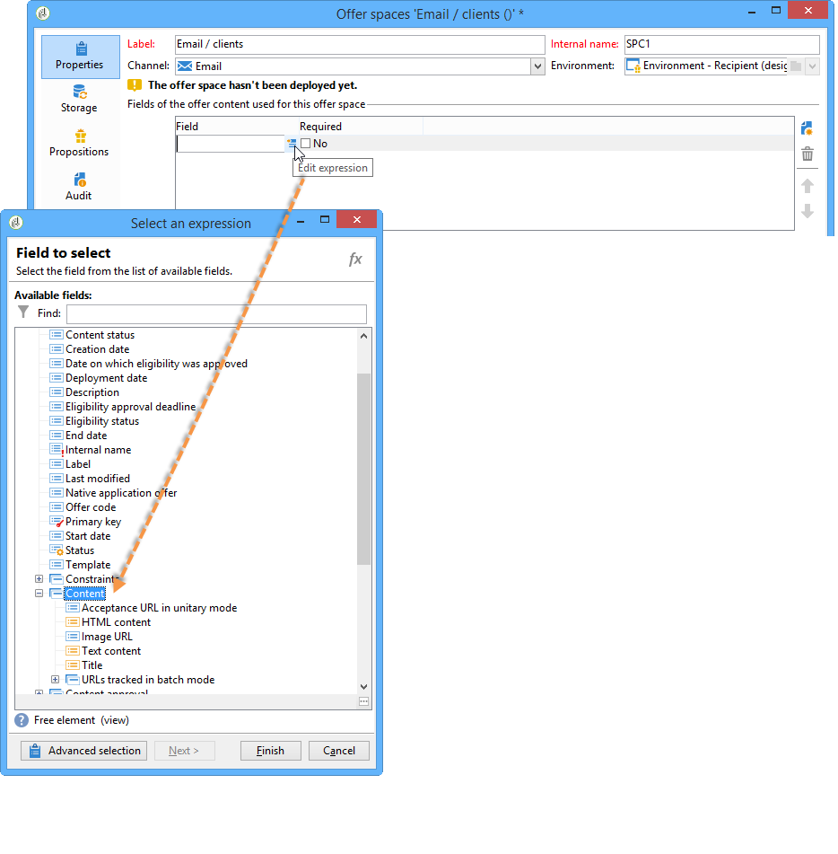
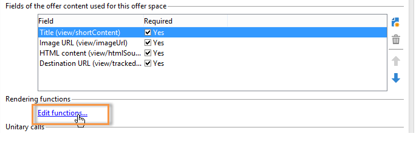

# 오퍼 공간 만들기{#creating-offer-spaces}

오퍼 공간 만들기는 **기술 관리자**&#x200B;만이 오퍼 공간 하위 폴더에 액세스할 수 있습니다. 오퍼 공간은 디자인 환경에서만 만들 수 있으며, 오퍼 승인 중에 라이브 환경에 자동으로 복제됩니다.

카탈로그 오퍼의 컨텐츠는 오퍼 공간에 구성됩니다. 기본적으로 컨텐츠에는 다음 필드가 포함될 수 있습니다.**[!UICONTROL Title]**, **[!UICONTROL Destination URL]**, **[!UICONTROL Image URL]**, **[!UICONTROL HTML content]** 및 **[!UICONTROL Text content]**. 필드 시퀀스는 오퍼 공간에 구성됩니다.

고급 매개 변수를 사용하면 연락처 식별 키(예: 다양한 요소, 이름 및 이메일 필드로 구성할 수 있음)를 지정할 수 있습니다. 자세한 내용은 [식별된 오퍼](../../interaction/using/integration-via-javascript--client-side-.md#presenting-an-identified-offer) 표시 섹션을 참조하십시오.

HTML 또는 XML 렌더링은 렌더링 함수를 통해 만들어집니다. 렌더링 함수에 정의된 필드의 시퀀스는 컨텐츠에 구성된 시퀀스와 동일해야 합니다.


새 오퍼 공간을 만들려면 다음 프로세스를 적용합니다.

1. 오퍼 공간 목록으로 이동하여 **[!UICONTROL New]**&#x200B;을 클릭합니다.

   

1. 사용할 채널을 선택하고 오퍼 공간의 레이블을 변경합니다.

   

1. 다음 사례 중 하나가 적용되는 경우 **[!UICONTROL Enable unitary mode]** 상자를 선택합니다.

   * 메시지 센터에서 상호 작용을 사용하고 있습니다.
   * 상호 작용의 단일 모드(인바운드 상호 작용)를 사용하고 있습니다.

1. **[!UICONTROL Content field]** 창으로 이동하여 **[!UICONTROL Add]**&#x200B;을 클릭합니다.

   

1. **[!UICONTROL Content]** 노드로 이동하여 다음 순서로 필드를 선택합니다.**[!UICONTROL Title]**, **[!UICONTROL Image URL]**, **[!UICONTROL HTML content]**, **[!UICONTROL Destination URL]** 순으로 선택합니다.

   

1. 각 필드를 필수 필드로 만들려면 **[!UICONTROL Required]** 상자를 선택합니다.

   >[!NOTE]
   >
   >이 구성은 미리 보기에서 사용되며, 해당 오퍼에서 필수 요소 중 하나가 누락된 경우 게시할 때 오퍼 공백이 유효하지 않게 됩니다. 하지만 오퍼가 이미 오퍼 공간에 존재하는 경우 이러한 기준은 고려되지 않습니다.

   

1. 렌더링 함수를 만들려면 **[!UICONTROL Edit functions]**&#x200B;을 클릭합니다.

   이러한 함수는 오퍼 공간에서 오퍼 표현을 생성하는 데 사용됩니다. 다음과 같은 몇 가지 형식을 사용할 수 있습니다.아웃바운드 상호 작용 및 인바운드 상호 작용에 대한 HTML 또는 텍스트입니다.

   

1. **[!UICONTROL HTML rendering]** 탭으로 이동하여 **[!UICONTROL Overload the HTML rendering function]**&#x200B;를 선택합니다.
1. 렌더링 함수를 삽입합니다.

   

필요한 경우 인바운드 상호 작용을 위해 XML 렌더링 함수를 오버로드할 수 있습니다. 아웃바운드 상호 작용에 대해 HTML 및 텍스트 렌더링 함수를 오버로드할 수도 있습니다. 자세한 내용은 [인바운드 채널 정보](../../interaction/using/about-inbound-channels.md)를 참조하십시오.

## 제안 상태 {#offer-proposition-statuses}

오퍼 제안은 타깃팅된 모집단과의 상호 작용에 따라 다양한 상태를 가질 수 있습니다. 상호 작용은 라이프 사이클 동안 제안 제안에 적용할 수 있는 일련의 값들과 함께 제공됩니다. 그러나 오퍼 제안이 만들어지고 수락될 때 상태가 변경되도록 플랫폼을 구성해야 합니다.

>[!NOTE]
>
>제안 제안의 상태는 즉시 업데이트되지 않습니다. 이것은 매 시간마다 트리거되는 추적 워크플로우에 의해 수행됩니다.

### 상태 목록 {#status-list}

상호 작용은 제안 제안 상태의 자격을 평가하는 데 사용할 수 있는 다음 값과 함께 제공됩니다.

* **[!UICONTROL Accepted]**.
* **[!UICONTROL Scheduled]**.
* **[!UICONTROL Generated]**.
* **[!UICONTROL Interested]**.
* **[!UICONTROL Presented]**.
* **[!UICONTROL Rejected]**.

이러한 값은 기본적으로 적용되지 않습니다.구성해야 합니다.

>[!NOTE]
>
>오퍼가 &quot;전송&quot; 상태의 게재와 연결된 경우 제안 제안의 상태는 자동으로 &quot;제안&quot;으로 변경됩니다.

### 제안을 만들 때 상태 구성 {#configuring-the-status-when-the-proposition-is-created}

상호 작용 엔진에서 오퍼 제안을 만들 때 내부 또는 외부 상호 작용인지 여부에 따라 상태가 변경됩니다. 이 두 값 간의 선택은 **[!UICONTROL Design]** 환경에서 오퍼 공백이 구성되는 방식에 따라 달라집니다.

각 공간에 대해 제안 보고서에 표시할 정보에 따라 제안을 만들 때 적용할 상태를 구성할 수 있습니다.

이렇게 하려면 다음 프로세스를 사용하십시오.

1. 원하는 공간의 **[!UICONTROL Storage]** 탭으로 이동합니다.
1. 제안을 만들 때 제안에 적용할 상태를 선택합니다.

   

### 제안을 수락할 때 상태 구성 {#configuring-the-status-when-the-proposition-is-accepted}

제안 제안이 수락되면, 기본적으로 제공된 값 중 하나를 사용하여 제안의 새 상태를 구성할 수 있습니다. 이 업데이트는 수신자가 상호 작용 엔진을 호출하는 오퍼의 링크를 클릭할 때 효과적입니다.

이렇게 하려면 다음 프로세스를 사용하십시오.

1. 원하는 공간의 **[!UICONTROL Storage]** 탭으로 이동합니다.
1. 제안을 수락할 때 해당 제안에 적용할 상태를 선택합니다.

   

**인바운드 상호 작용**

**[!UICONTROL Storage]** 탭에서는 **proposed** 및 **accepted** 오퍼 제안의 상태만 정의할 수 있습니다. 인바운드 상호 작용의 경우 오퍼 제안 상태는 인터페이스를 통해서가 아니라 오퍼 엔진을 호출하기 위해 URL에서 직접 지정해야 합니다. 이렇게 하면 제안 제안이 거부되는 경우 등 다른 경우에 적용할 상태를 지정할 수 있습니다.

```
<BASE_URL>?a=UpdateStatus&p=<PRIMARY_KEY_OF_THE_PROPOSITION>&st=<NEW_STATUS_OF_THE_PROPOSITION>&r=<REDIRECT_URL>
```

예를 들어 **Neobank** 사이트에 표시된 **홈 보험** 오퍼와 일치하는 제안(식별자 **40004**)에는 다음 URL이 포함되어 있습니다.

```
<BASE_URL>?a=UpdateStatus&p=<40004>&st=<3>&r=<"http://www.neobank.com/insurance/subscribe.html">
```

방문자가 오퍼를 클릭하고 따라서 URL이 클릭되는 즉시 **[!UICONTROL Accepted]** 상태(값 **3**)가 제안에 적용되며 방문자는 보험 계약을 수행하기 위해 **Neobank** 사이트의 새 페이지로 리디렉션됩니다.

>[!NOTE]
>
>URL에 다른 상태를 지정하려면(예: 오퍼 제안이 거부된 경우) 원하는 상태에 해당하는 값을 사용합니다. 예:**[!UICONTROL Rejected]** = &quot;5&quot;, **[!UICONTROL Presented]** = &quot;1&quot; 등입니다.
>
>상태 및 값은 **[!UICONTROL Offer propositions (nms)]** 데이터 스키마에서 검색할 수 있습니다. 자세한 정보는 이 [페이지](../../configuration/using/data-schemas.md)를 참조하십시오.

**아웃바운드 상호 작용**

아웃바운드 상호 작용의 경우 배달에 링크가 들어 있을 때 **[!UICONTROL Interested]** 상태를 제안 제안에 자동으로 적용할 수 있습니다. 링크에 **_urlType=&quot;11&quot;** 값을 추가하면 됩니다.

```
<a _urlType="11" href="<DEST_URL>">Link inserted into the delivery</a>
```

## 공간당 오퍼 미리 보기 {#offer-preview-per-space}

이 탭에서 선택한 방법을 통해 수신자가 자격이 있는 오퍼를 볼 수 있습니다. 아래 예에서 수신자는 우편으로 3가지 제안 사항을 제출할 수 있습니다.


수신자가 오퍼에 자격이 없는 경우 미리 보기에 표시됩니다.


공백으로 제한된 경우 미리 보기에서 컨텍스트를 무시할 수 있습니다. 이것은 상호 작용 스키마가 인바운드 채널을 사용하여 공간에서 참조된 필드를 추가하도록 확장된 경우입니다(자세한 내용은 [Extension 예](../../interaction/using/extension-example.md) 참조).
