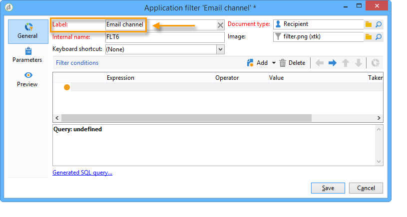

# 사전 정의된 필터 만들기{#creating-predefined-filters}

사전 정의된 필터를 사용하면 오퍼 생성 중에 쉽게 다시 사용할 수 있는 대상 모집단에 대한 자격 규칙을 만들 수 있습니다. 각 환경에 따라 다르며 오퍼 매개 변수를 고려합니다.

필터를 만들려면 다음 프로세스를 적용합니다.

1. **[!UICONTROL Administration]** 폴더로 이동하여 **[!UICONTROL Pre-defined offer filters]**&#x200B;을(를) 선택합니다.

   

1. **[!UICONTROL New]**&#x200B;을(를) 클릭합니다.

   

1. 나중에 필터를 식별할 수 있도록 레이블을 변경합니다.

   

1. 필터링 조건과 관련된 필드를 선택합니다.

   

1. 필요한 경우 연산자 및 값을 선택한 다음 쿼리를 저장합니다.

   

1. 필터 결과를 보려면 **[!UICONTROL Preview]**&#x200B;을(를) 클릭하십시오.

   
