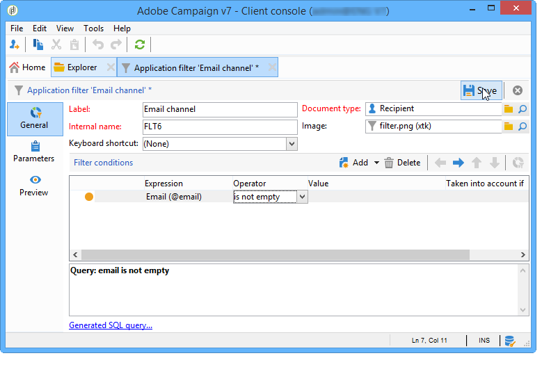

# 미리 정의된 필터 만들기{#creating-predefined-filters}

사전 정의된 필터를 사용하면 오퍼를 만드는 동안 쉽게 재사용할 수 있는 타겟 모집단에 대한 자격 조건 규칙을 만들 수 있습니다. 각 환경에 따라 다르며 오퍼 매개 변수를 고려합니다.

필터를 만들려면 다음 프로세스를 적용합니다.

1. 폴더로 이동하여 **[!UICONTROL Administration]** 선택합니다 **[!UICONTROL Pre-defined offer filters]**.

   

1. 클릭 **[!UICONTROL New]**.

   

1. 나중에 필터를 식별할 수 있도록 레이블을 변경합니다.

   

1. 필터링 조건이 우려되는 필드를 선택합니다.

   

1. 필요한 경우 연산자와 값을 선택한 다음 쿼리를 저장합니다.

   

1. 필터 결과를 **[!UICONTROL Preview]** 보려면 을 클릭합니다.

   

**관련 항목**

* [자주 사용하는 쿼리를 편집 가능한 미리 정의된 필터로 저장](https://helpx.adobe.com/campaign/kb/simplifying-campaign-management-acc.html#Savefrequentlyusedqueriesaseditablepredefinedfilters)