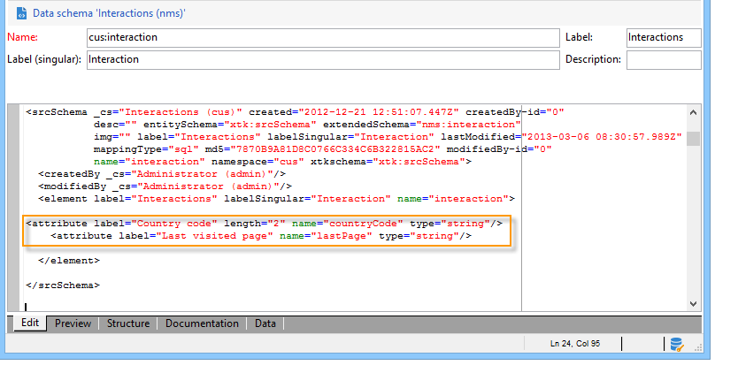
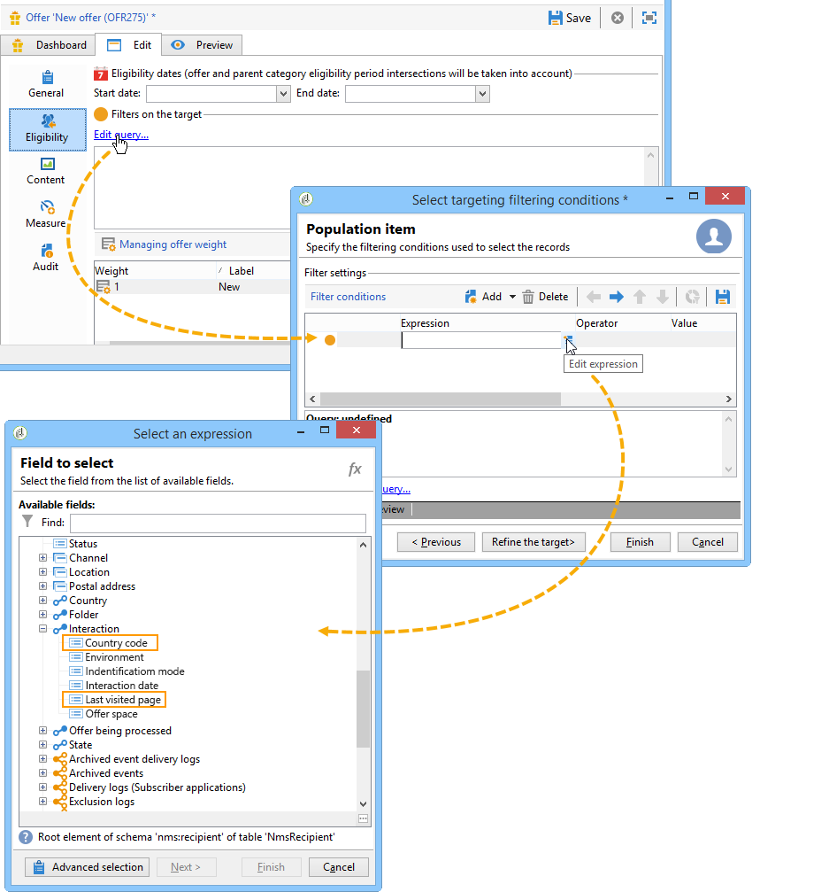

# 확장 예제{#extension-example}

인바운드 연락처(콜 센터 또는 웹 사이트)의 경우 자격 규칙 세트를 사용하여 해당 연락처에 가장 적절한 오퍼를 제안합니다. 오퍼의 자격 조건을 보강하려면 **nms:interaction** 스키마를 확장하세요.

* 새 상호 작용 컨텍스트를 추가하려면 **nms:interaction** 스키마를 확장하고 스키마에 필요한 만큼 **특성** 요소를 만드십시오.

  다음 예에서는 추가된 기준이 국가 코드 및 마지막으로 방문한 페이지입니다.

  

* 그런 다음 자격 기준 정의를 정의할 때 이전에 생성한 속성을 사용할 수 있습니다.

  다음 예제에서는 사용자의 국가 또는 마지막으로 본 웹 페이지를 기반으로 오퍼를 표시하는 자격 조건을 만들 수 있습니다.

  

* SOAP 호출을 구성할 때는 상호 작용 스키마에 추가된 컨텍스트 정보를 참조하도록 **context** XML 요소를 삽입합니다. 자세한 내용은 [SOAP을 통한 통합(서버측)](../../interaction/using/integration-via-soap-server-side.md)을 참조하세요.
