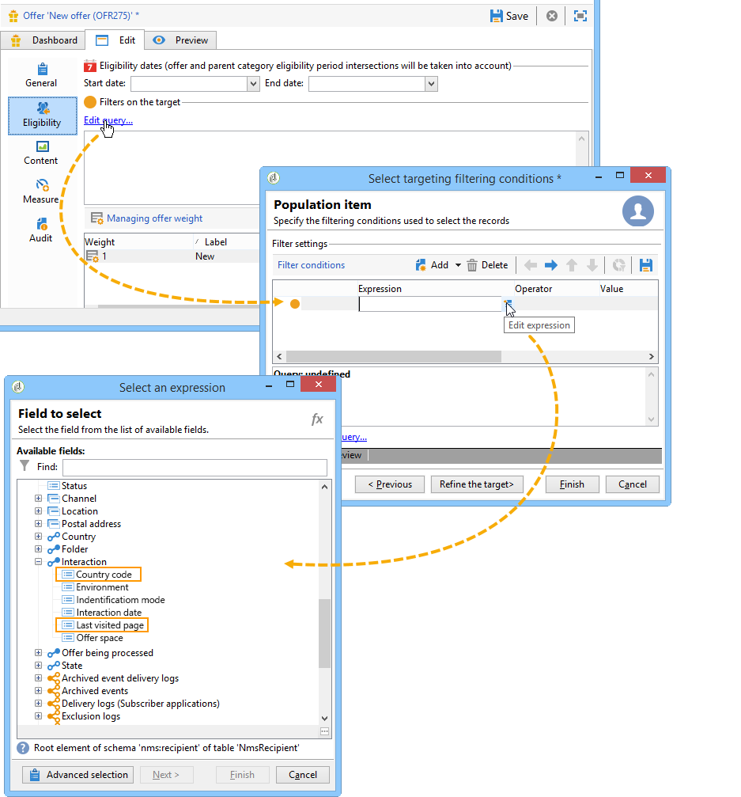

# 확장 예제{#extension-example}

인바운드 연락처(콜 센터 또는 웹 사이트)의 경우, 가장 관련성이 높은 오퍼는 자격 조건 집합을 사용하여 지정된 연락처에 제안됩니다. 오퍼의 자격 조건을 강화하려면 **nms:interaction** 스키마를 확장합니다.

* 새 상호 작용 컨텍스트를 추가하려면 **nms:interaction** 스키마를 확장하고 스키마에서 필요한 만큼 **속성** 요소를 만듭니다.

   다음 예에서, 추가된 기준은 국가 코드와 마지막으로 방문한 페이지입니다.

   

* 그런 다음 자격 조건 정의를 정의할 때 이전에 생성한 속성을 사용할 수 있습니다.

   다음 예에서는 사용자의 국가 또는 사용자가 본 마지막 웹 페이지를 기반으로 오퍼를 표시하는 자격 조건을 만들 수 있습니다.

   

* SOAP 호출을 구성할 때 상호 작용 스키마에 추가된 컨텍스트 정보를 참조하도록 **컨텍스트** XML 요소를 삽입합니다. 자세한 내용은 SOAP를 통한 [통합(서버측)을](../../interaction/using/integration-via-soap--server-side-.md)참조하십시오.

