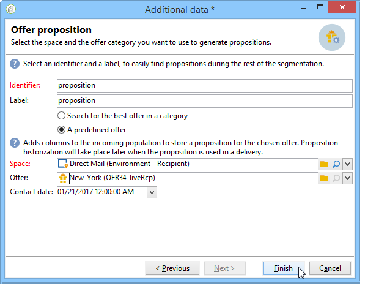

# 워크플로우를 통해 오퍼 통합{#integrating-an-offer-via-a-workflow}

배달 활동 자체 외에, 몇 가지 워크플로우 활동을 통해 오퍼가 표시되는 방식을 정의할 수 있습니다.

* 배달 개요
* 강화
* 오퍼 엔진
* 셀별 오퍼

## 배달 개요 {#delivery-outline}

캠페인 워크플로우에서 사용할 수 있는 배달 개요 활동을 사용하면 진행 중인 현재 캠페인의 배달 개요에서 참조되는 오퍼를 표시할 수 있습니다.

1. 워크플로우에서 배달 활동을 추가하기 전에 배달 개요 활동을 추가합니다.
1. 배달 개요 활동에서 사용할 개요를 지정합니다.

   배달 외곽선 지정에 대한 자세한 내용은 캠페인 - [MRM 안내서를 참조하십시오](../../campaign/using/marketing-campaign-deliveries.md#associating-and-structuring-resources-linked-via-a-delivery-outline) .

1. 게재에 따라 사용 가능한 필드를 완료합니다.
1. 두 가지 가능한 경우가 있습니다.

   * 오퍼 엔진에 전화를 걸려면 **[!UICONTROL Restrict the number of propositions selected]** 상자를 선택하십시오. 전달에 제공할 오퍼 공간과 제안 수를 지정합니다.

      오퍼 가중치 및 자격 조건은 오퍼 엔진에서 고려됩니다.

   * 상자를 선택하지 않으면 오퍼 엔진에 대한 호출을 하지 않고 배달 아웃라인의 모든 오퍼가 표시됩니다.
   >[!NOTE]
   >
   >미리 보기는 배달에 지정된 오퍼 수를 고려합니다. 워크플로우를 실행할 때 고려되는 배달 아웃라인에 지정된 번호입니다.

   

## 강화 {#enrichment}

데이터 연계 강화 활동을 통해 제공 받는 사람을 위한 오퍼나 링크를 추가할 수 있습니다.

>[!NOTE]
>
>농축 활동에 대한 자세한 내용은 워크플로우 안내서의 [전용 설명서를 참조하십시오](../../workflow/using/enrichment.md).

예를 들어 배달하기 전에 수신자 쿼리에 대한 데이터를 보완할 수 있습니다.

오퍼 제안을 지정하는 방법에는 두 가지가 있습니다.

* 오퍼 또는 오퍼 엔진 호출 지정.
* 오퍼에 대한 링크 참조.

### 오퍼 엔진에 대한 오퍼 또는 호출 지정 {#specifying-an-offer-or-a-call-to-the-offer-engine}

쿼리를 구성한 후(워크플로우 [가이드](../../workflow/using/query.md)참조):

1. 추가 및 열기
1. 탭에서 **[!UICONTROL Enrichment]** 을 선택합니다 **[!UICONTROL Add data]**.
1. 추가할 데이터 **[!UICONTROL An offer proposition]** 유형에서 선택합니다.

   

1. 추가할 제안에 대한 레이블과 식별자를 지정합니다.
1. 오퍼 선택을 지정합니다. 다음과 같은 두 가지 옵션을 사용할 수 있습니다.

   * **[!UICONTROL Search for the best offer in a category]** :이 옵션을 선택하고 오퍼 엔진 호출 매개 변수(오퍼 공간, 카테고리 또는 테마, 연락처 날짜, 유지할 오퍼 수)를 지정합니다. 엔진은 이러한 매개 변수에 따라 추가할 오퍼를 자동으로 계산합니다. 두 필드를 동시에 **[!UICONTROL Category]** 모두 수료하는 것이 아니라 **[!UICONTROL Theme]** 필드를 완료하는 것이 좋습니다.

      

   * **[!UICONTROL A predefined offer]** :이 옵션을 선택하고 오퍼 엔진을 호출하지 않고 추가하려는 오퍼를 직접 구성할 오퍼 공간, 특정 오퍼 및 연락처 날짜를 지정합니다.

      

1. 그런 다음 선택한 채널에 해당하는 배달 활동을 구성합니다. 이에 대한 자세한 내용은 [오퍼 제안을 전달에](../../interaction/using/integrating-an-offer-via-the-wizard.md#inserting-an-offer-proposition-into-a-delivery) 삽입 섹션을 참조하십시오.

   >[!NOTE]
   >
   >미리 보기에 사용할 수 있는 제안의 수는 전달에서 직접 수행되는 가능한 구성이 아니라 농축활동에서 수행되는 구성에 따라 다릅니다.

### 오퍼에 대한 링크 참조 {#referencing-a-link-to-an-offer}

또한 농축활동의 오퍼에 대한 링크를 참조할 수 있습니다.

이렇게 하려면 다음 프로세스를 사용하십시오.

1. 활동의 **[!UICONTROL Add data]** 탭에서 **[!UICONTROL Enrichment]** 선택합니다.
1. 추가할 데이터 유형을 선택하는 창에서 선택합니다 **[!UICONTROL A link]**.
1. 설정하려는 링크 유형과 대상을 선택합니다. 이 경우 대상은 오퍼 스키마입니다.

   

1. 농축활동의 인바운드 테이블 데이터(수신자 테이블)와 오퍼 테이블 간의 조인을 지정합니다. 예를 들어, 오퍼 코드를 수신자에게 연결할 수 있습니다.

   

1. 그런 다음 선택한 채널에 해당하는 배달 활동을 구성합니다. 이에 대한 자세한 내용은 [오퍼 제안을 전달에](../../interaction/using/integrating-an-offer-via-the-wizard.md#inserting-an-offer-proposition-into-a-delivery) 삽입 섹션을 참조하십시오.

   >[!NOTE]
   >
   >미리 보기에 사용할 수 있는 제안 수는 전달에서 수행된 구성에 따라 달라집니다.

### 오퍼 순위 및 가중치 저장 {#storing-offer-rankings-and-weights}

기본적으로, **농축** 활동이 제안을 전달하는 데 사용될 경우, 순위 및 가중치는 제안 표에 저장되지 않습니다.

>[!NOTE]
>
>기억하십시오.이 **[!UICONTROL Offer engine]** 활동은 기본적으로 이 정보를 저장합니다.

그러나 다음과 같이 이 정보를 저장할 수 있습니다.

1. 쿼리 후와 배달 활동 전에 배치된 농축활동의 오퍼 엔진에 대한 호출을 만듭니다. 오퍼 [지정 또는 오퍼 엔진에](../../interaction/using/integrating-an-offer-via-a-workflow.md#specifying-an-offer-or-a-call-to-the-offer-engine) 대한 호출 섹션을 참조하십시오.
1. 활동의 기본 창에서 을 **[!UICONTROL Edit additional data...]**&#x200B;선택합니다.

   

1. 등급 및 오퍼 가중치에 대한 **[!UICONTROL @rank]** 열을 **[!UICONTROL @weight]** 추가합니다.

   

1. 추가를 확인하고 워크플로우를 저장합니다.

게시는 오퍼의 등급 및 중량을 자동으로 저장합니다. 이 정보는 전달의 **[!UICONTROL Offers]** 탭에 표시됩니다.

## 오퍼 엔진 {#offer-engine}

또한 이 **[!UICONTROL Offer engine]** 활동을 통해 제공 전에 오퍼 엔진에 대한 호출을 지정할 수 있습니다.

이러한 활동은 전달 전에 엔진에서 계산된 오퍼를 통해 인바운드 모집단 데이터를 증가시켜 엔진 호출을 통한 농축활동과 동일한 원리로 작동합니다.

쿼리를 구성한 후(워크플로우 [가이드](../../workflow/using/query.md)참조):

1. 활동을 추가하고 **[!UICONTROL Offer engine]** 엽니다.
1. 다양한 사용 가능한 필드를 작성하여 오퍼 엔진 매개 변수(오퍼 공간, 카테고리 또는 테마, 연락처 날짜, 보관할 오퍼 수)를 지정합니다. 엔진은 이러한 매개 변수에 따라 추가할 오퍼를 자동으로 계산합니다.

   >[!NOTE]
   >
   >경고:이 활동을 사용하는 경우 게재에 사용된 오퍼 제안만 저장됩니다.

   

1. 그런 다음 선택한 채널에 해당하는 배달 활동을 구성합니다. 이에 대한 자세한 내용은 [오퍼 제안을 전달에](../../interaction/using/integrating-an-offer-via-the-wizard.md#inserting-an-offer-proposition-into-a-delivery) 삽입 섹션을 참조하십시오.

## 셀별 오퍼 {#offers-by-cell}

이 **[!UICONTROL Offers by cell]** 활동을 통해 인바운드 모집단(예: 질의)을 여러 세그먼트에 배포하고 이러한 각 세그먼트에 대해 표시할 오퍼를 지정할 수 있습니다.

이렇게 하려면 다음 프로세스를 사용하십시오.

1. 타겟 모집단을 지정한 후 **[!UICONTROL Offers by cell]** 활동을 추가한 다음 엽니다.
1. 탭에서 오퍼를 표시할 오퍼 공간을 **[!UICONTROL General]** 선택합니다.
1. 탭에서 **[!UICONTROL Cells]** **[!UICONTROL Add]** 단추를 사용하여 다른 하위 세트를 지정합니다.

   * 사용 가능한 필터링 및 제한 규칙을 사용하여 하위 집합 채우기를 지정합니다.
   * 그런 다음 하위 세트에 표시할 오퍼를 선택합니다. 사용 가능한 오퍼는 이전 단계에서 선택한 오퍼 환경에서 사용할 수 있는 오퍼입니다.

      

1. 그런 다음 선택한 채널에 해당하는 배달 활동을 구성합니다. 이에 대한 자세한 내용은 [오퍼 제안을 전달에](../../interaction/using/integrating-an-offer-via-the-wizard.md#inserting-an-offer-proposition-into-a-delivery) 삽입 섹션을 참조하십시오.

