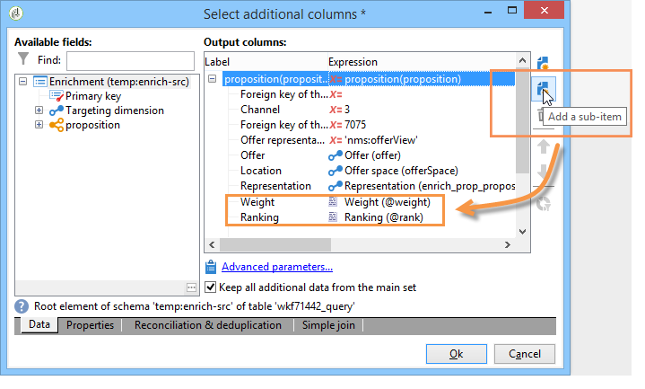

# 워크플로우를 통해 오퍼 통합{#integrating-an-offer-via-a-workflow}

게재 활동 자체 외에, 몇 가지 워크플로우 활동을 통해 오퍼를 표시하는 방식을 정의할 수 있습니다.

* 게재 개요
* 데이터 보강
* 오퍼 엔진
* 셀별 오퍼

## 게재 개요 {#delivery-outline}

캠페인 워크플로우에서 사용할 수 있는 게재 개요 활동을 사용하면 진행 중인 현재 캠페인의 게재 아웃라인에서 참조되는 오퍼를 표시할 수 있습니다.

1. 워크플로우에서 게재 활동을 추가하기 전에 게재 개요 활동을 추가합니다.
1. 게재 개요 활동에서 사용할 개요를 지정합니다.

   게재 아웃라인 지정에 대한 자세한 내용은 [캠페인 - MRM](../../campaign/using/marketing-campaign-deliveries.md#associating-and-structuring-resources-linked-via-a-delivery-outline) 안내서.

1. 게재에 따라 사용 가능한 필드를 작성합니다.
1. 다음 두 가지 가능한 경우가 있습니다.

   * 오퍼 엔진을 호출하려면 **[!UICONTROL Restrict the number of propositions selected]** 상자. 게재에 표시할 오퍼 공간과 제안 수를 지정합니다.

      오퍼 가중치 및 자격 규칙은 오퍼 엔진에서 고려됩니다.

   * 상자를 선택하지 않으면 오퍼 엔진을 호출하지 않고 게재 아웃라인의 모든 오퍼가 표시됩니다.
   >[!NOTE]
   >
   >미리 보기는 게재에 지정된 오퍼 수를 고려합니다. 워크플로우를 실행할 때 고려되는 게재 아웃라인에 지정된 번호입니다.

   

## 데이터 보강 {#enrichment}

데이터 보강 활동을 통해 게재 수신자를 위한 오퍼에 오퍼나 링크를 추가할 수 있습니다.

>[!NOTE]
>
>데이터 보강 활동에 대한 자세한 내용은 [워크플로우 안내서](../../workflow/using/enrichment.md).

예를 들어 게재 전에 수신자 쿼리의 데이터를 보강할 수 있습니다.

오퍼 제안을 지정하는 방법에는 두 가지가 있습니다.

* 오퍼 또는 오퍼 엔진 호출 지정
* 오퍼 링크 참조.

### 오퍼 엔진에 대한 호출 지정 {#specifying-an-offer-or-a-call-to-the-offer-engine}

쿼리를 구성한 후 [워크플로우 안내서](../../workflow/using/query.md)):

1. 데이터 보강 활동을 추가하고 엽니다.
1. **[!UICONTROL Enrichment]** 탭에서 **[!UICONTROL Add data]**&#x200B;를 선택합니다.
1. 선택 **[!UICONTROL An offer proposition]** 추가할 데이터 유형에서 을 참조하십시오.

   

1. 추가할 제안에 대한 레이블과 식별자를 지정합니다.
1. 오퍼 선택을 지정합니다. 다음 두 가지 옵션을 사용할 수 있습니다.

   * **[!UICONTROL Search for the best offer in a category]** : 이 옵션을 선택하고 오퍼 엔진 호출 매개 변수(오퍼 공간, 카테고리 또는 테마), 연락 날짜, 유지할 오퍼 수)를 지정합니다. 엔진은 이러한 매개 변수에 따라 추가할 오퍼를 자동으로 계산합니다. 다음 중 하나를 완료하는 것이 좋습니다 **[!UICONTROL Category]** 또는 **[!UICONTROL Theme]** 필드(동시에 둘 다 아님).

      

   * **[!UICONTROL A predefined offer]** : 오퍼 엔진을 호출하지 않고 추가할 오퍼를 직접 구성하려면 이 옵션을 선택하고 오퍼 공간, 특정 오퍼 및 연락 날짜를 지정합니다.

      

1. 그런 다음 선택한 채널에 해당하는 게재 활동을 구성합니다. 자세한 내용은 [게재에 오퍼 제안 삽입](../../interaction/using/integrating-an-offer-via-the-wizard.md#inserting-an-offer-proposition-into-a-delivery) 섹션을 참조하십시오.

   >[!NOTE]
   >
   >미리 보기에 사용할 수 있는 proposition 수는 게재에서 직접 수행되는 구성 대신 데이터 보강 활동에서 수행되는 구성에 따라 다릅니다.

### 오퍼 링크 참조 {#referencing-a-link-to-an-offer}

데이터 보강 활동에서 오퍼에 대한 링크를 참조할 수도 있습니다.

이렇게 하려면 다음 프로세스를 사용합니다.

1. 선택 **[!UICONTROL Add data]** 활동 **[!UICONTROL Enrichment]** 탭.
1. 추가할 데이터 유형을 선택하는 창에서 **[!UICONTROL A link]**.
1. 설정할 링크의 유형과 타겟을 선택합니다. 이 경우 대상은 오퍼 스키마입니다.

   

1. 데이터 보강 활동의 인바운드 테이블 데이터(여기에서 수신자 테이블)와 오퍼 테이블 간의 조인을 지정합니다. 예를 들어 오퍼 코드를 수신자에게 연결할 수 있습니다.

   

1. 그런 다음 선택한 채널에 해당하는 게재 활동을 구성합니다. 자세한 내용은 [게재에 오퍼 제안 삽입](../../interaction/using/integrating-an-offer-via-the-wizard.md#inserting-an-offer-proposition-into-a-delivery) 섹션을 참조하십시오.

   >[!NOTE]
   >
   >미리 보기에 사용할 수 있는 proposition 수는 게재에서 수행된 구성에 따라 다릅니다.

### 오퍼 순위 및 가중치 저장 {#storing-offer-rankings-and-weights}

기본적으로 **데이터 보강** 활동은 오퍼를 전달하는 데 사용되며, 그 순위 및 가중치는 제안 테이블에 저장되지 않습니다.

>[!NOTE]
>
>기억: 다음 **[!UICONTROL Offer engine]** 활동은 기본적으로 이 정보를 저장합니다.

그러나 다음과 같이 이 정보를 저장할 수 있습니다.

1. 쿼리 뒤에, 게재 활동 전에 배치된 데이터 보강 활동에서 오퍼 엔진에 대한 호출을 만듭니다. 자세한 내용은 [오퍼 엔진에 대한 호출 지정](../../interaction/using/integrating-an-offer-via-a-workflow.md#specifying-an-offer-or-a-call-to-the-offer-engine) 섹션을 참조하십시오.
1. 활동의 기본 창에서 을(를) 선택합니다 **[!UICONTROL Edit additional data...]**.

   

1. 추가 **[!UICONTROL @rank]** 등급 및 열 **[!UICONTROL @weight]** 제안 가중치입니다.

   

1. 추가를 확인하고 워크플로우를 저장합니다.

게재는 오퍼의 등급 및 가중치를 자동으로 저장합니다. 이 정보는 게재의 **[!UICONTROL Offers]** 탭.

## 오퍼 엔진 {#offer-engine}

다음 **[!UICONTROL Offer engine]** 또한 활동을 사용하면 게재 전에 오퍼 엔진에 대한 호출을 지정할 수 있습니다.

이 활동은 게재 전에 엔진에서 계산된 오퍼로 인바운드 모집단 데이터를 강화하여 엔진 호출을 사용하는 데이터 보강 활동과 동일한 원리에서 작동합니다.

쿼리를 구성한 후 [워크플로우 안내서](../../workflow/using/query.md)):

1. 추가 및 열기 **[!UICONTROL Offer engine]** 활동.
1. 오퍼 엔진 매개 변수(오퍼 공간, 카테고리 또는 테마), 연락 날짜, 유지할 오퍼 수)에 대한 호출을 지정하려면 사용 가능한 다양한 필드를 완료하십시오. 엔진은 이러한 매개 변수에 따라 추가할 오퍼를 자동으로 계산합니다.

   >[!NOTE]
   >
   >경고: 이 활동을 사용하는 경우 게재에 사용된 오퍼 포지션만 저장됩니다.

   

1. 그런 다음 선택한 채널에 해당하는 게재 활동을 구성합니다. 자세한 내용은 [게재에 오퍼 제안 삽입](../../interaction/using/integrating-an-offer-via-the-wizard.md#inserting-an-offer-proposition-into-a-delivery) 섹션을 참조하십시오.

## 셀별 오퍼 {#offers-by-cell}

다음 **[!UICONTROL Offers by cell]** 활동을 사용하면 인바운드 모집단을 여러 세그먼트로(예: 쿼리에서) 배포하고 이러한 각 세그먼트에 대해 표시할 오퍼를 지정할 수 있습니다.

이렇게 하려면 다음 프로세스를 사용합니다.

1. 추가 **[!UICONTROL Offers by cell]** 활동 모집단을 지정한 후 엽니다.
1. 에서 **[!UICONTROL General]** 탭에서 오퍼를 표시할 오퍼 공간을 선택합니다.
1. 에서 **[!UICONTROL Cells]** 탭에서 **[!UICONTROL Add]** 버튼:

   * 사용 가능한 필터링 및 제한 규칙을 사용하여 하위 집합 모집단을 지정합니다.
   * 그런 다음 하위 세트에 표시할 오퍼를 선택합니다. 사용 가능한 오퍼는 이전 단계에서 선택한 오퍼 환경에서 사용할 수 있는 오퍼입니다.

      

1. 그런 다음 선택한 채널에 해당하는 게재 활동을 구성합니다. 자세한 내용은 [게재에 오퍼 제안 삽입](../../interaction/using/integrating-an-offer-via-the-wizard.md#inserting-an-offer-proposition-into-a-delivery) 섹션을 참조하십시오.
