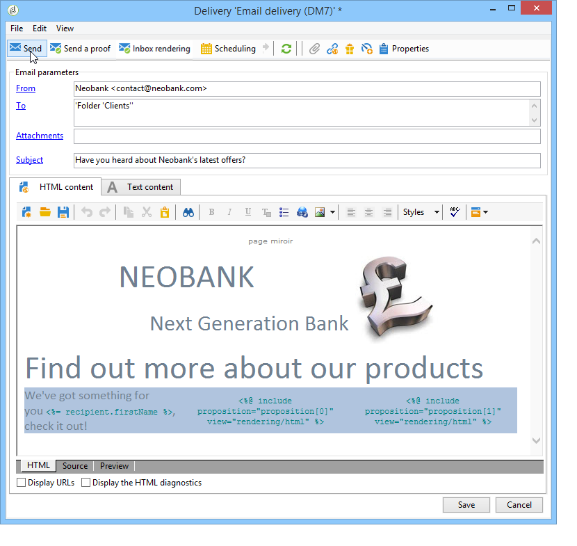

# 마법사를 통해 오퍼 통합{#integrating-an-offer-via-the-wizard}

게재를 만들 때 오퍼를 통합하는 두 가지 가능한 방법이 있습니다.

* 게재 본문에서 오퍼 엔진을 호출합니다.
* 캠페인의 게재 개요를 통해 오퍼를 참조합니다. 이 방법은 일반적으로 종이 캠페인에 사용됩니다.

## 오퍼 엔진에 대한 호출을 사용하여 제공 {#delivering-with-a-call-to-the-offer-engine}

마케팅 캠페인 중에 오퍼를 제공하려면 선택한 채널을 기반으로 클래식 게재 작업을 만드십시오. 게재 컨텐츠가 정의될 때 오퍼 엔진이 도구 모음에서 사용 가능한 **[!UICONTROL Offers]** 아이콘을 클릭하여 호출됩니다.

이 섹션](../../delivery/using/about-direct-mail-channel.md)에서 DM 게재 [에 대해 자세히 알아보십시오. 마케팅 캠페인 [에 대해 자세히 알아보십시오](../../campaign/using/setting-up-marketing-campaigns.md).

### 오퍼를 게재에 삽입하는 주요 단계 {#main-steps-for-inserting-an-offer-into-a-delivery}

게재에 오퍼 위치를 삽입하려면 다음 단계를 수행합니다.

1. 게재 창에서 오퍼 아이콘을 클릭합니다.

   

1. 오퍼 환경과 일치하는 공간을 선택합니다.

   

1. 엔진의 오퍼 선택 사항을 세분화하려면 제시할 오퍼가 속하는 카테고리 또는 하나/여러 개의 테마를 선택합니다. 제한 사항을 오버로드하지 않도록 이러한 필드 중 하나만 사용하는 것이 좋습니다.

   

   

1. 게재 본문에 삽입할 오퍼 수를 지정합니다.

   

1. 필요한 경우 **[!UICONTROL Exclude non-eligible recipients]** 옵션을 선택합니다. 자세한 내용은 [오퍼 엔진 호출 매개 변수](#parameters-for-calling-offer-engine)를 참조하십시오.

   

1. 필요한 경우 **[!UICONTROL Do not display anything if no offers are selected]** 옵션을 선택합니다. 자세한 내용은 [오퍼 엔진 호출 매개 변수](#parameters-for-calling-offer-engine)를 참조하십시오.

   

1. 병합 필드를 사용하여 게재 콘텐츠에 속성을 삽입합니다. 사용 가능한 proposition 수는 엔진 호출이 구성되는 방식에 따라 다르며, 순서는 오퍼의 우선 순위에 따라 다릅니다.

   

1. 컨텐츠를 완료하고 평소대로 게재를 전송합니다.

   

### 오퍼 엔진 호출을 위한 매개 변수 {#parameters-for-calling-offer-engine}

* **[!UICONTROL Space]** : 오퍼 엔진을 활성화하기 위해 선택해야 하는 오퍼 환경의 공간입니다.
* **[!UICONTROL Category]** : 오퍼가 정렬되는 특정 폴더입니다. 카테고리를 지정하지 않으면 테마를 선택하지 않은 한 환경에 포함된 모든 오퍼가 오퍼 엔진에서 고려됩니다.
* **[!UICONTROL Themes]** : 카테고리에서 업스트림으로 정의된 주요 단어입니다. 오퍼는 필터로서 작동하며 카테고리 집합에서 오퍼를 선택하여 표시할 오퍼의 수를 개선할 수 있도록 해줍니다.
* **[!UICONTROL Number of propositions]** : 게재 본문에 삽입할 수 있는 엔진에서 반환한 오퍼 수입니다. 오퍼가 메시지에 삽입되지 않으면 오퍼가 계속 생성되지만 표시되지 않습니다.
* **[!UICONTROL Exclude non-eligible recipients]** : 이 옵션을 사용하면 적합한 오퍼가 충분하지 않은 수신자의 제외를 활성화하거나 비활성화할 수 있습니다. 해당 Proposition 수는 요청된 Proposition 수보다 작을 수 있습니다. 이 확인란을 선택하면 적절한 위치가 없는 수신자는 게재에서 제외됩니다. 이 옵션을 선택하지 않으면 이러한 수신자는 제외되지 않지만 요청된 프로필 수가 없습니다.
* **[!UICONTROL Do not display anything if no offer is selected]** : 이 옵션을 사용하면 프로필 중 하나가 없는 경우 메시지를 처리하는 방법을 선택할 수 있습니다. 이 상자를 선택하면 누락된 제안 표시가 표시되지 않고 이 제안에 대한 메시지에 콘텐츠가 표시되지 않습니다. 상자를 선택하지 않으면 메시지 자체가 전송 중에 취소되고 수신자는 더 이상 메시지를 받지 않습니다.

### 게재에 오퍼 제안 삽입 {#inserting-an-offer-proposition-into-a-delivery}

표시할 오퍼의 표현은 병합 필드를 통해 게재 본문에 삽입됩니다. 제안 수는 오퍼 엔진 호출의 매개 변수에 정의됩니다.

오퍼의 필드를 사용하거나 이메일의 경우 렌더링 기능을 사용하여 게재를 개인화할 수 있습니다.

## 게재 개요 제공 {#delivering-with-delivery-outlines}

게재 개요를 사용하여 오퍼를 게재에 표시할 수도 있습니다.

게재 아웃라인에 대한 자세한 내용은 [캠페인 - MRM](../../campaign/using/marketing-campaign-deliveries.md#associating-and-structuring-resources-linked-via-a-delivery-outline) 안내서를 참조하십시오.

1. 새 캠페인을 만들거나 기존 캠페인에 액세스합니다.
1. 캠페인의 **[!UICONTROL Edit]** > **[!UICONTROL Documents]** 탭을 통해 게재 아웃라인에 액세스합니다.
1. 아웃라인을 추가한 다음 아웃라인을 마우스 오른쪽 단추로 클릭하고 **[!UICONTROL New]** > **[!UICONTROL Offer]** 을 선택하여 원하는 만큼 오퍼를 삽입한 다음 캠페인을 저장합니다.

   

1. 액세스 권한이 있는 게재 개요(예: DM 게재)가 있는 게재를 만듭니다.
1. 게재를 편집할 때 **[!UICONTROL Select a delivery outline]** 을 클릭합니다.

   >[!NOTE]
   >
   >게재 유형에 따라 이 옵션은 **[!UICONTROL Properties]** > **[!UICONTROL Advanced]** 메뉴에서 찾을 수 있습니다(예를 들어 이메일 게재의 경우).

   

1. 그런 다음 **[!UICONTROL Offers]** 버튼을 사용하여 게재에 표시할 오퍼 수와 오퍼 공간을 구성할 수 있습니다.

   

1. 개인화 필드를 사용하여 게재 본문에 제안을 추가합니다(자세한 내용은 [게재](#inserting-an-offer-proposition-into-a-delivery) 섹션에 오퍼 제안 삽입 을 참조). 또는 DM 게재의 경우 추출 파일 형식을 편집하여 오퍼를 게재 본문에 추가합니다.

   게재 아웃라인에서 참조되는 오퍼에서 제안이 선택됩니다.

   >[!NOTE]
   >
   >오퍼의 등급 및 가중치에 대한 정보는 오퍼가 게재에서 직접 생성된 경우에만 제안 테이블에 저장됩니다.
