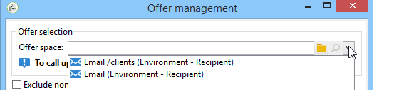

# 마법사를 통해 오퍼 통합{#integrating-an-offer-via-the-wizard}

배달을 만들 때 오퍼를 통합하는 방법에는 두 가지가 있습니다.

* 배달 본문에 오퍼 엔진 호출.
* 캠페인의 배달 개요를 통해 오퍼를 참조합니다. 이 방법은 일반적으로 종이 캠페인에 사용됩니다.

## 오퍼 엔진으로 전달 {#delivering-with-a-call-to-the-offer-engine}

마케팅 캠페인 도중 오퍼를 발표하려면 선택한 채널을 기반으로 클래식 배달 작업을 만들면 됩니다. 오퍼 엔진은 도구 모음에서 사용 가능한 아이콘을 클릭하여 배달 컨텐츠가 정의되면 **[!UICONTROL Offers]** 호출됩니다.

배달 및 마케팅 캠페인에 대한 자세한 내용은 [배달](../../delivery/using/about-direct-mail-channel.md) 및 [캠페인을 참조하십시오](../../campaign/using/setting-up-marketing-campaigns.md).

### 오퍼를 게재에 삽입하기 위한 주요 단계 {#main-steps-for-inserting-an-offer-into-a-delivery}

오퍼를 게재에 삽입하려면 다음 단계를 수행하십시오.

1. 배달 창에서 오퍼 아이콘을 클릭합니다.

   

1. 오퍼 환경과 일치하는 공간을 선택합니다.

   

1. 엔진에서 선택한 오퍼를 세분화하려면 제공할 오퍼가 속한 카테고리 또는 하나/여러 테마를 선택합니다. 제한 사항을 과도하게 로드하지 않도록 이러한 필드 중 하나만 사용하는 것이 좋습니다.

   

   

1. 배달 본문에 삽입할 오퍼 수를 지정합니다.

   

1. 필요한 경우 **[!UICONTROL Exclude non-eligible recipients]** 옵션을 선택합니다. 자세한 내용은 [매개 변수를 참조하십시오](#parameters-for-calling-offer-engine).

   

1. 필요한 경우 **[!UICONTROL Do not display anything if no offers are selected]** 옵션을 선택합니다. 자세한 내용은 [매개 변수를 참조하십시오](#parameters-for-calling-offer-engine).

   

1. 병합 필드를 사용하여 배달 내용에 속성을 삽입합니다. 사용할 수 있는 제안 수는 엔진 호출이 구성되는 방식에 따라 다르며 해당 주문은 오퍼의 우선 순위에 따라 달라집니다.

   

1. 컨텐츠를 마무리하고 평소대로 배달을 보낼 수 있습니다.

   

### 오퍼 엔진 호출 매개 변수 {#parameters-for-calling-offer-engine}

* **[!UICONTROL Space]** :오퍼 엔진을 활성화하기 위해 선택해야 하는 오퍼 환경의 공간입니다.
* **[!UICONTROL Category]** :오퍼가 정렬되는 특정 폴더입니다. 카테고리를 지정하지 않으면 테마를 선택하지 않으면 환경에 포함된 모든 오퍼가 오퍼 엔진에서 고려됩니다.
* **[!UICONTROL Themes]** :카테고리에서 업스트림 키워드 정의 이러한 오퍼는 필터 역할을 하며 카테고리 세트에서 오퍼를 선택하여 제공할 오퍼 수를 조정할 수 있습니다.
* **[!UICONTROL Number of propositions]** :전달 본문에 삽입할 수 있는 엔진에서 반환되는 오퍼 수입니다. 오퍼가 메시지에 삽입되지 않으면 오퍼가 계속 생성되지만 표시되지 않습니다.
* **[!UICONTROL Exclude non-eligible recipients]** :이 옵션을 사용하면 적합한 오퍼가 부족한 수신자의 제외를 활성화하거나 비활성화할 수 있습니다. 적격한 제안 개수는 요청된 제안 개수보다 작을 수 있습니다. 이 확인란을 선택하면 충분한 제안이 없는 수신자는 전달에서 제외됩니다. 이 옵션을 선택하지 않으면 이러한 수신자는 제외되지 않지만 요청된 제안 수는 없습니다.
* **[!UICONTROL Do not display anything if no offer is selected]** :이 옵션을 사용하면 프로필 중 하나가 없는 경우 메시지가 처리되는 방식을 선택할 수 있습니다. 이 상자를 선택하면 누락된 제안 표현이 표시되지 않고 이 제안에 대한 메시지에는 컨텐츠가 나타나지 않습니다. 상자를 선택하지 않으면 메시지 자체가 전송 도중 취소되고 받는 사람은 더 이상 메시지를 받지 않습니다.

### 게재에 제안 삽입 {#inserting-an-offer-proposition-into-a-delivery}

나타낼 오퍼의 표현은 병합 필드를 통해 배달 본문에 삽입됩니다. 제안 수는 오퍼 엔진 호출 매개 변수에 정의됩니다.

전달 내용은 오퍼의 필드 또는 이메일의 경우 렌더링 기능을 사용하여 개인화할 수 있습니다.

## 전달 개요 {#delivering-with-delivery-outlines}

배달 개요를 사용하여 오퍼를 게재할 수도 있습니다.

배달 개요에 대한 자세한 내용은 [캠페인 - MRM](../../campaign/using/marketing-campaign-deliveries.md#associating-and-structuring-resources-linked-via-a-delivery-outline) 안내서를 참조하십시오.

1. 새 캠페인을 만들거나 기존 캠페인에 액세스합니다.
1. 캠페인의 **[!UICONTROL Edit]** > 탭을 통해 배달 개요를 **[!UICONTROL Documents]** 액세스합니다.
1. 아웃라인을 추가한 다음 아웃라인을 마우스 오른쪽 단추로 클릭하고 > 을 선택하여 원하는 만큼 오퍼를 삽입한 **[!UICONTROL New]** 다음 캠페인 **[!UICONTROL Offer]**&#x200B;을 저장합니다.

   

1. 액세스 권한이 있는 배달 외곽선(예: DM 배달)을 포함하는 배달을 만듭니다.
1. 배달을 편집할 때 을 클릭합니다 **[!UICONTROL Select a delivery outline]**.

   >[!NOTE]
   >
   >배달 유형에 따라, 이 옵션은 **[!UICONTROL Properties]** > **[!UICONTROL Advanced]** 메뉴(예: 이메일 배달)에서 찾을 수 있습니다.

   

1. 그런 다음 **[!UICONTROL Offers]** 단추를 사용하여 오퍼 공간과 전달에 표시할 오퍼 수를 구성할 수 있습니다.

   

1. 추출 파일 형식을 편집하여 개인화 필드(자세한 내용은 전달 [섹션에 제안 제안 삽입](#inserting-an-offer-proposition-into-a-delivery) 섹션 참조) 또는 DM 전달의 경우 제안을 사용하여 전달 본문에 제안을 추가합니다.

   게재 아웃라인에서 참조되는 오퍼에서 제안이 선택됩니다.

   >[!NOTE]
   >
   >오퍼 순위 및 가중치에 대한 정보는 오퍼가 게재에서 직접 생성된 경우에만 제안 테이블에 저장됩니다.

