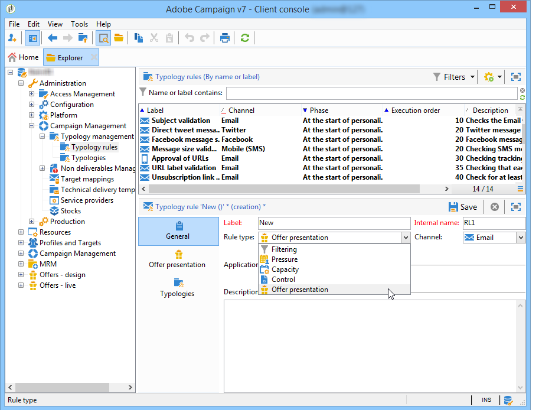
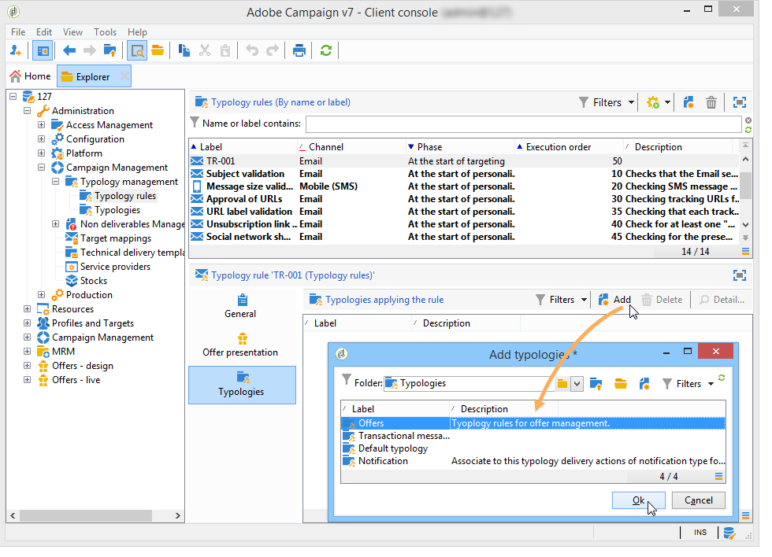

# 오퍼 프레젠테이션 관리{#managing-offer-presentation}

## 프레젠테이션 규칙 개요 {#presentation-rules-overview}

상호 작용을 통해 프레젠테이션 규칙을 사용하여 오퍼 제안 흐름을 제어할 수 있습니다. 이러한 규칙은 상호 작용에 따라 분류 규칙입니다. 수신자에게 이미 수행한 제안 내역을 기반으로 오퍼를 제외할 수 있습니다. 이러한 항목은 환경에서 참조됩니다.

## 오퍼 프레젠테이션 규칙 만들기 및 참조 {#creating-and-referencing-an-offer-presentation-rule}

1. > **[!UICONTROL Administration]** > **[!UICONTROL Campaign management]** > **[!UICONTROL Typology management]** > **[!UICONTROL Typology rules]** 노드로 이동합니다.
1. 유형 규칙을 만들고 유형을 **[!UICONTROL Offer presentation]** 선택합니다.

   

1. 규칙을 적용할 채널을 지정합니다.

   

1. 규칙의 응용 프로그램 기준을 구성합니다. 자세한 내용은 [프레젠테이션 규칙 설정을 참조하십시오](#presentation-rule-settings).
1. > **[!UICONTROL Administration]** > **[!UICONTROL Campaign execution]** **[!UICONTROL Typology management]** > **[!UICONTROL Typologies]** 노드로 이동하고 모든 **[!UICONTROL Offer presentation]** 유형 규칙을 그룹화하는 유형을 만듭니다.

   

1. 일단 유형이 생성되면, 커서를 분류 규칙 위에 놓고 방금 만든 유형학 유형에 그룹화합니다.

   

1. 오퍼 환경에서 드롭다운 목록을 사용한 유형을 참조합니다.

   

## 프레젠테이션 규칙 설정 {#presentation-rule-settings}

### 애플리케이션 기준 {#application-criteria-}

탭에서 사용할 수 있는 응용 프로그램 기준을 **[!UICONTROL General]** 사용하면 프레젠테이션 규칙이 적용될 오퍼를 지정할 수 있습니다. 이렇게 하려면 아래 설명된 대로 쿼리를 만들고 관련 오퍼를 선택해야 합니다.

1. 분류 규칙에서 링크를 클릭하여 쿼리를 만듭니다. **[!UICONTROL Edit the rule application conditions...]**

   

1. 쿼리 창에서 유형 규칙을 적용할 오퍼에 필터를 적용할 수 있습니다.

   예를 들어 오퍼 카테고리를 선택할 수 있습니다.

   

### 오퍼 차원 {#offer-dimensions}

탭에서 **[!UICONTROL Offer presentation]** 환경에 구성된 것과 동일한 차원을 프레젠테이션 규칙에 지정해야 합니다.

받는 사람 표와 **[!UICONTROL Targeting dimension]** 일치합니다(기본적으로:nms:수신자)에게 문의하십시오. 이 **[!UICONTROL Storage dimension]** 는 타깃팅 차원에 연결된 제안 내역이 포함된 표와 일치합니다(기본적으로:nms:promentationRcp).

>[!NOTE]
>
>비표준 표를 사용할 수도 있습니다. 특정 타깃팅 차원을 사용하려면 대상 매핑을 사용하여 전용 환경과 테이블을 만들어야 합니다. 자세한 내용은 오퍼 환경 [만들기를 참조하십시오](../../interaction/using/live-design-environments.md#creating-an-offer-environment).

### 기간 {#period}

이 기간은 오퍼 프레젠테이션 날짜에 시작되는 슬라이딩 기간입니다. 오퍼 제안의 유효성에 대한 기간을 설정합니다. 이 기간 이후에 이루어진 제안에는 이 규칙이 적용되지 않는다.

기간은 제안 날짜 **전****에** 시작하여 이후 **n일** 후 **[!UICONTROL Period considered]** 에 만료되며, 여기서n은필드에 입력한 번호에 해당합니다.

* 인바운드 공간의 경우, 제안 날짜는 오퍼 프레젠테이션 날짜입니다.
* 아웃바운드 공간의 경우 제안 날짜는 배달 연락처 날짜입니다(예: 타깃팅 워크플로우에 입력된 배달 날짜).

화살표를 사용하여 일 수를 변경하거나 마침표(&quot;2d 6h&quot;와 같이)를 직접 입력합니다.

### 제안 수 {#number-of-propositions}

해당 오퍼가 제외되거나 제외되기 전에 수행할 수 있는 최대 개수의 제안을 설정할 수 있습니다.

화살표를 사용하여 오퍼 제안 수를 변경합니다.

## 프로필 및 수신자 정의 {#defining-propositions-and-recipients}

이 **[!UICONTROL Propositions to count]** **[!UICONTROL General]** 섹션에서는 입사 내역에 특정 횟수가 표시되는 경우 탭에 정의된 오퍼가 제외될 수신자와 제안을 모두 지정할 수 있습니다.

### 프로필 필터링 {#filtering-propositions}

필터링 기준을 선택하여 채널, 관련 오퍼 또는 이전에 할당된 제안 상태를 기반으로 제안을 제외할 수 있습니다.

이러한 기준은 프레젠테이션 규칙의 가장 빈번한 응용 프로그램을 나타냅니다. 다른 기준을 사용하려면 **[!UICONTROL Limit propositions...]** 링크를 사용하여 쿼리를 만들 수 있습니다. For more on this, refer to the [Creating a query on propositions](#creating-a-query-on-propositions) section.

* **채널에서 필터링**

   **[!UICONTROL On the same channel only]** :탭에 지정된 채널에서 오퍼 위치를 제외할 수 **[!UICONTROL General]** 있습니다.

   예를 들어, 탭의 규칙에 지정된 채널은 **[!UICONTROL General]** 이메일입니다. 규칙이 적용되는 오퍼가 지금까지 웹 채널에서만 제공된 경우, 상호 작용 엔진은 오퍼를 이메일 배달로 제공할 수 있습니다. 그러나 오퍼가 이메일로 표시되면 상호 작용 엔진은 오퍼를 표시할 다른 채널을 선택합니다.

   >[!NOTE]
   >
   >우리는 공간이 아니라 채널에 대해 이야기하고 있습니다. 규칙이 웹 채널에서 오퍼를 제외해야 하는 경우, 두 개의 공백(예: 배너와 페이지 본문)으로 웹 사이트에 제시될 오퍼가 이전에 이미 제공된 경우 사이트에 표시되지 않습니다.
   >
   >오퍼 프레젠테이션이 포함된 워크플로우의 경우, 규칙이 구성된 경우에만 올바르게 고려됩니다 **[!UICONTROL All channels]**.

* **오퍼에 대해 필터링**

   이 필터를 사용하면 특정 오퍼 세트로 카운트되도록 오퍼 위치를 제한할 수 있습니다.

   **[!UICONTROL All offers]** :기본값. 오퍼에 필터가 적용되지 않습니다.

   **[!UICONTROL Offer being presented]** :탭에 지정된 오퍼는 이미 제공된 경우 **[!UICONTROL General]** 제외됩니다.

   **[!UICONTROL Offers from the same category]** :오퍼는 동일한 카테고리의 오퍼가 이미 제공된 경우 제외됩니다.

   **[!UICONTROL The offers which the rule applies to]** :여러 오퍼가 **[!UICONTROL General]** 탭에 정의되면, 이 오퍼 세트의 각 오퍼 제안이 고려되고, 제안 임계값에 도달하는 경우 모든 오퍼의 제외에서 종료됩니다.

   예를 들어, 오퍼 2, 3 및 5는 **[!UICONTROL General]** 탭에 정의됩니다. 최대 프로필 수는 2로 설정됩니다. 2개 및 5개의 오퍼가 각각 한 번 제공되면, 계산되는 제안 수는 2개가 됩니다. 결과적으로, 3은 제공되지 않습니다.

* **제안 상태 필터링**

   이 필터를 사용하면 제안 내역에 고려될 오퍼 속성의 가장 빈번한 상태를 선택할 수 있습니다.

   **[!UICONTROL Regardless of the proposition status]** :기본값. 제안 상태에 필터가 적용되지 않습니다.

   **[!UICONTROL Accepted or rejected propositions]** :수락되거나 거부된 이전에 제공된 오퍼를 제외할 수 있습니다.

   **[!UICONTROL Accepted propositions]** :수락된 이전에 제공된 오퍼를 제외할 수 있습니다.

   **[!UICONTROL Rejected propositions]** :거부된 이전에 제공된 오퍼를 제외할 수 있습니다.

### 수신자 정의 {#defining-recipients}

수신자를 지정하려면 링크를 클릭하고 **[!UICONTROL Edit the query from the targeting dimension...]** 규칙에 따라 받는 사람을 선택합니다.

### 제안 시 쿼리 만들기 {#creating-a-query-on-propositions}

쿼리를 통해 계산될 제안을 지정하려면 링크를 클릭하고 **[!UICONTROL Limit propositions...]** 고려할 기준을 지정합니다.

다음 예에서는 두 개의 프레젠테이션이 **특별 프로모션** 카테고리( **콜 센터** 공간)에 있는 프레젠테이션과 무게 **20**&#x200B;미만으로 카운트됩니다.

