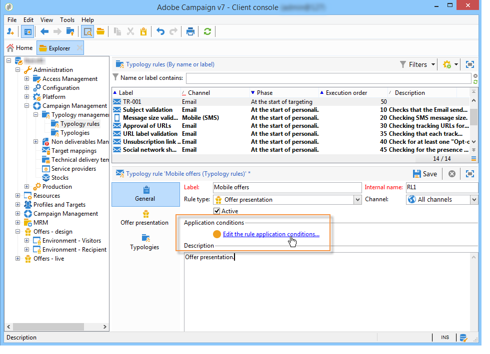

# 오퍼 프레젠테이션 관리{#managing-offer-presentation}

## 프레젠테이션 규칙 개요 {#presentation-rules-overview}

상호 작용을 사용하면 프레젠테이션 규칙을 사용하여 오퍼 제안의 흐름을 제어할 수 있습니다. 상호 작용에만 해당되는 이러한 규칙은 유형화 규칙입니다. 수신자에게 이미 제안된 이력을 기반으로 오퍼를 제외할 수 있습니다. 환경에서 참조됩니다

## 오퍼 표시 규칙 만들기 및 참조 {#creating-and-referencing-an-offer-presentation-rule}

1. 로 이동 **[!UICONTROL Administration]** > **[!UICONTROL Campaign management]** > **[!UICONTROL Typology management]** > **[!UICONTROL Typology rules]** 노드.
1. 유형화 규칙을 만들고 **[!UICONTROL Offer presentation]** 유형.

   

1. 규칙을 적용할 채널을 지정합니다.

   

1. 규칙의 적용 기준을 구성합니다. 자세한 내용은 다음을 참조하십시오. [프레젠테이션 규칙 설정](#presentation-rule-settings).
1. 로 이동 **[!UICONTROL Administration]** > **[!UICONTROL Campaign execution]** > **[!UICONTROL Typology management]** > **[!UICONTROL Typologies]** 노드를 만들고 모든 항목을 그룹화할 유형화 만들기 **[!UICONTROL Offer presentation]** 규칙을 입력합니다.

   

1. 유형화가 생성되면 유형화 규칙에 커서를 놓고 방금 생성한 유형화에서 그룹화합니다.

   

1. 오퍼 환경에서 드롭다운 목록을 사용하여 유형화를 참조합니다.

   

## 프레젠테이션 규칙 설정 {#presentation-rule-settings}

### 애플리케이션 기준 {#application-criteria-}

에서 사용할 수 있는 애플리케이션 기준 **[!UICONTROL General]** 탭에서는 프레젠테이션 규칙이 적용될 오퍼를 지정할 수 있습니다. 이렇게 하려면 아래 설명된 대로 쿼리를 만들고 관련 오퍼를 선택해야 합니다.

1. 유형화 규칙에서 **[!UICONTROL Edit the rule application conditions...]** 링크를 클릭하여 쿼리를 만듭니다.

   

1. 쿼리 창에서 유형화 규칙을 적용할 오퍼에 필터를 적용할 수 있습니다.

   예를 들어 오퍼 카테고리를 선택할 수 있습니다.

   

### 오퍼 차원 {#offer-dimensions}

다음에서 **[!UICONTROL Offer presentation]** 탭에서 환경에 구성된 치수와 동일한 치수를 표시 규칙에 지정해야 합니다.

다음 **[!UICONTROL Targeting dimension]** 오퍼 제안을 받을 수신자 테이블(기본적으로 nms:recipients)과 일치합니다. 다음 **[!UICONTROL Storage dimension]** 은 타겟팅 차원에 연결된 제안 내역을 포함하는 테이블과 일치합니다(기본적으로).:nms:propositionRcp).

>[!NOTE]
>
>비표준 테이블을 사용할 수도 있습니다. 특정 타겟팅 차원을 사용하려면 타겟 매핑을 사용하여 전용 환경뿐만 아니라 테이블을 만들어야 합니다. 자세한 내용은 다음을 참조하십시오. [오퍼 환경 만들기](../../interaction/using/live-design-environments.md#creating-an-offer-environment).

### 기간 {#period}

이것은 오퍼 프레젠테이션 날짜부터 시작하는 슬라이딩 기간입니다. 오퍼 제안의 유효성에 대한 시간 제한을 설정합니다. 이 기간이 지난 오퍼에는 이 규칙이 적용되지 않습니다.

기간이 시작됩니다. **n** 제안 일자 이전 일 및 종료 일 **n** 며칠 후, **n** 은(는) 다음에 입력한 번호에 해당합니다. **[!UICONTROL Period considered]** 필드:

* 인바운드 공백의 경우 제안 날짜가 오퍼 표시 날짜입니다.
* 아웃바운드 스페이스의 경우 제안 일자는 게재 연락 일자(예: 타겟팅 워크플로우에 입력된 게재 일자)입니다.

화살표를 사용하여 일 수를 변경하거나 기간(예: &quot;2d 6h&quot;)을 직접 입력합니다.

### 제안 수 {#number-of-propositions}

관련 오퍼가 제외되기 전에 할 수 있는 가장 많은 수의 제안을 설정할 수 있습니다.

화살표를 사용하여 오퍼 제안 수를 변경합니다.

## 제안 및 수신자 정의 {#defining-propositions-and-recipients}

다음 **[!UICONTROL Propositions to count]** 섹션에서 정의된 오퍼를 제외할 수신자와 제안을 모두 지정할 수 있습니다. **[!UICONTROL General]** 제안 내역에 특정 횟수만큼 표시되는 경우 탭합니다.

### 제안 필터링 {#filtering-propositions}

필터링 기준을 선택하여 채널, 관련 오퍼 또는 이전에 할당된 제안의 상태를 기반으로 제안을 제외할 수 있습니다.

이러한 기준은 프레젠테이션 규칙의 가장 빈번한 적용을 나타냅니다. 다른 기준을 사용하려면 **[!UICONTROL Limit propositions...]** 링크를 클릭합니다. 자세한 내용은 [제안에 대한 쿼리 만들기](#creating-a-query-on-propositions) 섹션.

* **채널에서 필터링**

  **[!UICONTROL On the same channel only]** : 에 지정된 채널에서 오퍼 제안을 제외할 수 있습니다. **[!UICONTROL General]** 탭.

  예를 들어 의 규칙에 대해 지정된 채널은 **[!UICONTROL General]** 탭은 이메일입니다. 규칙이 적용되는 오퍼가 지금까지 웹 채널에서만 제공된 경우 상호 작용 엔진은 이메일 게재에 오퍼를 표시할 수 있습니다. 그러나 오퍼가 이메일로 제공되면 상호 작용 엔진은 오퍼를 제공할 다른 채널을 선택합니다.

  >[!NOTE]
  >
  >우리는 공간이 아니라 채널에 대해 이야기하고 있다. 규칙이 웹 채널에서 오퍼를 제외해야 하는 경우, 웹 사이트에 두 개의 공백으로 표시되도록 지정된 오퍼(예: 배너와 페이지 본문)는 이전에 이미 제공된 경우 사이트에 표시되지 않습니다.
  >
  >오퍼 프레젠테이션과 관련된 워크플로우의에 규칙이 구성되어 있는 경우에만 올바로 고려됩니다. **[!UICONTROL All channels]**.

* **오퍼에 대해 필터링**

  이 필터를 사용하면 오퍼 제안을 특정 오퍼 세트로 계산하도록 제한할 수 있습니다.

  **[!UICONTROL All offers]** : 기본값. 오퍼에 필터가 적용되지 않습니다.

  **[!UICONTROL Offer being presented]** : 다음에 지정된 오퍼 **[!UICONTROL General]** 이미 표시된 탭은 제외됩니다.

  **[!UICONTROL Offers from the same category]** : 동일한 범주의 오퍼가 이미 표시된 경우 오퍼가 제외됩니다.

  **[!UICONTROL The offers which the rule applies to]** : 몇 개의 오퍼가에 정의된 경우 **[!UICONTROL General]** 탭에서는 이 오퍼 세트의 각 오퍼 제안이 고려되며 제안 임계값에 도달하면 모든 오퍼의 제외로 종료됩니다.

  예를 들어 오퍼 2, 3 및 5는 **[!UICONTROL General]** 탭. 최대 제안 수는 2로 설정됩니다. 오퍼 2와 5를 각각 한 번씩 제시하면 계산되는 제안 수는 2개가 됩니다. 따라서 오퍼 3은 제공되지 않습니다.

* **제안 상태 필터링**

  이 필터를 사용하면 제안 기록에서 고려할 제안 제안에 대해 가장 빈번한 상태를 선택할 수 있습니다.

  **[!UICONTROL Regardless of the proposition status]** : 기본값. 제안 상태에 필터가 적용되지 않습니다.

  **[!UICONTROL Accepted or rejected propositions]** : 이전에 제공된 오퍼가 수락되거나 거부된 것을 제외할 수 있습니다.

  **[!UICONTROL Accepted propositions]** : 이전에 제공된 오퍼가 수락되어 이를 제외할 수 있습니다.

  **[!UICONTROL Rejected propositions]** : 이전에 제공된 오퍼가 거부되면 제외할 수 있습니다.

### 수신자 정의 {#defining-recipients}

수신자를 지정하려면 **[!UICONTROL Edit the query from the targeting dimension...]** 규칙에 관련된 수신자를 연결하고 선택합니다.

### 제안에 대한 쿼리 만들기 {#creating-a-query-on-propositions}

쿼리를 통해 계산할 제안을 지정하려면 **[!UICONTROL Limit propositions...]** 을(를) 연결하고 고려할 기준을 지정합니다.

다음 예에서는 두 개의 프레젠테이션 후에 계산할 제안이 **특별 오퍼** 범주, **콜센터** 아래 무게를 갖는 공백 **20**.

