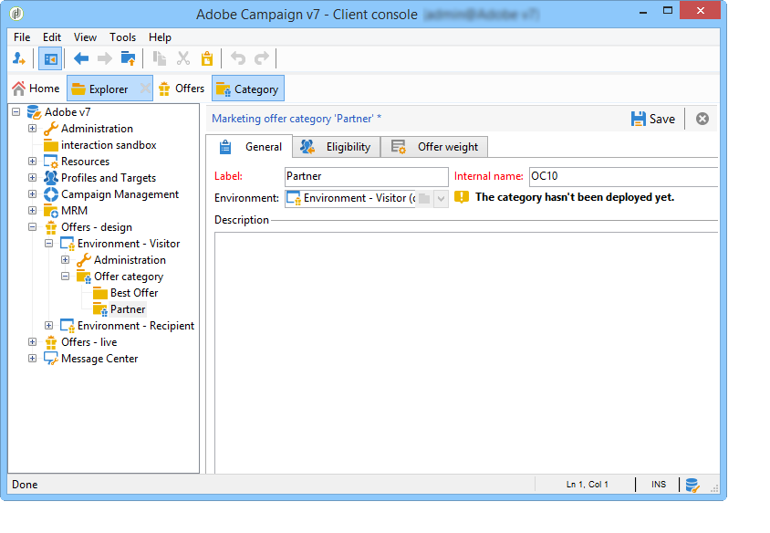

# 인바운드 채널에 대한 오퍼{#offers-on-an-inbound-channel}

## 익명의 방문자 {#presenting-an-offer-to-an-anonymous-visitor}에게 오퍼 제시

Neobank 사이트는 해당 페이지를 탐색하는 익명의 방문자를 겨냥한 오퍼를 웹 사이트에 표시하려고 합니다.

이 상호 작용을 설정하려면 다음을 수행합니다.

1. [익명 환경 만들기](#creating-an-anonymous-environment)
1. [익명 오퍼 공간 만들기](#creating-anonymous-offer-spaces)
1. [오퍼 카테고리 및 테마 만들기](#creating-an-offer-category-and-a-theme)
1. [익명의 오퍼를 만듭니다.](#creating-anonymous-offers)
1. [웹 사이트에서 웹 오퍼 공간 구성](#configure-the-web-offer-space-on-the-website)

### 익명 환경 만들기 {#creating-an-anonymous-environment}

[오퍼 환경 만들기](../../interaction/using/live-design-environments.md#creating-an-offer-environment)에 설명된 절차에 따라 **방문자**&#39; 차원을 기반으로 익명 환경을 만드십시오.

새 환경이 포함된 트리 구조를 가져옵니다.


### 익명 오퍼 공간 만들기 {#creating-anonymous-offer-spaces}

1. 익명 환경(**방문자**)에서 **[!UICONTROL Administration]** > **[!UICONTROL Spaces]** 노드로 이동합니다.
1. 호출 채널을 만들려면 **[!UICONTROL New]**&#x200B;을 클릭합니다.

   

   >[!NOTE]
   >
   >공백은 자동으로 익명의 환경에 연결됩니다.

1. 레이블을 변경하고 **[!UICONTROL Inbound Web]** 채널을 선택합니다. **[!UICONTROL Enable unitary mode]** 상자도 확인해야 합니다.

   

1. 공간에 사용된 오퍼 컨텐츠 필드를 선택하고 관련 상자를 선택하여 필요에 따라 지정합니다.

   이렇게 하면 다음 요소 중 하나가 없는 오퍼는 이 공간을 사용할 수 없습니다.

   * 제목
   * HTML 컨텐츠
   * 이미지 URL
   * 대상 URL

   

1. 다음과 같이 HTML 렌더링 함수를 편집합니다.

   ```
   function (imageUrl, targetUrl, shortContent, htmlSource){
         var html = "<p><b>" + shortContent + "</b></p>";
         html += "<p>" + htmlSource + "</p>";
         html += "<a _urlType='11' href='" + targetUrl + "'></a>";
         return html;
       }   
   ```

   >[!IMPORTANT]
   >
   >렌더링 함수는 오퍼가 올바르게 표시되도록 이전에 선택한 순서대로 공간에 사용된 필드의 이름을 지정해야 합니다.

   

1. 오퍼 공간을 저장합니다.

### 오퍼 카테고리 및 테마 {#creating-an-offer-category-and-a-theme} 만들기

1. 방금 만든 환경 내의 **[!UICONTROL Offer catalog]** 노드로 이동합니다.
1. **[!UICONTROL Offer catalog]** 노드를 마우스 오른쪽 단추로 클릭하고 **[!UICONTROL Create a new 'Offer category' folder]**&#x200B;을 선택합니다.

   예를 들어 새 카테고리의 이름을 **금융 제품**&#x200B;으로 지정합니다.

1. 범주의 **[!UICONTROL Eligibility]** 탭으로 이동한 다음 **파이낸싱**&#x200B;을 테마로 입력한 다음 변경 내용을 저장합니다.

   

### 익명 오퍼 만들기 {#creating-anonymous-offers}

1. 방금 만든 카테고리로 이동합니다.
1. **[!UICONTROL New]**&#x200B;을(를) 클릭합니다.

   

1. 즉시 사용 가능한 익명 오퍼 템플릿 또는 이전에 만든 템플릿을 선택합니다.

   

1. 레이블을 변경하고 오퍼를 저장합니다.

   

1. **[!UICONTROL Eligibility]** 탭으로 이동하여 해당 애플리케이션 컨텍스트에 따라 오퍼의 가중치를 지정합니다.

   이 예에서 오퍼는 연말에 대한 우선 순위로 사이트의 홈 페이지에 표시되도록 구성됩니다.

   

1. **[!UICONTROL Content]** 탭으로 이동하여 오퍼의 컨텐츠를 정의합니다.

   >[!NOTE]
   >
   >**[!UICONTROL Content definitions]**&#x200B;을 선택하여 웹 공간에 필요한 요소 목록을 표시할 수 있습니다.

   

1. 두 번째 오퍼를 만듭니다.

   

1. **[!UICONTROL Eligibility]** 탭으로 이동하여 첫 번째 오퍼와 동일한 가중치를 적용합니다.
1. 각 오퍼에 대한 승인 주기를 실행하여 승인 오퍼 공간과 온라인 환경에서 사용할 수 있도록 합니다.

### 웹 사이트 {#configure-the-web-offer-space-on-the-website}에서 웹 오퍼 공간 구성

방금 구성한 오퍼를 웹 사이트에 표시하려면 상호 작용 엔진을 호출하기 위해 사이트의 HTML 페이지에 JavaScript 코드를 삽입하십시오(여기에 대한 자세한 내용은 [인바운드 채널 정보](../../interaction/using/about-inbound-channels.md) 참조).

1. HTML 페이지로 이동하여 이전에 만든 익명 오퍼 공간의 내부 이름과 일치하는 값을 포함하는 @id 속성을 삽입합니다(](#creating-anonymous-offer-spaces)i_[). 앞에 &lt;a2/>i_**이 있습니다. 참조)**

   

1. 호출 URL을 삽입합니다.

   

   위의 파란색 URL 상자는 인스턴스 이름, 환경의 내부 이름([익명 환경 만들기](#creating-an-anonymous-environment) 참조) 및 카테고리에 연결된 테마([오퍼 카테고리 만들기 및 테마](#creating-an-offer-category-and-a-theme))에 해당합니다. 후자는 선택 사항입니다.

방문자가 웹 사이트의 홈 페이지에 액세스하면 **파이낸싱** 테마가 있는 오퍼가 HTML 페이지에 구성된 대로 표시됩니다.


페이지를 여러 번 방문하는 사용자는 동일한 가중치가 할당되었으므로 카테고리에서 하나 또는 다른 오퍼를 볼 수 있습니다.

## 식별되지 않은 연락처 {#switching-to-an-anonymous-environment-in-case-of-unidentified-contacts}의 경우 익명 환경으로 전환

Neobank 회사는 두 개의 다른 대상에 대한 마케팅 오퍼를 만들고 싶습니다. 익명의 웹 사이트 브라우저에 대한 일반 오퍼를 표시하려고 합니다. 이 사용자 중 한 명이 Neobank에서 제공하는 식별자를 가진 고객인 것으로 밝혀지면 Dell은 고객이 로그인하는 즉시 개인화된 혜택을 제공하기를 원합니다.

이 사례 조사는 다음 시나리오를 기반으로 합니다.

1. 방문자는 로그온하지 않고 Neobank 웹 사이트를 탐색합니다.

   

   페이지에 다음과 같은 3개의 익명 오퍼가 표시됩니다.2개의 **Neobank 제품에 대한 최고의 오퍼**&#x200B;와 Neobank 파트너로부터 하나의 오퍼를 제공합니다.

   

1. Neobank 고객인 사용자는 자신의 자격 증명으로 로그온합니다.

   

   3개의 개인화된 오퍼가 표시됩니다.

   

이 사례 연구를 구현하려면 2개의 오퍼 환경이 필요합니다.하나는 익명의 상호 작용을 위한 것이고 다른 하나는 식별된 연락처에 대해 특별히 구성된 오퍼를 사용하는 것입니다. 연락처가 로그온되어 있지 않아 식별되지 않는 경우 식별된 오퍼 환경이 익명의 오퍼 환경으로 자동 전환되도록 구성됩니다.

다음 단계를 적용합니다.

* 다음 단계를 사용하여 익명 인바운드 상호 작용에 대한 오퍼 카탈로그를 만듭니다.

   1. [익명의 연락처에 대한 환경 만들기](#creating-an-environment-for-anonymous-contacts)
   1. [익명 환경을 위한 오퍼 공간 구성](#configuring-offer-spaces-for-the-anonymous-environment)
   1. [익명 환경에서 오퍼 카테고리 만들기](#creating-offer-categories-in-an-anonymous-environment)
   1. [익명의 방문자를 위한 오퍼 만들기](#creating-offers-for-anonymous-visitors)

* 다음 단계를 사용하여 식별된 인바운드 상호 작용에 대한 오퍼 카탈로그를 만듭니다.

   1. [식별된 환경에서 오퍼 공간 구성](#configure-the-offer-spaces-in-the-identified-environment)
   1. [식별된 환경에서 오퍼 카테고리 만들기](#creating-offer-categories-in-an-identified-environment)
   1. [개인화된 제안 만들기](#creating-personalized-offers)

* 오퍼 엔진에 대한 호출을 구성합니다.

   1. [웹 페이지에서 오퍼 공간 구성](#configuring-offer-spaces-on-the-web-page)
   1. [식별된 오퍼 공간의 고급 설정 지정](#specifying-the-advanced-settings-of-the-identified-offer-spaces)

### 익명의 연락처에 대한 환경 만들기 {#creating-an-environment-for-anonymous-contacts}

1. 배달 매핑 마법사(**방문자** 매핑)를 통해 익명 인바운드 상호 작용에 대한 오퍼 환경을 만듭니다. 자세한 내용은 [오퍼 환경 만들기](../../interaction/using/live-design-environments.md#creating-an-offer-environment)를 참조하십시오.

   

### 익명 환경에 대한 오퍼 공간 구성 {#configuring-offer-spaces-for-the-anonymous-environment}

웹 사이트에 표시되어야 하는 오퍼는 두 가지 카테고리에 속합니다.**최고 오퍼** 및 **파트너**&#x200B;입니다. 이 예에서는 각 카테고리에 대한 특정 오퍼 공간을 만듭니다.

**최고 오퍼** 카테고리와 일치하는 오퍼 공간을 만들려면 다음 프로세스를 적용합니다.

1. Adobe Campaign 트리에서 방금 만든 익명 환경으로 이동하여 오퍼 공간을 추가합니다.

   

1. 새 **[!UICONTROL Inbound web]** 문자 공간을 만듭니다.

   

1. 레이블을 입력합니다.예를 들어 **웹 우수 익명 오퍼**&#x200B;입니다.
1. 이 오퍼 공간에 사용된 오퍼 컨텐츠 필드를 추가하고 렌더링 함수를 구성합니다.

   

   >[!IMPORTANT]
   >
   >렌더링 함수는 오퍼가 올바르게 표시되도록 이전에 선택한 순서대로 공간에 사용된 필드의 이름을 지정해야 합니다.

1. 동일한 프로세스를 사용하여 **파트너** 카테고리와 일치하도록 인바운드 웹 채널 오퍼 공간을 만듭니다.

   

### 익명 환경에서 오퍼 카테고리 만들기 {#creating-offer-categories-in-an-anonymous-environment}

먼저 두 가지 오퍼 카테고리를 만듭니다.**최고 오퍼** 카테고리와 **파트너** 카테고리. 각 카테고리에는 익명의 연락처에 대한 2개의 오퍼가 포함됩니다.

1. 방금 만든 익명 환경의 **[!UICONTROL Offer catalog]**&#x200B;으로 이동합니다.
1. **최고 오퍼**&#x200B;를 레이블로 **[!UICONTROL Offer category]** 폴더를 추가합니다.

   

1. **파트너**&#x200B;를 레이블로 사용하여 두 번째 범주를 만듭니다.

   

### 익명의 방문자를 위한 오퍼 만들기 {#creating-offers-for-anonymous-visitors}

이제 위에 만든 각 카테고리에 2개의 오퍼를 만듭니다.

1. **최고 오퍼** 카테고리로 이동하여 익명 오퍼를 만듭니다.

   

1. **[!UICONTROL Eligibility]** 탭으로 이동하여 해당 애플리케이션 컨텍스트에 따라 오퍼의 가중치를 지정합니다.

   

1. **[!UICONTROL Content]** 탭으로 이동하여 오퍼의 컨텐츠를 정의합니다.

   

1. **최고 오퍼** 범주에 두 번째 오퍼를 만듭니다.

   

1. **파트너** 카테고리로 이동하여 익명 오퍼를 만듭니다.
1. **[!UICONTROL Content]** 탭으로 이동하여 오퍼의 컨텐츠를 정의합니다.

   

1. **[!UICONTROL Eligibility]** 탭으로 이동하여 해당 애플리케이션 컨텍스트에 따라 오퍼의 가중치를 지정합니다.

   

1. **파트너** 카테고리에 대한 두 번째 오퍼를 만듭니다.

   

1. **[!UICONTROL Eligibility]** 탭으로 이동하여 이 카테고리의 첫 번째 오퍼에 적용한 것과 동일한 두께를 적용하여 오퍼가 웹 사이트에 연속 표시되도록 합니다.

   

1. 각 오퍼에 대한 승인 주기를 실행하여 승인 작업을 시작합니다. 컨텐츠를 승인할 때 오퍼에 따라 **파트너** 또는 **우수 오퍼** 오퍼 공간을 활성화합니다.

### 식별된 환경 {#configure-the-offer-spaces-in-the-identified-environment}에서 오퍼 공간 구성

웹 사이트에서 제공할 오퍼는 다음 두 가지 카테고리에서 가져옵니다.**최고 오퍼** 및 **파트너**&#x200B;입니다. 이 예에서는 각 카테고리에 대한 특정 공간을 만들려고 합니다.

2개의 오퍼 공간을 만들려면 익명 오퍼 공간에 대해 동일한 절차를 적용합니다. [익명 환경에 대한 오퍼 공간 구성을 참조하십시오](#configuring-offer-spaces-for-the-anonymous-environment).

1. Adobe Campaign 트리에서 방금 만든 환경으로 이동하여 **Best Offer** 및 **Partner** 오퍼 공간을 추가합니다.
1. [익명 환경에 대한 오퍼 공간 구성에 자세히 설명된 프로세스를 적용합니다](#configuring-offer-spaces-for-the-anonymous-environment).

   

1. **[!UICONTROL Fall back on an anonymous environment if no individuals were identified]** 옵션을 선택합니다.

   

1. 드롭다운 목록을 사용하여 이전에 만든 익명의 웹 오퍼 공간을 선택합니다([익명 환경에 대한 오퍼 공간 구성](#configuring-offer-spaces-for-the-anonymous-environment) 참조).

   

### 식별된 오퍼 공간의 고급 설정 지정 {#specifying-the-advanced-settings-of-the-identified-offer-spaces}

이 예에서는 Adobe Campaign 데이터베이스의 이메일 주소 덕분에 연락처 ID가 수행됩니다. 받는 사람 이메일을 스페이스에 추가하려면 다음 프로세스를 적용합니다.

1. 식별된 환경에서 오퍼 공간 폴더로 이동합니다.
1. **최상의 오퍼** 오퍼 공간을 선택하고 **[!UICONTROL Advanced parameters]**&#x200B;를 클릭합니다.

   

1. **[!UICONTROL Target identification]** 탭에서 **[!UICONTROL Add]**&#x200B;을(를) 클릭합니다 .

   

1. **[!UICONTROL Edit expression]**&#x200B;을 클릭하고 수신자 테이블로 이동한 다음 **[!UICONTROL Email]** 필드를 선택합니다.

   

1. **[!UICONTROL OK]**&#x200B;을 클릭하여 **[!UICONTROL Advanced parameters]** 창을 닫고 **최상의 오퍼** 오퍼 공간 구성을 마칩니다.
1. **파트너** 오퍼 공간에 동일한 프로세스를 적용합니다.

   

### 식별된 환경에서 오퍼 카테고리 만들기 {#creating-offer-categories-in-an-identified-environment}

2개의 개별 카테고리를 만들 예정입니다.각각 2개의 맞춤형 오퍼가 포함된 **최고 오퍼** 카테고리와 **파트너** 카테고리

1. 식별된 환경의 **[!UICONTROL Offer catalogs]** 노드로 이동합니다.
1. 익명 환경에서와 마찬가지로 **Best Offer** 및 **Partner**&#x200B;를 레이블로 2개의 **[!UICONTROL Offer category]** 폴더를 추가합니다.

   

### 개인화된 오퍼 만들기 {#creating-personalized-offers}

각 카테고리에 대해 2개의 개인화된 제안(예: 4개의 제안)을 만들고 싶습니다.

1. **최고 오퍼** 카테고리로 이동하여 첫 번째 맞춤형 오퍼를 만듭니다.

   

1. **[!UICONTROL Eligibility]** 탭으로 이동하여 해당 애플리케이션 컨텍스트에 따라 오퍼의 가중치를 지정합니다.

   

1. **[!UICONTROL Content]** 탭으로 이동하여 오퍼의 컨텐츠를 정의합니다.

   

1. **최고 오퍼** 범주에 두 번째 오퍼를 만듭니다.

   

1. **파트너** 카테고리로 이동하여 개인화된 오퍼를 만듭니다.

   

1. **[!UICONTROL Eligibility]** 탭으로 이동하여 해당 애플리케이션 컨텍스트에 따라 오퍼의 가중치를 지정합니다.

   

1. **파트너** 카테고리에 대한 두 번째 오퍼를 만듭니다.

   

1. **[!UICONTROL Eligibility]** 탭으로 이동하여 이 카테고리의 첫 번째 오퍼에 적용한 것과 동일한 두께를 적용하여 오퍼가 웹 사이트에 연속 표시되도록 합니다.
1. 각 오퍼에 대한 승인 주기를 실행하여 업데이트를 시작합니다. 컨텐츠 승인 중에 **파트너** 또는 **우수 오퍼** 오퍼 공간을 활성화합니다.

### 웹 페이지 {#configuring-offer-spaces-on-the-web-page}에서 오퍼 공간 구성

Neobank 회사의 웹 사이트에는 다음과 같은 오퍼를 위한 3개의 공간이 있습니다.**최고 오퍼** 범주의 은행 관련 오퍼에 대해 두 개, **파트너** 범주의 오퍼에 대해 한 개.


웹 사이트의 HTML 페이지에서 이러한 오퍼 공간을 구성하려면 다음 프로세스를 적용합니다.

1. HTML 페이지의 내용에 3개를 삽입합니다.

   값이 @id 속성을 갖는 요소를 사용하여 웹 사이트의 다양한 오퍼 공간에서 오퍼를 호출할 수 있습니다.

   

1. 그런 다음 속성 값을 정의하는 스크립트를 삽입합니다.

   

   이 예에서 **ContBO1** 및 **ContBO2** 값은 **OsWebBestOfferIdentified**, 즉 식별된 환경에서 이전에 만든 **Best Offer** 오퍼의 내부 이름을 받습니다. **CatBestOffer** 및 **CatBestOfferAnunknown** 값은 익명 및 식별된 환경에 대한 **Best Offer** 범주의 내부 이름과 일치합니다.

   

   마찬가지로 **ContPtn**&#x200B;은 식별된 환경에서 만들어진 **Partner** 오퍼 공간의 내부 이름과 일치하는 **OSWebPartnerIdentified** 값을 받습니다. **** CatPartnership 및  **** CatPartnerAnimated는 익명 및 식별된 환경의 Partnercategories **** 의 내부 이름과 일치시킵니다.

   

1. Neobank 사이트에 로그온하는 사용자를 식별할 수 있는 정보를 **interactionTarget** 변수에 할당합니다.

   

   개인 ID는 브라우저 쿠키, URL의 읽기 매개 변수, 이메일 또는 개인 식별자에 기초할 수 있습니다. 기본 키가 아닌 수신자 테이블의 필드를 사용하는 경우 공간의 고급 매개 변수에 정의해야 합니다(식별된 오퍼 공간의 고급 설정 지정[ 참조).](#specifying-the-advanced-settings-of-the-identified-offer-spaces)

1. 호출 URL을 삽입합니다.

   

   URL에는 식별된 환경의 내부 이름인 **EnvNeobankRecip**&#x200B;이(가) 포함되어 있습니다.

웹 페이지를 열 때;스크립트를 사용하면 상호 작용 엔진을 호출하여 웹 페이지의 관련 공간에 오퍼 컨텐츠를 표시할 수 있습니다. Adobe Campaign 서버에 대한 단일 호출에서 엔진은 선택할 환경, 오퍼 공간 및 카테고리를 결정합니다.

이 예에서 엔진은 식별된 환경(**EnvNeobankIdnRecipe**)을 인식합니다. 웹 페이지의 첫 번째 및 두 번째 오퍼 공간과 (**OSWebBestOfferIdentified**) 및 **Best Offer** 카테고리(**CatBestOffer**)에 대한 오퍼 공간(&lt;a6/>OSWebWeb 사이트의 세 번째 오퍼 공간에 대한 partnerIdentified **) 오퍼 공간과**&#x200B;파트너&#x200B;**카테고리(** CatPartner **).**

엔진에서 수신자를 식별할 수 없는 경우 식별된 오퍼 공간에서 참조되는 익명 오퍼 공간과 스크립트에서 지정한 대로 익명 카테고리(**CatPartner** 및 **CatPartnerAnunknown**)로 전환합니다.
