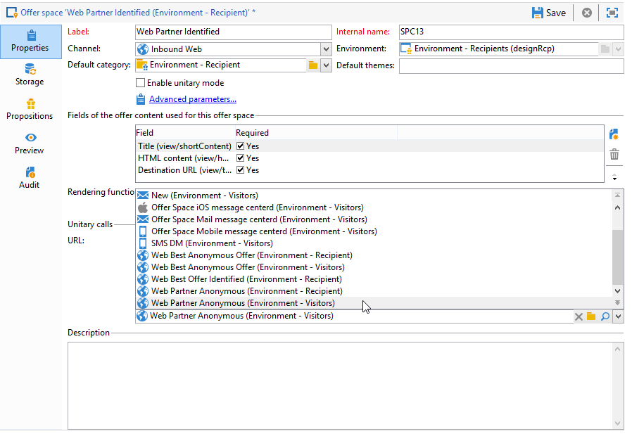
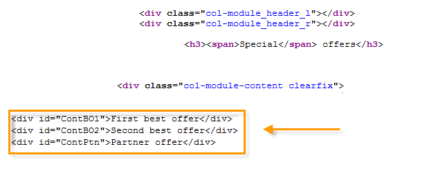

# 인바운드 채널에 대한 오퍼{#offers-on-an-inbound-channel}


## 익명의 방문자에게 오퍼 표시 {#presenting-an-offer-to-an-anonymous-visitor}

네이빈 사이트는 해당 페이지를 검색하는 식별되지 않은 방문자를 위한 웹 사이트에 오퍼를 표시하려고 합니다.

이러한 상호 작용을 설정하려면 다음을 수행합니다.

1. [익명 환경 만들기](#creating-an-anonymous-environment)
1. [익명 오퍼 공간 만들기](#creating-anonymous-offer-spaces)
1. [오퍼 카테고리 및 테마 만들기](#creating-an-offer-category-and-a-theme)
1. [익명 오퍼를 만듭니다.](#creating-anonymous-offers)
1. [웹 사이트에서 웹 오퍼 공간 구성](#configure-the-web-offer-space-on-the-website)

### 익명 환경 만들기 {#creating-an-anonymous-environment}

에 자세히 설명된 절차를 따르십시오. [오퍼 환경 만들기](../../interaction/using/live-design-environments.md#creating-an-offer-environment) 익명 환경을 **방문자 수**&#39; 차원.

새 환경이 포함된 트리 구조가 표시됩니다.


### 익명 오퍼 공간 만들기 {#creating-anonymous-offer-spaces}

1. 익명 환경(**방문자 수**)으로 이동합니다. **[!UICONTROL Administration]** > **[!UICONTROL Spaces]** 노드 아래에 있어야 합니다.
1. 클릭 **[!UICONTROL New]** 통화 채널을 만들려면

   

   >[!NOTE]
   >
   >공간은 자동으로 익명 환경에 연결됩니다.

1. 레이블을 변경하고 을(를) 선택합니다 **[!UICONTROL Inbound Web]** 채널. 또한 **[!UICONTROL Enable unitary mode]** 상자.

   

1. 스페이스에 사용된 오퍼 콘텐츠 필드를 선택하고 관련 상자를 선택하여 필요에 따라 지정합니다.

   이러한 방식으로 다음 요소 중 하나를 누락된 오퍼는 이 공간에 적합하지 않습니다.

   * 제목
   * HTML 콘텐츠
   * 이미지 URL
   * 대상 URL

   

1. 예를 들어 다음과 같이 HTML 렌더링 함수를 편집합니다.

   ```
   function (imageUrl, targetUrl, shortContent, htmlSource){
         var html = "<p><b>" + shortContent + "</b></p>";
         html += "<p>" + htmlSource + "</p>";
         html += "<a _urlType='11' href='" + targetUrl + "'></a>";
         return html;
       }   
   ```

   >[!IMPORTANT]
   >
   >렌더링 함수는 오퍼가 올바르게 표시되도록 이전에 선택한 순서대로 공간에 사용된 필드의 이름을 지정해야 합니다.

   

1. 오퍼 공간을 저장합니다.

### 오퍼 카테고리 및 테마 만들기 {#creating-an-offer-category-and-a-theme}

1. 로 이동합니다. **[!UICONTROL Offer catalog]** 노드 아래에 그룹화됩니다.
1. 마우스 오른쪽 단추를 클릭합니다. **[!UICONTROL Offer catalog]** 노드 및 선택 **[!UICONTROL Create a new 'Offer category' folder]**.

   새 카테고리의 이름을 지정합니다. **금융 제품** 예.

1. 카테고리(으)로 이동합니다. **[!UICONTROL Eligibility]** 탭을 선택하고 **융자** 테마로 저장한 다음 변경 내용을 저장합니다.

   

### 익명 오퍼 만들기 {#creating-anonymous-offers}

1. 방금 만든 카테고리로 이동합니다.
1. **[!UICONTROL New]**&#x200B;를 클릭합니다.

   

1. 즉시 사용 가능한 익명 오퍼 템플릿 또는 이전에 만든 템플릿을 선택합니다.

   

1. 레이블을 변경하고 오퍼를 저장합니다.

   

1. 로 이동합니다. **[!UICONTROL Eligibility]** 탭하고 해당 애플리케이션 컨텍스트에 따라 오퍼의 가중치를 지정합니다.

   이 예에서는 해당 오퍼가 연말까지는 사이트의 홈 페이지에 우선 순위로 표시되도록 구성됩니다.

   

1. 로 이동합니다. **[!UICONTROL Content]** 탭하고 오퍼의 컨텐츠를 정의합니다.

   >[!NOTE]
   >
   >선택할 수 있습니다 **[!UICONTROL Content definitions]** 를 클릭하여 웹 공간에 필요한 요소 목록을 표시합니다.

   

1. 두 번째 오퍼를 만듭니다.

   

1. 로 이동합니다. **[!UICONTROL Eligibility]** 탭하고 첫 번째 오퍼에 대해 동일한 가중치를 적용합니다.
1. 각 오퍼에 대한 승인 주기를 실행하여 오퍼와 승인된 오퍼 공간을 온라인 환경에서 사용할 수 있도록 합니다.

### 웹 사이트에서 웹 오퍼 공간 구성 {#configure-the-web-offer-space-on-the-website}

방금 구성한 오퍼를 웹 사이트에 표시하도록 하려면 사이트의 HTML 페이지에 JavaScript 코드를 삽입하여 상호 작용 엔진을 호출하십시오(자세한 내용은 [인바운드 채널 정보](../../interaction/using/about-inbound-channels.md)).

1. HTML 페이지로 이동하여 이전에 만든 익명 오퍼 공간의 내부 이름과 일치하는 값을 사용하는 @id 속성을 삽입합니다( 참조). [익명 오퍼 공간 만들기](#creating-anonymous-offer-spaces)) 앞에 **i_**.

   

1. 호출 URL을 삽입합니다.

   

   위의 파란색 URL 상자는 인스턴스 이름, 환경의 내부 이름에 해당합니다( 참조) [익명 환경 만들기](#creating-an-anonymous-environment)) 및 카테고리에 연결된 테마([오퍼 카테고리 및 테마 만들기](#creating-an-offer-category-and-a-theme)). 후자는 선택 사항입니다.

방문자가 웹 사이트의 홈 페이지에 액세스하면 오퍼는 **융자** 테마는 HTML 페이지에 구성된 대로 표시됩니다.


두 페이지 모두 동일한 가중치가 지정되었으므로 여러 번 페이지를 방문하는 사용자는 카테고리의 하나 또는 다른 오퍼를 볼 수 있습니다.

## 식별되지 않은 연락처의 경우 익명 환경으로 전환 {#switching-to-an-anonymous-environment-in-case-of-unidentified-contacts}

Neobank 회사는 두 개의 다른 타겟에 대한 마케팅 오퍼를 생성하려고 합니다. 익명 웹 사이트 브라우저에 대한 일반 오퍼를 표시하려고 합니다. 이 사용자 중 하나가 Neobank에서 제공하는 식별자를 사용하는 고객인 경우 회사는 로그온하는 즉시 개인화된 오퍼를 수신하려고 합니다.

이 사례 연구는 다음 시나리오를 기반으로 합니다.

1. 방문자가 로그인하지 않고 Neobank 웹 사이트를 탐색합니다.

   

   페이지에 다음과 같은 세 개의 익명 오퍼가 표시됩니다. 2개 **최상의 오퍼** Neobank 제품에 대한 오퍼와 Neobank 파트너로부터 제공되는 오퍼를 제공합니다.

   

1. Neobank 고객인 사용자가 자격 증명으로 로그온합니다.

   

   3개의 개인화된 오퍼가 표시됩니다.

   

이 사례 연구를 구현하려면 두 가지 오퍼 환경이 있어야 합니다. 익명의 상호 작용용 및 식별된 연락처에 대해 특별히 구성된 오퍼가 있는 상호 작용용. 식별된 오퍼 환경은 연락처가 로그온되어 있지 않아 식별되지 않는 경우 익명 오퍼 환경으로 자동으로 전환하도록 구성됩니다.

다음 단계를 적용합니다.

* 다음 단계를 사용하여 익명 인바운드 상호 작용에 대한 오퍼 카탈로그를 만듭니다.

   1. [익명 연락처에 대한 환경 만들기](#creating-an-environment-for-anonymous-contacts)
   1. [익명 환경에 대한 오퍼 공간 구성](#configuring-offer-spaces-for-the-anonymous-environment)
   1. [익명 환경에서 오퍼 카테고리 만들기](#creating-offer-categories-in-an-anonymous-environment)
   1. [익명의 방문자를 위한 오퍼 만들기](#creating-offers-for-anonymous-visitors)

* 다음 단계를 사용하여 식별된 인바운드 상호 작용에 관련된 오퍼 카탈로그를 만듭니다.

   1. [식별된 환경에서 오퍼 공간 구성](#configure-the-offer-spaces-in-the-identified-environment)
   1. [식별된 환경에서 오퍼 카테고리 만들기](#creating-offer-categories-in-an-identified-environment)
   1. [개인화된 오퍼 만들기](#creating-personalized-offers)

* 오퍼 엔진에 대한 호출을 구성합니다.

   1. [웹 페이지에서 오퍼 공간 구성](#configuring-offer-spaces-on-the-web-page)
   1. [식별된 오퍼 공간의 고급 설정 지정](#specifying-the-advanced-settings-of-the-identified-offer-spaces)

### 익명 연락처에 대한 환경 만들기 {#creating-an-environment-for-anonymous-contacts}

1. 게재 매핑 마법사(**방문자** 매핑)을 참조하십시오. 자세한 내용은 [오퍼 환경 만들기](../../interaction/using/live-design-environments.md#creating-an-offer-environment).

   

### 익명 환경에 대한 오퍼 공간 구성 {#configuring-offer-spaces-for-the-anonymous-environment}

웹 사이트에서 제공해야 하는 오퍼는 두 가지 다른 카테고리에 속합니다. **최상의 오퍼** 및 **파트너**. 이 예제에서는 각 카테고리에 대한 특정 오퍼 공간을 만듭니다.

와 일치하는 오퍼 공간을 만들려면 **최상의 오퍼** 범주, 다음 프로세스를 적용합니다.

1. Adobe Campaign 트리에서 방금 만든 익명 환경으로 이동하고 오퍼 공간을 추가합니다.

   

1. 새 만들기 **[!UICONTROL Inbound web]** 공백 입력.

   

1. 레이블 입력: **Web Best Anonymous 오퍼** 예를 들어,
1. 이 오퍼 공간에 사용되는 오퍼 콘텐츠 필드를 추가하고 렌더링 함수를 구성합니다.

   

   >[!IMPORTANT]
   >
   >렌더링 함수는 오퍼가 올바르게 표시되도록 이전에 선택한 순서대로 공간에 사용된 필드의 이름을 지정해야 합니다.

1. 동일한 프로세스를 사용하여 일치하는 인바운드 웹 채널 오퍼 공간을 만듭니다 **파트너** 카테고리.

   

### 익명 환경에서 오퍼 카테고리 만들기 {#creating-offer-categories-in-an-anonymous-environment}

먼저 두 개의 오퍼 카테고리를 만듭니다. a **최상의 오퍼** 카테고리 및 **파트너** 카테고리. 각 카테고리에는 익명의 연락처에 대한 두 개의 오퍼가 포함됩니다.

1. 로 이동합니다. **[!UICONTROL Offer catalog]** 방금 생성한 익명 환경.
1. 추가 **[!UICONTROL Offer category]** 폴더 **최상의 오퍼** 레이블.

   

1. 다음으로 두 번째 카테고리 만들기 **파트너** 레이블.

   

### 익명의 방문자를 위한 오퍼 만들기 {#creating-offers-for-anonymous-visitors}

이제 위에 만든 각 카테고리에 두 개의 오퍼를 만듭니다.

1. 로 이동합니다. **최상의 오퍼** 카테고리를 사용하여 익명의 오퍼를 만듭니다.

   

1. 로 이동합니다. **[!UICONTROL Eligibility]** 탭하고 해당 애플리케이션 컨텍스트에 따라 오퍼의 가중치를 지정합니다.

   

1. 로 이동합니다. **[!UICONTROL Content]** 탭하고 오퍼의 컨텐츠를 정의합니다.

   

1. 에서 두 번째 오퍼를 만듭니다. **최상의 오퍼** 카테고리.

   

1. 로 이동합니다. **파트너** 카테고리를 사용하여 익명의 오퍼를 만듭니다.
1. 로 이동합니다. **[!UICONTROL Content]** 탭하고 오퍼의 컨텐츠를 정의합니다.

   

1. 로 이동합니다. **[!UICONTROL Eligibility]** 탭하고 해당 애플리케이션 컨텍스트에 따라 오퍼의 가중치를 지정합니다.

   

1. 에 대해 두 번째 오퍼를 만듭니다. **파트너** 카테고리.

   

1. 로 이동합니다. **[!UICONTROL Eligibility]** 탭하고 이 카테고리의 첫 번째 오퍼에 적용한 것과 동일한 가중치를 적용하여 오퍼가 웹 사이트에 순차적으로 표시되도록 합니다.

   

1. 각 오퍼에 대한 승인 주기를 실행하여 오퍼를 라이브로 만듭니다. 콘텐츠를 승인할 때 **파트너** 또는 **최상의 오퍼** 오퍼에 따라 공간을 제공합니다.

### 식별된 환경에서 오퍼 공간 구성 {#configure-the-offer-spaces-in-the-identified-environment}

웹 사이트에 제공할 오퍼는 두 가지 다른 카테고리에서 가져옵니다. **최상의 오퍼** 및 **파트너**. 이 예제에서는 각 카테고리에 대해 특정 공간을 만들려고 합니다.

두 오퍼 공백을 만들려면 익명 오퍼 공간과 동일한 절차를 적용합니다. 을(를) 참조하십시오. [익명 환경에 대한 오퍼 공간 구성](#configuring-offer-spaces-for-the-anonymous-environment).

1. Adobe Campaign 트리에서 방금 만든 환경으로 이동하여 를 추가합니다 **최상의 오퍼** 및 **파트너** 오퍼 스페이스.
1. 에 자세히 설명된 프로세스 적용 [익명 환경에 대한 오퍼 공간 구성](#configuring-offer-spaces-for-the-anonymous-environment).

   

1. 을(를) 선택합니다 **[!UICONTROL Fall back on an anonymous environment if no individuals were identified]** 선택 사항입니다.

   

1. 드롭다운 목록을 사용하여 이전에 만든 익명의 웹 오퍼 공간을 선택합니다(참조: [익명 환경에 대한 오퍼 공간 구성](#configuring-offer-spaces-for-the-anonymous-environment)).

   

### 식별된 오퍼 공간의 고급 설정 지정 {#specifying-the-advanced-settings-of-the-identified-offer-spaces}

이 예에서는 Adobe Campaign 데이터베이스의 이메일 주소 덕분에 연락처 식별이 수행됩니다. 스페이스에 수신자 이메일을 추가하려면 다음 프로세스를 적용합니다.

1. 식별된 환경에서 오퍼 공간 폴더로 이동합니다.
1. 을(를) 선택합니다 **최상의 오퍼** 오퍼 스페이스 및 **[!UICONTROL Advanced parameters]**.

   

1. **[!UICONTROL Target identification]** 탭에서 **[!UICONTROL Add]**&#x200B;을(를) 클릭합니다 .

   

1. 클릭 **[!UICONTROL Edit expression]**&#x200B;를 눌러 수신자 테이블로 이동하고 **[!UICONTROL Email]** 필드.

   

1. 클릭 **[!UICONTROL OK]** 를 **[!UICONTROL Advanced parameters]** 창 및 완료 구성 **최상의 오퍼** 오퍼 공간.
1. 에 대해 동일한 프로세스 적용 **파트너** 오퍼 공간.

   

### 식별된 환경에서 오퍼 카테고리 만들기 {#creating-offer-categories-in-an-identified-environment}

두 가지 카테고리를 만들 예정입니다. a **최상의 오퍼** 카테고리 및 **파트너** 카테고리. 각각 개인화된 두 개의 오퍼가 있습니다.

1. 로 이동합니다. **[!UICONTROL Offer catalogs]** 식별된 환경의 노드입니다.
1. 익명 환경에서처럼 두 개를 추가합니다 **[!UICONTROL Offer category]** 폴더 **최상의 오퍼** 및 **파트너** 를 레이블로 사용합니다.

   

### 개인화된 오퍼 만들기 {#creating-personalized-offers}

각 카테고리에 대해 개인화된 두 개의 오퍼(예: 4개의 오퍼)를 생성하려고 합니다.

1. 로 이동합니다. **최상의 오퍼** 카테고리를 사용하여 첫 번째 개인화된 오퍼를 만듭니다.

   

1. 로 이동합니다. **[!UICONTROL Eligibility]** 탭하고 해당 애플리케이션 컨텍스트에 따라 오퍼의 가중치를 지정합니다.

   

1. 로 이동합니다. **[!UICONTROL Content]** 탭하고 오퍼의 컨텐츠를 정의합니다.

   

1. 에서 두 번째 오퍼를 만듭니다. **최상의 오퍼** 카테고리.

   

1. 로 이동합니다. **파트너** 카테고리를 사용하여 개인화된 오퍼를 만듭니다.

   

1. 로 이동합니다. **[!UICONTROL Eligibility]** 탭하고 해당 애플리케이션 컨텍스트에 따라 오퍼의 가중치를 지정합니다.

   

1. 에 대해 두 번째 오퍼를 만듭니다. **파트너** 카테고리.

   

1. 로 이동합니다. **[!UICONTROL Eligibility]** 탭하고 이 카테고리의 첫 번째 오퍼에 적용한 것과 동일한 가중치를 적용하여 오퍼가 웹 사이트에 순차적으로 표시되도록 합니다.
1. 각 오퍼에 대한 승인 주기를 실행하여 업데이트를 시작합니다. 콘텐츠를 승인하는 동안 **파트너** 또는 **최상의 오퍼** 오퍼 스페이스.

### 웹 페이지에서 오퍼 공간 구성 {#configuring-offer-spaces-on-the-web-page}

Neobank 회사의 웹 사이트에는 오퍼를 위한 세 개의 공간이 있습니다. 은행 관련 오퍼에 대한 두 가지 **최상의 오퍼** 카테고리 및 오퍼의 오퍼에 대해 각각 하나씩 있습니다. **파트너** 카테고리.


웹 사이트의 HTML 페이지에서 이러한 오퍼 공간을 구성하려면 다음 프로세스를 적용합니다.

1. HTML 페이지의 콘텐츠에 3을 삽입합니다

   값이 @id 인 요소를 사용하여 웹 사이트의 다양한 오퍼 공간에서 오퍼를 호출할 수 있습니다.

   

1. 그런 다음 속성 값을 정의하기 위한 스크립트를 삽입합니다.

   

   이 예제에서는 **ContBO1** 및 **ContBO2** 값 받기 **OsWebBestOfferIdentified**, 즉 의 내부 이름 **최상의 오퍼** 식별된 환경에서 이전에 만든 오퍼 공간. 다음 **CatBestOffer** 및 **CatBestOfferAnonym** 값은 의 내부 이름과 일치합니다 **최상의 오퍼** 익명 및 식별된 환경에 대한 카테고리입니다.

   

   마찬가지로 **ContPtn** 수신 **OSWebPartnerIdentified** 값의 내부 이름과 일치하는 값 **파트너** 식별된 환경에서 생성된 오퍼 공간. **CatPartner** 및 **CatPartnerAnonym** 의 내부 이름과 일치함 **파트너** 익명 및 식별된 환경에 대한 카테고리입니다.

   

1. Neobank 사이트에 로그온한 사용자를 식별할 수 있도록 정보를 지정합니다. **interactionTarget** 변수를 채우는 방법을 설명합니다.

   

   개인 식별은 브라우저 쿠키, URL의 읽기 매개 변수, 이메일 또는 개인 식별자를 기반으로 할 수 있습니다. 기본 키 이외의 수신자 테이블의 필드를 사용하는 경우 공간의 고급 매개 변수에서 정의해야 합니다(참조: [식별된 오퍼 공간의 고급 설정 지정](#specifying-the-advanced-settings-of-the-identified-offer-spaces)).

1. 호출 URL을 삽입합니다.

   

   URL은 **EnvNeobankRecep**: 식별된 환경의 내부 이름입니다.

웹 페이지를 열 때; 스크립트를 사용하면 상호 작용 엔진을 호출하여 웹 페이지의 관련 공간에 오퍼 콘텐츠를 표시할 수 있습니다. Adobe Campaign 서버에 대한 단일 호출에서 엔진은 선택할 환경, 오퍼 공간 및 카테고리를 결정합니다.

이 예에서는 엔진은 식별된 환경(**EnvNeobankIdnRecep**). 오퍼 공간(**OSWebBestOfferIdentified**) 및 **최상의 오퍼** 카테고리 (**CatBestOffer**)를 만들 수 있습니다.**OSWebPartnerIdentified**) 오퍼 공간 및 **파트너** 카테고리 (**CatPartner**)을 클릭하여 사이트에서 세 번째 오퍼 공간을 만듭니다.

엔진이 수신자를 식별할 수 없는 경우 식별된 오퍼 공간에서 참조되는 익명 오퍼 공간과 익명 카테고리( )로 전환됩니다&#x200B;**CatPartner** 및 **CatPartnerAnonym**)을 사용할 수 있습니다.
