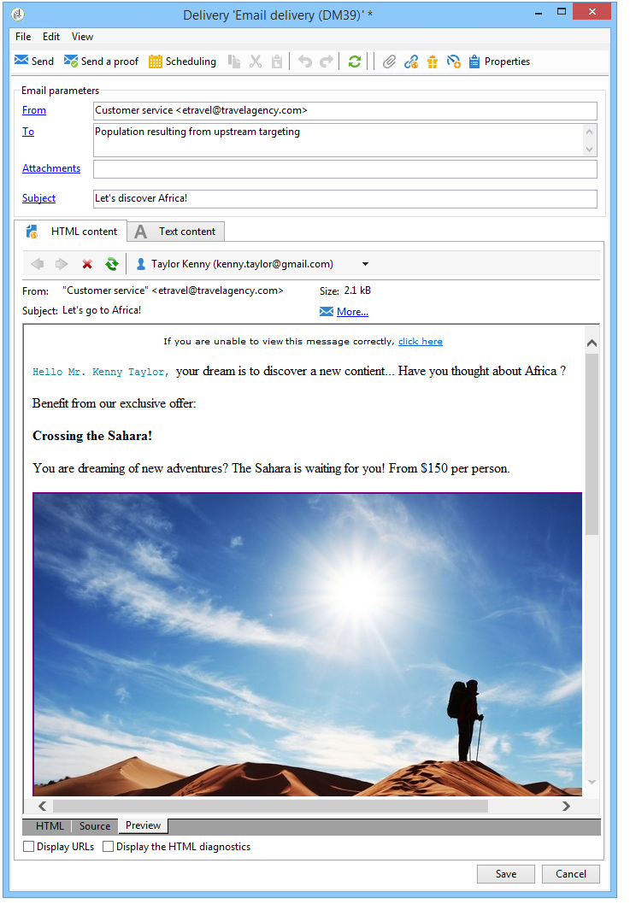

# 아웃바운드 채널의 오퍼{#offers-on-an-outbound-channel}

## 이메일 오퍼 전달 {#email-offer-delivery}

저희 데이터베이스에는 아프리카로의 여행 상품들이 있습니다. 각 오퍼의 자격 조건, 컨텍스트 및 표현이 구성되었습니다. 이제 캠페인을 만들어 이메일을 통해 오퍼를 전달하고 싶습니다.

1. 마케팅 캠페인 및 타깃팅 워크플로우를 만듭니다.

   

1. 이메일 배달을 편집하고 **[!UICONTROL Offers]** 아이콘을 클릭합니다.

   

1. 공휴일과 일치하는 오퍼 환경의 이메일 공간을 선택합니다.

   

1. 아프리카 여행 상품을 포함하는 카테고리를 선택합니다.

   

1. 게재의 오퍼 수를 2로 설정합니다.

   

1. 오퍼 관리 창을 닫고 게재의 컨텐츠를 만듭니다.

   

1. 메뉴를 사용하여 첫 번째 오퍼 제안을 삽입하고 HTML 렌더링 기능을 선택합니다.

   

1. 두 번째 제안 사항을 삽입합니다.

   

1. 전달에서 오퍼를 미리 **[!UICONTROL Preview]** 보려면 을 클릭하고 수신자가 오퍼를 받을 때 미리 볼 수신자를 선택합니다.

   

1. 게재를 저장하고 타깃팅 워크플로우를 시작합니다.
1. 배달을 열고 게재의 **[!UICONTROL Audit]** 탭을 클릭합니다.오퍼 엔진에서 카탈로그의 다양한 오퍼에서 만들 제안을 선택했음을 확인할 수 있습니다.

   

## 오퍼 시뮬레이션 수행 {#perform-an-offer-simulation}

1. 우주에서 **[!UICONTROL Profiles and Targets]** 링크를 클릭한 다음 **[!UICONTROL Simulations]** **[!UICONTROL Create]** 단추를 클릭합니다.

   

1. 레이블을 선택하고 필요한 경우 실행 설정을 지정합니다.

   

1. 시뮬레이션을 저장합니다. 그러면 새 탭에서 열립니다.

   

1. 탭을 **[!UICONTROL Edit]** 클릭한 다음 **[!UICONTROL Scope]**&#x200B;클릭합니다.

   

1. 오퍼를 시뮬레이션할 범주를 선택합니다.

   

1. 시뮬레이션에 사용할 오퍼 공간을 선택합니다.

   

1. 유효 일자를 입력합니다. 시작 날짜를 적어도 입력해야 합니다. 이렇게 하면 오퍼 엔진이 오퍼를 필터링하고 지정된 날짜에 유효한 오퍼를 선택할 수 있습니다.
1. 필요한 경우 하나 또는 여러 테마를 지정하여 설정에 이 키워드가 포함된 오퍼의 수를 제한합니다.

   이 예에서는 여행 **카테고리에** 두 개의 하위 카테고리가 있으며 두 개의 별도 테마가 있습니다. 고객>1년 **** 테마에서 오퍼에 대한 시뮬레이션을 실행하려고 합니다.

   

1. 타깃팅할 수신자를 선택합니다.

   

1. 각 수신자에게 보낼 오퍼 수를 구성합니다.

   이 예에서는 오퍼 엔진이 각 수신자에 대해 가장 높은 가중치를 가진 3개의 오퍼를 선택합니다.

   

1. 설정을 저장한 다음 **[!UICONTROL Start]** 탭을 클릭하여 시뮬레이션을 실행합니다 **[!UICONTROL Dashboard]** .

   

1. 시뮬레이션이 완료되면 오퍼당 제안의 세부 **[!UICONTROL Results]** 분류를 참조하십시오.

   이 예에서는 오퍼 엔진에서 3가지 제안에 대한 오퍼 분류를 기반으로 했습니다.

   

1. 오퍼 엔진에서 선택한 오퍼 목록을 **[!UICONTROL Breakdown of offers by rank]** 보려면 을 표시합니다.

   

1. 필요한 경우 범위 설정을 변경하고 을 클릭하여 시뮬레이션을 다시 실행할 수 **[!UICONTROL Start simulation]**&#x200B;있습니다.

   

1. 시뮬레이션 데이터를 저장하려면 보고서에서 사용 가능한 내역 또는 내보내기 기능을 사용합니다.

   

