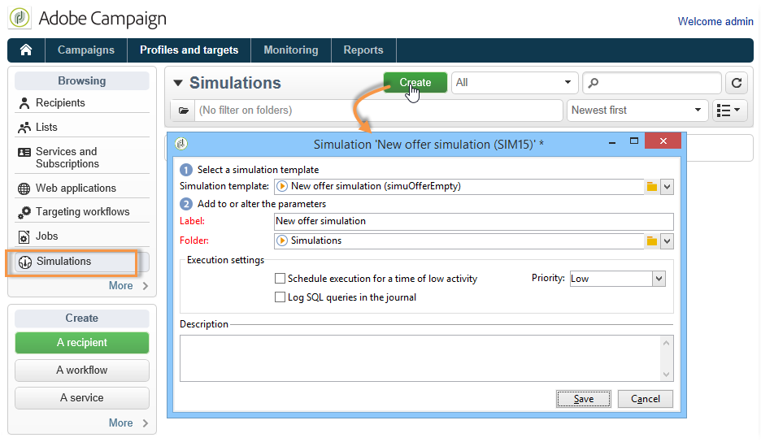
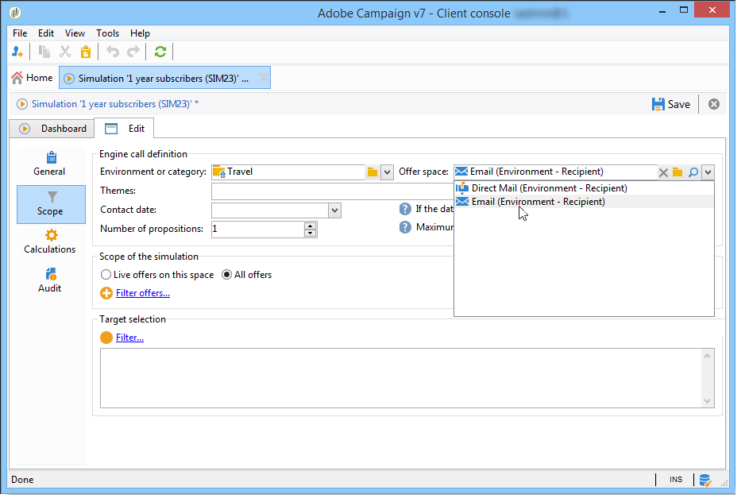

# 아웃바운드 채널에 대한 오퍼{#offers-on-an-outbound-channel}

## 이메일 오퍼 게재 {#email-offer-delivery}

저희 데이터베이스에는 아프리카로 가는 여행 상품 범주가 있습니다. 각 오퍼의 자격, 컨텍스트 및 표현이 구성되었습니다. 이제 이메일을 통해 오퍼를 제공하는 캠페인을 만들려고 합니다.

1. 마케팅 캠페인 및 타겟팅 워크플로우를 만듭니다.

   

1. 이메일 게재를 편집하고 을(를) 클릭합니다. **[!UICONTROL Offers]** 아이콘.

   

1. 휴일에 맞는 오퍼 환경을 위한 이메일 공간을 선택합니다.

   

1. 아프리카 여행 상품을 포함하는 범주를 선택하십시오.

   

1. 게재의 오퍼 수를 2로 설정합니다.

   

1. 오퍼 관리 창을 닫고 게재 콘텐츠를 만듭니다.

   

1. 메뉴를 사용하여 첫 번째 오퍼 제안을 삽입하고 HTML 렌더링 기능을 선택합니다.

   

1. 두 번째 오퍼 제안을 삽입합니다.

   

1. 클릭 **[!UICONTROL Preview]** 게재에서 오퍼를 미리 보려면 수신자를 선택하여 오퍼가 수신되는 대로 오퍼를 미리 봅니다.

   

1. 게재를 저장하고 타깃팅 워크플로우를 시작합니다.
1. 게재를 열고 을(를) 클릭합니다. **[!UICONTROL Audit]** 게재 탭: 오퍼 엔진이 카탈로그의 여러 오퍼에서 만들 제안을 선택했음을 확인할 수 있습니다.

   

## 오퍼 시뮬레이션 수행 {#perform-an-offer-simulation}

1. 에서 **[!UICONTROL Profiles and Targets]** 탭에서 **[!UICONTROL Simulations]** 링크를 클릭한 다음 **[!UICONTROL Create]** 버튼을 클릭합니다.

   

1. 레이블을 선택하고 필요한 경우 실행 설정을 지정합니다.

   

1. 시뮬레이션을 저장합니다. 그러면 새 탭에서 열립니다.

   

1. 을(를) 클릭합니다. **[!UICONTROL Edit]** 탭을 클릭한 다음 **[!UICONTROL Scope]**.

   

1. 오퍼를 시뮬레이션할 카테고리를 선택합니다.

   

1. 시뮬레이션에 사용할 오퍼 공간을 선택합니다.

   

1. 유효 일자를 입력합니다. 시작 일자를 적어도 입력해야 합니다. 이렇게 하면 오퍼 엔진이 오퍼를 필터링하고 지정된 날짜에 유효한 오퍼를 선택할 수 있습니다.
1. 필요한 경우 하나 또는 여러 테마를 지정하여 해당 설정에서 이 키워드를 포함하는 오퍼로 오퍼 수를 제한하십시오.

   이 예제에서는 **여행** 카테고리에는 두 개의 서로 다른 테마가 있는 두 개의 하위 카테고리가 있습니다. 오퍼에 대한 시뮬레이션을 **고객 > 1년** 테마.

   

1. 타겟팅할 수신자를 선택합니다.

   

1. 각 수신자에게 전송할 오퍼 수를 구성합니다.

   이 예제에서 오퍼 엔진은 각 수신자에 대해 가중치가 가장 높은 3개의 오퍼를 선택합니다.

   

1. 설정을 저장한 다음 **[!UICONTROL Start]** 에서 **[!UICONTROL Dashboard]** 탭을 사용하여 시뮬레이션을 실행합니다.

   

1. 시뮬레이션이 완료되면 다음을 참조하십시오 **[!UICONTROL Results]** 제안당 제안을 상세하게 분석하기 위해.

   이 예제에서 오퍼 엔진은 3가지 제안을 기준으로 오퍼 분류를 기반으로 했습니다.

   

1. 표시 **[!UICONTROL Breakdown of offers by rank]** 오퍼 엔진에서 선택한 오퍼 목록을 보려면

   

1. 필요한 경우 범위 설정을 변경하고 을 클릭하여 시뮬레이션을 다시 실행할 수 있습니다 **[!UICONTROL Start simulation]**.

   

1. 시뮬레이션 데이터를 저장하려면 보고서에서 사용할 수 있는 내역 또는 내보내기 기능을 사용합니다.

   
