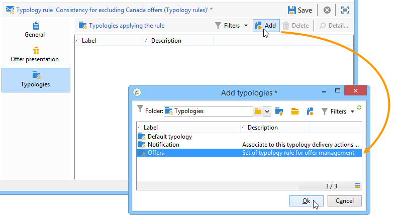

# 프레젠테이션 규칙{#presentation-rules}

## Creating a presentation rule {#creating-a-presentation-rule}

저희 데이터베이스에는 유럽, 아프리카, 미국, 캐나다를 위한 몇 가지 여행상품이 있습니다 캐나다로의 여행 제안을 보내려고 하는데, 받는 사람이 이러한 유형의 제안을 거부하는 경우, 우리는 그것을 그들에게 다시 보내고 싶지 않다

캐나다로의 여행은 받는 사람당 한 번만 제공되며 거부된 경우 다시 제공되지 않도록 Adobe의 규칙을 구성할 것입니다.

1. Adobe Campaign 트리에서 **[!UICONTROL Administration]** > **[!UICONTROL Campaign management]** > **[!UICONTROL Typology management]** > **[!UICONTROL Typology rules]** 노드로 이동합니다.
1. 새 **[!UICONTROL Offer presentation]** 문자 규칙을 만듭니다.

   

1. 필요한 경우 레이블 및 설명을 변경합니다.

   

1. 규칙을 모든 채널로 확장하려면 **[!UICONTROL All channels]** 옵션을 선택합니다.

   

1. 링크를 **[!UICONTROL Edit expression]** 클릭하고 **[!UICONTROL Category]** 노드를 표현식으로 선택합니다.

   

1. 캐나다에 대한 여행 오퍼와 일치하는 범주를 선택하고 을 클릭하여 쿼리 창 **[!UICONTROL OK]** 을 닫습니다.

   

1. 탭에서 **[!UICONTROL Offer presentation]** 환경에 구성된 것과 동일한 차원을 선택합니다.

   

1. 규칙이 적용되는 기간을 지정합니다.

   

1. 캐나다로의 여행을 거부한 수신자가 다른 유사한 제안을 받지 않도록 제안을 하나로 제한합니다.

   

1. 캐나다 **[!UICONTROL Offers for the same category]** 카테고리에서 모든 오퍼를 제외하려면 **필터를** 선택합니다.

   

1. 받는 사람이 거부한 **[!UICONTROL Rejected propositions]** 프로필 값만 고려하려면 필터를 선택합니다.

   

1. 이 규칙이 적용될 수신자를 선택합니다.

   본 예에서는 단골 고객 **을** 대상으로 선정되었습니다.

   

1. 오퍼 유형 내의 규칙을 참조합니다.

   

1. 오퍼 환경(이 경우&#x200B;**환경 - 수신자** )으로 이동하고 탭의 드롭다운 목록을 사용하여 만든 새 유형을 **[!UICONTROL Eligibility]** 참조합니다.

   

## 프레젠테이션 규칙 적용 {#applying-the-presentation-rule}

다음은 이전에 만든 분류 규칙의 응용 프로그램 예입니다.

캐나다 카테고리에 속하는 첫 번째 제안서를 보내려고 합니다. 어떤 수신자에게도 한번 거부를 받으면 다시 제공되지는 않는다.

1. [ **자주 방문하는 여행자** ] 수신자 폴더에서 자격 조건을 갖춘 오퍼를 확인할 프로필 중 하나를 선택합니다.탭을 **[!UICONTROL Propositions]** 클릭한 다음 **[!UICONTROL Preview]** 탭을 클릭합니다.

   본사의 예에서, **Tim Ramsey** 는 **미국** 카테고리의 일부인 오퍼에적합합니다.

   

1. 먼저 제안을 통해 빈번한 여행 **을** 받는 사람을 대상으로 이메일 전달을 만듭니다.
1. 오퍼 엔진 콜업 매개 변수를 선택합니다.

   이 예에서는 **캐나다** 및 **미국** 하위 카테고리가 포함된 미국 **여행 카테고리가** 선택됩니다.

   

1. 메시지 본문에 오퍼를 삽입하고 배달을 보냅니다. 자세한 내용은 아웃바운드 채널 [정보를 참조하십시오](../../interaction/using/about-outbound-channels.md).

   수신자는 자격이 있는 오퍼를 받았습니다.

1. 수신자는 제안 내역에 표시된 대로 캐나다 제안을 거부했습니다.

   

1. 현재 해당 고객에게 적합한 오퍼를 확인하십시오.

   캐나다에 대한 오퍼가 선택되지 않았음을 알 수 있습니다.

   

**관련 항목**

* [채널 전반에서 제안 관리 및 중복성 제어](https://helpx.adobe.com/campaign/kb/simplifying-campaign-management-acc.html#Manageoffersandcontrolredundancyacrosschannels)