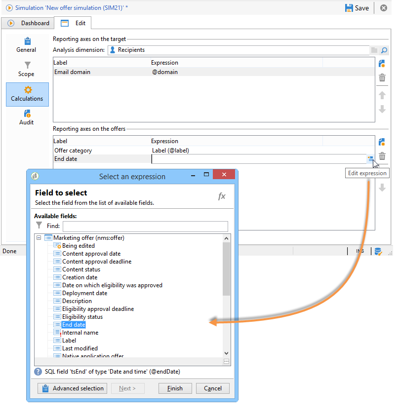

# 시뮬레이션 범위{#simulation-scope}

## 범위 정의 {#definition-of-the-scope}

탭을 열어 설정을 선택합니다. **[!UICONTROL Scope]**

다음 항목은 필수입니다.

* 환경 또는 오퍼 카테고리
* 오퍼 공간.
* 연락처 날짜. 연락처 날짜에 적합하지 않은 오퍼는 고려되지 않습니다.
* 타겟 모집단입니다.

   대상에 필터를 구성하지 않으면 전체 수신자 테이블이 고려됩니다.

* 대상당 시뮬레이션할 제안 수입니다.

   수신자는 이 많은 제안을 받게 됩니다. 예를 들어 5를 입력하면 각 수신자는 최대 5개의 오퍼 제안을 받게 됩니다.

   

시뮬레이션에 사용할 오퍼를 세분화하려면 하나 또는 여러 테마(카테고리에 미리 지정됨)를 추가할 수 있습니다.

또한 모든 오퍼에 대해 시뮬레이션을 수행하거나 온라인 오퍼에 대해서만 실행할 수 있습니다. 원하는 경우 일부 필터를 사용하여 선택 항목을 변경할 수 있습니다.

>[!NOTE]
>
>연락처 날짜를 지정해야 합니다. 이렇게 하면 상호 작용 엔진이 선택한 환경 또는 카테고리의 오퍼를 정렬할 수 있습니다. 날짜가 구성되지 않으면 시뮬레이션에서 오류가 발생합니다.

## 보고 축 추가 {#adding-reporting-axes}

타겟 또는 **[!UICONTROL Calculations]** 탭을 통해 오퍼에 보고 축을 추가하여 시뮬레이션 분석을 향상시킬 수 있습니다.

이렇게 하려면 **[!UICONTROL Add]** 단추를 클릭하고 적절한 필드를 선택합니다. 축이 시뮬레이션을 계산하는 데 사용되고 분석 보고서에 표시됩니다. 자세한 내용은 시뮬레이션 추적을 [참조하십시오](../../interaction/using/simulation-tracking.md).

