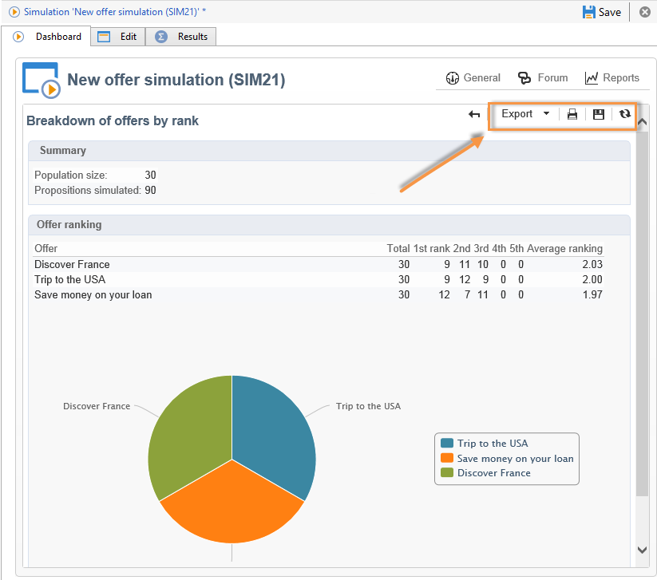

# 시뮬레이션 추적{#simulation-tracking}

시뮬레이션이 완료되면 시뮬레이션 대시보드에서 사용할 수 있는 시뮬레이션 창과 보고서에 추가되는 **[!UICONTROL Results]** 탭을 통해 결과를 분석할 수 **[!UICONTROL Breakdown of offers by rank]** 있습니다.

시뮬레이션 결과에는 등급별 및 수신자별 제안 분류가 포함됩니다. 보고 축도 고려되고 이 탭에 표시됩니다.

이러한 결과를 저장하고 필요한 경우 결과에 대한 설명 분석을 만들어 내보낼 수 있습니다. 이렇게 하려면 결과 창에서 해당 링크를 클릭합니다.

설명 분석 마법사에 대한 자세한 내용은 [이 섹션을](../../reporting/using/about-descriptive-analysis.md) 참조하십시오.

피벗 테이블은 등급별로 오퍼 분류의 빠른 보기를 제공합니다. Adobe Campaign의 모든 보고서와 마찬가지로 웹 브라우저에서 내보내기, 인쇄, 보관 또는 표시할 수 있습니다.

For more on this, refer to [this section](../../reporting/using/actions-on-reports.md).

